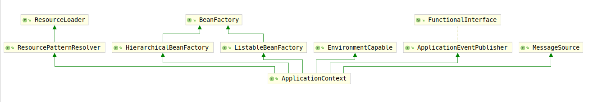

# ApplicationContext

该接口是Spring容器的基础接口，为应用程序提供了配置。考虑该接口的类继承结构图：

该接口继承了ResourcePatternResolver、EnvironmentCapable、ListableBeanFactory、HierarchicalBeanFactory、MessageSource、ApplicationEventPublisher接口，这些接口所暴露的功能在之前的部分已经详细介绍过，这里不多赘述。正是因为继承了这些接口，该接口实现了如下功能：

1. 由于继承了`org.springframework.beans.factory.ListableBeanFactory`接口，该类提供了访问BeanFactory内组件信息的功能。
2. 由于继承了`org.springframework.core.io.ResourceLoader`接口，使得该接口提供了加载文件资源等多种资源的能力
3. 由于继承了`ApplicationEventPublisher`接口，使得该接口提供了发布事件到注册了的监听器的功能
4. 由于继承了`MessageSource`接口，使得该接口提供了解析消息，支持国际化的能力。
5. 从父上下文继承。 在后代上下文中的定义将始终优先。 例如，这意味着整个Web应用程序都可以使用单个父上下文，而每个servlet都有其自己的子上下文，该子上下文独立于任何其他servlet的子上下文。

除了标准的BeanFactory生命周期功能之外，ApplicationContext实现还检测并调用ApplicationContextAware Bean以及ResourceLoaderAware，ApplicationEventPublisherAware和MessageSourceAware Bean。

该接口要求实现的方法大致分为两类：

1. 获取Context基本信息类的方法。
2. 获取AutowireCapableBeanFactory。

下面考查第一类方法，该类方法仅仅用于获取Context的基本信息，例如Id、ApplicationName、DisplayName、启动时间、父Context：

1. String getId()：获取context的唯一id，如果没有则返回null;
2. String getApplicationName(): 返回部署的项目的名字。
3. String getDisplayName()：返回上下文的一个相对友善的名字。
4. long getStartupDate()：获取context首次加载的时间戳。
5. ApplicationContext getParent()：获取该容器的父容器。

这些方法只是获取一些基本的显示属性或者标志性属性。第二类方法用于获取`AutowireCapableBeanFactory`，该方法暴露了context的`AutowireCapableBeanFactory`，不过该方法不应该被应用程序代码使用，仅仅用于初始化那些在Spring bean 声明周期外部初始化的bean。
