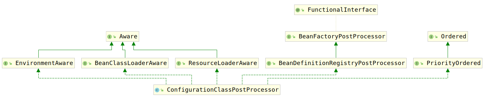

# ConfigurationClassPostProcessor

该类用于被Configuration注解修饰的类的自举处理。

默认情况下，当使用了`<context:annotation-config/>`和`<context:component-scan/>`时，该BeanFactoryPostProcessor会被注册。除此之外，可以像注册其他的BeanFactoryPostProcessor一样手动注册该BeanFactoryPostProcessor。

该BeanFactoryPostProcessor是依照优先级进行执行的。这一点相当重要，因为所有的@Configuration注解注释的类中的方法都有自己独特的bean定义注册逻辑，这些逻辑发生在其他BeanFactoryPostProcessir执行之前。

下面考虑该类的类继承结构图：



可以看到该类实现了3类接口：

1. Aware接口以及其子接口，用于完成基本属性的注入。详见[附录1 Aware接口族](./../附录/1.Aware接口族/1.Aware接口.md)
2. BeanFactoryPostProcessor接口，用于完成BeanFactoryPostProcessor修改bean定义的功能。
3. Ordered类型接口，用于完成优先级排序操作。详见[附录2 Ordered接口族](./../附录/2.Ordered接口族/1.Ordered接口.md)

根据类继承结构图可以看到，`ConfigurationClassPostProcessor`实现了`BeanDefinitionRegistryPostProcessor`接口（详见[BeanFactoryPostProcessor](../../附录/4.BeanFactoryPostProcessor接口族/1.BeanFactoryPostProcessor.md)）。

这里我们详细考察其主要方法：

1. postProcessBeanFactory(ConfigurableListableBeanFactory beanFactory)
2. postProcessBeanDefinitionRegistry(BeanDefinitionRegistry registry)

首先考察`postProcessBeanFactory`方法，该方法用于通过将配置类替换为CGLIB增强的子类，准备用于在运行时为bean请求提供服务的Configuration类：

```java
public void postProcessBeanFactory(ConfigurableListableBeanFactory beanFactory) {
    // 获取BeanFactory的唯一标示
    int factoryId = System.identityHashCode(beanFactory);
    // 如果处理过这个BeanFactory则抛出异常
    if (this.factoriesPostProcessed.contains(factoryId)) {
        throw new IllegalStateException(
            "postProcessBeanFactory already called on this post-processor against " + beanFactory);
    }
    // 将BeanFactory标示已经处理过
    this.factoriesPostProcessed.add(factoryId);
    // 如果没有进行过Configuration注解的Bean处理，那么进行处理
    if (!this.registriesPostProcessed.contains(factoryId)) {
        // 如果 BeanDefinitionRegistryPostProcessor接口不被支持
        // 则调用该方法
        processConfigBeanDefinitions((BeanDefinitionRegistry) beanFactory);
    }
    // 增强配置类
    enhanceConfigurationClasses(beanFactory);
    // 注册ImportAwareBeanPostProcessor
    beanFactory.addBeanPostProcessor(new ImportAwareBeanPostProcessor(beanFactory));
}
```

首先考察`processConfigBeanDefinitions(BeanDefinitionRegistry registry)`方法：

```java
public void processConfigBeanDefinitions(BeanDefinitionRegistry registry) {
    // 创建List对象configCandidates用于存储配置类bean定义
    List<BeanDefinitionHolder> configCandidates = new ArrayList<>();
    // 获取所有的Bean定义
    String[] candidateNames = registry.getBeanDefinitionNames();
    // 遍历所有的Bean定义
    for (String beanName : candidateNames) {
        // 获取bean定义
        BeanDefinition beanDef = registry.getBeanDefinition(beanName);
        // 如果该Bean定义具有configurationClass属性，那么证明该Bean定义已经被处理过了
        // 所以无需处理
        if (beanDef.getAttribute(ConfigurationClassUtils.CONFIGURATION_CLASS_ATTRIBUTE) != null) {
            if (logger.isDebugEnabled()) {
                logger.debug("Bean definition has already been processed as a configuration class: " + beanDef);
            }
        }
        // 检验是否有被@Configuration修饰的bean
        else if (ConfigurationClassUtils.checkConfigurationClassCandidate(beanDef, this.metadataReaderFactory)) {
            configCandidates.add(new BeanDefinitionHolder(beanDef, beanName));
        }
    }

    // 如果没有被@Configuration修饰的bean立即返回
    if (configCandidates.isEmpty()) {
        return;
    }

    // 为Configuration修饰的Bean通过Ordered接口进行排序
    configCandidates.sort((bd1, bd2) -> {
        int i1 = ConfigurationClassUtils.getOrder(bd1.getBeanDefinition());
        int i2 = ConfigurationClassUtils.getOrder(bd2.getBeanDefinition());
        return Integer.compare(i1, i2);
    });

    SingletonBeanRegistry sbr = null;
    if (registry instanceof SingletonBeanRegistry) {
        sbr = (SingletonBeanRegistry) registry;
        // 判断是否使用本地类名作为bean名称
        // 如果不使用，则获取名为`org.springframework.context.annotation.internalConfigurationBeanNameGenerator`的bean
        // 将其作为bean名称的生成器
        if (!this.localBeanNameGeneratorSet) {
            BeanNameGenerator generator = (BeanNameGenerator) sbr.getSingleton(
                AnnotationConfigUtils.CONFIGURATION_BEAN_NAME_GENERATOR);
            if (generator != null) {
                this.componentScanBeanNameGenerator = generator;
                this.importBeanNameGenerator = generator;
            }
        }registerSingleton
    }
    // 配置Environment
    if (this.environment == null) {
        this.environment = new StandardEnvironment();
    }

    // 解析每个被@Configuration修饰的配置类
    ConfigurationClassParser parser = new ConfigurationClassParser(
        this.metadataReaderFactory, this.problemReporter, this.environment,
        this.resourceLoader, this.componentScanBeanNameGenerator, registry);

    Set<BeanDefinitionHolder> candidates = new LinkedHashSet<>(configCandidregisterSingletonates);
    Set<ConfigurationClass> alreadyParsed = new HashSet<>(configCandidates.size());
    do {
        // 解析被@Configuration修饰的配置类
        parser.parse(candidates);
        // 验证解析结果
        parser.validate();

        Set<ConfigurationClass> configClasses = new LinkedHashSet<>(parser.getConfigurationClasses());
        configClasses.removeAll(alreadyParsed);

        // 设置配置类BeanDefinition读取器
        if (this.reader == null) {
            this.reader = new ConfigurationClassBeanDefinitionReader(
                registry, this.sourceExtractor, this.resourceLoader, this.environment,
                this.importBeanNameGenerator, parser.getImportRegistry());
        }
        // 将配置类中所有的bean定义进行加载
        this.reader.loadBeanDefinitions(configClasses);
        // 记录已经解析的配置类
        alreadyParsed.addAll(configClasses);

        candidates.clear();
        if (registry.getBeanDefinitionCount() > candidateNames.length) {
            String[] newCandidateNames = registry.getBeanDefinitionNames();
            Set<String> oldCandidateNames = new HashSet<>(Arrays.asList(candidateNames));
            Set<String> alreadyParsedClasses = new HashSet<>();
            for (ConfigurationClass configurationClass : alreadyParsed) {
                alreadyParsedClasses.add(configurationClass.getMetadata().getClassName());
            }
            // 重新将新添加的配置类BeanDefinition放入到candidates中等待解析BeanDefinition
            for (String candidateName : newCandidateNamConfigurationClassUtils.checkConfigurationClassCandidatees) {
                if (!oldCandidateNames.contains(candidateName)) {
                    BeanDefinition bd = registry.getBeanDefinition(candidateName);
                    if (ConfigurationClassUtils.checkConfigurationClassCandidate(bd, this.metadataReaderFactory) &&
                        !alreadyParsedClasses.contains(bd.getBeanClassName())) {
                            candidates.add(new BeanDefinitionHolder(bd, candidateName));
                    }
                }
            }
            candidateNames = newCandidateNames;
        }
    }
    while (!candidates.isEmpty());

    // 注册ImportRegistry类型的bean用于支持为@Configuration修饰的配置类执行ImportAware所要求的操作
    if (sbr != null && !sbr.containsSingleton(IMPORT_REGISTRY_BEAN_NAME)) {
        sbr.registerSingleton(IMPORT_REGISTRY_BEAN_NAME, parser.getImportRegistry());
    }
    // 清除缓存
    if (this.metadataReaderFactory instanceof CachingMetadataReaderFactory) {
        // Clear cache in externally provided MetadataReaderFactory; this is a no-op
        // for a shared cache since it'll be cleared by the ApplicationContext.
        ((CachingMetadataReaderFactory) this.metadataReaderFactory).clearCache();
    }
}
```

该方法中主要的解析逻辑全部交给`parser`完成，该属性是`ConfigurationClassParser`类型的对象，接下来我们对其进行具体的分析。

该类接下来在继续分析。同时该方法中判断配置类中是否有bean定义是通过`ConfigurationClassUtils.checkConfigurationClassCandidate`方法进行处理，也会在后续进行分析。此处继续分析`postProcessBeanFactory`方法。下面考察`enhanceConfigurationClasses(ConfigurableListableBeanFactory beanFactory)`方法，该方法负责对所有的配置类bean定义使用`ConfigurationClassEnhancer`创建CG-Lib代理进行增强。
