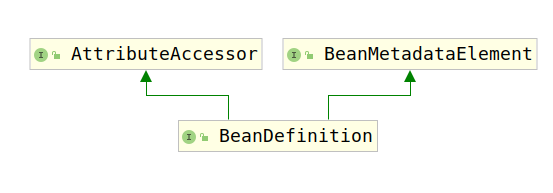

# BeanDefinition接口

Bean定义是一个bean实例的描述，它描述了一个bean的属性，构造器参数和以及更多的实现相关的信息。

该接口是一个最小的接口，该接口的主要功能是用于`BeanFactoryPostProcessor`去进行bean元数据的检查与更改。

考虑该接口的类继承结构图：

该接口继承了`AttributeAccessor`和`BeanMetadataElement`接口。首先对这两个接口进行分析，首先分析`AttributeAccessor`接口：

该接口用于将任意数据附加到任意对象上，该接口提供了一套管理attribute的方法，通过这套方法我们可以管理自定义的attribute。

因此这部分方法也相对简单：

1. setAttribute(String name, @Nullable Object value)：添加属性
2. getAttribute(String name)：获取属性
3. removeAttribute(String name)：移除属性
4. removeAttribute(String name)：判断属性是否存在
5. attributeNames()：获取所有属性的名字

下面考察`BeanMetadataElement`接口，该接口提供了获取Bean定义元数据的方法，即getSource()方法，通过该方法可以返回解析前的数据。

最后我们考察BeanDefinition接口。该接口定义了几个常量：

常量名|描述|值|类型
---|---|---|---
SCOPE_SINGLETON|该常量用于表示BeanDefinition中Bean是否是单例|singleton|String
SCOPE_PROTOTYPE|该常量用于表示BeanDefinition中的Bean是否是原型（每次获取都创建一个新的）|prototype|String
ROLE_APPLICATION|该常量用于表示该BeanDefinition是主程序的一部分|0|int
ROLE_SUPPORT|该常量用于表示该BeanDefinition是某些较大的配置的支持部分，通常都是外部的ComponentDefinition|1|int
ROLE_INFRASTRUCTURE|该常量用于表示BeanDefinition中的bean提供了完全的后台功能与最终的使用用户无关|2|int

除了上述的常量以外，该接口提供了一些列方法分别用于管理如下资源：

1. 父类BeanDefinition的名字：

    |方法|描述|
    ---|---
    setParentName(@Nullable String parentName)|设置父类BeanDefinition的名字
    getParentName()|获取父类BeanDefinition名字

2. bean类型的全限定类名：

    |方法|描述|
    ---|---
    setBeanClassName(@Nullable String beanClassName)|设置BeanDefinition指定的Bean的全限定类名
    getBeanClassName()|获取BeanDefinition指定的Bean的全限定类名

3. Bean的范围：

    |方法|描述|
    ---|---
    setScope(@Nullable String scope)|设置bean的范围（单例/原型）
    getScope()|获取bean的范围

4. Bean的懒加载属性：

    |方法|描述|
    ---|---
    setLazyInit(boolean lazyInit)|设置bean是否进行懒加载
    isLazyInit()|获取bean懒加载的配置

5. Bean的依赖：

    |方法|描述|
    ---|---
    setDependsOn(@Nullable String... dependsOn)|设置依赖的Bean名称
    getDependsOn()|获取依赖的Bean名称

6. 该Bean能否被自动注入：

    |方法|描述|
    ---|---
    setAutowireCandidate(boolean autowireCandidate)|设置该Bean是否可以被自动注入到其他Bean
    isAutowireCandidate()|查看该Bean是否可以被自动注入到其他Bean

7. 该Bean是否是自动注入时的首选类：

    |方法|描述|
    ---|---
    setPrimary(boolean primary)|设置该Bean是否是自动注入时的首选类
    isPrimary()|查看该Bean是否是自动注入时的首选类

8. 该Bean的FactoryBean名称：

    |方法|描述|
    ---|---
    setFactoryBeanName(@Nullable String factoryBeanName)|设置该Bean的工厂Bean名称
    getFactoryBeanName()|获取该Bean的工厂Bean名称

9. 该Bean的工厂方法名称：

    |方法|描述|
    ---|---
    setFactoryMethodName(@Nullable String factoryMethodName)|设置该Bean的工厂方法名称
    getFactoryBeanName()|获取该Bean的工厂方法名称

10. 该Bean的构造器参数：

    |方法|描述|
    ---|---
    getConstructorArgumentValues()|获取该Bean的构造器参数
    hasConstructorArgumentValues()|查询该Bean是否有构造器参数

11. 该Bean的属性：

    |方法|描述|
    ---|---
    getPropertyValues()|获取Bean的属性值
    hasPropertyValues()|查询该Bean是否有属性

12. 该Bean的声明周期方法：

    |方法|描述|
    ---|---
    setInitMethodName(@Nullable String initMethodName)|设置初始化方法名
    getInitMethodName()|获取初始化方法名
    setDestroyMethodName(@Nullable String destroyMethodName)|设置该Bean的销毁方法
    getDestroyMethodName()|获取该Bean的销毁方法名称

13. 该Bean的描述性参数

    |方法|属性|
    ---|---
    setRole(int role)|设置该Bean的角色
    getRole()|获取该Bean的角色
    setDescription(@Nullable String description)|设置该Bean的描述
    getDescription()|获得该Bean的描述
    getResolvableType()|获取该Bean的解析类型
    isSingleton()|判断该Bean是否是单例
    isPrototype()|判断该Bean是否是原型
    isAbstract()|判断该Bean是否是抽象的，无法实例化
    getResourceDescription()|获取该Bean的Bean定义资源描述
    getOriginatingBeanDefinition()|获取原始的Bean定义
