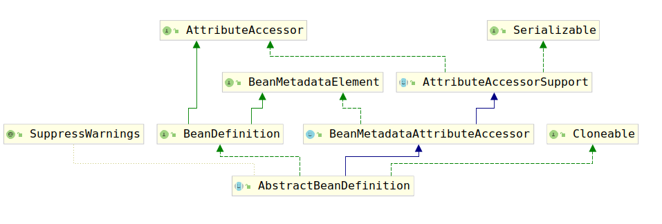

# AbstractBeanDefinition

AbstractBeanDefinition是BeanDefinition的抽象实现类，该类是成熟的BeanDefinition的基类。自动装配相关的常数配置在此进行声明。

考察`AbstractBeanDefinition`的类继承结构图：



由于`AbstractBeanDefinition`实现了BeanDefinition接口，这里再次考虑`BeanDefinition`接口类继承结构图：


两者相对比，其中`AttributeAccessorSupport`负责处理`AttributeAccessor`接口功能。`BeanMetadataAttributeAccessor`负责处理`BeanMetadataElement`接口功能。

下面考虑`AttributeAccessorSupport`实现：

由于`AttributeAccessor`提供的功能仅仅是为每个对象都提供一个通用属性管理，因此`AttributeAccessorSupport`使用一个Map存储属性集合，这里使用的是`LinkedHashMap`：

```java
private final Map<String, Object> attributes = new LinkedHashMap<>();
```

`AttributeAccessor`接口的实现通过管理该Map完成，值得一提的是，如果传入的value是null，那么会直接从attributes中remove掉该key-value值，而不是将null放入到attributes中，源码如下：

```java
public void setAttribute(String name, @Nullable Object value) {
    Assert.notNull(name, "Name must not be null");
    if (value != null) {
        this.attributes.put(name, value);
    }
    else {
        removeAttribute(name);
    }
}
```

下面考察`BeanMetadataAttributeAccessor`，该类继承了`AttributeAccessorSupport`，因此提供了通用属性管理功能。同时实现了`BeanMetadataElement`接口，用于保存Bean的元数据。但是该类不仅仅实现了这两个功能。该类在管理属性时，这里管理的是一个特殊的属性（即BeanMetadataAttribute）。首先考察`BeanMetadataAttribute`：

根据类名可以看出，该类也只是属性的一种表示，因此，该类中保存了`name`和`value`两个属性，但是该类还包含了一个属性名为`source`，该属性保存了该key-value值的解析源数据。查看该类的类继承结构可以看到，该类实现了`BeanMetadataElement`接口，该接口中方法的实现正是依靠该属性。

了解了`BeanMetadataAttribute`之后，再次查看`AttributeAccessor`接口要求实现的方法：

```java
@Override
public void setAttribute(String name, @Nullable Object value) {
    super.setAttribute(name, new BeanMetadataAttribute(name, value));
}

@Override
@Nullable
public Object getAttribute(String name) {
    BeanMetadataAttribute attribute = (BeanMetadataAttribute) super.getAttribute(name);
    return (attribute != null ? attribute.getValue() : null);
}

@Override
@Nullable
public Object removeAttribute(String name) {
    BeanMetadataAttribute attribute = (BeanMetadataAttribute) super.removeAttribute(name);
    return (attribute != null ? attribute.getValue() : null);
}
```

可以看到此处将属性值转化为`BeanMetadataAttribute`再进行管理。

下面开始正式分析`AbstractBeanDefinition`这个类，首先考察该类中声明的各个常量值，这些常量值分为4类：

1. Bean的默认范围：

    ```java
    public static final String SCOPE_DEFAULT = "";
    ```

    该常量表示默认的SCOPE名，即为("")，等效于单例，除非从父类Bean定义中进行了覆盖操作。

2. 自动装配模式配置

    |常量名|描述|值|类型|
    ---|---|---|---
    AUTOWIRE_NO|不进行自定义装配|AutowireCapableBeanFactory.AUTOWIRE_NO|int
    AUTOWIRE_BY_NAME|根据bean的属性名称进行装配|AutowireCapableBeanFactory.AUTOWIRE_BY_NAME|int
    AUTOWIRE_BY_TYPE|根据bean的属性的类型进行装配|AutowireCapableBeanFactory.AUTOWIRE_BY_TYPE|int
    AUTOWIRE_CONSTRUCTOR|根据构造器进行装配|AutowireCapableBeanFactory.AUTOWIRE_CONSTRUCTOR|int

3. 依赖检测类型

    |常量名|描述|值|类型|
    ---|---|---|---
    DEPENDENCY_CHECK_NONE|不进行依赖检测|0|int
    DEPENDENCY_CHECK_OBJECTS|对对象引用进行依赖检测|1|int
    DEPENDENCY_CHECK_SIMPLE|对简单属性进行依赖检测（通过BeanUtils的isSimpleProperty方法可以判断该属性是否是简单属性）|2|int
    DEPENDENCY_CHECK_ALL|对所有属性进行以来检测|3|int

4. 常量用于指定容器应尝试推断bean的destory方法名称。

    ```java
    public static final String INFER_METHOD = "(inferred)";
    ```

AbstractBeanDefinition存储了多个变量，用于BeanDefinition中重要属性的存储，主要包括如下几个：

1. beanClass

    ```java
    private volatile Object beanClass;
    ```

    该属性保存了Bean的类型。

2. scope

    ```java
    private String scope = SCOPE_DEFAULT;
    ```

    该属性存储了bean的scope，默认情况下是SCOPE_DEFAULT，默认情况下是单例。

3. abstractFlag

    ```java
    private boolean abstractFlag = false;
    ```

    该属性表示该Bean是否是抽象类。

4. lazyInit

    ```java
    private Boolean lazyInit;
    ```

    该属性表示该Bean是否需要懒加载。

5. 