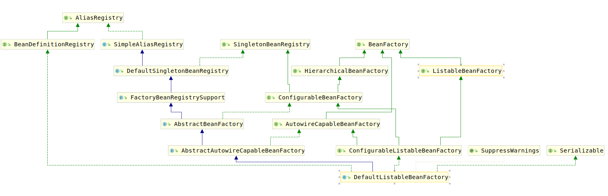

# DefaultListableBeanFactory

在分析`AnnotationConfigApplicationContext`的过程中，考察到，`AnnotationConfigApplicationContext`的父类名为`GenericApplicationContext`，`GenericApplicationContext`为`AbstractApplicationContext`提供了beanFactory和resourceLoader相关方法的实现。此处使用的BeanFactory便是`DefaultListableBeanFactory`。

这里考察`DefaultListableBeanFactory`的类继承结构图：

详细考察类图可以发现，`DefaultListableBeanFactory`实现了三族接口：

1. AliasRegistry接口以及其子接口
2. SingletonBeanRegistry接口以及其子接口
3. BeanFactory接口以及其子接口
4. AutowireCapableBeanFactory接口以及其子接口

接下来对这些接口进行分析。
