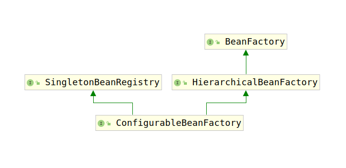

# ConfigurableBeanFactory接口

该接口是绝大多数BeanFactory的配置接口，用于对BeanFactory进行配置。

该类的类继承结构图如下：



该接口主要对如下项目进行配置：

1. 父类BeanFactory

    ```java
    void setParentBeanFactory(BeanFactory parentBeanFactory) throws IllegalStateException;
    ```

    该方法配置BeanFactory的父BeanFactory。由于`ConfigurableBeanFactory`的父接口`HierarchicalBeanFactory`为`BeanFactory`提供了层级结构，即BeanFactory可以有其父BeanFactory，也可以有其子BeanFactory。但是并没有提供配置接口，只提供了查询接口，因此此处提供配置方法。

2. 类加载器

    ```java
    void setBeanClassLoader(@Nullable ClassLoader beanClassLoader);
    ClassLoader getBeanClassLoader();
    void setTempClassLoader(@Nullable ClassLoader tempClassLoader);
    ClassLoader getTempClassLoader();
    ```

    Spring的BeanFactory中有两个ClassLoader，分别是BeanClassLoader和TempClassLoader。

    其中TempClassLoader用于类型匹配。缺省为none，仅使用标准bean ClassLoader。如果涉及到加载时织入，通常只指定一个临时的ClassLoader，以确保尽可能延迟地加载实际的bean类。BeanFactory完成其引导阶段后，便会将其删除。

3. bean元数据缓冲

    ```java
    void setCacheBeanMetadata(boolean cacheBeanMetadata);
    boolean isCacheBeanMetadata();
    ```
