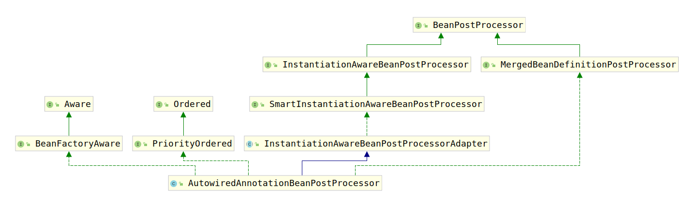

# 2.7.2 创建Bean-修改Bean定义

Spring很多信息都被保存在了一个Bean定义，在Spring中BeanDefinition不仅仅用于表示bean创建的元数据，它甚至用Bean定义做了缓存，例如上一节中说的`resolvedConstructorOrFactoryMethod`、`constructorArgumentsResolved`等。那么修改Bean定义就实现更多操作，例如`@Autowired`注解的功能就是使用该技术进行的。接下来我们考察Spring创建过程中修改Bean定义的部分。

该部分功能由`MergedBeanDefinitionPostProcessor`完成，接下来我们查看该部分代码：

```java
// 获取创建的对象
final Object bean = instanceWrapper.getWrappedInstance();
// 获取bean的类型
Class<?> beanType = instanceWrapper.getWrappedClass();
// 将bean类型缓存下来
if (beanType != NullBean.class) {
    mbd.resolvedTargetType = beanType;
}

// 处理Bean定义
synchronized (mbd.postProcessingLock) {
    // 如果BeanDefinition没有被处理过，那么进行处理
    if (!mbd.postProcessed) {
        try {
            // 使用MergedBeanDefinitionPostProcessor处理bean定义
            applyMergedBeanDefinitionPostProcessors(mbd, beanType, beanName);
        }
        catch (Throwable ex) {
            throw new BeanCreationException(mbd.getResourceDescription(), beanName,
                "Post-processing of merged bean definition failed", ex);
            }
            // 将BeanDefinition标记为被处理过
            mbd.postProcessed = true;
    }
}
```

这里相对复杂的方法就是`applyMergedBeanDefinitionPostProcessors(RootBeanDefinition mbd, Class<?> beanType, String beanName)`，该方法用来使用`MergedBeanDefinitionPostProcessor`的`postProcessMergedBeanDefinition(RootBeanDefinition beanDefinition, Class<?> beanType, String beanName)`修改BeanDefinition。代码如下：

```java
protected void applyMergedBeanDefinitionPostProcessors(RootBeanDefinition mbd, Class<?> beanType, String beanName) {
    for (BeanPostProcessor bp : getBeanPostProcessors()) {
        if (bp instanceof MergedBeanDefinitionPostProcessor) {
            MergedBeanDefinitionPostProcessor bdp = (MergedBeanDefinitionPostProcessor) bp;
            bdp.postProcessMergedBeanDefinition(mbd, beanType, beanName);
        }
    }
}
```

文章开头已经说了，这部分用于处理`@Autowired`注解，这里我们对`@Autowired`注解的处理逻辑进行分析。处理该部分逻辑的`MergedBeanDefinitionPostProcessor`是`AutowiredAnnotationBeanPostProcessor`，接下来我们对其进行分析。

`AutowiredAnnotationBeanPostProcessor`类的类继承结构图如下：



上图中的接口我们都对其进行分析过，现在查看`AutowiredAnnotationBeanPostProcessor`到底实现了哪些方法，实际上`AutowiredAnnotationBeanPostProcessor`仅仅实现了如下方法：

1. Ordered的getOrder()方法
2. BeanFactoryAware的setBeanFactory(BeanFactory beanFactory)方法
3. MergedBeanDefinitionPostProcessor的所有方法
4. `InstantiationAwareBeanPostProcessor`的`determineCandidateConstructors(Class<?> beanClass, final String beanName)`方法
5. 
