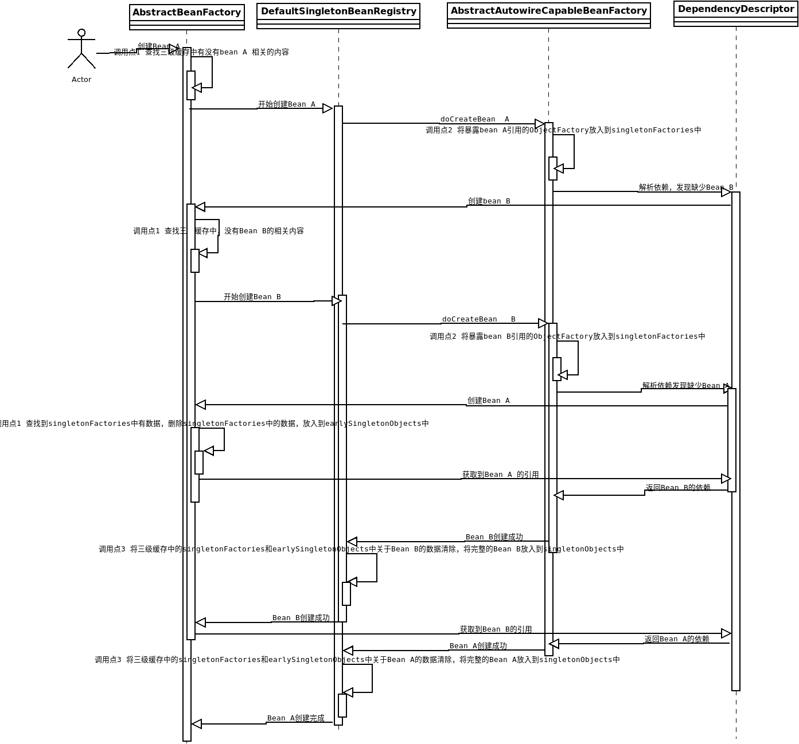

# 2.7.3创建bean-处理早期暴露引用

经历前两节分析的两个步骤，bean的最基础的对象已经被创建出来，虽然仅仅只通过构造器创建了，没有做任何修饰，并且也根据框架配置，对该Bean的BeanDefinition进行了合理的修改。接下来要处理早期暴露问题。

首先我们讨论何为早期暴露bean、为什么要在此处处理该问题、怎么处理的该问题？

## 1. 何为早期暴露bean

早期暴露bean是指在bean尚未创建完成之前就将bean的引用暴露出去，该功能主要用于处理循环依赖问题。Spring自动注入bean的方式有两种：

1. 根据构造器自动注入
2. 根据Setter方法、属性自动注入

经历过上面的分析我们已经了解了两者的具体步骤。因为有两种注入方式，两种方式都可能会出现循环依赖问题，那么就需要对其进行处理，Spring针对循环依赖问题对上述两种注入方式的处理逻辑是不同的：

1. 如果使用的是构造器自动注入，那么不解决循环依赖问题。
2. 如果使用的是Setter方法、属性自动注入，那么使用早期暴露的方式解决循环依赖问题。

那么Spring为什么不解决构造器自动注入时的循环依赖问题呢？因为如果不提供充足的依赖，根本无法创建一个空对象，毕竟不是所有的类都有默认无参构造器的。所以，对象都无法创建，怎么考虑属性注入的问题呢？因此，无法解决构造器自动注入时出现的循环依赖问题。使用一个例子来解释问题：

例如存在两个类A、B，其声明如下：

```java
public class A {
    public A(B b){
        ...
    }
}

public class B {
    public B(A b){
        ...
    }
}
```

这种情况下，当我们创建A类型的Bean（以下均称为Bean A）时缺少B类型的Bean（以下均称为Bean B），创建Bean B时需要Bean A，两个类型的对象实例根本无法创建，这是Java本身决定的，尽管是Spring也无法解决该问题。

但是Setter方法注入和属性注入则不同，因为bean对象已经根据构造器创建出来了，那么就可以将bean对象根据Setter方法或者作为属性注入到目标对象中，尽管被注入的对象是不完整的，但是总有完整的时候，无论对象是否完整，都使用的是相同的引用。同样使用一个例子来解释：

例如存在两个类A、B，其声明如下：

```java
public class A {

    private B b;
    public A(){
        ...
    }
}

public class B {

    private A a;
    public B(){
        ...
    }
}
```

可以看到，上述代码中也出现了循环依赖，但是这种循环依赖是不影响对象的创建的，我们可以轻易的用构造器创建出Bean A 和Bean B，当A需要注入B时也可以正常注入，尽管这时Bean B并不完整，但是无论Bean B如何更改，A中的b属性永远是当时注入的Bean B的引用，所以就算当Bean A注入了Bean B也不会导致之前的注入操作发生问题。所以这样就解决了循环依赖的问题。

顺便提一句，Spring是不解决原型Bean的循环依赖问题的。

## 2. 为什么要在此处处理早期暴露问题

经过上部分的分析，我们知道早期暴露出去的仅仅是刚创建出来的bean实例，所以要在构造器创建bean之后调用是很正常的，但是为何要在`applyMergedBeanDefinitionPostProcessors(mbd, beanType, beanName);`后调用呢？因为在获取早期暴露bean的时候，可能会通过BeanDefinition进行一系列操作，例如，早期暴露的bean不一定是构造器创建的bean，可能是该bean的代理。如果想要深入分析，可以深入考察`AbstractAutoProxyCreator`。

## 3. 如何处理的早期暴露问题

Spring通过三级缓存的去处理循环依赖问题，早期暴露问题就是循环依赖的一个子问题。

这里我们首先查看创建bean的过程中对于该问题到底做了怎样的操作：

```java
// 判断该bean是否允许早期暴露引用
boolean earlySingletonExposure = (mbd.isSingleton() && this.allowCircularReferences &&
    isSingletonCurrentlyInCreation(beanName));
// 执行早期暴露引用的操作
if (earlySingletonExposure) {
    if (logger.isTraceEnabled()) {
        logger.trace("Eagerly caching bean '" + beanName +
            "' to allow for resolving potential circular references");
    }
    addSingletonFactory(beanName, () -> getEarlyBeanReference(beanName, mbd, bean));
}
```

这里我们首先考察bean满足了哪些条件才允许早期暴露引用。其实经历过之前的分析，我们很容易看出上述三个条件分别代表什么：

1. mbd.isSingleton() -> bean是单例
2. this.allowCircularReferences -> 容器允许出现循环引用
3. isSingletonCurrentlyInCreation(beanName) -> 该单例正在创建

满足上述三个条件就允许早期暴露bean引用，早期暴露bean引用的方式也比较简单，仅仅是为bean分配一个工厂，然后放入到`singletonFactories`属性中罢了，详细考察该部分代码：

```java
addSingletonFactory(beanName, () -> getEarlyBeanReference(beanName, mbd, bean));

protected void addSingletonFactory(String beanName, ObjectFactory<?> singletonFactory) {
    Assert.notNull(singletonFactory, "Singleton factory must not be null");
    synchronized (this.singletonObjects) {
        if (!this.singletonObjects.containsKey(beanName)) {
            this.singletonFactories.put(beanName, singletonFactory);
            this.earlySingletonObjects.remove(beanName);
            this.registeredSingletons.add(beanName);
        }
    }
}
```

可以看到处理bean引用的方法是`getEarlyBeanReference(beanName, mbd, bean)`方法，这里根据bean定义对创建的bean进行处理。注意这里的处理操作是在调用ObjectFactory的getObject()方法时进行的。这里首先考察`addSingletonFactory(String beanName, ObjectFactory<?> singletonFactory)`方法，该方法被定义在`DefaultSingletonBeanRegistry`中。这里就涉及到了之前提到的三级缓存，这三级缓存分别是：

1. this.singletonObjects -> 保存创建完成的bean
2. this.earlySingletonObjects -> 保存尚未创建完毕的bean，属性尚未填充完成
3. this.singletonFactories -> 保存bean的原始对象

Spring bean创建过程中只有三处处理了三级缓存：

1. 刚刚开始创建bean时，调用了`getSingleton(String name)`方法获取缓存中的bean避免重复创建(详细请回顾[2.2创建Bean-处理早期暴露Bean](./2.2创建Bean-处理早期暴露Bean.md))，调用点代码(`AbstractBeanFactory`类中)：

   ```java
    protected <T> T doGetBean(final String name, @Nullable final Class<T> requiredType,
        @Nullable final Object[] args, boolean typeCheckOnly) throws BeansException {
        ...
        Object sharedInstance = getSingleton(beanName); //调用点1
        ...
    }
   ```

2. 本节讨论处

    ```java
    if (earlySingletonExposure) {
        if (logger.isTraceEnabled()) {
            logger.trace("Eagerly caching bean '" + beanName +
            "' to allow for resolving potential circular references");
        }
        // 调用点2
        addSingletonFactory(beanName, () -> getEarlyBeanReference(beanName, mbd, bean));
    }
    ```

3. 在创建bean时调用了getSingleton(String beanName, boolean allowEarlyReference)方法中调用了`addSingleton(String beanName, Object singletonObject)`方法(详情请回顾[创建Bean-获取单例Bean](./2.6创建Bean-获取单例Bean.md))，调用点代码(`AbstractBeanFactory`类中):

    ```java
    public Object getSingleton(String beanName, ObjectFactory<?> singletonFactory) {
        ...
        if (newSingleton) {
            addSingleton(beanName, singletonObject); // 调用点3
        }
        ...
    }
    ```

下面考虑无循环依赖与有循环依赖的过程中，三级缓存是如何工作的，在没有出现循环依赖时，例如首次创建Bean A，创建过程中三级缓存状态如下：

|调用点|singletonObjects|earlySingletonObjects|singletonFactories|
---|---|---|---
A.调用点1|空|空|空
A.调用点2|空|空|存在对应ObjectFactory（调用点2添加）
A.调用点3|创建完成的Bean A|空|空（调用点3清除）

如果出现了循环依赖，例如Bean A和Bean B循环依赖，那么创建过程中三级缓存状态如下：

|调用点|singletonObjects|earlySingletonObjects|singletonFactories|
---|---|---|---
A.调用点1|A空B空|A空B空|A空B空
A.调用点2|A空B空|A空B空|A存在对应ObjectFactory（调用点2添加）、B空
B.调用点1|A空B空|A空B空|A存在对应ObjectFactory、B空
B.调用点2|A空B空|A空B空|A存在对应ObjectFactory、B存在对应ObjectFactory（调用点2添加）
A.调用点1|A空B空|A存在对象（调用点1添加）B空|A空（调用点1清除）、B存在对应ObjectFactory
B.调用点3|A空B创建完成的Bean B（调用点3添加）|A存在对象B空|A空B空
A.调用点3|A创建完成的Bean A（调用点3添加） B创建完成的Bean B|A空（调用点3清除）B空|A空B空

创建过程配合下图更好理解：



Spring Bean的自动注入的循环依赖也在此处理完毕。
