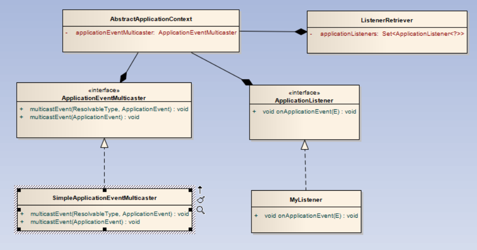

# Spring IOC的一般使用方法

## @Configuration 和 @Bean注解

Spring IOC注解式开发使用一个配置类代替配置文件，配置类就是在类上加上@Configuration注解就可以了，当我们要注册一个类型为A的bean时，我们只需要创建一个新的方法，该方法的返回值为类型A即可，创建的方法的方法名即为bean ID。

下面给出创建一个名为Car的bean的例子：

    @Configuration
    public class TestConfiguration {
        
        public TestConfiguration() {
            System.out.println("TestConfiguration is creating");
        }
        
        @Bean
        public Car car() {
            return new Car("Big Car",10);
        }	
    }

    public class Car {

        private String name;
        
        private int age;

        public String getName() {
            return name;
        }

        public void setName(String name) {
            this.name = name;
        }

        public int getAge() {
            return age;
        }

        public void setAge(int age) {
            this.age = age;
        }

        public Car() {
            super();
        }

        public Car(String name, int age) {
            super();
            this.name = name;
            this.age = age;
        }

        @Override
        public String toString() {
            return "Car [name=" + name + ", age=" + age + "]";
        }
        
    }

    public class Main {

        public static void main(String[] args) {
            ApplicationContext context = new AnnotationConfigApplicationContext(TestConfiguration.class);
            Car car = (Car) context.getBean("car");
            String[] names = context.getBeanDefinitionNames();
            System.out.println(context.getDisplayName());
            System.out.println(car);
            System.out.println(context.containsBean("car"));
            for(String str:names) {
                System.out.println(str);
            }
        }
    }

## @ComponentScan

报扫描会自动扫描指定路径下的组件，查看@ComponentScan源码，我们发现很多的属性，这里我们一一列举。

### 1. 直接使用@ComponentScan

直接使用@ComponentScan将会扫描本配置类所在的包以及其子包下的所有组件。

### 2. 指定basePackages属性

basePackages属性是一个String[]数组，该属性指定了要扫描的包，源码如下：

	String[] basePackages() default {};

我们可以通过如下方式对其进行使用：

@ComponentScan(basePackages={"1","2"})

这样Spring就会扫描到1包和2包下的所有Bean，这里的1和2仅仅是偷懒，不要在意。

### 3. 指定basePackageClasses属性

basePackages属性是一个String[]数组，该属性指定了要扫描的类，源码如下：

	Class<?>[] basePackageClasses() default {};

我们可以通过如下方式对其进行使用：

@ComponentScan(basePackageClasses={"1","2"})

这样Spring就会扫描到1类和2类，然后将其作为bean，这里的1和2仅仅是偷懒，不要在意。

### 4.指定includeFilters()属性

includeFilters接受一个Filter数组，该属性用一个Filter数组来过滤扫描的类，经过Filter过滤的bean都会进行加载，放入容器中，源码如下：

	Filter[] includeFilters() default {};

我们考察Filter注解：

@Retention(RetentionPolicy.RUNTIME)
	@Target({})
	@interface Filter {
        FilterType type() default FilterType.ANNOTATION;
        @AliasFor("classes")
		Class<?>[] value() default {};
        @AliasFor("value")
		Class<?>[] classes() default {};
        String[] pattern() default {};
    }

其中type可以指定5个值：ANNOTATION,ASSIGNABLE_TYPE,ASPECTJ,REGEX,CUSTOM，分别代表按注解、给定的类型、ASPECTJ表达式、正则表达式、自定义规则进行过滤。其中按照自定义规则进行过滤要传入自定义的TypeFilter类。

我们这里先演示下按照注解进行过滤：

首先自定义一个注解：

    @Retention(RetentionPolicy.RUNTIME)
    @Target(ElementType.TYPE)
    public @interface MyAn {

        String values() default "";
        
    }

然后创建两个类用该注解标注：

    @MyAn
    public class Car {
    private String name;
        
        private int age;

        public String getName() {
            return name;
        }

        public void setName(String name) {
            this.name = name;
        }

        public int getAge() {
            return age;
        }

        public void setAge(int age) {
            this.age = age;
        }

        public Car() {
            super();
        }

        public Car(String name, int age) {
            super();
            this.name = name;
            this.age = age;
        }

        @Override
        public String toString() {
            return "Car [name=" + name + ", age=" + age + "]";
        }
    }

    @MyAn
    public class Bike {

        private String name;
        
        private int age;

        public String getName() {
            return name;
        }

        public void setName(String name) {
            this.name = name;
        }

        public int getAge() {
            return age;
        }

        public void setAge(int age) {
            this.age = age;
        }

        public Bike() {
            super();
        }

        public Bike(String name, int age) {
            super();
            this.name = name;
            this.age = age;
        }

        @Override
        public String toString() {
            return "Car [name=" + name + ", age=" + age + "]";
        }
    }
然后创建一个类用@Component标注：

    @Component
    public class Taxi {

    private String name;
        
        private int age;

        public String getName() {
            return name;
        }

        public void setName(String name) {
            this.name = name;
        }

        public int getAge() {
            return age;
        }

        public void setAge(int age) {
            this.age = age;
        }

        public Taxi() {
            super();
        }

        public Taxi(String name, int age) {
            super();
            this.name = name;
            this.age = age;
        }

        @Override
        public String toString() {
            return "Car [name=" + name + ", age=" + age + "]";
        
        }
    }

然后创建配置类，我们使用包扫描规定被@MyAn标注的类也要被当作bean加载：

    @ComponentScan(includeFilters = {
            @Filter(type=FilterType.ANNOTATION,classes= {MyAn.class})
    })
    public class TestConfiguration {

    }

然后写一个main函数测试：

    public class Main {

        public static void main(String[] args) {
            ApplicationContext context = new AnnotationConfigApplicationContext(TestConfiguration.class);
            String[] names = context.getBeanDefinitionNames();
            System.out.println(context.getDisplayName());
            for(String str:names) {
                System.out.println(str);
            }
        }
        
    }

测试结果：

    org.springframework.context.annotation.AnnotationConfigApplicationContext@5b37e0d2
    org.springframework.context.annotation.internalConfigurationAnnotationProcessor
    org.springframework.context.annotation.internalAutowiredAnnotationProcessor
    org.springframework.context.annotation.internalRequiredAnnotationProcessor
    org.springframework.context.annotation.internalCommonAnnotationProcessor
    org.springframework.context.event.internalEventListenerProcessor
    org.springframework.context.event.internalEventListenerFactory
    testConfiguration
    bike
    car
    taxi

bike、car、taxi都被加入到spring-ioc容器中了。如果我们不想将Spring默认的几个注解标注的类加入到容器中，可以如下配置：

    @ComponentScan(includeFilters = {
            @Filter(type=FilterType.ANNOTATION,classes= {MyAn.class})
    },useDefaultFilters = false)
    public class TestConfiguration {
        
    }

然后再运行上述代码，结果如下：

    org.springframework.context.annotation.AnnotationConfigApplicationContext@5b37e0d2
    org.springframework.context.annotation.internalConfigurationAnnotationProcessor
    org.springframework.context.annotation.internalAutowiredAnnotationProcessor
    org.springframework.context.annotation.internalRequiredAnnotationProcessor
    org.springframework.context.annotation.internalCommonAnnotationProcessor
    org.springframework.context.event.internalEventListenerProcessor
    org.springframework.context.event.internalEventListenerFactory
    testConfiguration
    bike
    car

没有被@Component修饰的Taxi类的对象加入到容器中。

下面使用FilterType.CUSTOM来进行过滤，这里我们需要自定义一个TypeFilter，代码如下：

    public class MyFilter implements TypeFilter{

        
        /**
        * @param metadataReader 读取到当前正在扫描类的信息
        * @param metadataReaderFactory 可以读取到任何类的信息
        * */
        public boolean match(MetadataReader metadataReader, MetadataReaderFactory metadataReaderFactory)
                throws IOException {
            return metadataReader.getClassMetadata().getClassName().equals("cn.edu.ynu.example.example3.Car");
        }

    }

这里metadataReader有三个方法:
1. metadataReader.getAnnotationMetadata():获取当前扫描类的注解信息
2. metadataReader.getClassMetadata()：获取当前扫描类的类信息
3. metadataReader.getResource()：获取当前扫描类的资源信息（类路径）

这里metadataReaderFactory有两个方法：
1.  metadataReaderFactory.getMetadataReader(String)，String指定一个类名，通过这个类名我们可以获取它的metadataReader。
2.  metadataReaderFactory.getMetadataReader(Resource)，这个同上，只不过我们传入的是一个Resource对象。

同样进行上述测试，结果如下：

    org.springframework.context.annotation.AnnotationConfigApplicationContext@5b37e0d2
    org.springframework.context.annotation.internalConfigurationAnnotationProcessor
    org.springframework.context.annotation.internalAutowiredAnnotationProcessor
    org.springframework.context.annotation.internalRequiredAnnotationProcessor
    org.springframework.context.annotation.internalCommonAnnotationProcessor
    org.springframework.context.event.internalEventListenerProcessor
    org.springframework.context.event.internalEventListenerFactory
    testConfiguration
    car

该包下不满足条件的类全部被过滤掉了。

## @Scope注解

Spring ioc创建的bean默认情况下是单例的即Singleton类型的，但是有时候我们不希望他是单例的，我们可以使用@Scope注解为其进行设置，@Scope可以设置4个值，分别代表如下意思：
1. singleton:单例，只在容器创建时创建一次，容器关闭时销毁，由于是单例，所以使用==进行比较得到的结果为true。
2. prototype:原型，每次访问都创建一次，只在使用时才创建，容器不管理器销毁
3. session:每个session创建一次
4. request:每个请求创建一次

## @Lazy注解

由于单实例bean在容器启动时创建对象，如果我们在Bean上加上@Lazy就可以让容器进行懒加载，即第一次获取时才创建对象。

## @Conditional注解

@Conditional注解能按照一定条件注册bean，满足条件则注册bean。其源码如下：

    @Target({ElementType.TYPE, ElementType.METHOD})
    @Retention(RetentionPolicy.RUNTIME)
    @Documented
    public @interface Conditional {

        /**
        * All {@link Condition}s that must {@linkplain Condition#matches match}
        * in order for the component to be registered.
        */
        Class<? extends Condition>[] value();

    }

可以看到该注解可以放在类或者方法上，value里面需要传入Condition数组，查看Condition，发现它是一个接口，代码如下：

    public interface Condition {

        /**
        * Determine if the condition matches.
        * @param context the condition context
        * @param metadata metadata of the {@link org.springframework.core.type.AnnotationMetadata class}
        * or {@link org.springframework.core.type.MethodMetadata method} being checked
        * @return {@code true} if the condition matches and the component can be registered,
        * or {@code false} to veto the annotated component's registration
        */
        boolean matches(ConditionContext context, AnnotatedTypeMetadata metadata);

    }
我们需要实现matches方法，CaonditionContext context参数是判断条件可以使用的上下文信息，AnnotatedTypeMetadata metadata是注释信息。下面进行演示，我们定义环境变量TRANSPORTATION，如果该变量值为bike我们就装配Bike bean，如果是Car，就装配Car bean。首先是Condition类：

    public class BikeCondition implements Condition{

        /**
        * @param context 
        * */
        public boolean matches(ConditionContext context, AnnotatedTypeMetadata metadata) {
            Environment environment = context.getEnvironment();
            return environment.getProperty("TRANSPORTATION").equals("BIKE");
        }

    }

BikeCondition中的matches方法规定只有当TRANSPORTATION环境变量为BIKE时这个条件才成立。然后是另一个Condition类：

    public class CarCondition implements Condition {

        public boolean matches(ConditionContext context, AnnotatedTypeMetadata metadata) {
            
            Environment environment = context.getEnvironment();
            return environment.getProperty("TRANSPORTATION").equals("CAR");
        }

    }

CarCondition中matches方法规定只有当TRANSPORTATION环境变量为CAR时这个条件才成立，配置类如下：

    @Configuration
    public class TestConfiguration {

        @Conditional(value= {CarCondition.class})
        @Bean
        public Car car() {
            return new Car();
        }
        
        @Conditional(value= {BikeCondition.class})
        @Bean
        public Bike bike() {
            return new Bike();
        }
    }

满足CarCondition就装配car，满足BikeCondition就装配bike。

测试类如下：

    public class Main {

        public static void main(String[] args) {
            
            ApplicationContext context = new AnnotationConfigApplicationContext(TestConfiguration.class);
            String[] names = context.getBeanDefinitionNames();
            System.out.println(context.getEnvironment().getProperty("TRANSPORTATION"));
            for(String str:names) {
                System.out.println(str);
            }
        }
    }

环境变量TRANSPORTATION为BIKE时运行结果为：

    BIKE
    org.springframework.context.annotation.internalConfigurationAnnotationProcessor
    org.springframework.context.annotation.internalAutowiredAnnotationProcessor
    org.springframework.context.annotation.internalRequiredAnnotationProcessor
    org.springframework.context.annotation.internalCommonAnnotationProcessor
    org.springframework.context.event.internalEventListenerProcessor
    org.springframework.context.event.internalEventListenerFactory
    testConfiguration
    bike

环境变量TRANSPORTATION为CAR时运行结果为：

    CAR
    org.springframework.context.annotation.internalConfigurationAnnotationProcessor
    org.springframework.context.annotation.internalAutowiredAnnotationProcessor
    org.springframework.context.annotation.internalRequiredAnnotationProcessor
    org.springframework.context.annotation.internalCommonAnnotationProcessor
    org.springframework.context.event.internalEventListenerProcessor
    org.springframework.context.event.internalEventListenerFactory
    testConfiguration
    car

需要注意的是@Conditional注解传入的是一个Condition数组，所有的Condition都满足才能进行注册这个bean，否则不行，修改配置类如下：

    @Configuration
    public class TestConfiguration {

        @Conditional(value= {CarCondition.class,BikeCondition.class})
        @Bean
        public Car car() {
            return new Car();
        }
        
        @Conditional(value= {BikeCondition.class})
        @Bean
        public Bike bike() {
            return new Bike();
        }
    }

环境变量TRANSPORTATION设置为BIKE时，测试结果如下：

    BIKE
    org.springframework.context.annotation.internalConfigurationAnnotationProcessor
    org.springframework.context.annotation.internalAutowiredAnnotationProcessor
    org.springframework.context.annotation.internalRequiredAnnotationProcessor
    org.springframework.context.annotation.internalCommonAnnotationProcessor
    org.springframework.context.event.internalEventListenerProcessor
    org.springframework.context.event.internalEventListenerFactory
    testConfiguration
    bike

我们发现car 这个bean没有被注册到容器中。

## @Import注解

@Import能快速的给容器导入一个组件，源码如下：

    @Target(ElementType.TYPE)
    @Retention(RetentionPolicy.RUNTIME)
    @Documented
    public @interface Import {

        /**
        * {@link Configuration}, {@link ImportSelector}, {@link ImportBeanDefinitionRegistrar}
        * or regular component classes to import.
        */
        Class<?>[] value();

    }
@Import接收一个Class类型的数组，Spring-ioc会将该数组中所有的类型都注册为一个bean。

具体用法如下：

我们仅仅修改上一部分例子中的配置类：

    @Configuration
    @Import(Bike.class)
    public class TestConfiguration {

        @Bean
        public Car car() {
            return new Car();
        }
    }

然后测试类如下：

    public class Main {

        public static void main(String[] args) {
            
            ApplicationContext context = new AnnotationConfigApplicationContext(TestConfiguration.class);
            String[] names = context.getBeanDefinitionNames();
            Bike bike = context.getBean(Bike.class);
            System.out.println(bike);
            for(String str:names) {
                System.out.println(str);
            }
        }
    }

结果如下：

    Bike [name=null, age=0]
    org.springframework.context.annotation.internalConfigurationAnnotationProcessor
    org.springframework.context.annotation.internalAutowiredAnnotationProcessor
    org.springframework.context.annotation.internalRequiredAnnotationProcessor
    org.springframework.context.annotation.internalCommonAnnotationProcessor
    org.springframework.context.event.internalEventListenerProcessor
    org.springframework.context.event.internalEventListenerFactory
    testConfiguration
    cn.edu.ynu.example.example5.Bike
    car

我们看到这里cn.edu.ynu.example.example5.Bike 被注册到了Spring-ioc容器中，还可以看出是通过默认构造器创建的bean，而且id默认为全类名，如果我们注释掉Bike的默认构造函数，结果如下：

    Exception in thread "main" org.springframework.beans.factory.UnsatisfiedDependencyException: Error creating bean with name 'cn.edu.ynu.example.example5.Bike': Unsatisfied dependency expressed through constructor parameter 0; nested exception is org.springframework.beans.factory.NoSuchBeanDefinitionException: No qualifying bean of type 'java.lang.String' available: expected at least 1 bean which qualifies as autowire candidate. Dependency annotations: {}
        at org.springframework.beans.factory.support.ConstructorResolver.createArgumentArray(ConstructorResolver.java:729)
        at org.springframework.beans.factory.support.ConstructorResolver.autowireConstructor(ConstructorResolver.java:192)
        at org.springframework.beans.factory.support.AbstractAutowireCapableBeanFactory.autowireConstructor(AbstractAutowireCapableBeanFactory.java:1274)
        at org.springframework.beans.factory.support.AbstractAutowireCapableBeanFactory.createBeanInstance(AbstractAutowireCapableBeanFactory.java:1131)
        at org.springframework.beans.factory.support.AbstractAutowireCapableBeanFactory.doCreateBean(AbstractAutowireCapableBeanFactory.java:541)
        at org.springframework.beans.factory.support.AbstractAutowireCapableBeanFactory.createBean(AbstractAutowireCapableBeanFactory.java:501)
        at org.springframework.beans.factory.support.AbstractBeanFactory.lambda$doGetBean$0(AbstractBeanFactory.java:317)
        at org.springframework.beans.factory.support.DefaultSingletonBeanRegistry.getSingleton(DefaultSingletonBeanRegistry.java:228)
        at org.springframework.beans.factory.support.AbstractBeanFactory.doGetBean(AbstractBeanFactory.java:315)
        at org.springframework.beans.factory.support.AbstractBeanFactory.getBean(AbstractBeanFactory.java:199)
        at org.springframework.beans.factory.support.DefaultListableBeanFactory.preInstantiateSingletons(DefaultListableBeanFactory.java:760)
        at org.springframework.context.support.AbstractApplicationContext.finishBeanFactoryInitialization(AbstractApplicationContext.java:869)
        at org.springframework.context.support.AbstractApplicationContext.refresh(AbstractApplicationContext.java:550)
        at org.springframework.context.annotation.AnnotationConfigApplicationContext.<init>(AnnotationConfigApplicationContext.java:88)
        at cn.edu.ynu.example.example5.Main.main(Main.java:13)
    Caused by: org.springframework.beans.factory.NoSuchBeanDefinitionException: No qualifying bean of type 'java.lang.String' available: expected at least 1 bean which qualifies as autowire candidate. Dependency annotations: {}
        at org.springframework.beans.factory.support.DefaultListableBeanFactory.raiseNoMatchingBeanFound(DefaultListableBeanFactory.java:1509)
        at org.springframework.beans.factory.support.DefaultListableBeanFactory.doResolveDependency(DefaultListableBeanFactory.java:1104)
        at org.springframework.beans.factory.support.DefaultListableBeanFactory.resolveDependency(DefaultListableBeanFactory.java:1065)
        at org.springframework.beans.factory.support.ConstructorResolver.resolveAutowiredArgument(ConstructorResolver.java:815)
        at org.springframework.beans.factory.support.ConstructorResolver.createArgumentArray(ConstructorResolver.java:721)
        ... 14 more

我们注意到@Import的value属性中可以放置Configuration、ImportSelector、ImportBeanDefinitionRegistrar类型的类，考察放置ImportSelector类，这里将不再是将这个类作为bean注册到容器中，我们考察ImportSelector类源码：

    public interface ImportSelector {

        /**
        * Select and return the names of which class(es) should be imported based on
        * the {@link AnnotationMetadata} of the importing @{@link Configuration} class.
        */
        String[] selectImports(AnnotationMetadata importingClassMetadata);

    }

如果@Import的value值中放入的类实现了这个接口，那么就会将selectImports()返回的String[]数组中的类注册到容器中，该数组中保存的是类的全限定名。这里的AnnotationMetadata类型的参数是当前被标记上@Import的类上的所有注解信息。这里给出使用例子：

    public class MyImportSelector implements ImportSelector{

        //AnnotationMetadata:当前标注@Import注解的类的所有注释信息
        public String[] selectImports(AnnotationMetadata importingClassMetadata) {
            return new String[] {"cn.edu.ynu.example.example5.Taxi"};
        }
    }

配置类修改如下：

    @Configuration
    @Import(value= {MyImportSelector.class})
    public class TestConfiguration {

        @Bean
        public Car car() {
            return new Car();
        }
    }

结果如下：

    org.springframework.context.annotation.internalConfigurationAnnotationProcessor
    org.springframework.context.annotation.internalAutowiredAnnotationProcessor
    org.springframework.context.annotation.internalRequiredAnnotationProcessor
    org.springframework.context.annotation.internalCommonAnnotationProcessor
    org.springframework.context.event.internalEventListenerProcessor
    org.springframework.context.event.internalEventListenerFactory
    testConfiguration
    cn.edu.ynu.example.example5.Taxi
    car

最后考虑value中的值是ImportBeanDefinitionRegistrar，该类可以自定义控制bean的注册，源码如下：

    public interface ImportBeanDefinitionRegistrar {

        /**
        * Register bean definitions as necessary based on the given annotation metadata of
        * the importing {@code @Configuration} class.
        * 
Note that {@link BeanDefinitionRegistryPostProcessor} types may <em>not</em> be
        * registered here, due to lifecycle constraints related to {@code @Configuration}
        * class processing.
        * @param importingClassMetadata annotation metadata of the importing class
        * @param registry current bean definition registry
        */
        public void registerBeanDefinitions(
                AnnotationMetadata importingClassMetadata, BeanDefinitionRegistry registry);

    }

其中AnnotationMetadata属性是被标注@Import注解的类的注解信息，BeanDefinitionRegistry是当前的bean定义注册器。

我们自定义一个ImportBeanDefinition，该类指定如果id为taxi的bean没有被注册，就注册一个id为taxi的bean，该bean的类型是Taxi。

    public class MyImportBeanDefinitionRegistrar implements ImportBeanDefinitionRegistrar{

        
        public void registerBeanDefinitions(AnnotationMetadata importingClassMetadata, BeanDefinitionRegistry registry) {
            // TODO Auto-generated method stub
            if(!registry.containsBeanDefinition("taxi")) {
                BeanDefinition beanDefinition = new RootBeanDefinition(Taxi.class);
                registry.registerBeanDefinition("taxi", beanDefinition);
            }
            else {
                return;
            }
        }

    }

配置类如下：

    @Configuration
    @Import(value= {MyImportBeanDefinitionRegistrar.class})
    public class TestConfiguration {

        @Bean
        public Car car() {
            return new Car();
        }
    }

测试结果如下：

    org.springframework.context.annotation.internalConfigurationAnnotationProcessor
    org.springframework.context.annotation.internalAutowiredAnnotationProcessor
    org.springframework.context.annotation.internalRequiredAnnotationProcessor
    org.springframework.context.annotation.internalCommonAnnotationProcessor
    org.springframework.context.event.internalEventListenerProcessor
    org.springframework.context.event.internalEventListenerFactory
    testConfiguration
    car
    taxi

## 使用FactoryBean

FactoryBean是一个接口，接口如下：

    public interface FactoryBean<T> {

        @Nullable
        T getObject() throws Exception;

        @Nullable
        Class<?> getObjectType();
        //返回true，单实例，返回false，多实例
        default boolean isSingleton() {
            return true;
        }
    }

将实现了该接口的类注册到容器中成为Bean，那么其通过getObject()方法获得的对象也会被注入到容器中成为bean，而且bean的id就是实现了FactoryBean接口的类的bean id，我们可以通过在id之前加上&符号获取真正的FactoryBean类型的bean。代码示例如下：

例如我们要创建一个工厂bean用于返回一个Car，该工厂叫做CarFactory。

    public class CarFactory implements FactoryBean{

        public Object getObject() throws Exception {
            // TODO Auto-generated method stub
            return new Car();
        }

        public Class getObjectType() {
            // TODO Auto-generated method stub
            return Car.class;
        }

    }

更改配置类，注册CarFactoryBean。

    @Configuration
    public class TestConfiguration {

        @Bean
        public CarFactory car() {
            return new CarFactory();
        }
        
    }

更改测试方法，获取Car和CarFactory类型的bean：

    public class Main {

        public static void main(String[] args) {
            
            ApplicationContext context = new AnnotationConfigApplicationContext(TestConfiguration.class);
            Car car = (Car)context.getBean("car");
            CarFactory carFactory = (CarFactory) context.getBean("&car");
            System.out.println(car);
            System.out.println(carFactory);
        }
    }

打印结果：

    Car [name=null, age=0]
    cn.edu.ynu.example.example5.CarFactory@120d6fe6

## 自定义bean的初始化和销毁方法

bean的声明周期：创建--初始化--使用--销毁。
自定义bean初始化和销毁方法的方式有4种，分别如下

### 1. 指定初始化和销毁方法： 指定init-method和destory-method

修改Car类型如下：

    public class Car {
        
        private String name;
        
        private int age;

        public void init() {
            System.out.println("init ...");
            this.name = "Car";
            this.age = 11;
        }
        
        public void destory() {
            System.out.println("destory ...");
        }
        
        public String getName() {
            return name;
        }

        public void setName(String name) {
            this.name = name;
        }

        public int getAge() {
            return age;
        }

        public void setAge(int age) {
            this.age = age;
        }

        public Car() {
            super();
        }

        public Car(String name, int age) {
            super();
            this.name = name;
            this.age = age;
        }

        @Override
        public String toString() {
            return "Car [name=" + name + ", age=" + age + "]";
        }
    }

修改配置类如下：

    @Configuration
    public class TestConfiguration {

        @Bean(initMethod = "init",destroyMethod = "destory")
        public Car car() {
            return new Car();
        }
    }

修改测试类如下：

    public class Main {

        public static void main(String[] args) {
            
            AnnotationConfigApplicationContext context = new AnnotationConfigApplicationContext(TestConfiguration.class);
            context.close();
        }
    }

测试结果如下：

    十二月 03, 2018 3:42:51 下午 org.springframework.context.support.AbstractApplicationContext prepareRefresh
    信息: Refreshing org.springframework.context.annotation.AnnotationConfigApplicationContext@5b37e0d2: startup date [Mon Dec 03 15:42:51 CST 2018]; root of context hierarchy
    init ...
    十二月 03, 2018 3:42:52 下午 org.springframework.context.support.AbstractApplicationContext doClose
    信息: Closing org.springframework.context.annotation.AnnotationConfigApplicationContext@5b37e0d2: startup date [Mon Dec 03 15:42:51 CST 2018]; root of context hierarchy
    destory ..

### 2. 通过让Bean实现InitializingBean来实现初始化逻辑，让Bean是新啊DisposableBean接口来是新啊销毁逻辑。

InitializingBean源码：

    public interface InitializingBean {

        /**
        * Invoked by a BeanFactory after it has set all bean properties supplied
        * (and satisfied BeanFactoryAware and ApplicationContextAware).
        * 
This method allows the bean instance to perform initialization only
        * possible when all bean properties have been set and to throw an
        * exception in the event of misconfiguration.
        * @throws Exception in the event of misconfiguration (such
        * as failure to set an essential property) or if initialization fails.
        */
        void afterPropertiesSet() throws Exception;

    }

DisposableBean源码:

    public interface DisposableBean {

        /**
        * Invoked by a BeanFactory on destruction of a singleton.
        * @throws Exception in case of shutdown errors.
        * Exceptions will get logged but not rethrown to allow
        * other beans to release their resources too.
        */
        void destroy() throws Exception;

    }

测试代码：

Taxi类：

    public class Taxi implements InitializingBean,DisposableBean{

    private String name;
        
        private int age;

        public String getName() {
            return name;
        }

        public void setName(String name) {
            this.name = name;
        }

        public int getAge() {
            return age;
        }

        public void setAge(int age) {
            this.age = age;
        }

        public Taxi() {
            super();
            System.out.println("construct ...");
        }

        public Taxi(String name, int age) {
            super();
            this.name = name;
            this.age = age;
        }

        @Override
        public String toString() {
            return "Taxi [name=" + name + ", age=" + age + "]";
        
        }

        public void destroy() throws Exception {
            // TODO Auto-generated method stub
            System.out.println("destroy ...");
        }

        public void afterPropertiesSet() throws Exception {
            // TODO Auto-generated method stub
            System.out.println("init ...");
            this.name = "taxi";
            this.age = 1;
        }
    }

配置类：

    @Configuration
    public class TestConfiguration {

        @Bean
        public Taxi taxi() {
            return new Taxi();
        }
        
    }

测试类代码：

    public class Main {

        public static void main(String[] args) {
            
            AnnotationConfigApplicationContext context = new AnnotationConfigApplicationContext(TestConfiguration.class);
            Taxi taxi = context.getBean(Taxi.class);
            System.out.println(taxi);
            context.close();
        }
    }

运行结果：

    十二月 03, 2018 4:11:42 下午 org.springframework.context.support.AbstractApplicationContext prepareRefresh
    信息: Refreshing org.springframework.context.annotation.AnnotationConfigApplicationContext@5b37e0d2: startup date [Mon Dec 03 16:11:42 CST 2018]; root of context hierarchy
    construct ...
    init ...
    Taxi [name=taxi, age=1]
    十二月 03, 2018 4:11:42 下午 org.springframework.context.support.AbstractApplicationContext doClose
    信息: Closing org.springframework.context.annotation.AnnotationConfigApplicationContext@5b37e0d2: startup date [Mon Dec 03 16:11:42 CST 2018]; root of context hierarchy
    destroy ...

### 3. 使用JSR250定义的注解：@PostConstruct&@PreDestroy

这两个注解是用来修饰方法的。代码示例如下：

Car类：

    public class Car {
        
        private String name;
        
        private int age;

        @PostConstruct
        public void init() {
            System.out.println("init ...");
            this.name = "Car";
            this.age = 11;
        }
        
        @PreDestroy
        public void destory() {
            System.out.println("destory ...");
        }
        
        public String getName() {
            return name;
        }

        public void setName(String name) {
            this.name = name;
        }

        public int getAge() {
            return age;
        }

        public void setAge(int age) {
            this.age = age;
        }

        public Car() {
            super();
            System.out.println("construct ...");
        }

        public Car(String name, int age) {
            super();
            this.name = name;
            this.age = age;
        }

        @Override
        public String toString() {
            return "Car [name=" + name + ", age=" + age + "]";
        }
    }

配置类：

    @Configuration
    public class TestConfiguration {

        @Bean
        public Car car() {
            return new Car();
        }
        
    }

测试类：

    public class Main {

        public static void main(String[] args) {
            
            AnnotationConfigApplicationContext context = new AnnotationConfigApplicationContext(TestConfiguration.class);
            Car taxi = context.getBean(Car.class);
            System.out.println(taxi);
            context.close();
        }
    }

运行结果：

    十二月 03, 2018 4:22:24 下午 org.springframework.context.support.AbstractApplicationContext prepareRefresh
    信息: Refreshing org.springframework.context.annotation.AnnotationConfigApplicationContext@5b37e0d2: startup date [Mon Dec 03 16:22:24 CST 2018]; root of context hierarchy
    construct ...
    init ...
    Car [name=Car, age=11]
    十二月 03, 2018 4:22:24 下午 org.springframework.context.support.AbstractApplicationContext doClose
    信息: Closing org.springframework.context.annotation.AnnotationConfigApplicationContext@5b37e0d2: startup date [Mon Dec 03 16:22:24 CST 2018]; root of context hierarchy
    destory ...

### 4. BeanPostProcessor接口

BeanPostProcessor接口要求实现两个方法：

    @Component
    public class MyBeanPostProcessor implements BeanPostProcessor{
        
        @Nullable
        public Object postProcessBeforeInitialization(Object bean, String beanName) throws BeansException {
            
            System.out.println("postProcessBeforeInitialization"+"---"+beanName);
            return bean;
        }
        
        @Nullable
        public Object postProcessAfterInitialization(Object bean, String beanName) throws BeansException {
            
            System.out.println("postProcessAfterInitialization"+"---"+beanName);
            if(bean instanceof Car) {
                Car car = (Car) bean;
                car.setName("car");
                car.setAge(11);
            }
            return bean;
        }
        
    }

其中postProcessBeforeInitialization()方法在bean初始化之前调用，postProcessAfterInitialization()方法在bean初始化之后调用。

给配置类添加上@ComponentScan()然后运行测试类，结果如下：

    十二月 03, 2018 4:39:21 下午 org.springframework.context.support.AbstractApplicationContext prepareRefresh
    信息: Refreshing org.springframework.context.annotation.AnnotationConfigApplicationContext@5b37e0d2: startup date [Mon Dec 03 16:39:21 CST 2018]; root of context hierarchy
    postProcessBeforeInitialization---org.springframework.context.event.internalEventListenerProcessor
    postProcessAfterInitialization---org.springframework.context.event.internalEventListenerProcessor
    postProcessBeforeInitialization---org.springframework.context.event.internalEventListenerFactory
    postProcessAfterInitialization---org.springframework.context.event.internalEventListenerFactory
    postProcessBeforeInitialization---testConfiguration
    postProcessAfterInitialization---testConfiguration
    construct ...
    postProcessBeforeInitialization---car
    init ...
    postProcessAfterInitialization---car
    Car [name=car, age=11]
    十二月 03, 2018 4:39:21 下午 org.springframework.context.support.AbstractApplicationContext doClose
    信息: Closing org.springframework.context.annotation.AnnotationConfigApplicationContext@5b37e0d2: startup date [Mon Dec 03 16:39:21 CST 2018]; root of context hierarchy
    destory ...

## @Value注解

@Value注解可以用来初始化Bean的属性初始值。源码如下：

    @Target({ElementType.FIELD, ElementType.METHOD, ElementType.PARAMETER, ElementType.ANNOTATION_TYPE})
    @Retention(RetentionPolicy.RUNTIME)
    @Documented
    public @interface Value {

        /**
        * The actual value expression: e.g. "#{systemProperties.myProp}".
        */
        String value();

    }

@Value注解中的value属性接受一个字符串，Spring在创建bean的时候会使用该字符串内容初始化对应属性值。value属性可以接受

1. 基本类型
2. SPEL，#{}
3. 环境变量，${}
   
## @PropertySource注解

@PropertySource注解可以用来加载外部配置文件。

## @AutoWired注解和@Qualifier注解、@Primary

@AutoWired注解用于自动装配，优先使用类扫描指定类型的bean，如果该类型的bean有多个，那么就优先取id为变量名的bean。标注了@Primary注解的bean在自动装配的时候会被优先选取。@Quallifier注解中传入bean id，自动装配时会使用指定的id进行装配。

@Autowired标注为止：构造器、参数、方法、属性。

标注在方法，Spring容器创建当前对象，就会调用方法、完成赋值，方法使用的参数，自定义的值从ioc中获取。@Bean标注的方法创建对象的时候方法参数从容器中获取。

标注在构造器位置，构造器所使用的参数也从容器中获取。如果组件只有一个有参构造器，这个有参构造器的@Autowired可以省略。参数位置的组件还是可以自动从容器中获取。

标注在参数上效果相同。

## @Resource注解和@Inject注解

@Resource注解和@Inject注解是JSR330规范的注解。

@Resource注解也可以进行自动装配，可以按照名称装配，不能支持@Primary和@AutoWired(required=false)的功能。

@Inject注解也支持自动装配，需要导入javax.inject包，和AutoWired功能一样。不能调节required属性。

脱离了Spring框架，这两个注解也可以使用。

## AutowiredAnnotationBeanPostProcesser完成自动注入功能

## 自定义组件想要使用Spring容器底层的组件只需要让自定义组件实现XXXAware接口。

XXXAware的功能都是通过后置处理器XXXProcesser来实现的。

## BeanFactoryPostProcessor

BeanFactoryPostProcessor接口用来在bean上下文中的内部beanFactory初始化之后对其及逆行更改。它内部的方法在所有的bean定义被加载但是没有被实例化的时候调用。该接口源码如下：

    public interface BeanFactoryPostProcessor {

        /**
        * Modify the application context's internal bean factory after its standard
        * initialization. All bean definitions will have been loaded, but no beans
        * will have been instantiated yet. This allows for overriding or adding
        * properties even to eager-initializing beans.
        * @param beanFactory the bean factory used by the application context
        * @throws org.springframework.beans.BeansException in case of errors
        */
        void postProcessBeanFactory(ConfigurableListableBeanFactory beanFactory) throws BeansException;

    }

这个方法的执行在Spring上下文刷新的时候，即AnnotationConfigContext类型的refresh()方法中，而该方法包含如下流程：

    public void refresh() throws BeansException, IllegalStateException {
		synchronized (this.startupShutdownMonitor) {
			// Prepare this context for refreshing.
			prepareRefresh();

			// Tell the subclass to refresh the internal bean factory.
			ConfigurableListableBeanFactory beanFactory = obtainFreshBeanFactory();

			// Prepare the bean factory for use in this context.
			prepareBeanFactory(beanFactory);

			try {
				// Allows post-processing of the bean factory in context subclasses.
				postProcessBeanFactory(beanFactory);

				// Invoke factory processors registered as beans in the context.
				invokeBeanFactoryPostProcessors(beanFactory);

				// Register bean processors that intercept bean creation.
				registerBeanPostProcessors(beanFactory);

				// Initialize message source for this context.
				initMessageSource();

				// Initialize event multicaster for this context.
				initApplicationEventMulticaster();

				// Initialize other special beans in specific context subclasses.
				onRefresh();

				// Check for listener beans and register them.
				registerListeners();

				// Instantiate all remaining (non-lazy-init) singletons.
				finishBeanFactoryInitialization(beanFactory);

				// Last step: publish corresponding event.
				finishRefresh();
			}

			catch (BeansException ex) {
				if (logger.isWarnEnabled()) {
					logger.warn("Exception encountered during context initialization - " +
							"cancelling refresh attempt: " + ex);
				}

				// Destroy already created singletons to avoid dangling resources.
				destroyBeans();

				// Reset 'active' flag.
				cancelRefresh(ex);

				// Propagate exception to caller.
				throw ex;
			}

			finally {
				// Reset common introspection caches in Spring's core, since we
				// might not ever need metadata for singleton beans anymore...
				resetCommonCaches();
			}
		}
	}

真正执行该类接口方法的是在

    // Invoke factory processors registered as beans in the context.
	invokeBeanFactoryPostProcessors(beanFactory);

这个方法的逻辑中，考察该方法源码：

    /**
	 * Instantiate and invoke all registered BeanFactoryPostProcessor beans,
	 * respecting explicit order if given.
	 * 
Must be called before singleton instantiation.
	 */
     //实例化所有被注册的BeanFactoryPostProcessor类型的bean，并且按照给定顺序执行
	protected void invokeBeanFactoryPostProcessors(ConfigurableListableBeanFactory beanFactory) {
		PostProcessorRegistrationDelegate.invokeBeanFactoryPostProcessors(beanFactory, getBeanFactoryPostProcessors());

		// Detect a LoadTimeWeaver and prepare for weaving, if found in the meantime
		// (e.g. through an @Bean method registered by ConfigurationClassPostProcessor)
		if (beanFactory.getTempClassLoader() == null && beanFactory.containsBean(LOAD_TIME_WEAVER_BEAN_NAME)) {
			beanFactory.addBeanPostProcessor(new LoadTimeWeaverAwareProcessor(beanFactory));
			beanFactory.setTempClassLoader(new ContextTypeMatchClassLoader(beanFactory.getBeanClassLoader()));
		}
	}

具体的调用实现在这行代码：

    PostProcessorRegistrationDelegate.invokeBeanFactoryPostProcessors(beanFactory, getBeanFactoryPostProcessors());

查看`invokeBeanFactoryPostProcessors(ConfigurableListableBeanFactory beanFactory, List<BeanFactoryPostProcessor> beanFactoryPostProcessors)`源码：

    public static void invokeBeanFactoryPostProcessors(
			ConfigurableListableBeanFactory beanFactory, List<BeanFactoryPostProcessor> beanFactoryPostProcessors) {

		// Invoke BeanDefinitionRegistryPostProcessors first, if any.
		Set<String> processedBeans = new HashSet<>();

		if (beanFactory instanceof BeanDefinitionRegistry) {
			BeanDefinitionRegistry registry = (BeanDefinitionRegistry) beanFactory;
			List<BeanFactoryPostProcessor> regularPostProcessors = new LinkedList<>();
			List<BeanDefinitionRegistryPostProcessor> registryProcessors = new LinkedList<>();

			for (BeanFactoryPostProcessor postProcessor : beanFactoryPostProcessors) {
				if (postProcessor instanceof BeanDefinitionRegistryPostProcessor) {
					BeanDefinitionRegistryPostProcessor registryProcessor =
							(BeanDefinitionRegistryPostProcessor) postProcessor;
					registryProcessor.postProcessBeanDefinitionRegistry(registry);
					registryProcessors.add(registryProcessor);
				}
				else {
					regularPostProcessors.add(postProcessor);
				}
			}

			// Do not initialize FactoryBeans here: We need to leave all regular beans
			// uninitialized to let the bean factory post-processors apply to them!
			// Separate between BeanDefinitionRegistryPostProcessors that implement
			// PriorityOrdered, Ordered, and the rest.
			List<BeanDefinitionRegistryPostProcessor> currentRegistryProcessors = new ArrayList<>();

			// First, invoke the BeanDefinitionRegistryPostProcessors that implement PriorityOrdered.
			String[] postProcessorNames =
					beanFactory.getBeanNamesForType(BeanDefinitionRegistryPostProcessor.class, true, false);
			for (String ppName : postProcessorNames) {
				if (beanFactory.isTypeMatch(ppName, PriorityOrdered.class)) {
					currentRegistryProcessors.add(beanFactory.getBean(ppName, BeanDefinitionRegistryPostProcessor.class));
					processedBeans.add(ppName);
				}
			}
			sortPostProcessors(currentRegistryProcessors, beanFactory);
			registryProcessors.addAll(currentRegistryProcessors);
			invokeBeanDefinitionRegistryPostProcessors(currentRegistryProcessors, registry);
			currentRegistryProcessors.clear();

			// Next, invoke the BeanDefinitionRegistryPostProcessors that implement Ordered.
			postProcessorNames = beanFactory.getBeanNamesForType(BeanDefinitionRegistryPostProcessor.class, true, false);
			for (String ppName : postProcessorNames) {
				if (!processedBeans.contains(ppName) && beanFactory.isTypeMatch(ppName, Ordered.class)) {
					currentRegistryProcessors.add(beanFactory.getBean(ppName, BeanDefinitionRegistryPostProcessor.class));
					processedBeans.add(ppName);
				}
			}
			sortPostProcessors(currentRegistryProcessors, beanFactory);
			registryProcessors.addAll(currentRegistryProcessors);
			invokeBeanDefinitionRegistryPostProcessors(currentRegistryProcessors, registry);
			currentRegistryProcessors.clear();

			// Finally, invoke all other BeanDefinitionRegistryPostProcessors until no further ones appear.
			boolean reiterate = true;
			while (reiterate) {
				reiterate = false;
				postProcessorNames = beanFactory.getBeanNamesForType(BeanDefinitionRegistryPostProcessor.class, true, false);
				for (String ppName : postProcessorNames) {
					if (!processedBeans.contains(ppName)) {
						currentRegistryProcessors.add(beanFactory.getBean(ppName, BeanDefinitionRegistryPostProcessor.class));
						processedBeans.add(ppName);
						reiterate = true;
					}
				}
				sortPostProcessors(currentRegistryProcessors, beanFactory);
				registryProcessors.addAll(currentRegistryProcessors);
				invokeBeanDefinitionRegistryPostProcessors(currentRegistryProcessors, registry);
				currentRegistryProcessors.clear();
			}

			// Now, invoke the postProcessBeanFactory callback of all processors handled so far.
			invokeBeanFactoryPostProcessors(registryProcessors, beanFactory);
			invokeBeanFactoryPostProcessors(regularPostProcessors, beanFactory);
		}

		else {
			// Invoke factory processors registered with the context instance.
			invokeBeanFactoryPostProcessors(beanFactoryPostProcessors, beanFactory);
		}

		// Do not initialize FactoryBeans here: We need to leave all regular beans
		// uninitialized to let the bean factory post-processors apply to them!
		String[] postProcessorNames =
				beanFactory.getBeanNamesForType(BeanFactoryPostProcessor.class, true, false);

		// Separate between BeanFactoryPostProcessors that implement PriorityOrdered,
		// Ordered, and the rest.
		List<BeanFactoryPostProcessor> priorityOrderedPostProcessors = new ArrayList<>();
		List<String> orderedPostProcessorNames = new ArrayList<>();
		List<String> nonOrderedPostProcessorNames = new ArrayList<>();
		for (String ppName : postProcessorNames) {
			if (processedBeans.contains(ppName)) {
				// skip - already processed in first phase above
			}
			else if (beanFactory.isTypeMatch(ppName, PriorityOrdered.class)) {
				priorityOrderedPostProcessors.add(beanFactory.getBean(ppName, BeanFactoryPostProcessor.class));
			}
			else if (beanFactory.isTypeMatch(ppName, Ordered.class)) {
				orderedPostProcessorNames.add(ppName);
			}
			else {
				nonOrderedPostProcessorNames.add(ppName);
			}
		}

		// First, invoke the BeanFactoryPostProcessors that implement PriorityOrdered.
		sortPostProcessors(priorityOrderedPostProcessors, beanFactory);
		invokeBeanFactoryPostProcessors(priorityOrderedPostProcessors, beanFactory);

		// Next, invoke the BeanFactoryPostProcessors that implement Ordered.
		List<BeanFactoryPostProcessor> orderedPostProcessors = new ArrayList<>();
		for (String postProcessorName : orderedPostProcessorNames) {
			orderedPostProcessors.add(beanFactory.getBean(postProcessorName, BeanFactoryPostProcessor.class));
		}
		sortPostProcessors(orderedPostProcessors, beanFactory);
		invokeBeanFactoryPostProcessors(orderedPostProcessors, beanFactory);

		// Finally, invoke all other BeanFactoryPostProcessors.
		List<BeanFactoryPostProcessor> nonOrderedPostProcessors = new ArrayList<>();
		for (String postProcessorName : nonOrderedPostProcessorNames) {
			nonOrderedPostProcessors.add(beanFactory.getBean(postProcessorName, BeanFactoryPostProcessor.class));
		}
		invokeBeanFactoryPostProcessors(nonOrderedPostProcessors, beanFactory);

		// Clear cached merged bean definitions since the post-processors might have
		// modified the original metadata, e.g. replacing placeholders in values...
		beanFactory.clearMetadataCache();
	}

查看该函数我们发现，该函数先执行BeanDefinitionRegistryPostProcessor的实例化与执行，然后再执行BeanFactoryPostProcessor的实例化与执行。执行BeanFactoryPostProcessor的操作时先将其分为3类：

- 实现了PriorityOrdered接口的
- 实现了Ordered接口的
- 两者都没有实现的

并存储到3个列表中，然后遍历三个列表获取实例（如果获取不到就创建实例），等到遍历结束，对整个列表进行排序，然后执行对应接口方法(postProcessBeanFactory(ConfigurableListableBeanFactory beanFactory))。

### BeanDefinitionRegistryPostProcessor

这个接口允许我们在Spring容器上下文初始化之后去更改内部bean定义，它会在bean定义将要加载，并且没有bean被实例化的情况下会被调用。该接口源码如下：

    public interface BeanDefinitionRegistryPostProcessor extends BeanFactoryPostProcessor {

        /**
        * Modify the application context's internal bean definition registry after its
        * standard initialization. All regular bean definitions will have been loaded,
        * but no beans will have been instantiated yet. This allows for adding further
        * bean definitions before the next post-processing phase kicks in.
        * @param registry the bean definition registry used by the application context
        * @throws org.springframework.beans.BeansException in case of errors
        */
        void postProcessBeanDefinitionRegistry(BeanDefinitionRegistry registry) throws BeansException;

    }

经过对上一节BeanFactoryPostProcessor接口的分析，我们知道对BeanDefinitionRegistryPostProcessor的调用是在refresh()函数的如下代码进行：

    // Invoke factory processors registered as beans in the context.
	invokeBeanFactoryPostProcessors(beanFactory);

关于BeanDefinitionRegistryPostProcessor类型的类的实例化与执行如下：

    if (beanFactory instanceof BeanDefinitionRegistry) {
			BeanDefinitionRegistry registry = (BeanDefinitionRegistry) beanFactory;
			List<BeanFactoryPostProcessor> regularPostProcessors = new LinkedList<>();
			List<BeanDefinitionRegistryPostProcessor> registryProcessors = new LinkedList<>();

			for (BeanFactoryPostProcessor postProcessor : beanFactoryPostProcessors) {
				if (postProcessor instanceof BeanDefinitionRegistryPostProcessor) {
					BeanDefinitionRegistryPostProcessor registryProcessor =
							(BeanDefinitionRegistryPostProcessor) postProcessor;
					registryProcessor.postProcessBeanDefinitionRegistry(registry);
					registryProcessors.add(registryProcessor);
				}
				else {
					regularPostProcessors.add(postProcessor);
				}
			}

			// Do not initialize FactoryBeans here: We need to leave all regular beans
			// uninitialized to let the bean factory post-processors apply to them!
			// Separate between BeanDefinitionRegistryPostProcessors that implement
			// PriorityOrdered, Ordered, and the rest.
			List<BeanDefinitionRegistryPostProcessor> currentRegistryProcessors = new ArrayList<>();

			// First, invoke the BeanDefinitionRegistryPostProcessors that implement PriorityOrdered.
			String[] postProcessorNames =
					beanFactory.getBeanNamesForType(BeanDefinitionRegistryPostProcessor.class, true, false);
			for (String ppName : postProcessorNames) {
				if (beanFactory.isTypeMatch(ppName, PriorityOrdered.class)) {
					currentRegistryProcessors.add(beanFactory.getBean(ppName, BeanDefinitionRegistryPostProcessor.class));
					processedBeans.add(ppName);
				}
			}
			sortPostProcessors(currentRegistryProcessors, beanFactory);
			registryProcessors.addAll(currentRegistryProcessors);
			invokeBeanDefinitionRegistryPostProcessors(currentRegistryProcessors, registry);
			currentRegistryProcessors.clear();

			// Next, invoke the BeanDefinitionRegistryPostProcessors that implement Ordered.
			postProcessorNames = beanFactory.getBeanNamesForType(BeanDefinitionRegistryPostProcessor.class, true, false);
			for (String ppName : postProcessorNames) {
				if (!processedBeans.contains(ppName) && beanFactory.isTypeMatch(ppName, Ordered.class)) {
					currentRegistryProcessors.add(beanFactory.getBean(ppName, BeanDefinitionRegistryPostProcessor.class));
					processedBeans.add(ppName);
				}
			}
			sortPostProcessors(currentRegistryProcessors, beanFactory);
			registryProcessors.addAll(currentRegistryProcessors);
			invokeBeanDefinitionRegistryPostProcessors(currentRegistryProcessors, registry);
			currentRegistryProcessors.clear();

			// Finally, invoke all other BeanDefinitionRegistryPostProcessors until no further ones appear.
			boolean reiterate = true;
			while (reiterate) {
				reiterate = false;
				postProcessorNames = beanFactory.getBeanNamesForType(BeanDefinitionRegistryPostProcessor.class, true, false);
				for (String ppName : postProcessorNames) {
					if (!processedBeans.contains(ppName)) {
						currentRegistryProcessors.add(beanFactory.getBean(ppName, BeanDefinitionRegistryPostProcessor.class));
						processedBeans.add(ppName);
						reiterate = true;
					}
				}
				sortPostProcessors(currentRegistryProcessors, beanFactory);
				registryProcessors.addAll(currentRegistryProcessors);
				invokeBeanDefinitionRegistryPostProcessors(currentRegistryProcessors, registry);
				currentRegistryProcessors.clear();
			}

			// Now, invoke the postProcessBeanFactory callback of all processors handled so far.
			invokeBeanFactoryPostProcessors(registryProcessors, beanFactory);
			invokeBeanFactoryPostProcessors(regularPostProcessors, beanFactory);
		}

先对BeanDefinitionRegistryPostProcessor按照实现接口分为3类，分别存储一个链表，分别为：

- 实现了PriorityOrdered接口的
- 实现了Ordered接口的
- 两者都没有实现的

然后按顺序对每个链表中的BeanDefinitionRegistryPostProcessor进行遍历，对其进行实例化，等到遍历完成后对列表进行排序，然后调用其postProcessBeanDefinitionRegistry(BeanDefinitionRegistry registry)方法。最后调用所有BeanDefinitionRegistryPostProcessor的postProcessBeanFactory(ConfigurableListableBeanFactory beanFactory)方法。

## ApplicationListener、ApplicationEvent、@EventListener注解

ApplicationListener是一个接口，一个事件监听器应该实现该接口，该接口源码如下：

    @FunctionalInterface
    public interface ApplicationListener<E extends ApplicationEvent> extends EventListener {

        /**
        * Handle an application event.
        * @param event the event to respond to
        */
        void onApplicationEvent(E event);

    }

ApplicationEvent是需要监听的事件，是一个抽象类，源码如下：

    public abstract class ApplicationEvent extends EventObject {

        /** use serialVersionUID from Spring 1.2 for interoperability */
        private static final long serialVersionUID = 7099057708183571937L;

        /** System time when the event happened */
        private final long timestamp;

        /**
        * Create a new ApplicationEvent.
        * @param source the object on which the event initially occurred (never {@code null})
        */
        public ApplicationEvent(Object source) {
            super(source);
            this.timestamp = System.currentTimeMillis();
        }

        /**
        * Return the system time in milliseconds when the event happened.
        */
        public final long getTimestamp() {
            return this.timestamp;
        }

    }

EventListener注解，被标注了该注解的方法被看作是一个事件的监听器。

    @Target({ElementType.METHOD, ElementType.ANNOTATION_TYPE})
    @Retention(RetentionPolicy.RUNTIME)
    @Documented
    public @interface EventListener {

        /**
        * Alias for {@link #classes}.
        */
        @AliasFor("classes")
        Class<?>[] value() default {};

        /**
        * The event classes that this listener handles.
        * 
If this attribute is specified with a single value, the
        * annotated method may optionally accept a single parameter.
        * However, if this attribute is specified with multiple values,
        * the annotated method must <em>not</em> declare any parameters.
        */
        @AliasFor("value")
        Class<?>[] classes() default {};

        /**
        * Spring Expression Language (SpEL) attribute used for making the
        * event handling conditional.
        * 
Default is {@code ""}, meaning the event is always handled.
        * 
The SpEL expression evaluates against a dedicated context that
        * provides the following meta-data:
        * <ul>
        * <li>{@code #root.event}, {@code #root.args} for
        * references to the {@link ApplicationEvent} and method arguments
        * respectively.</li>
        * <li>Method arguments can be accessed by index. For instance the
        * first argument can be accessed via {@code #root.args[0]}, {@code #p0}
        * or {@code #a0}. Arguments can also be accessed by name if that
        * information is available.</li>
        * </ul>
        */
        String condition() default "";

    }

使用示例：

监听器类：

    @Component
    public class MyListener implements ApplicationListener<ApplicationEvent>{

        public void onApplicationEvent(ApplicationEvent event) {
            // TODO Auto-generated method stub
            System.out.println(event.getSource()+" publish "+event.getClass().getName()+" at "+event.getTimestamp());
        }

    }

使用@EventListener注解实现的监听器：

    @Service
    public class UserService {

        @EventListener(classes= {ApplicationEvent.class})
        public void listen(ApplicationEvent event) {
            System.out.println(event.getSource().getClass().getName()+" public the event "+event.getClass().getName());
        }
        
    }

配置类：

    @ComponentScan
    @Configuration
    public class ListenerConfiguration {

    }

测试类：

    public class Main {

        public static void main(String[] args) {
            AnnotationConfigApplicationContext context = new AnnotationConfigApplicationContext(ListenerConfiguration.class);
            context.publishEvent(new ApplicationEvent(new String("MyEvent")) {
                
            });
            context.close();
        }
    }

监听器方法调用原理:

1. 调用context.publish(ApplicationEvent)函数
2. 调用AbstractApplicationContext.publishEvent(ApplicationEvent)方法：

        //发布event给所有listener
        public void publishEvent(ApplicationEvent event) {
		    publishEvent(event, null);
	    }

3. 调用AbstractApplicationContext.publishEvent(Object,ResolvableType)方法：

        protected void publishEvent(Object event, @Nullable ResolvableType eventType) {
            Assert.notNull(event, "Event must not be null");
            if (logger.isTraceEnabled()) {
                logger.trace("Publishing event in " + getDisplayName() + ": " + event);
            }

            // Decorate event as an ApplicationEvent if necessary
            //将event强转成ApplicationEvent
            ApplicationEvent applicationEvent;
            if (event instanceof ApplicationEvent) {
                applicationEvent = (ApplicationEvent) event;
            }
            else {
                applicationEvent = new PayloadApplicationEvent<>(this, event);
                if (eventType == null) {
                    eventType = ((PayloadApplicationEvent) applicationEvent).getResolvableType();
                }
            }

            // Multicast right now if possible - or lazily once the multicaster is initialized
            if (this.earlyApplicationEvents != null) {
                //添加早期发布的事件，本次分析可以忽略
                this.earlyApplicationEvents.add(applicationEvent);
            }
            else {
                //获取ApplicationEventMulticaster然后发布事件
                getApplicationEventMulticaster().multicastEvent(applicationEvent, eventType);
            }

            // Publish event via parent context as well...
            if (this.parent != null) {
                if (this.parent instanceof AbstractApplicationContext) {
                    ((AbstractApplicationContext) this.parent).publishEvent(event, eventType);
                }
                else {
                    this.parent.publishEvent(event);
                }
            }
        }
        
4. 调用AbstractApplicationContext.getApplicationEventMulticaster()，获取context内嵌的ApplicationEventMulticaster。

        ApplicationEventMulticaster getApplicationEventMulticaster() throws IllegalStateException {
            if (this.applicationEventMulticaster == null) {
                throw new IllegalStateException("ApplicationEventMulticaster not initialized - " +
                        "call 'refresh' before multicasting events via the context: " + this);
            }
            return this.applicationEventMulticaster;
        }

5. 调用ApplicationEventMulticaster接口的multicastEvent(ApplicationEvent event, @Nullable ResolvableType eventType)方法发布事件到可用的Listener。

        public void multicastEvent(final ApplicationEvent event, @Nullable ResolvableType eventType) {
            //解析事件类型
            ResolvableType type = (eventType != null ? eventType : resolveDefaultEventType(event));
            //获取所有监听器，遍历调用监听器方法
            for (final ApplicationListener<?> listener : getApplicationListeners(event, type)) {
                //获取Executor，如果不为空可以进行异步的发布事件
                Executor executor = getTaskExecutor();
                if (executor != null) {
                    //异步调用监听器方法
                    executor.execute(() -> invokeListener(listener, event));
                }
                else {
                    //调用监听器方法
                    invokeListener(listener, event);
                }
            }
        }
    
6. 调用invokeListener(ApplicationListener<?> listener, ApplicationEvent event)执行监听器的方法：

        protected void invokeListener(ApplicationListener<?> listener, ApplicationEvent event) {
            //调用getErrorHandler()获取errorHandler
            ErrorHandler errorHandler = getErrorHandler();
            //如果errorHandler不为空，就直接调用doInvokeListener()如果出错就使用errorHandler处理
            if (errorHandler != null) {
                try {
                    doInvokeListener(listener, event);
                }
                catch (Throwable err) {
                    errorHandler.handleError(err);
                }
            }
            //如果errorHandler为空，就直接调用doInvokeListener()
            else {
                doInvokeListener(listener, event);
            }
        }
7. 调用doInvokeListener(ApplicationListener listener, ApplicationEvent event)执行listener中的onApplicationEvent(ApplicationEvent)方法：

        private void doInvokeListener(ApplicationListener listener, ApplicationEvent event) {
            try {
                listener.onApplicationEvent(event);
            }
            catch (ClassCastException ex) {
                String msg = ex.getMessage();
                if (msg == null || matchesClassCastMessage(msg, event.getClass().getName())) {
                    // Possibly a lambda-defined listener which we could not resolve the generic event type for
                    // -> let's suppress the exception and just log a debug message.
                    Log logger = LogFactory.getLog(getClass());
                    if (logger.isDebugEnabled()) {
                        logger.debug("Non-matching event type for listener: " + listener, ex);
                    }
                }
                else {
                    throw ex;
                }
            }
        }

    这个东西贼像命令模式，类图如下：

    

### 初始化ApplicationEventMulticaster

由于上部分提出的调用过程是通过ApplicationEventMulticaster，初始化ApplicationEventMulticaster的过程是在AbstractApplicationContext的refresh()中的initApplicationEventMulticaster()方法：

    public void refresh() throws BeansException, IllegalStateException {
		synchronized (this.startupShutdownMonitor) {
			// Prepare this context for refreshing.
			prepareRefresh();

			// Tell the subclass to refresh the internal bean factory.
			ConfigurableListableBeanFactory beanFactory = obtainFreshBeanFactory();

			// Prepare the bean factory for use in this context.
			prepareBeanFactory(beanFactory);

			try {
				// Allows post-processing of the bean factory in context subclasses.
				postProcessBeanFactory(beanFactory);

				// Invoke factory processors registered as beans in the context.
				invokeBeanFactoryPostProcessors(beanFactory);

				// Register bean processors that intercept bean creation.
				registerBeanPostProcessors(beanFactory);

				// Initialize message source for this context.
				initMessageSource();

				// Initialize event multicaster for this context.
                //初始化ApplicationEventMulticaster
				initApplicationEventMulticaster();

				// Initialize other special beans in specific context subclasses.
				onRefresh();

				// Check for listener beans and register them.
				registerListeners();

				// Instantiate all remaining (non-lazy-init) singletons.
				finishBeanFactoryInitialization(beanFactory);

				// Last step: publish corresponding event.
				finishRefresh();
			}

			catch (BeansException ex) {
				if (logger.isWarnEnabled()) {
					logger.warn("Exception encountered during context initialization - " +
							"cancelling refresh attempt: " + ex);
				}

				// Destroy already created singletons to avoid dangling resources.
				destroyBeans();

				// Reset 'active' flag.
				cancelRefresh(ex);

				// Propagate exception to caller.
				throw ex;
			}

			finally {
				// Reset common introspection caches in Spring's core, since we
				// might not ever need metadata for singleton beans anymore...
				resetCommonCaches();
			}
		}
	}

查看initApplicationEventMulticaster()方法源码：

    protected void initApplicationEventMulticaster() {
        //获取当前bean工厂
		ConfigurableListableBeanFactory beanFactory = getBeanFactory();
        //如果beanFactory中包含了id为applicationEventMulticaster的bean，那么就将其取出进行赋值
		if (beanFactory.containsLocalBean(APPLICATION_EVENT_MULTICASTER_BEAN_NAME)) {
			this.applicationEventMulticaster =
					beanFactory.getBean(APPLICATION_EVENT_MULTICASTER_BEAN_NAME, ApplicationEventMulticaster.class);
			if (logger.isDebugEnabled()) {
				logger.debug("Using ApplicationEventMulticaster [" + this.applicationEventMulticaster + "]");
			}
		}
        //否则创建一个SimpleApplicationEventMulticaster类型的对象，然后进行赋值
		else {
			this.applicationEventMulticaster = new SimpleApplicationEventMulticaster(beanFactory);
			beanFactory.registerSingleton(APPLICATION_EVENT_MULTICASTER_BEAN_NAME, this.applicationEventMulticaster);
			if (logger.isDebugEnabled()) {
				logger.debug("Unable to locate ApplicationEventMulticaster with name '" +
						APPLICATION_EVENT_MULTICASTER_BEAN_NAME +
						"': using default [" + this.applicationEventMulticaster + "]");
			}
		}
	}

### @EventListener的原理

查看EventListener注解注释如下：

    /**
    * Annotation that marks a method as a listener for application events.
    *
    * 
If an annotated method supports a single event type, the method may
    * declare a single parameter that reflects the event type to listen to.
    * If an annotated method supports multiple event types, this annotation
    * may refer to one or more supported event types using the {@code classes}
    * attribute. See the {@link #classes} javadoc for further details.
    *
    * 
Events can be {@link ApplicationEvent} instances as well as arbitrary
    * objects.
    *
    * 
Processing of {@code @EventListener} annotations is performed via
    * the internal {@link EventListenerMethodProcessor} bean which gets
    * registered automatically when using Java config or manually via the
    * {@code <context:annotation-config/>} or {@code <context:component-scan/>}
    * element when using XML config.
    *
    * 
Annotated methods may have a non-{@code void} return type. When they
    * do, the result of the method invocation is sent as a new event. If the
    * return type is either an array or a collection, each element is sent
    * as a new individual event.
    *
    * 
It is also possible to define the order in which listeners for a
    * certain event are to be invoked. To do so, add Spring's common
    * {@link org.springframework.core.annotation.Order @Order} annotation
    * alongside this event listener annotation.
    *
    * 
While it is possible for an event listener to declare that it
    * throws arbitrary exception types, any checked exceptions thrown
    * from an event listener will be wrapped in an
    * {@link java.lang.reflect.UndeclaredThrowableException}
    * since the event publisher can only handle runtime exceptions.
    *
    * @author Stephane Nicoll
    * @since 4.2
    * @see EventListenerMethodProcessor
    */

由注释我们知道这个bean的处理逻辑是包含在EventListenerMethodProcessor里面的，根据注释我们知道这个类将被@EventListener注解修饰的方法注册为ApplicationListener实例,该类的定义如下:

    public class EventListenerMethodProcessor implements SmartInitializingSingleton, ApplicationContextAware 

该类实现了SmartInitializingSingleton接口，该接口要求实现一个方法：

    /**
	 * Invoked right at the end of the singleton pre-instantiation phase,
	 * with a guarantee that all regular singleton beans have been created
	 * already. {@link ListableBeanFactory#getBeansOfType} calls within
	 * this method won't trigger accidental side effects during bootstrap.
	 * 
<b>NOTE:</b> This callback won't be triggered for singleton beans
	 * lazily initialized on demand after {@link BeanFactory} bootstrap,
	 * and not for any other bean scope either. Carefully use it for beans
	 * with the intended bootstrap semantics only.
	 */
	void afterSingletonsInstantiated();

根据注释我们知道，这个方法在每个bean实例都被创建之后。

考察这个类的afterSingletonsInstantiated()方法：

    public void afterSingletonsInstantiated() {
		List<EventListenerFactory> factories = getEventListenerFactories();
		ConfigurableApplicationContext context = getApplicationContext();
		String[] beanNames = context.getBeanNamesForType(Object.class);
		for (String beanName : beanNames) {
            //指定{@code beanName}是否是引用作用域代理中的目标bean的bean的名称。
            //判断beanName不为null并且beanName以scopedTarget.开始
			if (!ScopedProxyUtils.isScopedTarget(beanName)) {
				Class<?> type = null;
				try {
					type = AutoProxyUtils.determineTargetClass(context.getBeanFactory(), beanName);
				}
				catch (Throwable ex) {
					// An unresolvable bean type, probably from a lazy bean - let's ignore it.
					if (logger.isDebugEnabled()) {
						logger.debug("Could not resolve target class for bean with name '" + beanName + "'", ex);
					}
				}
				if (type != null) {
					if (ScopedObject.class.isAssignableFrom(type)) {
						try {
							Class<?> targetClass = AutoProxyUtils.determineTargetClass(
									context.getBeanFactory(), ScopedProxyUtils.getTargetBeanName(beanName));
							if (targetClass != null) {
								type = targetClass;
							}
						}
						catch (Throwable ex) {
							// An invalid scoped proxy arrangement - let's ignore it.
							if (logger.isDebugEnabled()) {
								logger.debug("Could not resolve target bean for scoped proxy '" + beanName + "'", ex);
							}
						}
					}
					try {
                        //具体创建Listener的逻辑
						processBean(factories, beanName, type);
					}
					catch (Throwable ex) {
						throw new BeanInitializationException("Failed to process @EventListener " +
								"annotation on bean with name '" + beanName + "'", ex);
					}
				}
			}
		}
	}

processBean()源码：

    protected void processBean(
			final List<EventListenerFactory> factories, final String beanName, final Class<?> targetType) {

		if (!this.nonAnnotatedClasses.contains(targetType)) {
			Map<Method, EventListener> annotatedMethods = null;
			try {
                //获取到呗EventListener标记的方法信息
				annotatedMethods = MethodIntrospector.selectMethods(targetType,
						(MethodIntrospector.MetadataLookup<EventListener>) method ->
								AnnotatedElementUtils.findMergedAnnotation(method, EventListener.class));
			}
			catch (Throwable ex) {
				// An unresolvable type in a method signature, probably from a lazy bean - let's ignore it.
				if (logger.isDebugEnabled()) {
					logger.debug("Could not resolve methods for bean with name '" + beanName + "'", ex);
				}
			}
			if (CollectionUtils.isEmpty(annotatedMethods)) {
				this.nonAnnotatedClasses.add(targetType);
				if (logger.isTraceEnabled()) {
					logger.trace("No @EventListener annotations found on bean class: " + targetType.getName());
				}
			}
			else {
				// Non-empty set of methods
				ConfigurableApplicationContext context = getApplicationContext();
                //根据方法信息创建ApplicationListener
				for (Method method : annotatedMethods.keySet()) {
					for (EventListenerFactory factory : factories) {
						if (factory.supportsMethod(method)) {
							Method methodToUse = AopUtils.selectInvocableMethod(method, context.getType(beanName));
							ApplicationListener<?> applicationListener =
									factory.createApplicationListener(beanName, targetType, methodToUse);
							if (applicationListener instanceof ApplicationListenerMethodAdapter) {
                                //初始化新创建的Listener
								((ApplicationListenerMethodAdapter) applicationListener).init(context, this.evaluator);
							}
                            //上下文中添加这个Listener
							context.addApplicationListener(applicationListener);
							break;
						}
					}
				}
				if (logger.isDebugEnabled()) {
					logger.debug(annotatedMethods.size() + " @EventListener methods processed on bean '" +
							beanName + "': " + annotatedMethods);
				}
			}
		}
	}
