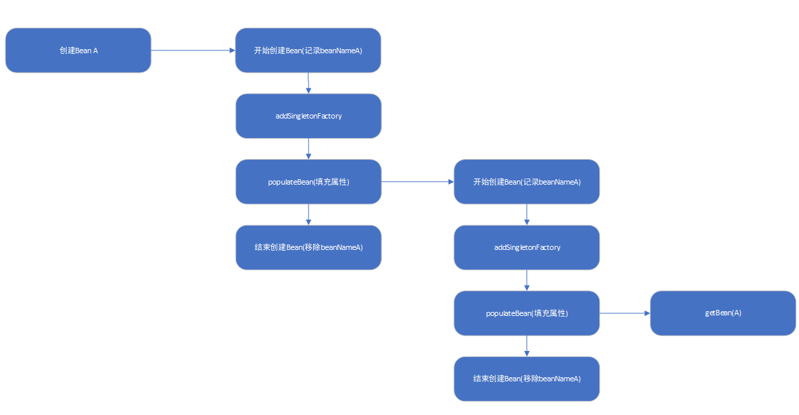

# 创建bean的加载过程

## getBean全过程

    Car car = (Car) context.getBean("car");

该句代码实现了怎样的功能呢？进行调试跳入发现执行的是如下代码：

    return getBeanFactory().getBean(name);

我们知道这是调用context内置的beanFactory的getBean(name)方法。这个getBean(String name)方法如下：

    @Override
	public Object getBean(String name) throws BeansException {
		return doGetBean(name, null, null, false);
	}

这里调用的doGetBean()方法源码如下：

    /**
	 * Return an instance, which may be shared or independent, of the specified bean.
	 * @param name the name of the bean to retrieve
	 * @param requiredType the required type of the bean to retrieve
	 * @param args arguments to use when creating a bean instance using explicit arguments
	 * (only applied when creating a new instance as opposed to retrieving an existing one)
	 * @param typeCheckOnly whether the instance is obtained for a type check,
	 * not for actual use
	 * @return an instance of the bean
	 * @throws BeansException if the bean could not be created
	 */
    protected <T> T doGetBean(final String name, @Nullable final Class<T> requiredType,
			@Nullable final Object[] args, boolean typeCheckOnly) throws BeansException {
            //提取对应的bean名称
		final String beanName = transformedBeanName(name);
		Object bean;

		// Eagerly check singleton cache for manually registered singletons.
		//检查缓存中或者实例工厂中是否有对应的实例
        //为什么首先会使用这段代码呢
        //因为在创建单例bean的时候会存在依赖注入的情况，而在创建依赖的时候为了避免循环依赖
        //Spring创建bean的原则是不等bean创建完成就会将创建bean的ObjectFactory提早曝光
        //也就是将ObjectFactory加入到缓存中，一旦下一个bean创建的时候需要依赖上个bean则直接使用ObjectFactory
        //直接尝试从缓存中获取或者singletonFactories中的ObjectFactory中获取
        Object sharedInstance = getSingleton(beanName);
		if (sharedInstance != null && args == null) {
			if (logger.isDebugEnabled()) {
				if (isSingletonCurrentlyInCreation(beanName)) {
					logger.debug("Returning eagerly cached instance of singleton bean '" + beanName +
							"' that is not fully initialized yet - a consequence of a circular reference");
				}
				else {
					logger.debug("Returning cached instance of singleton bean '" + beanName + "'");
				}
			}
                    //返回对应的实例,有时候存在诸如BeanFactory的情况并不是直接返回实例本身而是返回指定方法返回的实例
			bean = getObjectForBeanInstance(sharedInstance, name, beanName, null);
		}

		else {
			// Fail if we're already creating this bean instance:
			// We're assumably within a circular reference.
            //只有在单例情况才会尝试解决循环依赖，在原型情况下，如果存在
            //A中有B的属性，B中有A的属性，那么当依赖注入的时候，就会产生当A还未创建完的时候因为
            //对于B的创建再次返回创建A造成循环依赖
			if (isPrototypeCurrentlyInCreation(beanName)) {
				throw new BeanCurrentlyInCreationException(beanName);
			}

			// Check if bean definition exists in this factory.
			BeanFactory parentBeanFactory = getParentBeanFactory();
            // 如果beanDefinitionMap中也就是在所有已经加载的类中不包含beanName则尝试从parentBeanFactory中检测
			if (parentBeanFactory != null && !containsBeanDefinition(beanName)) {
				// Not found -> check parent.
				String nameToLookup = originalBeanName(name);
				//递归到父BeanFactory中进行查找
                if (parentBeanFactory instanceof AbstractBeanFactory) {
					return ((AbstractBeanFactory) parentBeanFactory).doGetBean(
							nameToLookup, requiredType, args, typeCheckOnly);
				}
				else if (args != null) {
					// Delegation to parent with explicit args.
					return (T) parentBeanFactory.getBean(nameToLookup, args);
				}
				else {
					// No args -> delegate to standard getBean method.
					return parentBeanFactory.getBean(nameToLookup, requiredType);
				}
			}
            //如果不是仅仅做类型检查，而是创建bean，这里要进行记录
			if (!typeCheckOnly) {
				markBeanAsCreated(beanName);
			}
            //将存储配置的GenericBeanDefinition转换为RootBeanDefinition，如果指定BeanName是子bean的话同时会合并父类的相关属性。
			try {
				final RootBeanDefinition mbd = getMergedLocalBeanDefinition(beanName);
				checkMergedBeanDefinition(mbd, beanName, args);

				// Guarantee initialization of beans that the current bean depends on.
                //如果存在依赖则需要递归实例化依赖的bean
				String[] dependsOn = mbd.getDependsOn();
				if (dependsOn != null) {
					for (String dep : dependsOn) {
						if (isDependent(beanName, dep)) {
							throw new BeanCreationException(mbd.getResourceDescription(), beanName,
									"Circular depends-on relationship between '" + beanName + "' and '" + dep + "'");
						}
                        //缓存依赖调用
						registerDependentBean(dep, beanName);
						try {
							getBean(dep);
						}
						catch (NoSuchBeanDefinitionException ex) {
							throw new BeanCreationException(mbd.getResourceDescription(), beanName,
									"'" + beanName + "' depends on missing bean '" + dep + "'", ex);
						}
					}
				}

				// Create bean instance.
                //实例化依赖的bean后便可以实例化mbd本身了
                //单例模式的创建
				if (mbd.isSingleton()) {
					sharedInstance = getSingleton(beanName, () -> {
						try {
							return createBean(beanName, mbd, args);
						}
						catch (BeansException ex) {
							// Explicitly remove instance from singleton cache: It might have been put there
							// eagerly by the creation process, to allow for circular reference resolution.
							// Also remove any beans that received a temporary reference to the bean.
							destroySingleton(beanName);
							throw ex;
						}
					});
					bean = getObjectForBeanInstance(sharedInstance, name, beanName, mbd);
				}
                            //pretotype模式的创建(new)
				else if (mbd.isPrototype()) {
					// It's a prototype -> create a new instance.
					Object prototypeInstance = null;
					try {
						beforePrototypeCreation(beanName);
						prototypeInstance = createBean(beanName, mbd, args);
					}
					finally {
						afterPrototypeCreation(beanName);
					}
					bean = getObjectForBeanInstance(prototypeInstance, name, beanName, mbd);
				}
                            //指定的scope上实例化bean
				else {
					String scopeName = mbd.getScope();
					final Scope scope = this.scopes.get(scopeName);
					if (scope == null) {
						throw new IllegalStateException("No Scope registered for scope name '" + scopeName + "'");
					}
					try {
						Object scopedInstance = scope.get(beanName, () -> {
							beforePrototypeCreation(beanName);
							try {
								return createBean(beanName, mbd, args);
							}
							finally {
								afterPrototypeCreation(beanName);
							}
						});
						bean = getObjectForBeanInstance(scopedInstance, name, beanName, mbd);
					}
					catch (IllegalStateException ex) {
						throw new BeanCreationException(beanName,
								"Scope '" + scopeName + "' is not active for the current thread; consider " +
								"defining a scoped proxy for this bean if you intend to refer to it from a singleton",
								ex);
					}
				}
			}
			catch (BeansException ex) {
				cleanupAfterBeanCreationFailure(beanName);
				throw ex;
			}
		}

		// Check if required type matches the type of the actual bean instance.
            //检查需要的类型是否符合bean的实际类型
		if (requiredType != null && !requiredType.isInstance(bean)) {
			try {
				T convertedBean = getTypeConverter().convertIfNecessary(bean, requiredType);
				if (convertedBean == null) {
					throw new BeanNotOfRequiredTypeException(name, requiredType, bean.getClass());
				}
				return convertedBean;
			}
			catch (TypeMismatchException ex) {
				if (logger.isDebugEnabled()) {
					logger.debug("Failed to convert bean '" + name + "' to required type '" +
							ClassUtils.getQualifiedName(requiredType) + "'", ex);
				}
				throw new BeanNotOfRequiredTypeException(name, requiredType, bean.getClass());
			}
		}
		return (T) bean;
	}

加载bean的逻辑：

1. 转化对应的beanName
    这里的转换beanName是指这里可能传入的参数是别名，也可能是FactoryBean，所以要进行一系列的解析，这些解析包括如下内容：
    - 去除FactoryBean修饰符，也就是如果name="&aa"，那么会首先去除&而使name="aa"；
    - 取指定alias所表示的最终beanName，例如别名A指向名称为B的bean而返回B，若别名A指向别名B，别名B又指向名称为C的bean则返回C。
2. 尝试从缓存中加载单例。
   单例在Spring的同一容器内只会被创建一次，后序再获取bean，就直接从单例缓存中获取了。当然这里也只是尝试加载，首先尝试从缓存中加载，如果加载不成功则再次尝试从singletonFactories中加载。因为在创建单例bean的时候会存在依赖注入的情况，而在创建依赖的时候为了避免循环依赖，再Spring创建bean的原则是不等bean创建完成就会将创建bean的ObjectFactory提早曝光加入到缓存中，一旦下一个bean创建时候需要依赖上一个bean则直接使用ObjectFactory。
3. bean的实例化
   如果缓存中得到了bean的原始状态，则需要对bean进行实例化。由于缓存中记录的只是最原始的bean状态，不一定是我们最终想要的bean。
4. 原型模式的依赖检查
   只有在单例情况下才会尝试解决循环依赖。如果存在A中有B的属性，B中有A属性，那么当依赖注入的时候，就会产生当A还未创建完成的时候因为对于B的创建再次返回创建A，造成循环依赖，也就是情况isPrototypeCurrentlyInCreation(beanName)判断true。
5. 依赖parentBeanFactory
6. 将GernericBeanDefinition转换为RootBeanDefinition
7. 寻找依赖
8. 针对不同的scope进行bean的创建
9. 类型转换。
   Spring中提供了各种各样的转换器，用户可以自己扩展转换器来满足需求。

## 缓存中获取单例bean

第2步中的getSingleton(String name)源码如下：

    public Object getSingleton(String beanName) {
		//设置参数为true表示允许早期依赖
		return getSingleton(beanName, true);
	}

    protected Object getSingleton(String beanName, boolean allowEarlyReference) {
		//检查缓存中是否存在实例
		Object singletonObject = this.singletonObjects.get(beanName);
		//如果缓存为空并且单例正在被创建
		if (singletonObject == null && isSingletonCurrentlyInCreation(beanName)) {
			//锁定变量并进行处理
			synchronized (this.singletonObjects) {
				//如果此bean正在加载就不处理
				singletonObject = this.earlySingletonObjects.get(beanName);
				if (singletonObject == null && allowEarlyReference) {
					//当某些方法需要提前初始化的时候则会调用addSingletonFactory方法将对应的ObjectFactory初始化策略存储在singletonFactories
					ObjectFactory<?> singletonFactory = this.singletonFactories.get(beanName);
					if (singletonFactory != null) {
						//预先调用设定的getObject方法
						singletonObject = singletonFactory.getObject();
						//记录在缓存中，earlySingletonObjects和singletonFactories互斥
						this.earlySingletonObjects.put(beanName, singletonObject);
						this.singletonFactories.remove(beanName);
					}
				}
			}
		}
		return singletonObject;
	}

这个方法首先会尝试在singletonObjects中获取实例，如果获取不到再从earlySingletonObjects中获取，如果还获取不到，再尝试从singletonFactories中获取beanName对应的ObjectFactory，然后调用这个ObjectFactory的getObject来创建bean，并放到earlySingletonObjects里面去，并且从singletonFactories中remove掉这个ObjectFactory。

这里有几个存储bean的不同map，简单解释下：
1. singletonObjects:用于保存BeanName和创建bean实例之间的关系，bean name->bean instance。
2. singletonFactories:用于保存BeanName和创建bean工厂之间的关系，bean name->ObjectFactory。
3. earlySingletonObjects:也是保存BeanName和创建bean实例之间的关系，与singletonObjects不同的是，当一个单例bean被放到这里面之后，那么当bean还是在创建过程中，就可以通过getBean方法获取到了，其目的是用来检测循环依赖。
4. registeredSingletons:用来保存当前所有已经注册的bean。

由于我们通过getSingleton方法获取到的对象是bean的初始状态，并不一定是我们需要的bean，因此我们需要getObjectForBeanInstance方法的帮助：

	@Override
	protected Object getObjectForBeanInstance(
			Object beanInstance, String name, String beanName, @Nullable RootBeanDefinition mbd) {

		String currentlyCreatedBean = this.currentlyCreatedBean.get();
		if (currentlyCreatedBean != null) {
			registerDependentBean(beanName, currentlyCreatedBean);
		}

		return super.getObjectForBeanInstance(beanInstance, name, beanName, mbd);
	}

	protected Object getObjectForBeanInstance(
			Object beanInstance, String name, String beanName, @Nullable RootBeanDefinition mbd) {

		// Don't let calling code try to dereference the factory if the bean isn't a factory.
		//如果指定的name是工厂相关（以&为前缀）且beanInstance又不是FactoryBean则验证类型不通过。
		if (BeanFactoryUtils.isFactoryDereference(name)) {
			if (beanInstance instanceof NullBean) {
				return beanInstance;
			}
			if (!(beanInstance instanceof FactoryBean)) {
				throw new BeanIsNotAFactoryException(transformedBeanName(name), beanInstance.getClass());
			}
		}

		// Now we have the bean instance, which may be a normal bean or a FactoryBean.
		// If it's a FactoryBean, we use it to create a bean instance, unless the
		// caller actually wants a reference to the factory.
		//如果现在拿到的beanInstance不是一个FactoryBean或者这个名字是以&开头的，那么就直接返回beanInstance。
		if (!(beanInstance instanceof FactoryBean) || BeanFactoryUtils.isFactoryDereference(name)) {
			return beanInstance;
		}
		//加载FactoryBean
		Object object = null;
		if (mbd == null) {
			//尝试从缓存中加载bean
			object = getCachedObjectForFactoryBean(beanName);
		}
		if (object == null) {
			//到这里已经明确知道beanInstance一定是FactoryBean类型
			// Return bean instance from factory.
			FactoryBean<?> factory = (FactoryBean<?>) beanInstance;
			// Caches object obtained from FactoryBean if it is a singleton.
			//containsBeanDefinition检测beanDefinitionMap中也就是在所有已经加载的类中检测是否定义beanName
			if (mbd == null && containsBeanDefinition(beanName)) {
				//将GenericBeanDefinition转换为RootBeanDefinition，如果指定了BeanName是子Bean的话同时会合并父类的相关属性
				mbd = getMergedLocalBeanDefinition(beanName);
			}
			//是否是用户定义的而不是应用程序本身定义的
			boolean synthetic = (mbd != null && mbd.isSynthetic());
			object = getObjectFromFactoryBean(factory, beanName, !synthetic);
		}
		return object;
	}
上述方法完成的工作逻辑如下：
1. 对FactoryBean正确性的验证
2. 对非FactoryBean不做任何处理
3. 对bean进行转换
4. 将从Factory中解析bean的工作委托给getObjectFromFactoryBean

		protected Object getObjectFromFactoryBean(FactoryBean<?> factory, String beanName, boolean shouldPostProcess) {
			//如果是单例模式的话
			if (factory.isSingleton() && containsSingleton(beanName)) {
				synchronized (getSingletonMutex()) {
					Object object = this.factoryBeanObjectCache.get(beanName);
					if (object == null) {
						object = doGetObjectFromFactoryBean(factory, beanName);
						// Only post-process and store if not put there already during getObject() call above
						// (e.g. because of circular reference processing triggered by custom getBean calls)
						Object alreadyThere = this.factoryBeanObjectCache.get(beanName);
						if (alreadyThere != null) {
							object = alreadyThere;
						}
						else {
							if (shouldPostProcess) {
								if (isSingletonCurrentlyInCreation(beanName)) {
									// Temporarily return non-post-processed object, not storing it yet..
									return object;
								}
								beforeSingletonCreation(beanName);
								try {
									object = postProcessObjectFromFactoryBean(object, beanName);
								}
								catch (Throwable ex) {
									throw new BeanCreationException(beanName,
											"Post-processing of FactoryBean's singleton object failed", ex);
								}
								finally {
									afterSingletonCreation(beanName);
								}
							}
							if (containsSingleton(beanName)) {
								this.factoryBeanObjectCache.put(beanName, object);
							}
						}
					}
					return object;
				}
			}
			else {
				Object object = doGetObjectFromFactoryBean(factory, beanName);
				if (shouldPostProcess) {
					try {
						object = postProcessObjectFromFactoryBean(object, beanName);
					}
					catch (Throwable ex) {
						throw new BeanCreationException(beanName, "Post-processing of FactoryBean's object failed", ex);
					}
				}
				return object;
			}
		}

这个方法所做的事就是，返回的bean如果是单例的，那就要保证全局唯一，同时，因为是单例的，所以不必重复创建，可以使用缓存来提高性能，等到真正获取bean之后，根据shouldPostProcess参数对其进行处理。真正使用FactoryBean获取实例的就是doGetObjectFromFactoryBean方法：

	private Object doGetObjectFromFactoryBean(final FactoryBean<?> factory, final String beanName)
			throws BeanCreationException {

		Object object;
		try {
			//需要权限验证
			if (System.getSecurityManager() != null) {
				AccessControlContext acc = getAccessControlContext();
				try {
					object = AccessController.doPrivileged((PrivilegedExceptionAction<Object>) factory::getObject, acc);
				}
				catch (PrivilegedActionException pae) {
					throw pae.getException();
				}
			}
			else {
				//直接调用getObject()方法
				object = factory.getObject();
			}
		}
		catch (FactoryBeanNotInitializedException ex) {
			throw new BeanCurrentlyInCreationException(beanName, ex.toString());
		}
		catch (Throwable ex) {
			throw new BeanCreationException(beanName, "FactoryBean threw exception on object creation", ex);
		}

		// Do not accept a null value for a FactoryBean that's not fully
		// initialized yet: Many FactoryBeans just return null then.
		//FactoryBean的getObject方法不接受空值返回
		if (object == null) {
			if (isSingletonCurrentlyInCreation(beanName)) {
				throw new BeanCurrentlyInCreationException(
						beanName, "FactoryBean which is currently in creation returned null from getObject");
			}
			object = new NullBean();
		}
		return object;
	}

最后谈一下postProcessObjectFromFactoryBean方法：

	@Override
	protected Object postProcessObjectFromFactoryBean(Object object, String beanName) {
		return applyBeanPostProcessorsAfterInitialization(object, beanName);
	}

		@Override
	public Object applyBeanPostProcessorsAfterInitialization(Object existingBean, String beanName)
			throws BeansException {

		Object result = existingBean;
		for (BeanPostProcessor beanProcessor : getBeanPostProcessors()) {
			Object current = beanProcessor.postProcessAfterInitialization(result, beanName);
			if (current == null) {
				return result;
			}
			result = current;
		}
		return result;
	}
这里就是遍历所有获取到的后处理器调用其postProcessAfterInitialization方法。

## 获取单例

如果缓存中不存在已经加载的bean实例，就需要从头开始bean的加载过程，在一系列检测之后，bean的加载过程从如下代码开始：

	sharedInstance = getSingleton(beanName, () -> {
					try {
						return createBean(beanName, mbd, args);
					}
					catch (BeansException ex) {
						// Explicitly remove instance from singleton cache: It might have been put there
						// eagerly by the creation process, to allow for circular reference resolution.
							// Also remove any beans that received a temporary reference to the bean.
							destroySingleton(beanName);
							throw ex;
					}
				});

这里我们首先查看getSingleton方法：

	public Object getSingleton(String beanName, ObjectFactory<?> singletonFactory) {
		Assert.notNull(beanName, "Bean name must not be null");
		//全局变量需要同步
		synchronized (this.singletonObjects) {
			//首先检查对应的bean是否已经加载过，因为singleton模式其实就是复用已经创建的bean，所以这一步是必须的。
			Object singletonObject = this.singletonObjects.get(beanName);
			//如果为空才可以进行singleton的bean的初始化
			if (singletonObject == null) {
				if (this.singletonsCurrentlyInDestruction) {
					throw new BeanCreationNotAllowedException(beanName,
							"Singleton bean creation not allowed while singletons of this factory are in destruction " +
							"(Do not request a bean from a BeanFactory in a destroy method implementation!)");
				}
				if (logger.isDebugEnabled()) {
					logger.debug("Creating shared instance of singleton bean '" + beanName + "'");
				}
				beforeSingletonCreation(beanName);
				boolean newSingleton = false;
				boolean recordSuppressedExceptions = (this.suppressedExceptions == null);
				if (recordSuppressedExceptions) {
					this.suppressedExceptions = new LinkedHashSet<>();
				}
				try {
					//初始化bean
					singletonObject = singletonFactory.getObject();
					newSingleton = true;
				}
				catch (IllegalStateException ex) {
					// Has the singleton object implicitly appeared in the meantime ->
					// if yes, proceed with it since the exception indicates that state.
					singletonObject = this.singletonObjects.get(beanName);
					if (singletonObject == null) {
						throw ex;
					}
				}
				catch (BeanCreationException ex) {
					if (recordSuppressedExceptions) {
						for (Exception suppressedException : this.suppressedExceptions) {
							ex.addRelatedCause(suppressedException);
						}
					}
					throw ex;
				}
				finally {
					if (recordSuppressedExceptions) {
						this.suppressedExceptions = null;
					}
					afterSingletonCreation(beanName);
				}
				if (newSingleton) {
					//加入缓存
					addSingleton(beanName, singletonObject);
				}
			}
			return singletonObject;
		}
	}

上述代码中其实是使用了回调方法，使得程序可以在单例创建的前后做一些准备及处理操作，而真正的获取单例bean的方法其实并不是在此方法中实现的，其实现逻辑是在ObjectFactory类型的实例singletonFactory中实现。而这些准备及处理操作包括如下内容：
1. 检查缓存是否已经加载过
2. 若没有加载，则记录beanName的正在加载状态
3. 加载单例前记录加载状态
   beforeSinglttonCreation方法记录加载状态，也就是通过this.singletonCurrentlyInCreation.add(beanName)将当前正要创建的bean记录在缓存中，这样便可以对循环依赖进行检测。

		protected void beforeSingletonCreation(String beanName) {
			if (!this.inCreationCheckExclusions.contains(beanName) && !this.singletonsCurrentlyInCreation.add(beanName)) {
				throw new BeanCurrentlyInCreationException(beanName);
			}
		}
4. 通过调用参数传入的ObjectFactory的个体Object方法实例化bean。
5. 加载单例后的处理方法调用。
   afterSingletonCreation方法，当bean加载结束后需要移除缓存中对该bean的正在加载状态的记录。

		protected void afterSingletonCreation(String beanName) {
			if (!this.inCreationCheckExclusions.contains(beanName) && !this.singletonsCurrentlyInCreation.remove(beanName)) {
				throw new IllegalStateException("Singleton '" + beanName + "' isn't currently in creation");
			}
		}
6. 将结果记录至缓存并加载bean过程中所记录的各种辅助状态。
   
		protected void addSingleton(String beanName, Object singletonObject) {
			synchronized (this.singletonObjects) {
				this.singletonObjects.put(beanName, singletonObject);
				this.singletonFactories.remove(beanName);
				this.earlySingletonObjects.remove(beanName);
				this.registeredSingletons.add(beanName);
			}
		}

7. 返回处理结果

这里所指的就是如下代码：

	sharedInstance = getSingleton(beanName, () -> {
					try {
						return createBean(beanName, mbd, args);
					}
					catch (BeansException ex) {
						// Explicitly remove instance from singleton cache: It might have been put there
						// eagerly by the creation process, to allow for circular reference resolution.
							// Also remove any beans that received a temporary reference to the bean.
							destroySingleton(beanName);
							throw ex;
					}
				});

## 准备创建bean

根据spring的函数命名规则，真正的干活的函数其实都是以do开头的，下面我们查看createBean这个函数中做了哪些准备工作。

	@Override
	protected Object createBean(String beanName, RootBeanDefinition mbd, @Nullable Object[] args)
			throws BeanCreationException {

		if (logger.isDebugEnabled()) {
			logger.debug("Creating instance of bean '" + beanName + "'");
		}
		RootBeanDefinition mbdToUse = mbd;

		// Make sure bean class is actually resolved at this point, and
		// clone the bean definition in case of a dynamically resolved Class
		// which cannot be stored in the shared merged bean definition.
		//锁定class，根据设置的class属性或者根据className来解析class。
		Class<?> resolvedClass = resolveBeanClass(mbd, beanName);
		if (resolvedClass != null && !mbd.hasBeanClass() && mbd.getBeanClassName() != null) {
			mbdToUse = new RootBeanDefinition(mbd);
			mbdToUse.setBeanClass(resolvedClass);
		}

		// Prepare method overrides.
		//验证和准备覆盖方法
		try {
			mbdToUse.prepareMethodOverrides();
		}
		catch (BeanDefinitionValidationException ex) {
			throw new BeanDefinitionStoreException(mbdToUse.getResourceDescription(),
					beanName, "Validation of method overrides failed", ex);
		}

		try {
			// Give BeanPostProcessors a chance to return a proxy instead of the target bean instance.
			//给BeanPostProcessors一个机会来返回代理来替代真正的实例
			Object bean = resolveBeforeInstantiation(beanName, mbdToUse);
			if (bean != null) {
				return bean;
			}
		}
		catch (Throwable ex) {
			throw new BeanCreationException(mbdToUse.getResourceDescription(), beanName,
					"BeanPostProcessor before instantiation of bean failed", ex);
		}

		try {
			Object beanInstance = doCreateBean(beanName, mbdToUse, args);
			if (logger.isDebugEnabled()) {
				logger.debug("Finished creating instance of bean '" + beanName + "'");
			}
			return beanInstance;
		}
		catch (BeanCreationException | ImplicitlyAppearedSingletonException ex) {
			// A previously detected exception with proper bean creation context already,
			// or illegal singleton state to be communicated up to DefaultSingletonBeanRegistry.
			throw ex;
		}
		catch (Throwable ex) {
			throw new BeanCreationException(
					mbdToUse.getResourceDescription(), beanName, "Unexpected exception during bean creation", ex);
		}
	}

该段代码的具体步骤与功能如下：
1. 根据设置的class属性或者根据className来解析class
2. 对override属性进行标记及验证
3. 应用初始化前的后处理器，解析指定bean是否存在初始化前的短路操作
4. 创建bean。

其实在spring中没有override-method的配置，但是有lookup-method和replace-method的配置，这两个配置的加载其实就是将配置统一存放在BeanDefinition中的methodOverrides属性里，而这个操作其实就是针对这两个配置的。

下面首先查看处理override属性的操作，查看源码中的AbstractBeanDefinition类的prepareMethodOverrides方法：

	public void prepareMethodOverrides() throws BeanDefinitionValidationException {
		// Check that lookup methods exists.
		if (hasMethodOverrides()) {
			Set<MethodOverride> overrides = getMethodOverrides().getOverrides();
			synchronized (overrides) {
				for (MethodOverride mo : overrides) {
					prepareMethodOverride(mo);
				}
			}
		}
	}

	protected void prepareMethodOverride(MethodOverride mo) throws BeanDefinitionValidationException {
		//获取对应类中对应方法名的个数
		int count = ClassUtils.getMethodCountForName(getBeanClass(), mo.getMethodName());
		if (count == 0) {
			throw new BeanDefinitionValidationException(
					"Invalid method override: no method with name '" + mo.getMethodName() +
					"' on class [" + getBeanClassName() + "]");
		}
		else if (count == 1) {
			// Mark override as not overloaded, to avoid the overhead of arg type checking.
			//标记MethodOverride暂未被覆盖，避免参数类型检查开销
			mo.setOverloaded(false);
		}
	}

在Spring配置中存在lookup-method和replace-method两个配置功能，而这两个配置的加载其实就是将配置统一存放在BeanDefinition中的methodOverrides属性里，这两个功能实现原理其实是在bean实例化的时候如果检测到存在methodOverrides属性，会动态地为当前bean生成代理并使用对应的拦截器为bean做增强处理，相关逻辑实现在bean实例化部分详细介绍。

对于方法匹配来讲，如果一个类中存在若干个重载方法，那么在函数调用及增强的时候还需要根据参数类型进行匹配，来最终确认当前调用的到底是哪个函数。但是Spring将一部分匹配工作在这里完成了，如果当前类中的方法只有一个，那么就设置重载该方法没有被重载，这样在后续调用的时候便可以直接找到的方法，而不需要进行方法的参数匹配验证了，而且还可以提前对方法存在性进行验证。

接下来的逻辑是进行实例化的前置处理，代码如下：

	Object bean = resolveBeforeInstantiation(beanName, mbdToUse);
	if (bean != null) {
			return bean;
	}

真正调用doCreate方法创建bean的实例前使用了resolveBeforeInstantiation方法对BeanDefinition中的属性做些前置处理，如果获得了对象就对其进行短路处理：

	if (bean != null) {
			return bean;
	}

这里考察resolveBeforeInstantiation方法的逻辑：

	@Nullable
	protected Object resolveBeforeInstantiation(String beanName, RootBeanDefinition mbd) {
		Object bean = null;
		if (!Boolean.FALSE.equals(mbd.beforeInstantiationResolved)) {
			// Make sure bean class is actually resolved at this point.
			if (!mbd.isSynthetic() && hasInstantiationAwareBeanPostProcessors()) {
				Class<?> targetType = determineTargetType(beanName, mbd);
				if (targetType != null) {
					bean = applyBeanPostProcessorsBeforeInstantiation(targetType, beanName);
					if (bean != null) {
						bean = applyBeanPostProcessorsAfterInitialization(bean, beanName);
					}
				}
			}
			mbd.beforeInstantiationResolved = (bean != null);
		}
		return bean;
	}

这个方法中首先调用applyBeanPostProcessorsBeforeInstantiation方法获得一个对象bean，如果对象不为null，那么调用applyBeanPostProcessorsAfterInitialization来对对象进行后处理。

首先查看applyBeanPostProcessorsBeforeInstantiation方法：

	protected Object applyBeanPostProcessorsBeforeInstantiation(Class<?> beanClass, String beanName) {
		for (BeanPostProcessor bp : getBeanPostProcessors()) {
			if (bp instanceof InstantiationAwareBeanPostProcessor) {
				InstantiationAwareBeanPostProcessor ibp = (InstantiationAwareBeanPostProcessor) bp;
				Object result = ibp.postProcessBeforeInstantiation(beanClass, beanName);
				if (result != null) {
					return result;
				}
			}
		}
		return null;
	}
bean的实例化前调用，也就是将AbstractBeanDefinition转换为BeanWrapper前的处理。给子类一个修改BeanDefinition的机会，也就是说当程序经过这个方法后，bean可能已经不是我们认为的bean了，而是或许成为了一个经过处理的的bean，可能是通过cglib生成的，也可能是通过其他技术生成的。具体逻辑就是，找到所有实现了InstantiationAwareBeanPostProcessor接口的bean，调用其postProcessBeforeInstantiation方法，查看返回是否为空。如果不为空就返回结果，如果全部遍历完都没有结果，那么就返回null。

接下来考虑applyBeanPostProcessorsAfterInitialization方法：

	@Override
	public Object applyBeanPostProcessorsAfterInitialization(Object existingBean, String beanName)
			throws BeansException {

		Object result = existingBean;
		for (BeanPostProcessor beanProcessor : getBeanPostProcessors()) {
			Object current = beanProcessor.postProcessAfterInitialization(result, beanName);
			if (current == null) {
				return result;
			}
			result = current;
		}
		return result;
	}

这个方法就是获取所有的BeanPostProcessor bean，然后调用其postProcessAfterInitialization方法，该方法用于在实例创建完并初始化后进行一系列操作。

## 循环依赖的处理

循环依赖就是循环引用，例如A引用B，B引用C，C引用A这类。

Spring将循环依赖的处理分为3种情况：

1. 构造器循环依赖
2. setter循环依赖
3. prototype循环依赖

### 构造器循环依赖

表示通过构造器注入构成的循环依赖，此依赖是无法解决的，只能抛出BeanCurrentlyInCreationException异常表示循环依赖。

spring容器将每一格正在创建的bean标识符放在一个”当前创建bean池“中，bean标识符在创建过程中将一直保持在这个池中，因此如果在创建bean过程中发现自己已经在”当前创建bean池“中的时候，将抛出BeanCurrentlyInCreationException异常表示循环依赖；而对于创建完毕的bean将从”当前创建bean池“中清除掉

例如上面示例的分析如下:
- spring容器创建A bean，首先去“当前创建bean池”查找是否当前bean正在创建，如果没发现，则继续准备其需要的构造参数B，并将A放入到”当前创建bean池“。
- spring容器创建B bean，首先去“当前创建bean池”查找是否当前bean正在创建，如果没发现，则继续准备其需要的构造参数C，并将B放入到”当前创建bean池“。
- spring容器创建C bean，首先去“当前创建bean池”查找是否当前bean正在创建，如果没发现，则继续准备其需要的构造参数A，并将C放入到”当前创建bean池“。
- 到此，spring容器创建A bean，发现该bean标识符在”当前创建bean池“中，因为表示循环依赖，抛出BeanCurrentlyInCreationException异常。
  
### setter循环依赖

表示通过setter注入方式构成的循环依赖。对于setter注入造成的依赖是通过Spring容器提前暴露刚完成构造器注入但未完成其他步骤（如setter注入）的bean来完成的，而且只能解决单例作用域的bean循环依赖。通过提前暴露一个单例工厂方法，从而使其他bean能引用到该bean，如下代码所示：

	addSingletonFactory(beanName,new ObjectFactory(){
		public Object getObject() throws BeanException{
			return getEarlyBeanReference(beanName,mbd,bean);
		}
	});

开始的例子进行setter循环依赖的执行步骤如下：

- spring容器创建单例A bean，首先根据无参构造器创建bean，并暴露一个ObjectFactory用于返回一个提前暴露要给创建中的bean，并将A标识符放到”当前创建bean池“，然后进行setter注入B。
- spring容器创建单例B bean，首先根据无参构造器创建bean，并暴露一个ObjectFactory用于返回一个提前暴露要给创建中的bean，并将B标识符放到”当前创建bean池“，然后进行setter注入C。
- spring容器创建单例C bean，首先根据无参构造器创建bean，并暴露一个ObjectFactory用于返回一个提前暴露要给创建中的bean，并将C标识符放到”当前创建bean池“，然后进行setter注入A。进行注入A时由于提前暴露了ObjectFactory工厂，从而使用它返回提前暴露一个创建中的bean。
- 最后再依赖注入B和A，完成setter注入。

### prototype范围的依赖注入

对于”prototype“作用于的bean，spring容器无法完成依赖注入，因为spring容器不进行缓存”prototype“作用域的bean，因此无法提前暴露一个创建中的bean。

对于singleton作用域bean，可以通过”setAllowCircularReferences(false);“来禁用循环引用。

## 创建bean

当经历过resolveBeforeInstantiation方法后，程序有两个选择，如果创建了代理或者说重写了InstantiationAwareBeanPostProcessor的postProcessBeforeInstantiation方法并在方法postProcessBeforeInstantiation中改变了bean，则直接返回就可以了，否则需要进行常规bean的创建。常规bean创建的操作就是在doCreateBean方法中完成的，方法如下：

	protected Object doCreateBean(final String beanName, final RootBeanDefinition mbd, final @Nullable Object[] args)
			throws BeanCreationException {

		// Instantiate the bean.
		BeanWrapper instanceWrapper = null;
		if (mbd.isSingleton()) {
			instanceWrapper = this.factoryBeanInstanceCache.remove(beanName);
		}
		if (instanceWrapper == null) {
			//根据指定bean使用对应的策略创建新的实例，如工厂方法、构造函数自动注入、简单初始化。
			instanceWrapper = createBeanInstance(beanName, mbd, args);
		}
		final Object bean = instanceWrapper.getWrappedInstance();
		Class<?> beanType = instanceWrapper.getWrappedClass();
		if (beanType != NullBean.class) {
			mbd.resolvedTargetType = beanType;
		}

		// Allow post-processors to modify the merged bean definition.
		synchronized (mbd.postProcessingLock) {
			if (!mbd.postProcessed) {
				try {
					//应用MergedBeanDefinitionPostProcessor
					applyMergedBeanDefinitionPostProcessors(mbd, beanType, beanName);
				}
				catch (Throwable ex) {
					throw new BeanCreationException(mbd.getResourceDescription(), beanName,
							"Post-processing of merged bean definition failed", ex);
				}
				mbd.postProcessed = true;
			}
		}

		// Eagerly cache singletons to be able to resolve circular references
		// even when triggered by lifecycle interfaces like BeanFactoryAware.
		//是否需要提早曝光：单例&允许循环依赖&当前bean正在创建中，检测循环依赖
		boolean earlySingletonExposure = (mbd.isSingleton() && this.allowCircularReferences &&
				isSingletonCurrentlyInCreation(beanName));
		if (earlySingletonExposure) {
			if (logger.isDebugEnabled()) {
				logger.debug("Eagerly caching bean '" + beanName +
						"' to allow for resolving potential circular references");
			}
			//为避免后期循环依赖，可以在bean初始化完成前将创建实例的ObjectFactory加入工厂
			//对bean再一次依赖引用，主要应用SmartInstantiationAwareBeanPostProcessor，
			//其中我们熟知的Spring AOP就是在这将advice动态织入bean中，若没有则直接返回bean，不做任何处理
			addSingletonFactory(beanName, () -> getEarlyBeanReference(beanName, mbd, bean));
		}

		// Initialize the bean instance.
		Object exposedObject = bean;
		try {
			//对bean进行填充，将各个属性值注入，其中，可能存在依赖于其他bean的属性，则会递归初始依赖bean
			populateBean(beanName, mbd, instanceWrapper);
			//调用初始化方法，比如init-method
			exposedObject = initializeBean(beanName, exposedObject, mbd);
		}
		catch (Throwable ex) {
			if (ex instanceof BeanCreationException && beanName.equals(((BeanCreationException) ex).getBeanName())) {
				throw (BeanCreationException) ex;
			}
			else {
				throw new BeanCreationException(
						mbd.getResourceDescription(), beanName, "Initialization of bean failed", ex);
			}
		}

		if (earlySingletonExposure) {
			Object earlySingletonReference = getSingleton(beanName, false);
			//earlySingletonReference只有在检测到循环依赖的情况下才不为空。
			if (earlySingletonReference != null) {
				//如果exposedObject没有在初始化方法中被改变，也就是没有被增强
				if (exposedObject == bean) {
					exposedObject = earlySingletonReference;
				}
				else if (!this.allowRawInjectionDespiteWrapping && hasDependentBean(beanName)) {
					String[] dependentBeans = getDependentBeans(beanName);
					Set<String> actualDependentBeans = new LinkedHashSet<>(dependentBeans.length);
					for (String dependentBean : dependentBeans) {
						//检测依赖
						if (!removeSingletonIfCreatedForTypeCheckOnly(dependentBean)) {
							actualDependentBeans.add(dependentBean);
						}
					}
					//因为bean创建后其所依赖的bean一定是已经创建的
					//actualDependentBeans不为空则表示当前bean创建后期以来的bean却没有创建完，也就是说存在循环依赖
					if (!actualDependentBeans.isEmpty()) {
						throw new BeanCurrentlyInCreationException(beanName,
								"Bean with name '" + beanName + "' has been injected into other beans [" +
								StringUtils.collectionToCommaDelimitedString(actualDependentBeans) +
								"] in its raw version as part of a circular reference, but has eventually been " +
								"wrapped. This means that said other beans do not use the final version of the " +
								"bean. This is often the result of over-eager type matching - consider using " +
								"'getBeanNamesOfType' with the 'allowEagerInit' flag turned off, for example.");
					}
				}
			}
		}

		// Register bean as disposable.
		try {
			//根据scope注册bean
			registerDisposableBeanIfNecessary(beanName, bean, mbd);
		}
		catch (BeanDefinitionValidationException ex) {
			throw new BeanCreationException(
					mbd.getResourceDescription(), beanName, "Invalid destruction signature", ex);
		}

		return exposedObject;
	}

该函数的概要思路如下：
1. 如果是单例则需要首先清除缓存；
2. 实例化bean，将BeanDefinition转换为BeanWrapper，转换过程大致如下：
	- 如果存在工厂方法则使用工厂方法进行初始化
	- 一个类有多个构造函数，每个构造函数都有不同的参数，所以需要根据参数锁定构造函数并进行初始化
	- 如果既不存在工厂方法也不存在带有参数的构造函数，则使用默认的构造函数进行bean的初始化
3. MergedBeanDefinitionPostProcessor的应用。
    bean合并后的处理，Autowired注解正是通过此方法实现诸如类型的预解析。
4. 依赖处理
5. 属性填充。将所有属性填充至bean的实例中。
6. 循环依赖检查。
    Spring中解决循环依赖只对单例有效，而对于prototype的bean，Spring没有好的解决办法，唯一要做的就是抛出异常。在这个步骤里面会检测已经加载的bean是否已经出现了循环依赖，并判断是否需要抛出异常。
7. 注册DisposableBean
    如果配置了destroy-method，这里需要注册以便于在销毁时使用。
8. 完成创建并返回

### 创建bean的实例

创建bean的实例的过程是如下代码：

	instanceWrapper = createBeanInstance(beanName, mbd, args);

查看该函数源码如下：

	protected BeanWrapper createBeanInstance(String beanName, RootBeanDefinition mbd, @Nullable Object[] args) {
		//解析class
		// Make sure bean class is actually resolved at this point.
		Class<?> beanClass = resolveBeanClass(mbd, beanName);

		if (beanClass != null && !Modifier.isPublic(beanClass.getModifiers()) && !mbd.isNonPublicAccessAllowed()) {
			throw new BeanCreationException(mbd.getResourceDescription(), beanName,
					"Bean class isn't public, and non-public access not allowed: " + beanClass.getName());
		}

		Supplier<?> instanceSupplier = mbd.getInstanceSupplier();
		if (instanceSupplier != null) {
			return obtainFromSupplier(instanceSupplier, beanName);
		}
		//如果工厂方法不为空则使用工厂方法初始化策略
		if (mbd.getFactoryMethodName() != null)  {
			return instantiateUsingFactoryMethod(beanName, mbd, args);
		}

		// Shortcut when re-creating the same bean...
		boolean resolved = false;
		boolean autowireNecessary = false;
		if (args == null) {
			synchronized (mbd.constructorArgumentLock) {
				//一个类有多个构造函数，每个构造函数都有不同的参数，所以调用前需要先根据参数锁定构造函数活对应的工厂方法
				if (mbd.resolvedConstructorOrFactoryMethod != null) {
					resolved = true;
					autowireNecessary = mbd.constructorArgumentsResolved;
				}
			}
		}
		//如果已经解析过则使用解析好的构造函数方法不需要再次锁定
		if (resolved) {
			if (autowireNecessary) {
				//构造函数自动注入
				return autowireConstructor(beanName, mbd, null, null);
			}
			else {
				//使用默认构造函数构造
				return instantiateBean(beanName, mbd);
			}
		}

		// Need to determine the constructor...
		//需要根据参数解析构造函数
		Constructor<?>[] ctors = determineConstructorsFromBeanPostProcessors(beanClass, beanName);
		if (ctors != null ||
				mbd.getResolvedAutowireMode() == RootBeanDefinition.AUTOWIRE_CONSTRUCTOR ||
				mbd.hasConstructorArgumentValues() || !ObjectUtils.isEmpty(args))  {
			//构造函数自动注入
			return autowireConstructor(beanName, mbd, ctors, args);
		}

		// No special handling: simply use no-arg constructor.
		//使用默认构造函数构造
		return instantiateBean(beanName, mbd);
	}

实现逻辑如下：

1. 如果在RootBeanDefinition中存在factoryMethodName属性，或者说在配置文件中配置了factory-method，那么Spring尝试使用instantiateUsingMethod(beanName,mbd,args)方法根据RootBeanDefinition中配置生成bean的实例。
2. 解析构造函数并进行构造函数的实例化。因为一个bean对应的类中可能有多个构造函数，而每个构造函数的参数不同,Spring在根据参数及类型去判断最终会使用哪个构造函数进行实例化。但是判断过程是个比较消耗性能的步骤，所以采用缓存机制，如果已经解析过则不需要重复解析而是直接从RootBeanDefinition中的属性resolvedConstructorOrFactoryMethod缓存的值去取，否则需要再次解析，并将解析的结果添加至RootBeanDefinition中的属性rresolvedConstructorOrFactoryMethod中。

#### autowireConstructor：构造器自动注入

对于实例的创建，Spring分为两种情况：
1. 通用实例化
2. 带有参数的实例化

		protected BeanWrapper autowireConstructor(
				String beanName, RootBeanDefinition mbd, @Nullable Constructor<?>[] ctors, @Nullable Object[] explicitArgs) {

			return new ConstructorResolver(this).autowireConstructor(beanName, mbd, ctors, explicitArgs);
		}

		public BeanWrapper autowireConstructor(final String beanName, final RootBeanDefinition mbd,
				@Nullable Constructor<?>[] chosenCtors, @Nullable final Object[] explicitArgs) {

			BeanWrapperImpl bw = new BeanWrapperImpl();
			this.beanFactory.initBeanWrapper(bw);

			Constructor<?> constructorToUse = null;
			ArgumentsHolder argsHolderToUse = null;
			Object[] argsToUse = null;
			//explicitArgs通过getBean方法传入
			//如果getBean方法调用的时候指定方法参数那么直接使用
			if (explicitArgs != null) {
				argsToUse = explicitArgs;
			}
			else {
				//如果在getBean方法的时候没有指定则尝试从配置文件解析
				Object[] argsToResolve = null;
				//尝试从缓存中获取
				synchronized (mbd.constructorArgumentLock) {
					constructorToUse = (Constructor<?>) mbd.resolvedConstructorOrFactoryMethod;
					if (constructorToUse != null && mbd.constructorArgumentsResolved) {
						// Found a cached constructor...
						// 从缓存中取
						argsToUse = mbd.resolvedConstructorArguments;
						if (argsToUse == null) {
							//配置的构造函数参数
							argsToResolve = mbd.preparedConstructorArguments;
						}
					}
				}
				//如果缓存中存在
				if (argsToResolve != null) {
					//解析参数类型，如给定方法的构造函数A(int,int)则通过此方法后就会把配置中的("1","1")转换为(1,1)
					//缓存中的值可能是原始值也可能是最终值
					argsToUse = resolvePreparedArguments(beanName, mbd, bw, constructorToUse, argsToResolve);
				}
			}
			//没有被缓存
			if (constructorToUse == null) {
				// Need to resolve the constructor.
				boolean autowiring = (chosenCtors != null ||
						mbd.getResolvedAutowireMode() == RootBeanDefinition.AUTOWIRE_CONSTRUCTOR);
				ConstructorArgumentValues resolvedValues = null;

				int minNrOfArgs;
				if (explicitArgs != null) {
					minNrOfArgs = explicitArgs.length;
				}
				else {
					//提取配置文件中的配置的构造函数参数
					ConstructorArgumentValues cargs = mbd.getConstructorArgumentValues();
					//用于承载解析后的构造函数参数的值
					resolvedValues = new ConstructorArgumentValues();
					//能解析到的参数个数
					minNrOfArgs = resolveConstructorArguments(beanName, mbd, bw, cargs, resolvedValues);
				}

				// Take specified constructors, if any.
				Constructor<?>[] candidates = chosenCtors;
				if (candidates == null) {
					Class<?> beanClass = mbd.getBeanClass();
					try {
						candidates = (mbd.isNonPublicAccessAllowed() ?
								beanClass.getDeclaredConstructors() : beanClass.getConstructors());
					}
					catch (Throwable ex) {
						throw new BeanCreationException(mbd.getResourceDescription(), beanName,
								"Resolution of declared constructors on bean Class [" + beanClass.getName() +
								"] from ClassLoader [" + beanClass.getClassLoader() + "] failed", ex);
					}
				}
				//排序给定的构造函数，public构造函数优先参数数量排序、非public构造函数参数数量排序
				AutowireUtils.sortConstructors(candidates);
				int minTypeDiffWeight = Integer.MAX_VALUE;
				Set<Constructor<?>> ambiguousConstructors = null;
				LinkedList<UnsatisfiedDependencyException> causes = null;

				for (Constructor<?> candidate : candidates) {
					Class<?>[] paramTypes = candidate.getParameterTypes();

					if (constructorToUse != null && argsToUse.length > paramTypes.length) {
						//如果已经找到选用的构造函数或者需要的参数个数小于当前的构造函数参数个数则终止，因为已经按照参数个数降序排列
						// Already found greedy constructor that can be satisfied ->
						// do not look any further, there are only less greedy constructors left.
						break;
					}
					if (paramTypes.length < minNrOfArgs) {
						//参数个数不相等
						continue;
					}

					ArgumentsHolder argsHolder;
					if (resolvedValues != null) {
						//有参数则根据值构造对应参数类型的参数
						try {
							//注释上获取参数名称
							String[] paramNames = ConstructorPropertiesChecker.evaluate(candidate, paramTypes.length);
							if (paramNames == null) {
								//获取参数名称探索器
								ParameterNameDiscoverer pnd = this.beanFactory.getParameterNameDiscoverer();
								if (pnd != null) {
									//获取指定构造函数的参数名称
									paramNames = pnd.getParameterNames(candidate);
								}
							}
							//根据名称和数据类型创建参数持有者
							argsHolder = createArgumentArray(beanName, mbd, resolvedValues, bw, paramTypes, paramNames,
									getUserDeclaredConstructor(candidate), autowiring);
						}
						catch (UnsatisfiedDependencyException ex) {
							if (this.beanFactory.logger.isTraceEnabled()) {
								this.beanFactory.logger.trace(
										"Ignoring constructor [" + candidate + "] of bean '" + beanName + "': " + ex);
							}
							// Swallow and try next constructor.
							if (causes == null) {
								causes = new LinkedList<>();
							}
							causes.add(ex);
							continue;
						}
					}
					else {
						// Explicit arguments given -> arguments length must match exactly.
						if (paramTypes.length != explicitArgs.length) {
							continue;
						}
						//构造函数没有参数的情况
						argsHolder = new ArgumentsHolder(explicitArgs);
					}
					//探测是否有不确定的构造函数存在，例如不同构造函数的参数为父子关系
					int typeDiffWeight = (mbd.isLenientConstructorResolution() ?
							argsHolder.getTypeDifferenceWeight(paramTypes) : argsHolder.getAssignabilityWeight(paramTypes));
					// Choose this constructor if it represents the closest match.
					//如果它代表着当前最接近的匹配则选择作为构造函数
					if (typeDiffWeight < minTypeDiffWeight) {
						constructorToUse = candidate;
						argsHolderToUse = argsHolder;
						argsToUse = argsHolder.arguments;
						minTypeDiffWeight = typeDiffWeight;
						ambiguousConstructors = null;
					}
					else if (constructorToUse != null && typeDiffWeight == minTypeDiffWeight) {
						if (ambiguousConstructors == null) {
							ambiguousConstructors = new LinkedHashSet<>();
							ambiguousConstructors.add(constructorToUse);
						}
						ambiguousConstructors.add(candidate);
					}
				}

				if (constructorToUse == null) {
					if (causes != null) {
						UnsatisfiedDependencyException ex = causes.removeLast();
						for (Exception cause : causes) {
							this.beanFactory.onSuppressedException(cause);
						}
						throw ex;
					}
					throw new BeanCreationException(mbd.getResourceDescription(), beanName,
							"Could not resolve matching constructor " +
							"(hint: specify index/type/name arguments for simple parameters to avoid type ambiguities)");
				}
				else if (ambiguousConstructors != null && !mbd.isLenientConstructorResolution()) {
					throw new BeanCreationException(mbd.getResourceDescription(), beanName,
							"Ambiguous constructor matches found in bean '" + beanName + "' " +
							"(hint: specify index/type/name arguments for simple parameters to avoid type ambiguities): " +
							ambiguousConstructors);
				}

				if (explicitArgs == null) {
					//将解析的构造函数加入缓存
					argsHolderToUse.storeCache(mbd, constructorToUse);
				}
			}

			try {
				final InstantiationStrategy strategy = beanFactory.getInstantiationStrategy();
				Object beanInstance;

				if (System.getSecurityManager() != null) {
					final Constructor<?> ctorToUse = constructorToUse;
					final Object[] argumentsToUse = argsToUse;
					beanInstance = AccessController.doPrivileged((PrivilegedAction<Object>) () ->
							strategy.instantiate(mbd, beanName, beanFactory, ctorToUse, argumentsToUse),
							beanFactory.getAccessControlContext());
				}
				else {
					beanInstance = strategy.instantiate(mbd, beanName, this.beanFactory, constructorToUse, argsToUse);
				}
				//将构建的实例加入BeanWrapper中
				bw.setBeanInstance(beanInstance);
				return bw;
			}
			catch (Throwable ex) {
				throw new BeanCreationException(mbd.getResourceDescription(), beanName,
						"Bean instantiation via constructor failed", ex);
			}
		}

	该函数的逻辑如下：
	1. 构造函数参数的确定。
	   - 根据explictArgs参数判断
		   如果传入的参数explictArgs不为空，那边可以直接确定参数，因为explicitArgs参数是在调用Bean的时候用户指定的，在BeanFactory类中存在这样的方法：
		   		
				Object getBean(String name,Object... args) throws BeansException;

			在获取bean的时候，用户不但可以指定bean的名称还可以指定bean所对应类的构造函数或工厂方法的方法参数，主要用于静态工厂方法的调用，而这里是需要给定完全匹配的参数的，所以，便可以判断，如果传入参数explicitArgs不为空，则可以确定构造函数参数就是它。
	   - 缓存中获取
			除此之外，确定参数的办法如果之前已经分析过，也就是说构造函数参数已经记录在缓存中，那么便可以直接拿来使用。而且，这里要提到的是，在缓存中缓存的可能是参数的最终类型也可能是参数的初始类型，这就需要经过类型转换器的过滤以确保参数类型与对应构造函数参数类型完全对应。
	   - 配置文件获取
		    如果不能根据传入的参数explicitArgs确定构造函数的参数也无法再缓存中得到相关信息，那么就需要从配置文件中获取。
			分析从获取配置文件中配置的构造函数信息开始，Spring中配置文件中的信息经过转换会通过BeanDefinition实例承载，通过调用mbd.getConstructorArgumentValues()来获取配置的构造函数信息。有了配置中的信息，可以使用获取对应的参数值信息。如果参数类型不匹配，可以将这一处理委托给resolveConstructorArguments方法。
	2. 构造函数的确定
		经过了上一步我们已经确定了构造函数的参数，接下来的任务就是根据构造函数参数在所在的构造函数中锁定对应的构造函数，匹配方法就是根据参数个数匹配,所以在匹配前需要对构造函数按照public构造函数优先参数数量降序、非public构造函数参数数量降序。这样可以在遍历的情况下迅速判断排在后面的构造函数参数个数是否符合条件。
		由于Spring配置中并不是唯一限制使用参数位置索引的方式取创建，同样还支持指定参数名称进行设定参数值的情况。这种情况就需要首先确定构造函数中的参数名称。
		获取参数名称的方式有两种：
		   - 通过注解的方式直接获取
		   - 使用Spring中提供的工具类ParameterNameDiscoverer来获取。
        构造函数、参数名称、参数类型、参数值确定后就可以锁定构造函数以及转换对应的参数类型了。 
	3. 根据确定的构造函数转换对应的参数类型
	   主要是使用Spring中提供的类型转换器或者用户提供的自定义类型转换器进行转换。
	4. 构造函数不确定性的验证
	   有时候即使构造函数、参数名称、参数类型、参数值都确定后也不一定会直接锁定构造函数，不同构造函数的参数为父子关系，所以Spring在最后又做了一次验证。
	5. 根据实例化策略以及得到的构造函数及构造函数参数实例化bean。

#### instantiateBean:使用默认构造器构造

这是Spring创建bean的第二种方式：

	protected BeanWrapper instantiateBean(final String beanName, final RootBeanDefinition mbd) {
		try {
			Object beanInstance;
			final BeanFactory parent = this;
			if (System.getSecurityManager() != null) {
				beanInstance = AccessController.doPrivileged((PrivilegedAction<Object>) () ->
						getInstantiationStrategy().instantiate(mbd, beanName, parent),
						getAccessControlContext());
			}
			else {
				beanInstance = getInstantiationStrategy().instantiate(mbd, beanName, parent);
			}
			BeanWrapper bw = new BeanWrapperImpl(beanInstance);
			initBeanWrapper(bw);
			return bw;
		}
		catch (Throwable ex) {
			throw new BeanCreationException(
					mbd.getResourceDescription(), beanName, "Instantiation of bean failed", ex);
		}
	}

这个方法仅仅是获取上下文指定的实例化策略，进行实例化对象，除此之外没有什么了。

#### 实例化策略

从上面的代码，例如：

	beanInstance = getInstantiationStrategy().instantiate(mbd, beanName, parent);

	beanInstance = AccessController.doPrivileged((PrivilegedAction<Object>) () ->
						getInstantiationStrategy().instantiate(mbd, beanName, parent),
						getAccessControlContext());

我们知道，bean的实例化需要实力化策略来支持，那么实例化策略到底是怎样的呢？查看SimpleInstantiationStrategy类中的代码：

	public Object instantiate(RootBeanDefinition bd, @Nullable String beanName, BeanFactory owner) {
		// Don't override the class with CGLIB if no overrides.
		//如果有需要覆盖或者动态替代的方法那么需要使用cglib进行动态代理，因为可以在创建代理的同时将动态方法织入类中
		//但是如果没有需要动态改变的方法，为了方便就可以直接使用反射就可以了
		if (!bd.hasMethodOverrides()) {
			Constructor<?> constructorToUse;
			synchronized (bd.constructorArgumentLock) {
				constructorToUse = (Constructor<?>) bd.resolvedConstructorOrFactoryMethod;
				if (constructorToUse == null) {
					final Class<?> clazz = bd.getBeanClass();
					if (clazz.isInterface()) {
						throw new BeanInstantiationException(clazz, "Specified class is an interface");
					}
					try {
						if (System.getSecurityManager() != null) {
							constructorToUse = AccessController.doPrivileged(
									(PrivilegedExceptionAction<Constructor<?>>) clazz::getDeclaredConstructor);
						}
						else {
							constructorToUse =	clazz.getDeclaredConstructor();
						}
						bd.resolvedConstructorOrFactoryMethod = constructorToUse;
					}
					catch (Throwable ex) {
						throw new BeanInstantiationException(clazz, "No default constructor found", ex);
					}
				}
			}
			return BeanUtils.instantiateClass(constructorToUse);
		}
		else {
			// Must generate CGLIB subclass.
			return instantiateWithMethodInjection(bd, beanName, owner);
		}
	}

instantiateWithMethodInjection方法由CglibSubclassingInstantiationStrategy类实现：

	public Object instantiate(@Nullable Constructor<?> ctor, @Nullable Object... args) {
			Class<?> subclass = createEnhancedSubclass(this.beanDefinition);
			Object instance;
			if (ctor == null) {
				instance = BeanUtils.instantiateClass(subclass);
			}
			else {
				try {
					Constructor<?> enhancedSubclassConstructor = subclass.getConstructor(ctor.getParameterTypes());
					instance = enhancedSubclassConstructor.newInstance(args);
				}
				catch (Exception ex) {
					throw new BeanInstantiationException(this.beanDefinition.getBeanClass(),
							"Failed to invoke constructor for CGLIB enhanced subclass [" + subclass.getName() + "]", ex);
				}
			}
			// SPR-10785: set callbacks directly on the instance instead of in the
			// enhanced class (via the Enhancer) in order to avoid memory leaks.
			Factory factory = (Factory) instance;
			factory.setCallbacks(new Callback[] {NoOp.INSTANCE,
					new LookupOverrideMethodInterceptor(this.beanDefinition, this.owner),
					new ReplaceOverrideMethodInterceptor(this.beanDefinition, this.owner)});
			return instance;
		}
上述代码实现逻辑如下：

1. 判断如果beanDefinition.getMethodOverrides()为空也就是用户没有使用replace或者lookup的配置方法，那么就直接使用反射。
2. 如果使用了这两种方式就要使用动态代理的方式将包含两个特性所对应的逻辑的拦截增强器设置进去。这样才能保证在调用方法的时候会被相应的拦截器拦截，返回值为包含拦截器的代理实例。
   
### 记录创建bean的ObjectFactory

doCreate函数中有如下代码：

	boolean earlySingletonExposure = (mbd.isSingleton() && this.allowCircularReferences &&
				isSingletonCurrentlyInCreation(beanName));
		if (earlySingletonExposure) {
			if (logger.isDebugEnabled()) {
				logger.debug("Eagerly caching bean '" + beanName +
						"' to allow for resolving potential circular references");
			}
			//为避免后期循环依赖，可以在bean初始化完成前将创建实例的ObjectFactory加入工厂
			//对bean再一次依赖引用，主要应用SmartInstantiationAwareBeanPostProcessor，
			//其中我们熟知的Spring AOP就是在这将advice动态织入bean中，若没有则直接返回bean，不做任何处理
			addSingletonFactory(beanName, () -> getEarlyBeanReference(beanName, mbd, bean));
		}

这段代码是用来解决spring的依赖问题的，首先我们需要弄清楚相关的遍历是什么意思？

1. earlySingletonExposure:字面意思是提早曝光单例，我们更在乎它后面的几个条件。
2. mbd.isSingleton():代表此RootBeanDefinition是否是单例
3. this.allowCircularReferences:是否允许循环依赖，配置文件中没有办法进行配置，但可以通过AbstractRefreshableApplicationContext中提供的方法进行配置
4. isSingletonCurrentlyInCreation(beanName):该bean是否在创建中。在Spring中，会有一个专门的属性默认为DefaultSingletonBeanRegistry的singletonsCurrentlyInCreation来记录bean的加载状态，在bean开始创建前会将beanName记录在属性中，在bean创建结束之后会将beanName移除。不同的scope记录该属性的代码位置不同，以singleton为例，在singleton下记录属性是在public Object getSingleton(String name,Object objectFactory)函数的beforeSingleton(beanName)和afterSingletonCreation(beanName)中，在这两段函数中分别this.singletonsCurrentlyInCreation.add(beanName)和this.singletonsCurrentlyInCreation(beanName)来进行状态的记录和移除。
   
经过上述分析我们知道earlySingletonExposure属性根据是否是单例、是否允许循环依赖、是否对应的bean正在创建3个条件决定这个参数的值，当三个条件都满足时会执行addSingletonFactory操作，那么该操作的目的是什么呢？

以A、B循环依赖为例，那么会有如下情况：

创建Bean A的时候首先会激励类A所对应的beanName，并将beanA的创建工厂加入缓存，而在对A的属性填充也就是调用polulate方法的时候又会再一次对B进行递归创建。同样的，因为在B中存在A属性，因此在实例化B的populate方法中会再次的初始化A，调用getBean(A)方法。

值得注意的是，这个getBean(A)方法我们之前介绍过，他会先去检测缓存中有没有已经创建好的对应bean，或者对应的ObjectFactory，此时缓存中已经存在Bean A的ObjectFactory，那么就要用ObjectFactory去创建A。这里我们考察ObjectFactory的实现：

	boolean earlySingletonExposure = (mbd.isSingleton() && this.allowCircularReferences &&
			isSingletonCurrentlyInCreation(beanName));
	if (earlySingletonExposure) {
		if (logger.isDebugEnabled()) {
			logger.debug("Eagerly caching bean '" + beanName +
					"' to allow for resolving potential circular references");
		}
		//为避免后期循环依赖，可以在bean初始化完成前将创建实例的ObjectFactory加入工厂
		//对bean再一次依赖引用，主要应用SmartInstantiationAwareBeanPostProcessor，
		//其中我们熟知的Spring AOP就是在这将advice动态织入bean中，若没有则直接返回bean，不做任何处理
		addSingletonFactory(beanName, () -> getEarlyBeanReference(beanName, mbd, bean));
	}

考察getEarlyBeanReference方法：

	protected Object getEarlyBeanReference(String beanName, RootBeanDefinition mbd, Object bean) {
		Object exposedObject = bean;
		if (!mbd.isSynthetic() && hasInstantiationAwareBeanPostProcessors()) {
			for (BeanPostProcessor bp : getBeanPostProcessors()) {
				if (bp instanceof SmartInstantiationAwareBeanPostProcessor) {
					SmartInstantiationAwareBeanPostProcessor ibp = (SmartInstantiationAwareBeanPostProcessor) bp;
					exposedObject = ibp.getEarlyBeanReference(exposedObject, beanName);
				}
			}
		}
		return exposedObject;
	}

在getEarlyBeanRReference函数中并没有太多的处理逻辑，仅仅就是后置处理器的处理工作。根据上面例子整理下Sping处理循环依赖的解决办法：在B中创建依赖A时通过ObjectFactory提供的实例化方法来中断A中的属性填充,使B中持有的A仅仅是刚初始化并没有填充任何属性的A，而初始化A的步骤还是在最开始创建A的时候进行的，由于这里的A和B中的A所表示的属性地址相同，因此在A中创建好的属性可以通过B中的A获取。

### 属性注入

populateBean函数用于处理属性填充的功能，具体实现如下：

	protected void populateBean(String beanName, RootBeanDefinition mbd, @Nullable BeanWrapper bw) {
		if (bw == null) {
			if (mbd.hasPropertyValues()) {
				throw new BeanCreationException(
						mbd.getResourceDescription(), beanName, "Cannot apply property values to null instance");
			}
			else {
				// Skip property population phase for null instance.
				//没有可以填充的属性
				return;
			}
		}

		// Give any InstantiationAwareBeanPostProcessors the opportunity to modify the
		// state of the bean before properties are set. This can be used, for example,
		// to support styles of field injection.
		//给InstantiationAwareBeanPostPrrocessorrs最后一次机会在属性设置前来改变bean
		//如：可以用来支持属性注入的类型
		boolean continueWithPropertyPopulation = true;

		if (!mbd.isSynthetic() && hasInstantiationAwareBeanPostProcessors()) {
			for (BeanPostProcessor bp : getBeanPostProcessors()) {
				if (bp instanceof InstantiationAwareBeanPostProcessor) {
					InstantiationAwareBeanPostProcessor ibp = (InstantiationAwareBeanPostProcessor) bp;
					//返回值为是否继续填充bean
					if (!ibp.postProcessAfterInstantiation(bw.getWrappedInstance(), beanName)) {
						continueWithPropertyPopulation = false;
						break;
					}
				}
			}
		}
		//如果后处理器发出停止填充命令则终止后序的执行
		if (!continueWithPropertyPopulation) {
			return;
		}

		PropertyValues pvs = (mbd.hasPropertyValues() ? mbd.getPropertyValues() : null);

		if (mbd.getResolvedAutowireMode() == RootBeanDefinition.AUTOWIRE_BY_NAME ||
				mbd.getResolvedAutowireMode() == RootBeanDefinition.AUTOWIRE_BY_TYPE) {
			MutablePropertyValues newPvs = new MutablePropertyValues(pvs);

			// Add property values based on autowire by name if applicable.
			//根据名称自动注入
			if (mbd.getResolvedAutowireMode() == RootBeanDefinition.AUTOWIRE_BY_NAME) {
				autowireByName(beanName, mbd, bw, newPvs);
			}

			// Add property values based on autowire by type if applicable.
			//根据类型自动注入
			if (mbd.getResolvedAutowireMode() == RootBeanDefinition.AUTOWIRE_BY_TYPE) {
				autowireByType(beanName, mbd, bw, newPvs);
			}

			pvs = newPvs;
		}
		//后处理器已经初始化
		boolean hasInstAwareBpps = hasInstantiationAwareBeanPostProcessors();
		//需要依赖检查
		boolean needsDepCheck = (mbd.getDependencyCheck() != RootBeanDefinition.DEPENDENCY_CHECK_NONE);

		if (hasInstAwareBpps || needsDepCheck) {
			if (pvs == null) {
				pvs = mbd.getPropertyValues();
			}
			PropertyDescriptor[] filteredPds = filterPropertyDescriptorsForDependencyCheck(bw, mbd.allowCaching);
			if (hasInstAwareBpps) {
				for (BeanPostProcessor bp : getBeanPostProcessors()) {
					if (bp instanceof InstantiationAwareBeanPostProcessor) {
						InstantiationAwareBeanPostProcessor ibp = (InstantiationAwareBeanPostProcessor) bp;
						//对所有需要依赖检查的属性进行后处理
						pvs = ibp.postProcessPropertyValues(pvs, filteredPds, bw.getWrappedInstance(), beanName);
						if (pvs == null) {
							return;
						}
					}
				}
			}
			if (needsDepCheck) {
				//依赖检查,对应depends-on属性，3.0已经弃用该属性
				checkDependencies(beanName, mbd, filteredPds, pvs);
			}
		}

		if (pvs != null) {
			//将属性应用到bean中
			applyPropertyValues(beanName, mbd, bw, pvs);
		}
	}

该函数处理流程如下：
1. InstantiationAwareBeanPostprocessor处理器的postProcessAfterInstantiation函数的调用，此函数可以控制程序是否继续进行属性填充。
2. 根据注入类型（byName/byType），提取依赖的bean，并统一存入PropertyValues中。
3. 应用InstantiationAwareBeanPostProcessor处理器的postProcessPropertyValues方法，对属性获取完毕填充前对属性的再次处理，典型应用是RequiredAnnotationBeanPostProcessor类中对属性的验证。
4. 将所有PropertyValues中的属性填充至BeanWrapper中。

#### autowireByName：根据名字自动注入

该方法代码如下：

	protected void autowireByName(
			String beanName, AbstractBeanDefinition mbd, BeanWrapper bw, MutablePropertyValues pvs) {
		//寻找bw中需要依赖注入的类型
		String[] propertyNames = unsatisfiedNonSimpleProperties(mbd, bw);
		for (String propertyName : propertyNames) {
			if (containsBean(propertyName)) {
				//递归初始化相关bean
				Object bean = getBean(propertyName);
				pvs.add(propertyName, bean);
				//注册依赖
				registerDependentBean(propertyName, beanName);
				if (logger.isDebugEnabled()) {
					logger.debug("Added autowiring by name from bean name '" + beanName +
							"' via property '" + propertyName + "' to bean named '" + propertyName + "'");
				}
			}
			else {
				if (logger.isTraceEnabled()) {
					logger.trace("Not autowiring property '" + propertyName + "' of bean '" + beanName +
							"' by name: no matching bean found");
				}
			}
		}
	}

#### autowireByType

	protected void autowireByType(
			String beanName, AbstractBeanDefinition mbd, BeanWrapper bw, MutablePropertyValues pvs) {

		TypeConverter converter = getCustomTypeConverter();
		if (converter == null) {
			converter = bw;
		}

		Set<String> autowiredBeanNames = new LinkedHashSet<>(4);
		//寻找bew中需要依赖注入的属性
		String[] propertyNames = unsatisfiedNonSimpleProperties(mbd, bw);
		for (String propertyName : propertyNames) {
			try {
				PropertyDescriptor pd = bw.getPropertyDescriptor(propertyName);
				// Don't try autowiring by type for type Object: never makes sense,
				// even if it technically is a unsatisfied, non-simple property.
				if (Object.class != pd.getPropertyType()) {
					//探测指定属性的set方法
					MethodParameter methodParam = BeanUtils.getWriteMethodParameter(pd);
					// Do not allow eager init for type matching in case of a prioritized post-processor.
					boolean eager = !PriorityOrdered.class.isInstance(bw.getWrappedInstance());
					DependencyDescriptor desc = new AutowireByTypeDependencyDescriptor(methodParam, eager);
					//解析指定beanName的属性所匹配的值，并把解析到的属性名称存储在autowiredBeanNames中，当属性存在多个封装bean时如：
					//@Autowired private List<A> aList将会找到所有匹配A类型的bean并将其注入
					Object autowiredArgument = resolveDependency(desc, beanName, autowiredBeanNames, converter);
					if (autowiredArgument != null) {
						pvs.add(propertyName, autowiredArgument);
					}
					for (String autowiredBeanName : autowiredBeanNames) {
						//注册依赖
						registerDependentBean(autowiredBeanName, beanName);
						if (logger.isDebugEnabled()) {
							logger.debug("Autowiring by type from bean name '" + beanName + "' via property '" +
									propertyName + "' to bean named '" + autowiredBeanName + "'");
						}
					}
					autowiredBeanNames.clear();
				}
			}
			catch (BeansException ex) {
				throw new UnsatisfiedDependencyException(mbd.getResourceDescription(), beanName, propertyName, ex);
			}
		}
	}

上述代码实现逻辑如下：
1. 寻找bw中需要依赖注入的属性
2. 遍历这些属性并寻找类型匹配的bean。

Spring提供了对于集合的类型注入的支持，Spring会把所有与Test匹配的类型找出来并注入到集合属性中，正是因为这一因素,所以在autowireByType函数中新建了局部变量autowiredBeanNames，用于存储所有依赖的bean，如果只是对非集合类的属性注入来说，此属性并无用处。

#### resolveDependency

该函数由DefaultListableBeanFactory类进行实现：

	public Object resolveDependency(DependencyDescriptor descriptor, @Nullable String requestingBeanName,
			@Nullable Set<String> autowiredBeanNames, @Nullable TypeConverter typeConverter) throws BeansException {

		descriptor.initParameterNameDiscovery(getParameterNameDiscoverer());
		if (Optional.class == descriptor.getDependencyType()) {
			//对于Optional包装器的创建
			return createOptionalDependency(descriptor, requestingBeanName);
		}
		else if (ObjectFactory.class == descriptor.getDependencyType() ||
				ObjectProvider.class == descriptor.getDependencyType()) {
			//ObjectFactory类注入的特殊处理
			return new DependencyObjectProvider(descriptor, requestingBeanName);
		}
		else if (javaxInjectProviderClass == descriptor.getDependencyType()) {
			//javaxInjectProviderClass类注入的特殊处理
			return new Jsr330ProviderFactory().createDependencyProvider(descriptor, requestingBeanName);
		}
		else {
			//通用处理逻辑
			Object result = getAutowireCandidateResolver().getLazyResolutionProxyIfNecessary(
					descriptor, requestingBeanName);
			if (result == null) {
				result = doResolveDependency(descriptor, requestingBeanName, autowiredBeanNames, typeConverter);
			}
			return result;
		}
	}

	@Nullable
	public Object doResolveDependency(DependencyDescriptor descriptor, @Nullable String beanName,
			@Nullable Set<String> autowiredBeanNames, @Nullable TypeConverter typeConverter) throws BeansException {

		InjectionPoint previousInjectionPoint = ConstructorResolver.setCurrentInjectionPoint(descriptor);
		try {
			Object shortcut = descriptor.resolveShortcut(this);
			if (shortcut != null) {
				return shortcut;
			}

			Class<?> type = descriptor.getDependencyType();
			//对于Spring中新增的@Value注解的支持
			Object value = getAutowireCandidateResolver().getSuggestedValue(descriptor);
			if (value != null) {
				if (value instanceof String) {
					String strVal = resolveEmbeddedValue((String) value);
					BeanDefinition bd = (beanName != null && containsBean(beanName) ? getMergedBeanDefinition(beanName) : null);
					value = evaluateBeanDefinitionString(strVal, bd);
				}
				TypeConverter converter = (typeConverter != null ? typeConverter : getTypeConverter());
				return (descriptor.getField() != null ?
						converter.convertIfNecessary(value, type, descriptor.getField()) :
						converter.convertIfNecessary(value, type, descriptor.getMethodParameter()));
			}
			//如果解析器没有成功解析，则需要考虑各种情况
			//处理集合属性
			Object multipleBeans = resolveMultipleBeans(descriptor, beanName, autowiredBeanNames, typeConverter);
			if (multipleBeans != null) {
				return multipleBeans;
			}

			Map<String, Object> matchingBeans = findAutowireCandidates(beanName, type, descriptor);
			if (matchingBeans.isEmpty()) {
				if (isRequired(descriptor)) {
					raiseNoMatchingBeanFound(type, descriptor.getResolvableType(), descriptor);
				}
				return null;
			}

			String autowiredBeanName;
			Object instanceCandidate;

			if (matchingBeans.size() > 1) {
				autowiredBeanName = determineAutowireCandidate(matchingBeans, descriptor);
				if (autowiredBeanName == null) {
					if (isRequired(descriptor) || !indicatesMultipleBeans(type)) {
						return descriptor.resolveNotUnique(type, matchingBeans);
					}
					else {
						// In case of an optional Collection/Map, silently ignore a non-unique case:
						// possibly it was meant to be an empty collection of multiple regular beans
						// (before 4.3 in particular when we didn't even look for collection beans).
						return null;
					}
				}
				instanceCandidate = matchingBeans.get(autowiredBeanName);
			}
			else {
				//已经可以确定只有一个匹配项
				// We have exactly one match.
				Map.Entry<String, Object> entry = matchingBeans.entrySet().iterator().next();
				autowiredBeanName = entry.getKey();
				instanceCandidate = entry.getValue();
			}

			if (autowiredBeanNames != null) {
				autowiredBeanNames.add(autowiredBeanName);
			}
			if (instanceCandidate instanceof Class) {
				instanceCandidate = descriptor.resolveCandidate(autowiredBeanName, type, this);
			}
			Object result = instanceCandidate;
			if (result instanceof NullBean) {
				if (isRequired(descriptor)) {
					raiseNoMatchingBeanFound(type, descriptor.getResolvableType(), descriptor);
				}
				result = null;
			}
			if (!ClassUtils.isAssignableValue(type, result)) {
				throw new BeanNotOfRequiredTypeException(autowiredBeanName, type, instanceCandidate.getClass());
			}
			return result;
		}
		finally {
			ConstructorResolver.setCurrentInjectionPoint(previousInjectionPoint);
		}
	}

	private Object resolveMultipleBeans(DependencyDescriptor descriptor, @Nullable String beanName,
			@Nullable Set<String> autowiredBeanNames, @Nullable TypeConverter typeConverter) {

		Class<?> type = descriptor.getDependencyType();
		//属性是数组类型
		if (type.isArray()) {
			Class<?> componentType = type.getComponentType();
			ResolvableType resolvableType = descriptor.getResolvableType();
			Class<?> resolvedArrayType = resolvableType.resolve();
			if (resolvedArrayType != null && resolvedArrayType != type) {
				type = resolvedArrayType;
				componentType = resolvableType.getComponentType().resolve();
			}
			if (componentType == null) {
				return null;
			}
			//根据属性类型找到beanFactory中所有类型的匹配bean
			//返回值的构成为：key=匹配的beanName，value=beanName对应的实例化后的bean(通过getBean(beanName)返回)
			Map<String, Object> matchingBeans = findAutowireCandidates(beanName, componentType,
					new MultiElementDescriptor(descriptor));
			if (matchingBeans.isEmpty()) {
				//如果autowirre的require属性为true而找到的匹配项却为空则只能抛出异常
				return null;
			}
			if (autowiredBeanNames != null) {
				autowiredBeanNames.addAll(matchingBeans.keySet());
			}

			TypeConverter converter = (typeConverter != null ? typeConverter : getTypeConverter());
			//通过类型转换器将bean的值转换成为对应的type类型
			Object result = converter.convertIfNecessary(matchingBeans.values(), type);
			if (getDependencyComparator() != null && result instanceof Object[]) {
				Arrays.sort((Object[]) result, adaptDependencyComparator(matchingBeans));
			}
			return result;
		}
		//属性是Collection类型
		else if (Collection.class.isAssignableFrom(type) && type.isInterface()) {
			Class<?> elementType = descriptor.getResolvableType().asCollection().resolveGeneric();
			if (elementType == null) {
				return null;
			}
			Map<String, Object> matchingBeans = findAutowireCandidates(beanName, elementType,
					new MultiElementDescriptor(descriptor));
			if (matchingBeans.isEmpty()) {
				return null;
			}
			if (autowiredBeanNames != null) {
				autowiredBeanNames.addAll(matchingBeans.keySet());
			}
			TypeConverter converter = (typeConverter != null ? typeConverter : getTypeConverter());
			Object result = converter.convertIfNecessary(matchingBeans.values(), type);
			if (getDependencyComparator() != null && result instanceof List) {
				((List<?>) result).sort(adaptDependencyComparator(matchingBeans));
			}
			return result;
		}
		//属性是Map类型
		else if (Map.class == type) {
			ResolvableType mapType = descriptor.getResolvableType().asMap();
			Class<?> keyType = mapType.resolveGeneric(0);
			if (String.class != keyType) {
				return null;
			}
			Class<?> valueType = mapType.resolveGeneric(1);
			if (valueType == null) {
				return null;
			}
			Map<String, Object> matchingBeans = findAutowireCandidates(beanName, valueType,
					new MultiElementDescriptor(descriptor));
			if (matchingBeans.isEmpty()) {
				return null;
			}
			if (autowiredBeanNames != null) {
				autowiredBeanNames.addAll(matchingBeans.keySet());
			}
			return matchingBeans;
		}
		else {
			return null;
		}
	}

寻找类型的匹配执行顺序时，首先尝试使用解析器进行解析，如果解析器没有成功解析，那么可能是使用默认的解析器没有做任何处理，或者是使用了自定义的解析器，但是对于集合等类型来说并不在解析范围之内，所以再次对不同类型进行不同情况的处理，虽说对于不同类型处理方式不一致，但是大致思路是相似的。

#### applyPropertyValues

截止到上一步，我们将所有的属性都填充到PropertyValues中，但是还没有将其应用到已经实例化的bean中，这一工作是在applyPropertyValues中实现的：

	protected void applyPropertyValues(String beanName, BeanDefinition mbd, BeanWrapper bw, PropertyValues pvs) {
		if (pvs.isEmpty()) {
			return;
		}

		if (System.getSecurityManager() != null && bw instanceof BeanWrapperImpl) {
			((BeanWrapperImpl) bw).setSecurityContext(getAccessControlContext());
		}

		MutablePropertyValues mpvs = null;
		List<PropertyValue> original;

		if (pvs instanceof MutablePropertyValues) {
			mpvs = (MutablePropertyValues) pvs;
			if (mpvs.isConverted()) {
				// Shortcut: use the pre-converted values as-is.
				//如果mpvs中的值已经被转换为对应的类型那么可以直接设置到beanwrapper中
				try {
					bw.setPropertyValues(mpvs);
					return;
				}
				catch (BeansException ex) {
					throw new BeanCreationException(
							mbd.getResourceDescription(), beanName, "Error setting property values", ex);
				}
			}
			original = mpvs.getPropertyValueList();
		}
		else {
			//如果pvs并不是使用MutablePropertyValues封装的类型，那么直接使用原始的属性获取方法
			original = Arrays.asList(pvs.getPropertyValues());
		}

		TypeConverter converter = getCustomTypeConverter();
		if (converter == null) {
			converter = bw;
		}
		//获取对应解析器
		BeanDefinitionValueResolver valueResolver = new BeanDefinitionValueResolver(this, beanName, mbd, converter);

		// Create a deep copy, resolving any references for values.
		List<PropertyValue> deepCopy = new ArrayList<>(original.size());
		boolean resolveNecessary = false;
		//遍历属性，将属性转换为对应类的对应属性的类型
		for (PropertyValue pv : original) {
			if (pv.isConverted()) {
				deepCopy.add(pv);
			}
			else {
				String propertyName = pv.getName();
				Object originalValue = pv.getValue();
				Object resolvedValue = valueResolver.resolveValueIfNecessary(pv, originalValue);
				Object convertedValue = resolvedValue;
				boolean convertible = bw.isWritableProperty(propertyName) &&
						!PropertyAccessorUtils.isNestedOrIndexedProperty(propertyName);
				if (convertible) {
					convertedValue = convertForProperty(resolvedValue, propertyName, bw, converter);
				}
				// Possibly store converted value in merged bean definition,
				// in order to avoid re-conversion for every created bean instance.
				if (resolvedValue == originalValue) {
					if (convertible) {
						pv.setConvertedValue(convertedValue);
					}
					deepCopy.add(pv);
				}
				else if (convertible && originalValue instanceof TypedStringValue &&
						!((TypedStringValue) originalValue).isDynamic() &&
						!(convertedValue instanceof Collection || ObjectUtils.isArray(convertedValue))) {
					pv.setConvertedValue(convertedValue);
					deepCopy.add(pv);
				}
				else {
					resolveNecessary = true;
					deepCopy.add(new PropertyValue(pv, convertedValue));
				}
			}
		}
		if (mpvs != null && !resolveNecessary) {
			mpvs.setConverted();
		}

		// Set our (possibly massaged) deep copy.
		try {
			bw.setPropertyValues(new MutablePropertyValues(deepCopy));
		}
		catch (BeansException ex) {
			throw new BeanCreationException(
					mbd.getResourceDescription(), beanName, "Error setting property values", ex);
		}
	}

### 初始化bean

对bean进行配置时bean中有一个属性为init-method属性，这个属性的作用时在bean实例化后调用init-method方法来根据用户业务进行相应的实例化，而这个逻辑就是在initializeBean方法中完成的，源码如下：

	protected Object initializeBean(final String beanName, final Object bean, @Nullable RootBeanDefinition mbd) {
		if (System.getSecurityManager() != null) {
			AccessController.doPrivileged((PrivilegedAction<Object>) () -> {
				invokeAwareMethods(beanName, bean);
				return null;
			}, getAccessControlContext());
		}
		else {
			//对特殊的bean处理：Aware、BeanClassLoaderAware、BeanFactoryAware
			invokeAwareMethods(beanName, bean);
		}

		Object wrappedBean = bean;
		if (mbd == null || !mbd.isSynthetic()) {
			//应用后处理器
			wrappedBean = applyBeanPostProcessorsBeforeInitialization(wrappedBean, beanName);
		}

		try {
			//激活用户自定义的init方法
			invokeInitMethods(beanName, wrappedBean, mbd);
		}
		catch (Throwable ex) {
			throw new BeanCreationException(
					(mbd != null ? mbd.getResourceDescription() : null),
					beanName, "Invocation of init method failed", ex);
		}
		if (mbd == null || !mbd.isSynthetic()) {
			//后处理器应用
			wrappedBean = applyBeanPostProcessorsAfterInitialization(wrappedBean, beanName);
		}

		return wrappedBean;
	}

#### 激活Aware方法

Spring中提供一些Aware相关接口，实现这些Aware接口的bean在被初始化后，可以取得一些相对应的资源，例如实现了BeanFactoryAware的bean在初始后，Spring容器将会注入BeanFactory实例，而这个操作的处理就在invokeAwareMethods里面，源码如下：

	private void invokeAwareMethods(final String beanName, final Object bean) {
		if (bean instanceof Aware) {
			if (bean instanceof BeanNameAware) {
				((BeanNameAware) bean).setBeanName(beanName);
			}
			if (bean instanceof BeanClassLoaderAware) {
				ClassLoader bcl = getBeanClassLoader();
				if (bcl != null) {
					((BeanClassLoaderAware) bean).setBeanClassLoader(bcl);
				}
			}
			if (bean instanceof BeanFactoryAware) {
				((BeanFactoryAware) bean).setBeanFactory(AbstractAutowireCapableBeanFactory.this);
			}
		}
	}

这个代码的实现比较简单。

#### 处理器的使用

在激活init方法之前，调用了两个应用后处理器的方法：

	wrappedBean = applyBeanPostProcessorsBeforeInitialization(wrappedBean, beanName);

	wrappedBean = applyBeanPostProcessorsAfterInitialization(wrappedBean, beanName);

考察这两个方法：

	@Override
	public Object applyBeanPostProcessorsBeforeInitialization(Object existingBean, String beanName)
			throws BeansException {

		Object result = existingBean;
		for (BeanPostProcessor beanProcessor : getBeanPostProcessors()) {
			Object current = beanProcessor.postProcessBeforeInitialization(result, beanName);
			if (current == null) {
				return result;
			}
			result = current;
		}
		return result;
	}

	@Override
	public Object applyBeanPostProcessorsAfterInitialization(Object existingBean, String beanName)
			throws BeansException {

		Object result = existingBean;
		for (BeanPostProcessor beanProcessor : getBeanPostProcessors()) {
			Object current = beanProcessor.postProcessAfterInitialization(result, beanName);
			if (current == null) {
				return result;
			}
			result = current;
		}
		return result;
	}

可以看到上述代码逻辑就是遍历所有的BeanPostProcessor，在调用初始化方法之前调用各个BeanPostProcessor的postProcessBeforeInitialization方法，在初始化方法调用之后调用BeanPostPorcessor的postProcessAfterInitialization方法。

#### 激活自定义的init方法

用户定制的初始化方法除了我们熟知的使用配置init-method外，还有事自定义的bean实现InitializingBean接口，并在afterPropertiesSet中实现自己的初始化业务逻辑。

	protected void invokeInitMethods(String beanName, final Object bean, @Nullable RootBeanDefinition mbd)
			throws Throwable {
		//检查是否时InitializingBean，如果是的话就需要调用afterPropertiesSet方法
		boolean isInitializingBean = (bean instanceof InitializingBean);
		if (isInitializingBean && (mbd == null || !mbd.isExternallyManagedInitMethod("afterPropertiesSet"))) {
			if (logger.isDebugEnabled()) {
				logger.debug("Invoking afterPropertiesSet() on bean with name '" + beanName + "'");
			}
			if (System.getSecurityManager() != null) {
				try {
					AccessController.doPrivileged((PrivilegedExceptionAction<Object>) () -> {
						((InitializingBean) bean).afterPropertiesSet();
						return null;
					}, getAccessControlContext());
				}
				catch (PrivilegedActionException pae) {
					throw pae.getException();
				}
			}
			else {
				//属性初始化后的处理
				((InitializingBean) bean).afterPropertiesSet();
			}
		}
		//如果能获取明确的initMethodName，调用自定义的该方法
		if (mbd != null && bean.getClass() != NullBean.class) {

			String initMethodName = mbd.getInitMethodName();
			if (StringUtils.hasLength(initMethodName) &&
					!(isInitializingBean && "afterPropertiesSet".equals(initMethodName)) &&
					!mbd.isExternallyManagedInitMethod(initMethodName)) {
				invokeCustomInitMethod(beanName, bean, mbd);
			}
		}
	}

### 注册DisposableBean

Spring中不但提供了对于初始化方法的扩展入口，同样也提供了销毁方法的扩展入口，用于销毁方法的扩展，可以配置属性destroy-method，用户还可以注册后处理器DestructionAwareBeanPostProcessor来统一处理bean的销毁方法：

	protected void registerDisposableBeanIfNecessary(String beanName, Object bean, RootBeanDefinition mbd) {
		AccessControlContext acc = (System.getSecurityManager() != null ? getAccessControlContext() : null);
		if (!mbd.isPrototype() && requiresDestruction(bean, mbd)) {
			if (mbd.isSingleton()) {
				// Register a DisposableBean implementation that performs all destruction
				// work for the given bean: DestructionAwareBeanPostProcessors,
				// DisposableBean interface, custom destroy method.
				//单例模式下注册需要销毁的bean，此方法中会处理实现DisposableBean的bean
				//并且对所有的bean使用DestructionAwareBeanPostProcessors处理

				registerDisposableBean(beanName,
						new DisposableBeanAdapter(bean, beanName, mbd, getBeanPostProcessors(), acc));
			}
			else {
				//自定义scope的处理
				// A bean with a custom scope...
				Scope scope = this.scopes.get(mbd.getScope());
				if (scope == null) {
					throw new IllegalStateException("No Scope registered for scope name '" + mbd.getScope() + "'");
				}
				scope.registerDestructionCallback(beanName,
						new DisposableBeanAdapter(bean, beanName, mbd, getBeanPostProcessors(), acc));
			}
		}
	}