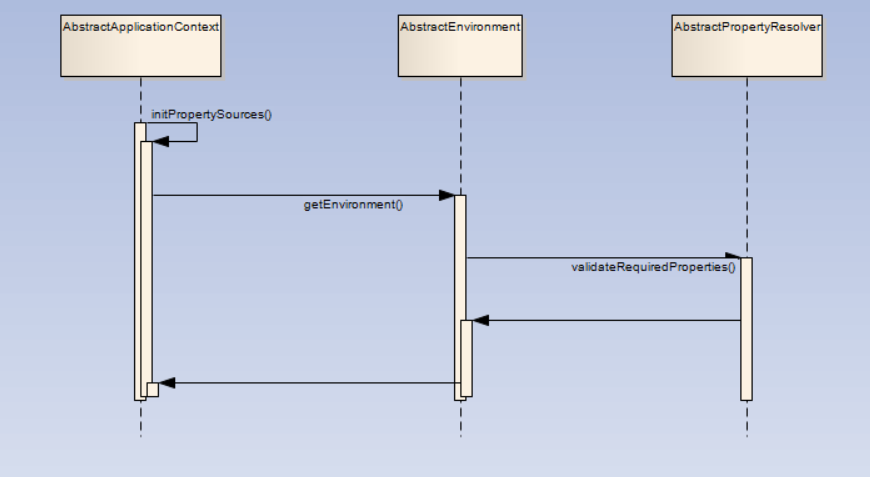

# Spring-IOC

## 例子

基于下面的例子分析spring-ioc容器创建过程：

配置类：

    @Configuration
    public class TestConfiguration {
        
        public TestConfiguration() {
            System.out.println("TestConfiguration is creating");
        }
        
        @Bean
        public Car car() {
            return new Car("Big Car",10);
        }	
    }
测试类：

    public class Main {

        public static void main(String[] args) {
            ApplicationContext context = new AnnotationConfigApplicationContext(TestConfiguration.class);
            Car car = (Car) context.getBean("car");
            String[] names = context.getBeanDefinitionNames();
            System.out.println(context.getDisplayName());
            System.out.println(car);
            System.out.println(context.containsBean("car"));
            for(String str:names) {
                System.out.println(str);
            }
        }
    }

测试Bean:

    public class Car {

        private String name;
        
        private int age;

        public String getName() {
            return name;
        }

        public void setName(String name) {
            this.name = name;
        }

        public int getAge() {
            return age;
        }

        public void setAge(int age) {
            this.age = age;
        }

        public Car() {
            super();
        }

        public Car(String name, int age) {
            super();
            this.name = name;
            this.age = age;
        }

        @Override
        public String toString() {
            return "Car [name=" + name + ", age=" + age + "]";
        }
        
    }

## spring-ioc容器创建过程分析

查看Main类中的main方法：

    public static void main(String[] args) {
            ApplicationContext context = new AnnotationConfigApplicationContext(TestConfiguration.class);
            Car car = (Car) context.getBean("car");
            String[] names = context.getBeanDefinitionNames();
            System.out.println(context.getDisplayName());
            System.out.println(car);
            System.out.println(context.containsBean("car"));
            for(String str:names) {
                System.out.println(str);
            }
        }

其中第一行代码：

    ApplicationContext context = new AnnotationConfigApplicationContext(TestConfiguration.class);

调用构造器，创建AnnotationConfigApplicationContext对象：

    public AnnotationConfigApplicationContext(Class<?>... annotatedClasses) {
		this();
		register(annotatedClasses);
		refresh();
	}

### this()

### register()

### refresh()

refresh()方法包含如下代码：

    public void refresh() throws BeansException, IllegalStateException {
		synchronized (this.startupShutdownMonitor) {
			// Prepare this context for refreshing.
			//准备刷新的上下文环境
			prepareRefresh();

			// Tell the subclass to refresh the internal bean factory.
			//初始化BeanFactory，并进行配置文件提取
			ConfigurableListableBeanFactory beanFactory = obtainFreshBeanFactory();

			// Prepare the bean factory for use in this context.
			//对BeanFactory进行各种功能的填充
			prepareBeanFactory(beanFactory);

			try {
				// Allows post-processing of the bean factory in context subclasses.
				// 子类覆盖方法做额外的处理
				postProcessBeanFactory(beanFactory);

				// Invoke factory processors registered as beans in the context.
				// 激活各种BeanFactory处理器
				invokeBeanFactoryPostProcessors(beanFactory);

				// Register bean processors that intercept bean creation.
				// 注册拦截Bean创建的Bean处理器，这里只是注册，真正的调用是在getBean时候
				registerBeanPostProcessors(beanFactory);

				// Initialize message source for this context.
				// 为上下文初始化Message源，即不同语言的消息体，国际化处理
				initMessageSource();

				// Initialize event multicaster for this context.
				// 初始化应用消息广播器，并放入"applicationEventMulticaster"bean中
				initApplicationEventMulticaster();

				// Initialize other special beans in specific context subclasses.
				// 初始化剩下的单实例
				onRefresh();

				// Check for listener beans and register them.
				// 在所有注册的bean中查找Listener bean，注册到消息广播器中
				registerListeners();

				// Instantiate all remaining (non-lazy-init) singletons.
				// 初始化剩下的单实例（非惰性的）
				finishBeanFactoryInitialization(beanFactory);

				// Last step: publish corresponding event.
				// 完成刷新过程，通知生命周期处理器lifecycleProcessor刷新过程，同时发出ContextRefreshEvent通知别人
				finishRefresh();
			}

			catch (BeansException ex) {
				if (logger.isWarnEnabled()) {
					logger.warn("Exception encountered during context initialization - " +
							"cancelling refresh attempt: " + ex);
				}

				// Destroy already created singletons to avoid dangling resources.
				destroyBeans();

				// Reset 'active' flag.
				cancelRefresh(ex);

				// Propagate exception to caller.
				throw ex;
			}

			finally {
				// Reset common introspection caches in Spring's core, since we
				// might not ever need metadata for singleton beans anymore...
				resetCommonCaches();
			}
		}
	}

该方法的处理逻辑：

1. 初始化前的准备工作，例如对系统属性或者环境变量进行准备及验证
   在某种情况下项目的使用需要读取某些系统变量，而这个变量的设置很可能会影响着系统的正确性，它可以在Spring启动的时候提前对必须的变量进行存在性验证。 
2. 初始化BeanFactory，并进行配置文件的读取
   这一步骤中将会复用BeanFactory中的配置文件读取解析及其他功能，这一步之后，ApplicationContext实际上就已经包含了BeanFactory所提供的功能，也就是可以进行Bean的提取等基础操作了。
3. 对BeanFactory进行各种功能填充
   @Qualifier和@Autowired这两个注解的是在这一步骤添加的支持
4. 子类覆盖方法做额外的处理
5. 激活各种BeanFactory处理器
6. 注册拦截bean创建的bean处理器，这里只是注册，真正的调用是在getBean的时候。
7. 为上下文初始化Message源，即对不同语言的消息体进行国际化处理
8. 初始化应用消息广播器，并放入“applicationEventMulticaster” bean中
9. 留给子类来初始化其他的bean
10. 在所有注册的bean中查找listener bean,注册到消息广播器中。
11. 初始化剩下的单实例（非惰性的）
12. 完成刷新过程，通知声明周期处理器lifecycleProcessor刷新过程，同时发出ContextRefreshEvent通知别人。

#### prepareRefresh()

方法注释：

    /**
	 * Prepare this context for refreshing, setting its startup date and
	 * active flag as well as performing any initialization of property sources.
	 */
     //为刷新容器做准备，设置容器启动事件，以及启动标志并且初始化配置文件中的属性

方法源码以及逻辑：

    protected void prepareRefresh() {
        //设置启动时间
		this.startupDate = System.currentTimeMillis();
		//设置active标志
        this.closed.set(false);
		this.active.set(true);

		if (logger.isInfoEnabled()) {
			logger.info("Refreshing " + this);
		}

		// Initialize any placeholder property sources in the context environment
        //初始化配置文件中的配置
        //这是一个空方法，用于子类初始化配置
		initPropertySources();

		// Validate that all properties marked as required are resolvable
		// see ConfigurablePropertyResolver#setRequiredProperties
		//取出环境变量并且验证必要的属性
        getEnvironment().validateRequiredProperties();

		// Allow for the collection of early ApplicationEvents,
		// to be published once the multicaster is available...
		//最后初始化应用程序事件序列，用于存储刷新容器期间发布的信息
        this.earlyApplicationEvents = new LinkedHashSet<>();
	}

这里由于initPropertySources()方法是空方法，我们仔细分析下

    getEnvironment().validateRequiredProperties();

getEnvironment()方法源码十分简单，如下：

    public ConfigurableEnvironment getEnvironment() {
		if (this.environment == null) {
			this.environment = createEnvironment();
		}
		return this.environment;
	}

逻辑就是如果this.environment是空就创建一个，否则就直接返回对象。

考察validateRequiredProperties()逻辑：

    @Override
	public void validateRequiredProperties() throws MissingRequiredPropertiesException {
		this.propertyResolver.validateRequiredProperties();
	}

这里调用了this.propertyResolver.validateRequiredProperties()。不过值得注意的是如果验证不通过会抛出MissingRequiredPropertiesException异常。考虑this.propertyResolver.validateRequiredProperties()的验证逻辑：

    public void validateRequiredProperties() {
		MissingRequiredPropertiesException ex = new MissingRequiredPropertiesException();
		for (String key : this.requiredProperties) {
			if (this.getProperty(key) == null) {
				ex.addMissingRequiredProperty(key);
			}
		}
		if (!ex.getMissingRequiredProperties().isEmpty()) {
			throw ex;
		}
	}

依次遍历this.requiredProperties，如果获取不到属性就将其添加到MissingRequiredPropertiesException 中，遍历完成后，如果MissingRequiredPropertiesException 包含缺少的属性，就抛出异常。但是这个验证逻辑比较简单，可以对其进行重写。

执行流程如图：

#### ConfigurableListableBeanFactory beanFactory = obtainFreshBeanFactory();

该方法从字面意思是获取BeanFactory。由于ApplicationContext是对BeanFactory的功能上扩展，不但包含了BeanFactory的全部功能更在其基础上添加了大量的扩展应用，那么obtainFreshBeanFactory正是实现BeanFactory的方法，也就是经过这个函数后ApplicationContext就已经拥有了BeanFactory的全部功能。

方法注释如下：

    /**
	 * Tell the subclass to refresh the internal bean factory.
	 * @return the fresh BeanFactory instance
	 * @see #refreshBeanFactory()
	 * @see #getBeanFactory()
	 */
     //告诉子类去刷新内部bean工厂

源码如下：

    protected ConfigurableListableBeanFactory obtainFreshBeanFactory() {
        //刷新bean工厂
		refreshBeanFactory();
        //重新获取bean工厂
		ConfigurableListableBeanFactory beanFactory = getBeanFactory();
		if (logger.isDebugEnabled()) {
			logger.debug("Bean factory for " + getDisplayName() + ": " + beanFactory);
		}
        //返回bean工厂
		return beanFactory;
	}

考察refreshBeanFactory()方法，注解如下：

    /**
	 * Do nothing: We hold a single internal BeanFactory and rely on callers
	 * to register beans through our public methods (or the BeanFactory's).
	 * @see #registerBeanDefinition
	 */
     //什么都不做，我们只有一个内部的BeanFactory单例，并且依赖调用者通过我们的public方法进行注册

源码如下：

    protected final void refreshBeanFactory() throws IllegalStateException {
		if (!this.refreshed.compareAndSet(false, true)) {
			throw new IllegalStateException(
					"GenericApplicationContext does not support multiple refresh attempts: just call 'refresh' once");
		}
		this.beanFactory.setSerializationId(getId());
	}

这个方法并没有做什么事情，只是刷新了下beanFactory而已

#### prepareBeanFactory(beanFactory);

这里实现Spring容器的功能扩展。

方法注释：

    /**
	 * Configure the factory's standard context characteristics,
	 * such as the context's ClassLoader and post-processors.
	 * @param beanFactory the BeanFactory to configure
	 */
     //配置工厂的标准上下文信息，例如例如上下文的类加载器和post-processor

源码如下：

    protected void prepareBeanFactory(ConfigurableListableBeanFactory beanFactory) {
		// Tell the internal bean factory to use the context's class loader etc.
        //设置类加载器
		beanFactory.setBeanClassLoader(getClassLoader());
		//设置SpEL解析器
        beanFactory.setBeanExpressionResolver(new StandardBeanExpressionResolver(beanFactory.getBeanClassLoader()));
		//添加了一个默认的propertyEditor，这个主要是对bean的属性等设置管理的一个工具
        beanFactory.addPropertyEditorRegistrar(new ResourceEditorRegistrar(this, getEnvironment()));

		// Configure the bean factory with context callbacks.
		//添加ApplicationContextAwareProcessor
        beanFactory.addBeanPostProcessor(new ApplicationContextAwareProcessor(this));
        //设置了几个自动装配的特殊规则
		beanFactory.ignoreDependencyInterface(EnvironmentAware.class);
		beanFactory.ignoreDependencyInterface(EmbeddedValueResolverAware.class);
		beanFactory.ignoreDependencyInterface(ResourceLoaderAware.class);
		beanFactory.ignoreDependencyInterface(ApplicationEventPublisherAware.class);
		beanFactory.ignoreDependencyInterface(MessageSourceAware.class);
		beanFactory.ignoreDependencyInterface(ApplicationContextAware.class);

		// BeanFactory interface not registered as resolvable type in a plain factory.
		// MessageSource registered (and found for autowiring) as a bean.
        //注册依赖
		beanFactory.registerResolvableDependency(BeanFactory.class, beanFactory);
		beanFactory.registerResolvableDependency(ResourceLoader.class, this);
		beanFactory.registerResolvableDependency(ApplicationEventPublisher.class, this);
		beanFactory.registerResolvableDependency(ApplicationContext.class, this);

		// Register early post-processor for detecting inner beans as ApplicationListeners.
        //添加ListenerDetector
		beanFactory.addBeanPostProcessor(new ApplicationListenerDetector(this));

		// Detect a LoadTimeWeaver and prepare for weaving, if found.
        //增加对AspectJ的支持
		if (beanFactory.containsBean(LOAD_TIME_WEAVER_BEAN_NAME)) {
			beanFactory.addBeanPostProcessor(new LoadTimeWeaverAwareProcessor(beanFactory));
			// Set a temporary ClassLoader for type matching.
			beanFactory.setTempClassLoader(new ContextTypeMatchClassLoader(beanFactory.getBeanClassLoader()));
		}
		//添加默认的系统环境
		// Register default environment beans.
		if (!beanFactory.containsLocalBean(ENVIRONMENT_BEAN_NAME)) {
			beanFactory.registerSingleton(ENVIRONMENT_BEAN_NAME, getEnvironment());
		}
		if (!beanFactory.containsLocalBean(SYSTEM_PROPERTIES_BEAN_NAME)) {
			beanFactory.registerSingleton(SYSTEM_PROPERTIES_BEAN_NAME, getEnvironment().getSystemProperties());
		}
		if (!beanFactory.containsLocalBean(SYSTEM_ENVIRONMENT_BEAN_NAME)) {
			beanFactory.registerSingleton(SYSTEM_ENVIRONMENT_BEAN_NAME, getEnvironment().getSystemEnvironment());
		}
	}

上面的函数中主要进行了几个方面的扩展：

1. 增加对SPEL语言的支持
2. 增加对属性编辑器的支持
3. 增加对一些内置类，比如EnvironmentAware、MessageSourceAware的信息注入。
4. 设置了依赖功能可忽略的接口
5. 注册一些固定依赖的属性
6. 添加AspectJ的支持
7. 将相关环境变量及属性测试以单例模式注册
   
##### 增加SPEL语言的支持

这段代码添加了对SPEL语言的支持：

	beanFactory.setBeanExpressionResolver(new StandardBeanExpressionResolver(beanFactory.getBeanClassLoader()));

但是这个解析器什么时候解析呢？

Spring在bean进行初始化的时候会有属性填充的一步，而在这一步Spring会调用AbstractAutowiredCapableBeanFactory类的applyPropertyValues函数来完成功能。就在这个函数中，会通过构造BeanDefinitionValueResolver类型实例valueResolver来进行属性值的解析。同时也是在这个步骤中一般通过AbstractBeanFactory中的evaluateBeanDefinitionString方法去完成SPEL的解析。

##### 增加属性注册编辑器

当进行Spring DI注入的时候，可以把普通的属性注入进来，但是对于Date这样的复杂类型就不可以，因此就需要使用属性编辑器。这里有两个解决方法：

1. 使用自定义属性编辑器
   使用自定义属性编辑器，通过继承PropertyEditorSupport，重写setAsText方法。
   在配置文件中引入类型为org.springframework.beans.factory.config.CustomEditorConfigurer的bean，并在属性customEditors中加入自定义的属性编辑器，其中key为属性编辑器所对应的bean类型。
   通过这样的配置，当Spring在注入bean的属性时一旦遇到了java.util.Date类型的属性会自动调用自定义的DatePropertyEditor解析器进行解析，并用解析结果代替配置属性进行注入。
2. 注册Spring自带的属性编辑器CustomDateEditor
   通过注册Spring自带的属性编辑器CustomDateEditor，定义属性编辑器如下：

		public class DatePropertyEditorRegistrar implements PropertyEditorRegistrar{
			public void registerCustomEditors(PropertyEditorRegistry registry){
				registry.registerCustomEditor(Date.class,new CustomDateEditor(new SimpleDateFormat("yyyy-MM-dd"),true));
			}
		}
	然后通过在配置文件中将自定义的DatePropertyEditorRegistrar注册进入org.springframework.beans.factory.config.CustomEditorConfigurer的propertyEditorRegistrars属性中，可以具有同样的效果。

	但是在refresh方法中，使用的是

		beanFactory.addPropertyEditorRegistrar(new ResourceEditorRegistrar(this, getEnvironment()));

	这两者有什么联系呢？考察ResourceEditorRegistrar的内部实现，这里我们主要关心registerCustomEditors方法的实现：

		public void registerCustomEditors(PropertyEditorRegistry registry) {
			ResourceEditor baseEditor = new ResourceEditor(this.resourceLoader, this.propertyResolver);
			doRegisterEditor(registry, Resource.class, baseEditor);
			doRegisterEditor(registry, ContextResource.class, baseEditor);
			doRegisterEditor(registry, InputStream.class, new InputStreamEditor(baseEditor));
			doRegisterEditor(registry, InputSource.class, new InputSourceEditor(baseEditor));
			doRegisterEditor(registry, File.class, new FileEditor(baseEditor));
			doRegisterEditor(registry, Path.class, new PathEditor(baseEditor));
			doRegisterEditor(registry, Reader.class, new ReaderEditor(baseEditor));
			doRegisterEditor(registry, URL.class, new URLEditor(baseEditor));

			ClassLoader classLoader = this.resourceLoader.getClassLoader();
			doRegisterEditor(registry, URI.class, new URIEditor(classLoader));
			doRegisterEditor(registry, Class.class, new ClassEditor(classLoader));
			doRegisterEditor(registry, Class[].class, new ClassArrayEditor(classLoader));

			if (this.resourceLoader instanceof ResourcePatternResolver) {
				doRegisterEditor(registry, Resource[].class,
						new ResourceArrayPropertyEditor((ResourcePatternResolver) this.resourceLoader, this.propertyResolver));
			}
		}

		private void doRegisterEditor(PropertyEditorRegistry registry, Class<?> requiredType, PropertyEditor editor) {
			if (registry instanceof PropertyEditorRegistrySupport) {
				((PropertyEditorRegistrySupport) registry).overrideDefaultEditor(requiredType, editor);
			}
			else {
				registry.registerCustomEditor(requiredType, editor);
			}
		}

	在doRegisterEditor函数中，可以看到之前提到的自定义属性中使用的关键代码：registry.registerCustomEditor(requiredType,editor)，回过头来看,ResourceEditorRegistrar类的registerCustomEditors方法的核心功能，其实无非是注册了一系列的常用类型的属性编辑器，例如，代码doRegisterEditor(registry,Class.class,new ClassEditor(classLoader))实现的功能就是注册Class类对应的属性编辑器。那么注册后一旦某个实体bean中存在一些Class类型的属性，那么Spring会调用ClassEditor将配置中定义的String类型转化成Class类型并进行赋值。

	然而我们没有看到确切的ResourceEditorRegistrar类的registerCustomEditors方法的调用，那么这个方法是在哪里调用的呢？通过查看该方法的调用层次结构，我们发现在AbstractBeanFactory中的registerCustomEditors方法中被调用过，继续查看该方法的调用结构，我们发现AbstractBeanFactory类中的initBeanWrapper方法中调用了该方法，这个方法用于将BeanDefinition转换为BeanWrapper用于属性的填充。到此我们知道了在bean的初始化后会调用ResourceEditorRegistrar的registerCustomEditors方法进行批量的通用属性编辑器注册。注册后，在属性填充的环节便可以直接让Spring使用这些编辑器进行属性的解析了。

	Spring中用于封装bean的是BeanWrapper类型，而它又间接继承了PopertyEditorRegistry类型，也就是我们之前反复看到的PropertyEditorRegisty registry，其实大部分情况下都是BeanWrapper，对于BeanWapper在Spring中的默认实现是BeanWrapperImpl，而在BeanWapperImpl除了实现BeanWrapper接口外还继承了PropertyEditorRegistrySupport，而在PropertyEditorRegistrySupport中有这样一个方法：

		private void createDefaultEditors() {
			this.defaultEditors = new HashMap<>(64);

			// Simple editors, without parameterization capabilities.
			// The JDK does not contain a default editor for any of these target types.
			this.defaultEditors.put(Charset.class, new CharsetEditor());
			this.defaultEditors.put(Class.class, new ClassEditor());
			this.defaultEditors.put(Class[].class, new ClassArrayEditor());
			this.defaultEditors.put(Currency.class, new CurrencyEditor());
			this.defaultEditors.put(File.class, new FileEditor());
			this.defaultEditors.put(InputStream.class, new InputStreamEditor());
			this.defaultEditors.put(InputSource.class, new InputSourceEditor());
			this.defaultEditors.put(Locale.class, new LocaleEditor());
			this.defaultEditors.put(Path.class, new PathEditor());
			this.defaultEditors.put(Pattern.class, new PatternEditor());
			this.defaultEditors.put(Properties.class, new PropertiesEditor());
			this.defaultEditors.put(Reader.class, new ReaderEditor());
			this.defaultEditors.put(Resource[].class, new ResourceArrayPropertyEditor());
			this.defaultEditors.put(TimeZone.class, new TimeZoneEditor());
			this.defaultEditors.put(URI.class, new URIEditor());
			this.defaultEditors.put(URL.class, new URLEditor());
			this.defaultEditors.put(UUID.class, new UUIDEditor());
			this.defaultEditors.put(ZoneId.class, new ZoneIdEditor());

			// Default instances of collection editors.
			// Can be overridden by registering custom instances of those as custom editors.
			this.defaultEditors.put(Collection.class, new CustomCollectionEditor(Collection.class));
			this.defaultEditors.put(Set.class, new CustomCollectionEditor(Set.class));
			this.defaultEditors.put(SortedSet.class, new CustomCollectionEditor(SortedSet.class));
			this.defaultEditors.put(List.class, new CustomCollectionEditor(List.class));
			this.defaultEditors.put(SortedMap.class, new CustomMapEditor(SortedMap.class));

			// Default editors for primitive arrays.
			this.defaultEditors.put(byte[].class, new ByteArrayPropertyEditor());
			this.defaultEditors.put(char[].class, new CharArrayPropertyEditor());

			// The JDK does not contain a default editor for char!
			this.defaultEditors.put(char.class, new CharacterEditor(false));
			this.defaultEditors.put(Character.class, new CharacterEditor(true));

			// Spring's CustomBooleanEditor accepts more flag values than the JDK's default editor.
			this.defaultEditors.put(boolean.class, new CustomBooleanEditor(false));
			this.defaultEditors.put(Boolean.class, new CustomBooleanEditor(true));

			// The JDK does not contain default editors for number wrapper types!
			// Override JDK primitive number editors with our own CustomNumberEditor.
			this.defaultEditors.put(byte.class, new CustomNumberEditor(Byte.class, false));
			this.defaultEditors.put(Byte.class, new CustomNumberEditor(Byte.class, true));
			this.defaultEditors.put(short.class, new CustomNumberEditor(Short.class, false));
			this.defaultEditors.put(Short.class, new CustomNumberEditor(Short.class, true));
			this.defaultEditors.put(int.class, new CustomNumberEditor(Integer.class, false));
			this.defaultEditors.put(Integer.class, new CustomNumberEditor(Integer.class, true));
			this.defaultEditors.put(long.class, new CustomNumberEditor(Long.class, false));
			this.defaultEditors.put(Long.class, new CustomNumberEditor(Long.class, true));
			this.defaultEditors.put(float.class, new CustomNumberEditor(Float.class, false));
			this.defaultEditors.put(Float.class, new CustomNumberEditor(Float.class, true));
			this.defaultEditors.put(double.class, new CustomNumberEditor(Double.class, false));
			this.defaultEditors.put(Double.class, new CustomNumberEditor(Double.class, true));
			this.defaultEditors.put(BigDecimal.class, new CustomNumberEditor(BigDecimal.class, true));
			this.defaultEditors.put(BigInteger.class, new CustomNumberEditor(BigInteger.class, true));

			// Only register config value editors if explicitly requested.
			if (this.configValueEditorsActive) {
				StringArrayPropertyEditor sae = new StringArrayPropertyEditor();
				this.defaultEditors.put(String[].class, sae);
				this.defaultEditors.put(short[].class, sae);
				this.defaultEditors.put(int[].class, sae);
				this.defaultEditors.put(long[].class, sae);
			}
		}

##### 添加ApplicationContextAwareProcessor处理器

考察ApplicationContextAwarreProcessor类的实现源码：

	class ApplicationContextAwareProcessor implements BeanPostProcessor {

		private final ConfigurableApplicationContext applicationContext;

		private final StringValueResolver embeddedValueResolver;

		/**
		* Create a new ApplicationContextAwareProcessor for the given context.
		*/
		public ApplicationContextAwareProcessor(ConfigurableApplicationContext applicationContext) {
			this.applicationContext = applicationContext;
			this.embeddedValueResolver = new EmbeddedValueResolver(applicationContext.getBeanFactory());
		}

		@Override
		@Nullable
		public Object postProcessBeforeInitialization(final Object bean, String beanName) throws BeansException {
			AccessControlContext acc = null;

			if (System.getSecurityManager() != null &&
					(bean instanceof EnvironmentAware || bean instanceof EmbeddedValueResolverAware ||
							bean instanceof ResourceLoaderAware || bean instanceof ApplicationEventPublisherAware ||
							bean instanceof MessageSourceAware || bean instanceof ApplicationContextAware)) {
				acc = this.applicationContext.getBeanFactory().getAccessControlContext();
			}

			if (acc != null) {
				AccessController.doPrivileged((PrivilegedAction<Object>) () -> {
					invokeAwareInterfaces(bean);
					return null;
				}, acc);
			}
			else {
				invokeAwareInterfaces(bean);
			}

			return bean;
		}

		private void invokeAwareInterfaces(Object bean) {
			if (bean instanceof Aware) {
				if (bean instanceof EnvironmentAware) {
					((EnvironmentAware) bean).setEnvironment(this.applicationContext.getEnvironment());
				}
				if (bean instanceof EmbeddedValueResolverAware) {
					((EmbeddedValueResolverAware) bean).setEmbeddedValueResolver(this.embeddedValueResolver);
				}
				if (bean instanceof ResourceLoaderAware) {
					((ResourceLoaderAware) bean).setResourceLoader(this.applicationContext);
				}
				if (bean instanceof ApplicationEventPublisherAware) {
					((ApplicationEventPublisherAware) bean).setApplicationEventPublisher(this.applicationContext);
				}
				if (bean instanceof MessageSourceAware) {
					((MessageSourceAware) bean).setMessageSource(this.applicationContext);
				}
				if (bean instanceof ApplicationContextAware) {
					((ApplicationContextAware) bean).setApplicationContext(this.applicationContext);
				}
			}
		}

		@Override
		public Object postProcessAfterInitialization(Object bean, String beanName) {
			return bean;
		}

	}

BeanPostProcessor类型的类我们主要考虑其postProcessBeforeInitialization和postProcessAfterInitialization方法，这两个方法分别在bean初始化之前和之后调用。由于postProcessAfterInitialization方法直接返回bean，没有做任何操作，所以我们主要关注postProcessBeforeInitialization方法。

	public Object postProcessBeforeInitialization(final Object bean, String beanName) throws BeansException {
			AccessControlContext acc = null;

			if (System.getSecurityManager() != null &&
					(bean instanceof EnvironmentAware || bean instanceof EmbeddedValueResolverAware ||
							bean instanceof ResourceLoaderAware || bean instanceof ApplicationEventPublisherAware ||
							bean instanceof MessageSourceAware || bean instanceof ApplicationContextAware)) {
				acc = this.applicationContext.getBeanFactory().getAccessControlContext();
			}

			if (acc != null) {
				AccessController.doPrivileged((PrivilegedAction<Object>) () -> {
					invokeAwareInterfaces(bean);
					return null;
				}, acc);
			}
			else {
				invokeAwareInterfaces(bean);
			}

			return bean;
		}

		private void invokeAwareInterfaces(Object bean) {
			if (bean instanceof Aware) {
				if (bean instanceof EnvironmentAware) {
					((EnvironmentAware) bean).setEnvironment(this.applicationContext.getEnvironment());
				}
				if (bean instanceof EmbeddedValueResolverAware) {
					((EmbeddedValueResolverAware) bean).setEmbeddedValueResolver(this.embeddedValueResolver);
				}
				if (bean instanceof ResourceLoaderAware) {
					((ResourceLoaderAware) bean).setResourceLoader(this.applicationContext);
				}
				if (bean instanceof ApplicationEventPublisherAware) {
					((ApplicationEventPublisherAware) bean).setApplicationEventPublisher(this.applicationContext);
				}
				if (bean instanceof MessageSourceAware) {
					((MessageSourceAware) bean).setMessageSource(this.applicationContext);
				}
				if (bean instanceof ApplicationContextAware) {
					((ApplicationContextAware) bean).setApplicationContext(this.applicationContext);
				}
			}
		}

查看上述方法我们发现，这个BeanPostProcessor主要做的任务就是在初始化前根据其实现的XXXAware方法注入特定的属性。由于Spring创建bean时默认处理的XXXAware只有几个，这里做一个扩展。

##### 设置忽略依赖

当Spring将ApplicationContextAwareProcessor注册后，那么在invokeAwareInterfaces方法中间接调用的Aware类已经不是普通的bean了，那么当然需要在Spring做bean的依赖注入的时候忽略他们。

#### postProcessBeanFactory()

该方法用于子类覆盖进行一定的扩展。

#### invokeBeanFactoryPostProcessors()

方法注释如下：
 
    /**
	 * Instantiate and invoke all registered BeanFactoryPostProcessor beans,
	 * respecting explicit order if given.
	 * 
Must be called before singleton instantiation.
	 */
     遵循特定顺序实例化并执行所有的被注册的BeanFactoryPostProcessor，一定要在单例实例化之前调用

既然该方法用来实例化并执行所有的BeanFactoryPostProcessor，那么BeanFactoryPostProcessor到底是用来做什么的呢？

BeanFactoryPostProcessor和BeanPostProcessor类似，可以对bean的定义进行处理，我们考虑该接口的源码：

	@FunctionalInterface
	public interface BeanFactoryPostProcessor {

		/**
		* Modify the application context's internal bean factory after its standard
		* initialization. All bean definitions will have been loaded, but no beans
		* will have been instantiated yet. This allows for overriding or adding
		* properties even to eager-initializing beans.
		* @param beanFactory the bean factory used by the application context
		* @throws org.springframework.beans.BeansException in case of errors
		*/
		void postProcessBeanFactory(ConfigurableListableBeanFactory beanFactory) throws BeansException;

	}

我们可以看到该接口只要求实现一个方法：

	void postProcessBeanFactory(ConfigurableListableBeanFactory beanFactory) throws BeansException;

根据该方法的注释我们知道：这个方法用于修改Spring容器的内部BeanFactory，调用这个方法的时候，所有的BeanDefinition都已经被加载，但是没有被实例化。这允许我们去添加一些BeanDefinition或者修改BeanDefinition。

值得注意的是BeanFactoryPostProcessor的作用范围是容器级的，只和所使用的容器有关，如果你想要切实的改变bean实例，最好还是用BeanPostProcessor。

接下来我们继续讨论invokeBeanFactoryPostProcessors方法，方法源码如下：

    protected void invokeBeanFactoryPostProcessors(ConfigurableListableBeanFactory beanFactory) {
        //这里执行实例化并执行所有BeanFactoryPostProcessor的实际逻辑
		PostProcessorRegistrationDelegate.invokeBeanFactoryPostProcessors(beanFactory, getBeanFactoryPostProcessors());

		// Detect a LoadTimeWeaver and prepare for weaving, if found in the meantime
        //检测LoadTimeWeaver并准备织入（如果在此期间找到）
        //通过一个被@Bean修饰的ConfigurationClassPostProcessor
		// (e.g. through an @Bean method registered by ConfigurationClassPostProcessor)
		if (beanFactory.getTempClassLoader() == null && beanFactory.containsBean(LOAD_TIME_WEAVER_BEAN_NAME)) {
			beanFactory.addBeanPostProcessor(new LoadTimeWeaverAwareProcessor(beanFactory));
			beanFactory.setTempClassLoader(new ContextTypeMatchClassLoader(beanFactory.getBeanClassLoader()));
		}
	}

我们仔细查看执行所有BeanFactoryPostProcessor的主逻辑，即：

    PostProcessorRegistrationDelegate.invokeBeanFactoryPostProcessors(beanFactory, getBeanFactoryPostProcessors());

它将执行逻辑交给PostProcessorRegistrationDelegate类的invokeBeanFactoryPostProcessors()方法，查看该方法源码：

    public static void invokeBeanFactoryPostProcessors(
			ConfigurableListableBeanFactory beanFactory, List<BeanFactoryPostProcessor> beanFactoryPostProcessors) {

		// Invoke BeanDefinitionRegistryPostProcessors first, if any.
        //用于记录已经处理过的bean
		Set<String> processedBeans = new HashSet<>();
        //这里是处理已经存在于beanFactoryPostProcessors属性中的BeanFactoryPostProcessor实例（即硬编码的后处理器），
		//由于传入的参数是由getBeanFactoryPostProcessors()可能有些BeanFactoryPostProcessors还未初始化，因此这里是拿不到的
		if (beanFactory instanceof BeanDefinitionRegistry) {
			BeanDefinitionRegistry registry = (BeanDefinitionRegistry) beanFactory;
			List<BeanFactoryPostProcessor> regularPostProcessors = new LinkedList<>();
			List<BeanDefinitionRegistryPostProcessor> registryProcessors = new LinkedList<>();

			for (BeanFactoryPostProcessor postProcessor : beanFactoryPostProcessors) {
				if (postProcessor instanceof BeanDefinitionRegistryPostProcessor) {
					BeanDefinitionRegistryPostProcessor registryProcessor =
							(BeanDefinitionRegistryPostProcessor) postProcessor;
					//对于BeanDefinitionRegistryProcessor类型，在BeanFactoryPostProcessor的基础上还有自己定义的方法，需要先调用。
					registryProcessor.postProcessBeanDefinitionRegistry(registry);
					registryProcessors.add(registryProcessor);
				}
				else {
					//记录常规BeanFactoryPostProcessor
					regularPostProcessors.add(postProcessor);
				}
			}

			// Do not initialize FactoryBeans here: We need to leave all regular beans
			// uninitialized to let the bean factory post-processors apply to them!
			// Separate between BeanDefinitionRegistryPostProcessors that implement
			// PriorityOrdered, Ordered, and the rest.
			//接下来是按照实现了PriorityOrdered, Ordered, and the rest的顺序进行实例化并且调用对应接口方法的工作，对于下面的BeanFactoryPostProcessor也一样

			List<BeanDefinitionRegistryPostProcessor> currentRegistryProcessors = new ArrayList<>();

			// First, invoke the BeanDefinitionRegistryPostProcessors that implement PriorityOrdered.
			//通过对beanFactory的beanDefinitionNames中的元素进行遍历，获取每个BeanDefinition，然后通过BeanDefinition与输入属性进行对照，
			//这里三个输入的变量分别代表
			// - Bean Class类型
			// - 是否可以不是单例
			// - 是否allowEagerInit
			//将满足条件的beanDefinition的名称全部返回
			//注意，对于被@Configuration注解修饰的类，其解析工作就是在这里通过
			//org.springframework.context.annotation.internalConfigurationAnnotationProcessor
			//完成的
			String[] postProcessorNames =
					beanFactory.getBeanNamesForType(BeanDefinitionRegistryPostProcessor.class, true, false);
			for (String ppName : postProcessorNames) {
				if (beanFactory.isTypeMatch(ppName, PriorityOrdered.class)) {
					currentRegistryProcessors.add(beanFactory.getBean(ppName, BeanDefinitionRegistryPostProcessor.class));
					processedBeans.add(ppName);
				}
			}
			sortPostProcessors(currentRegistryProcessors, beanFactory);
			registryProcessors.addAll(currentRegistryProcessors);
			invokeBeanDefinitionRegistryPostProcessors(currentRegistryProcessors, registry);
			currentRegistryProcessors.clear();

			// Next, invoke the BeanDefinitionRegistryPostProcessors that implement Ordered.
			postProcessorNames = beanFactory.getBeanNamesForType(BeanDefinitionRegistryPostProcessor.class, true, false);
			for (String ppName : postProcessorNames) {
				if (!processedBeans.contains(ppName) && beanFactory.isTypeMatch(ppName, Ordered.class)) {
					currentRegistryProcessors.add(beanFactory.getBean(ppName, BeanDefinitionRegistryPostProcessor.class));
					processedBeans.add(ppName);
				}
			}
			sortPostProcessors(currentRegistryProcessors, beanFactory);
			registryProcessors.addAll(currentRegistryProcessors);
			invokeBeanDefinitionRegistryPostProcessors(currentRegistryProcessors, registry);
			currentRegistryProcessors.clear();

			// Finally, invoke all other BeanDefinitionRegistryPostProcessors until no further ones appear.
			boolean reiterate = true;
			while (reiterate) {
				reiterate = false;
				postProcessorNames = beanFactory.getBeanNamesForType(BeanDefinitionRegistryPostProcessor.class, true, false);
				for (String ppName : postProcessorNames) {
					if (!processedBeans.contains(ppName)) {
						currentRegistryProcessors.add(beanFactory.getBean(ppName, BeanDefinitionRegistryPostProcessor.class));
						processedBeans.add(ppName);
						reiterate = true;
					}
				}
				sortPostProcessors(currentRegistryProcessors, beanFactory);
				registryProcessors.addAll(currentRegistryProcessors);
				invokeBeanDefinitionRegistryPostProcessors(currentRegistryProcessors, registry);
				currentRegistryProcessors.clear();
			}

			// Now, invoke the postProcessBeanFactory callback of all processors handled so far.
			//这里是按顺序调用所有的BeanDefinitionRegistry的postProcessBeanFactory()方法
			invokeBeanFactoryPostProcessors(registryProcessors, beanFactory);
			//这里就是调用原本已经存在于beanFactoryPostProcessors属性中的BeanFactoryPostProcessor实例的postProcessBeanFactory()方法
			invokeBeanFactoryPostProcessors(regularPostProcessors, beanFactory);
		}

		else {
			// Invoke factory processors registered with the context instance.
			invokeBeanFactoryPostProcessors(beanFactoryPostProcessors, beanFactory);
		}

		// Do not initialize FactoryBeans here: We need to leave all regular beans
		// uninitialized to let the bean factory post-processors apply to them!
		String[] postProcessorNames =
				beanFactory.getBeanNamesForType(BeanFactoryPostProcessor.class, true, false);

		// Separate between BeanFactoryPostProcessors that implement PriorityOrdered,
		// Ordered, and the rest.
		List<BeanFactoryPostProcessor> priorityOrderedPostProcessors = new ArrayList<>();
		List<String> orderedPostProcessorNames = new ArrayList<>();
		List<String> nonOrderedPostProcessorNames = new ArrayList<>();
		for (String ppName : postProcessorNames) {
			if (processedBeans.contains(ppName)) {
				// skip - already processed in first phase above
			}
			else if (beanFactory.isTypeMatch(ppName, PriorityOrdered.class)) {
				priorityOrderedPostProcessors.add(beanFactory.getBean(ppName, BeanFactoryPostProcessor.class));
			}
			else if (beanFactory.isTypeMatch(ppName, Ordered.class)) {
				orderedPostProcessorNames.add(ppName);
			}
			else {
				nonOrderedPostProcessorNames.add(ppName);
			}
		}

		// First, invoke the BeanFactoryPostProcessors that implement PriorityOrdered.
		sortPostProcessors(priorityOrderedPostProcessors, beanFactory);
		invokeBeanFactoryPostProcessors(priorityOrderedPostProcessors, beanFactory);

		// Next, invoke the BeanFactoryPostProcessors that implement Ordered.
		List<BeanFactoryPostProcessor> orderedPostProcessors = new ArrayList<>();
		for (String postProcessorName : orderedPostProcessorNames) {
			orderedPostProcessors.add(beanFactory.getBean(postProcessorName, BeanFactoryPostProcessor.class));
		}
		sortPostProcessors(orderedPostProcessors, beanFactory);
		invokeBeanFactoryPostProcessors(orderedPostProcessors, beanFactory);

		// Finally, invoke all other BeanFactoryPostProcessors.
		List<BeanFactoryPostProcessor> nonOrderedPostProcessors = new ArrayList<>();
		for (String postProcessorName : nonOrderedPostProcessorNames) {
			nonOrderedPostProcessors.add(beanFactory.getBean(postProcessorName, BeanFactoryPostProcessor.class));
		}
		invokeBeanFactoryPostProcessors(nonOrderedPostProcessors, beanFactory);

		// Clear cached merged bean definitions since the post-processors might have
		// modified the original metadata, e.g. replacing placeholders in values...
		beanFactory.clearMetadataCache();
	}

### registerBeanPostProcessors(beanFactory);

该方法顾名思义就是用来注册并实例化BeanPostProcessor，考虑方法源码如下：

	protected void registerBeanPostProcessors(ConfigurableListableBeanFactory beanFactory) {
		PostProcessorRegistrationDelegate.registerBeanPostProcessors(beanFactory, this);
	}

这里和上个函数一样也交给了一个Delegate代理实现，考察该具体实现方法：

	public static void registerBeanPostProcessors(
			ConfigurableListableBeanFactory beanFactory, AbstractApplicationContext applicationContext) {
		//获取所有的BeanPostProcessor类型bean名称
		String[] postProcessorNames = beanFactory.getBeanNamesForType(BeanPostProcessor.class, true, false);

		// Register BeanPostProcessorChecker that logs an info message when
		// a bean is created during BeanPostProcessor instantiation, i.e. when
		// a bean is not eligible for getting processed by all 
		//由于这里要添加一个BeanPostProcessor，所以这里要对处理的数值+1
		BeanPostProcessors.
		int beanProcessorTargetCount = beanFactory.getBeanPostProcessorCount() + 1 + postProcessorNames.length;
		beanFactory.addBeanPostProcessor(new BeanPostProcessorChecker(beanFactory, beanProcessorTargetCount));

		// Separate between BeanPostProcessors that implement PriorityOrdered,
		// Ordered, and the rest.
		//拆分所有的BeanPostProcessor为3类，分别为：
		//- 实现了PriorityOrdered接口的
		//- 实现了Ordered接口的
		//- 两者都没实现的
		//并按照上述顺序对他们进行创建实例。
		List<BeanPostProcessor> priorityOrderedPostProcessors = new ArrayList<>();
		List<BeanPostProcessor> internalPostProcessors = new ArrayList<>();
		List<String> orderedPostProcessorNames = new ArrayList<>();
		List<String> nonOrderedPostProcessorNames = new ArrayList<>();
		for (String ppName : postProcessorNames) {
			if (beanFactory.isTypeMatch(ppName, PriorityOrdered.class)) {
				BeanPostProcessor pp = beanFactory.getBean(ppName, BeanPostProcessor.class);
				priorityOrderedPostProcessors.add(pp);
				if (pp instanceof MergedBeanDefinitionPostProcessor) {
					internalPostProcessors.add(pp);
				}
			}
			else if (beanFactory.isTypeMatch(ppName, Ordered.class)) {
				orderedPostProcessorNames.add(ppName);
			}
			else {
				nonOrderedPostProcessorNames.add(ppName);
			}
		}

		// First, register the BeanPostProcessors that implement PriorityOrdered.
		sortPostProcessors(priorityOrderedPostProcessors, beanFactory);
		registerBeanPostProcessors(beanFactory, priorityOrderedPostProcessors);

		// Next, register the BeanPostProcessors that implement Ordered.
		List<BeanPostProcessor> orderedPostProcessors = new ArrayList<>();
		for (String ppName : orderedPostProcessorNames) {
			BeanPostProcessor pp = beanFactory.getBean(ppName, BeanPostProcessor.class);
			orderedPostProcessors.add(pp);
			if (pp instanceof MergedBeanDefinitionPostProcessor) {
				internalPostProcessors.add(pp);
			}
		}
		sortPostProcessors(orderedPostProcessors, beanFactory);
		registerBeanPostProcessors(beanFactory, orderedPostProcessors);

		// Now, register all regular BeanPostProcessors.
		List<BeanPostProcessor> nonOrderedPostProcessors = new ArrayList<>();
		for (String ppName : nonOrderedPostProcessorNames) {
			BeanPostProcessor pp = beanFactory.getBean(ppName, BeanPostProcessor.class);
			nonOrderedPostProcessors.add(pp);
			if (pp instanceof MergedBeanDefinitionPostProcessor) {
				internalPostProcessors.add(pp);
			}
		}
		registerBeanPostProcessors(beanFactory, nonOrderedPostProcessors);

		// Finally, re-register all internal BeanPostProcessors.
		sortPostProcessors(internalPostProcessors, beanFactory);
		registerBeanPostProcessors(beanFactory, internalPostProcessors);

		// Re-register post-processor for detecting inner beans as ApplicationListeners,
		// moving it to the end of the processor chain (for picking up proxies etc).
		beanFactory.addBeanPostProcessor(new ApplicationListenerDetector(applicationContext));
	}

### initMessageSource()

Spring用来处理国际化的。

方法注释如下：

	/**
	 * Initialize the MessageSource.
	 * Use parent's if none defined in this context.
	 */
	 //初始化一个MessageSource
	 //如果上下文中没定义的话就用父类的

源码如下：

	protected void initMessageSource() {
		//获取BeanFactory
		ConfigurableListableBeanFactory beanFactory = getBeanFactory();
		//判断是否有id为messageSource的bean
		if (beanFactory.containsLocalBean(MESSAGE_SOURCE_BEAN_NAME)) {
			this.messageSource = beanFactory.getBean(MESSAGE_SOURCE_BEAN_NAME, MessageSource.class);
			// Make MessageSource aware of parent MessageSource.
			if (this.parent != null && this.messageSource instanceof HierarchicalMessageSource) {
				HierarchicalMessageSource hms = (HierarchicalMessageSource) this.messageSource;
				if (hms.getParentMessageSource() == null) {
					// Only set parent context as parent MessageSource if no parent MessageSource
					// registered already.
					hms.setParentMessageSource(getInternalParentMessageSource());
				}
			}
			if (logger.isDebugEnabled()) {
				logger.debug("Using MessageSource [" + this.messageSource + "]");
			}
		}
		else {
			// Use empty MessageSource to be able to accept getMessage calls.
			// 创建新的MessageSouce，并设置ParentMessageSource
			DelegatingMessageSource dms = new DelegatingMessageSource();
			dms.setParentMessageSource(getInternalParentMessageSource());
			this.messageSource = dms;
			beanFactory.registerSingleton(MESSAGE_SOURCE_BEAN_NAME, this.messageSource);
			if (logger.isDebugEnabled()) {
				logger.debug("Unable to locate MessageSource with name '" + MESSAGE_SOURCE_BEAN_NAME +
						"': using default [" + this.messageSource + "]");
			}
		}
	}

### initApplicationEventMulticaster()

方法注释如下：

	/**
	 * Initialize the ApplicationEventMulticaster.
	 * Uses SimpleApplicationEventMulticaster if none defined in the context.
	 * @see org.springframework.context.event.SimpleApplicationEventMulticaster
	 */
	 //这个方法用来初始化一个ApplicationEventMulticaster
	 //如果上下文中没有的话就创建一个SimpleApplicationEventMulticaster
	 //ApplicationEventMulticaster是用来完成Sprin
	 g Context上下文Event监听的具体请查看

源码如下：

	protected void initApplicationEventMulticaster() {
		//获取BeanFactory
		ConfigurableListableBeanFactory beanFactory = getBeanFactory();
		//如果beanFactory包含applicationEventMulticaster名字的bean就获取
		if (beanFactory.containsLocalBean(APPLICATION_EVENT_MULTICASTER_BEAN_NAME)) {
			this.applicationEventMulticaster =
					beanFactory.getBean(APPLICATION_EVENT_MULTICASTER_BEAN_NAME, ApplicationEventMulticaster.class);
			if (logger.isDebugEnabled()) {
				logger.debug("Using ApplicationEventMulticaster [" + this.applicationEventMulticaster + "]");
			}
		}
		else {
			//否则创建一个SimpleApplicationEventMulticaster对象并赋值
			this.applicationEventMulticaster = new SimpleApplicationEventMulticaster(beanFactory);
			beanFactory.registerSingleton(APPLICATION_EVENT_MULTICASTER_BEAN_NAME, this.applicationEventMulticaster);
			if (logger.isDebugEnabled()) {
				logger.debug("Unable to locate ApplicationEventMulticaster with name '" +
						APPLICATION_EVENT_MULTICASTER_BEAN_NAME +
						"': using default [" + this.applicationEventMulticaster + "]");
			}
		}
	}

### onRefresh()

方法注释如下：

	/**
	 * Template method which can be overridden to add context-specific refresh work.
	 * Called on initialization of special beans, before instantiation of singletons.
	 * 
This implementation is empty.
	 * @throws BeansException in case of errors
	 * @see #refresh()
	 */
	 //这是一个模板方法，可以用来完成特定的上下文刷新工作
	 //它用于实例化特定的bean，会在单例bean实例化之前调用，默认为空

源码如下：

	protected void onRefresh() throws BeansException {
		// For subclasses: do nothing by default.
	}

### registerListeners()

方法注释如下：

	/**
	 * Add beans that implement ApplicationListener as listeners.
	 * Doesn't affect other listeners, which can be added without being beans.
	 */
	 //添加实现了ApplicationListener接口的类作为监听器bean
	 //如果不是bean将不能被添加，监听器之间不会相互影响

源码如下：

	protected void registerListeners() {
		//注册指定监听器，这些监听器是在applicationListeners属性中指定的，将其添加到ApplicationEventMulticaster中
		// Register statically specified listeners first.
		for (ApplicationListener<?> listener : getApplicationListeners()) {
			getApplicationEventMulticaster().addApplicationListener(listener);
		}

		// Do not initialize FactoryBeans here: We need to leave all regular beans
		// uninitialized to let post-processors apply to them!
		//获取beanDefinition中存在的bean，然后将其添加到ApplicationEventMulticaster中
		String[] listenerBeanNames = getBeanNamesForType(ApplicationListener.class, true, false);
		for (String listenerBeanName : listenerBeanNames) {
			getApplicationEventMulticaster().addApplicationListenerBean(listenerBeanName);
		}

		// Publish early application events now that we finally have a multicaster...
		// 第一步中设置的earlyApplicationEvents的处理
		Set<ApplicationEvent> earlyEventsToProcess = this.earlyApplicationEvents;
		this.earlyApplicationEvents = null;
		if (earlyEventsToProcess != null) {
			for (ApplicationEvent earlyEvent : earlyEventsToProcess) {
				getApplicationEventMulticaster().multicastEvent(earlyEvent);
			}
		}
	}

### finishBeanFactoryInitialization()

方法注释：

	/**
	 * Finish the initialization of this context's bean factory,
	 * initializing all remaining singleton beans.
	 */
	 //通过上下文中的bean工厂完成所有剩下的单例的实例化

方法源码：

	protected void finishBeanFactoryInitialization(ConfigurableListableBeanFactory beanFactory) {
		// Initialize conversion service for this context.
		if (beanFactory.containsBean(CONVERSION_SERVICE_BEAN_NAME) &&
				beanFactory.isTypeMatch(CONVERSION_SERVICE_BEAN_NAME, ConversionService.class)) {
			beanFactory.setConversionService(
					beanFactory.getBean(CONVERSION_SERVICE_BEAN_NAME, ConversionService.class));
		}

		// Register a default embedded value resolver if no bean post-processor
		// (such as a PropertyPlaceholderConfigurer bean) registered any before:
		// at this point, primarily for resolution in annotation attribute values.
		if (!beanFactory.hasEmbeddedValueResolver()) {
			beanFactory.addEmbeddedValueResolver(strVal -> getEnvironment().resolvePlaceholders(strVal));
		}

		// Initialize LoadTimeWeaverAware beans early to allow for registering their transformers early.
		String[] weaverAwareNames = beanFactory.getBeanNamesForType(LoadTimeWeaverAware.class, false, false);
		for (String weaverAwareName : weaverAwareNames) {
			getBean(weaverAwareName);
		}

		// Stop using the temporary ClassLoader for type matching.
		beanFactory.setTempClassLoader(null);

		// Allow for caching all bean definition metadata, not expecting further changes.
		//冻结配置，避免配置发生变化
		beanFactory.freezeConfiguration();

		// Instantiate all remaining (non-lazy-init) singletons.
		//真正的实例化剩下bean的逻辑
		beanFactory.preInstantiateSingletons();
	}

这个方法中有如下几行代码：

		if (beanFactory.containsBean(CONVERSION_SERVICE_BEAN_NAME) &&
				beanFactory.isTypeMatch(CONVERSION_SERVICE_BEAN_NAME, ConversionService.class)) {
			beanFactory.setConversionService(
					beanFactory.getBean(CONVERSION_SERVICE_BEAN_NAME, ConversionService.class));
		}

这个方法首先去寻找名为conversionService的bean，首先考虑该bean的作用：

之前我们提到过自定义类型转换器实现String转换为Date的格式，除了这种方式还有一种方式就是使用Converter。而ConversionService中就存储了多个Converter对象用来进行转换。而这里用来初始化配置。

### finishRefresh()

在Spring中提供了Lifecycle接口，Lifecycle中包含了start/stop方法，实现此接口后Spring会保证在启动的时候调用其start方法开始生命周期，并在Spring关闭的时候调用stop方法来结束生命周期，通常用来配置后台程序，在启动后一直进行，ApplicationContext的初始化最后正是保证了这一功能的实现。

方法注释：

	/**
	 * Finish the refresh of this context, invoking the LifecycleProcessor's
	 * onRefresh() method and publishing the
	 * {@link org.springframework.context.event.ContextRefreshedEvent}.
	 */
	 //完成容器刷新，执行LifecycleProcessor的onRefresh()方法，并且发布ContextRefreshedEvent事件

方法源码：

	protected void finishRefresh() {
		// Clear context-level resource caches (such as ASM metadata from scanning).
		clearResourceCaches();

		// Initialize lifecycle processor for this context.
		initLifecycleProcessor();

		// Propagate refresh to lifecycle processor first.
		getLifecycleProcessor().onRefresh();

		// Publish the final event.
		publishEvent(new ContextRefreshedEvent(this));

		// Participate in LiveBeansView MBean, if active.
		LiveBeansView.registerApplicationContext(this);
	}

当ApplicationContext启动或停止时，它会通过LifecycleProcessor来与所有声明的bean的周期做状态更新，而在LifecycleProcessor的使用前首先需要初始化。

这个函数的注解如下：

	实例化LifecycleProcessor，
	如果上下文中没有定义就使用DefaultLifecycleProcessor

源码如下：

	protected void initLifecycleProcessor() {
		ConfigurableListableBeanFactory beanFactory = getBeanFactory();
		if (beanFactory.containsLocalBean(LIFECYCLE_PROCESSOR_BEAN_NAME)) {
			this.lifecycleProcessor =
					beanFactory.getBean(LIFECYCLE_PROCESSOR_BEAN_NAME, LifecycleProcessor.class);
			if (logger.isDebugEnabled()) {
				logger.debug("Using LifecycleProcessor [" + this.lifecycleProcessor + "]");
			}
		}
		else {
			DefaultLifecycleProcessor defaultProcessor = new DefaultLifecycleProcessor();
			defaultProcessor.setBeanFactory(beanFactory);
			this.lifecycleProcessor = defaultProcessor;
			beanFactory.registerSingleton(LIFECYCLE_PROCESSOR_BEAN_NAME, this.lifecycleProcessor);
			if (logger.isDebugEnabled()) {
				logger.debug("Unable to locate LifecycleProcessor with name '" +
						LIFECYCLE_PROCESSOR_BEAN_NAME +
						"': using default [" + this.lifecycleProcessor + "]");
			}
		}
	}