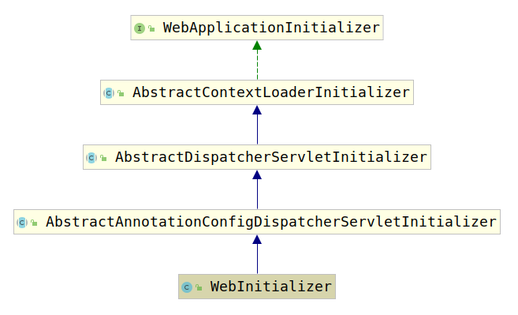

# 2.AbstractAnnotationConfigDispatcherServletInitializer

通过前面的分析，我们已经了解到Spring MVC使用`AbstractAnnotationConfigDispatcherServletInitializer`初始化Spring的容器。我们知道`AbstractAnnotationConfigDispatcherServletInitializer`是使用Spring MVC时必须要实现的类，那么该类到底做了什么事情，这一点将在本节揭晓。

考察一个类首先要查看其类继承结构，笔者继承`AbstractAnnotationConfigDispatcherServletInitializer`的实现了`WebInitializer`，这里我们考察该类的类继承结构图：



我们已经知道`WebApplicationInitializer`接口是Spring用于通过整合ServletContext初始化Spring 容器的接口，那么到底初始化了容器的什么东西呢？查看`WebApplicationInitializer`的首个子类`AbstractContextLoaderInitializer`的`onStartup(ServletContext servletContext)`方法，可以看到，该方法用于注册一个`ContextLoaderListener`到ServletContext上：

```java
public void onStartup(ServletContext servletContext) throws ServletException {
    registerContextLoaderListener(servletContext);
}
```

具体的注册方法也很简单：

```java
protected void registerContextLoaderListener(ServletContext servletContext) {
    WebApplicationContext rootAppContext = createRootApplicationContext();
    if (rootAppContext != null) {
        ContextLoaderListener listener = new ContextLoaderListener(rootAppContext);
        // 注意这里有放入初始化器，用于用户自定义的初始化逻辑
        listener.setContextInitializers(getRootApplicationContextInitializers());
        servletContext.addListener(listener);
    }
    else {
        logger.debug("No ContextLoaderListener registered, as " +
        "createRootApplicationContext() did not return an application context");
    }
}
```

该方法通过`createRootApplicationContext()`创建了一个`WebApplicationContext`，这个Context就是Spring的AbstractApplicationContext的子类，查看`createRootApplicationContext()`方法，可以看到，它是一个模板方法：

```java
protected WebApplicationContext createRootApplicationContext() {
    Class<?>[] configClasses = getRootConfigClasses();
    if (!ObjectUtils.isEmpty(configClasses)) {
        AnnotationConfigWebApplicationContext context = new AnnotationConfigWebApplicationContext();  
        context.register(configClasses);
        return context;
    }
    else {
        return null;
    }
}
```

查看该方法第一行：

```java
Class<?>[] configClasses = getRootConfigClasses();
```

是不是非常眼熟，这不就是我们在实现`AbstractAnnotationConfigDispatcherServletInitializer`时，必须要实现的三个方法之一么？没错，其实我们实现的`getRootConfigClasses()`方法为我们创建了一个`AnnotationConfigWebApplicationContext`，使用的配置类就是`getRootConfigClasses()`方法中配置的类。

我们现在回到`AbstractContextLoaderInitializer`的`registerContextLoaderListener`方法，注意，这里不仅仅创建了一个`WebApplicationContext`，关键是它还创建了一个`ContextLoaderListener`为其设置了`ContextInitializer`（顾名思义，这是`WebApplicationContext`的初始化器，用户可以使用它自定义初始化逻辑），并将`ContextLoaderListener`注册到了`ServletContext`中。尽管这个`ContextLoaderListener`很重要，但是这里我们先略过它，本节我们首先讨论覆盖`AbstractAnnotationConfigDispatcherServletInitializer`的三个方法到底是怎么使用的，我们将在下一节分析`ContextLoaderListener`。不过我们可以知道，`AbstractContextLoaderInitializer`的`onStartup(ServletContext)`方法为`ServletContext`创建了一个`AnnotationConfigWebApplicationContext`作为根容器。

查看完`AbstractContextLoaderInitializer`的`onStartup(ServletContext servletContext)`方法，让我们继续查看其子类`AbstractDispatcherServletInitializer`的该方法：

```java
public void onStartup(ServletContext servletContext) throws ServletException {
    super.onStartup(servletContext);
    registerDispatcherServlet(servletContext);
}
```

可以看到，该方法在调用父类的`onStartup(ServletContext servletContext)`方法的基础上还进行了DispatcherServlet的注册（`registerDispatcherServlet(ServletContext servletContext)`），使用过Spring MVC的读者应该都知道`DispatcherServlet`是Spring MVC框架中的核心类。那让我们查看一下`registerDispatcherServlet(ServletContext servletContext)`方法：

```java
protected void registerDispatcherServlet(ServletContext servletContext) {
    String servletName = getServletName();
    Assert.hasLength(servletName, "getServletName() must not return null or empty");
    // 创建ServletAppContext 创建第二个ApplicationContext
    WebApplicationContext servletAppContext = createServletApplicationContext();
    Assert.notNull(servletAppContext, "createServletApplicationContext() must not return null");
    // 闯进DispatcherServlet
    FrameworkServlet dispatcherServlet = createDispatcherServlet(servletAppContext);
    Assert.notNull(dispatcherServlet, "createDispatcherServlet(WebApplicationContext) must not return null");
    dispatcherServlet.setContextInitializers(getServletApplicationContextInitializers());
    // 配置DispatcherServlet
    ServletRegistration.Dynamic registration = servletContext.addServlet(servletName, dispatcherServlet);
    if (registration == null) {
        throw new IllegalStateException("Failed to register servlet with name '" + servletName + "'. " +
            "Check if there is another servlet registered under the same name.");
    }

    registration.setLoadOnStartup(1);
    // 配置DispatcherServlet的监听URI
    registration.addMapping(getServletMappings());
    registration.setAsyncSupported(isAsyncSupported());

    // 配置过滤器
    Filter[] filters = getServletFilters();
    if (!ObjectUtils.isEmpty(filters)) {
        for (Filter filter : filters) {
            registerServletFilter(servletContext, filter);
        }
    }

    // 自定义配置
    customizeRegistration(registration);
}
```

这里我们主要查看两个方法，第一个是该方法的第三行，即如下代码：

```java
WebApplicationContext servletAppContext = createServletApplicationContext();
```

该方法在`AbstractDispatcherServletInitializer`的子类`AbstractAnnotationConfigDispatcherServletInitializer`的实现与之前我们看到的`createRootApplicationContext()`的实现很相似：

```java
protected WebApplicationContext createServletApplicationContext() {
    AnnotationConfigWebApplicationContext context = new AnnotationConfigWebApplicationContext();
    Class<?>[] configClasses = getServletConfigClasses();
    if (!ObjectUtils.isEmpty(configClasses)) {
        context.register(configClasses);
    }
    return context;
}
```

可以看到，该方法也是创建一个`AnnotationConfigWebApplicationContext`不过这次用的配置是`getServletConfigClasses()`中定义的配置类。

第二个方法是该方法中配置DispatcherServlet的第二行：

```java
registration.addMapping(getServletMappings());
```

该方法用于规定Servlet监听的URI，同样这也是使用我们覆盖的`getServletMappings()`方法。

## 小结

总结一下，经过上面的解析我们知道了`AbstractAnnotationConfigDispatcherServletInitializer`利用我们覆盖的三个方法做了如下三件事：

1. 创建了两个ApplicationContext，分别是`RootApplicationContext`以及`WebApplicationContext`，并将我们定义的配置类`register`到容器中，通过之前了解过的Spring IOC 源码我们知道，`register(Class[])`方法就是解析beanDefinition。注意这里只是注册了BeanDefinition，但是没有refresh。
2. 创建了一个DispatcherServlet，注意，不管叫什么名字都只是一个Servlet。并将之前创建的`WebApplicationContext`赋值给了这个DispatcherServlet，并不是ServletContext
3. 向ServletContext注册了一个监听器`ContextLoaderListener`，并将创建的`RootApplicationContext`放到监听器中。

那么这就引出了三个问题：

1. 为什么要创建两个ApplicationContext?
2. Spring的两个ApplicationContext和ServletContext以及DispatcherSevlet到底有什么关系？
3. ContextLoaderListener到底在ServletContext初始化和销毁之后做了什么？

这里我们可以解决第一个问题，第二个以及第三个问题会在之后的文章中讨论。

Spring MVC文档里就有写到，Spring MVC创建了两个ApplicationContext，分别用来存储两类Bean:

1. 与Spring MVC密切相关的Bean
2. 与Spring MVC关系不大的基本Bean

也因此会创建两个ApplicationContext。而且我们已经看到了保存与Spring MVC密切相关的Bean的ApplicationContext（以下简称为WebApplicationContext）存储在DispatcherServlet中，如果只创建一个`ApplicationContext`那么那些与Spring MVC关系不大的Bean也必须放到`WebApplicationContext`中（不可能放到Servlet外的，因为Servlet是必须要使用WebApplicationContext的），那么DispatcherServlet会显得异常臃肿。

了解了第一个问题的答案之后，让我们继续讨论Spring MVC源码，下一章节对`ContextLoaderListener`进行讨论。
