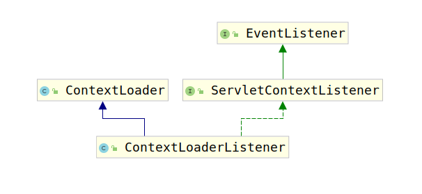

# 3. ContextLoaderListener

在学习`Servlet`相关知识的时候，我们应该了解过Servlet中可以对三个域添加Listener：

1. ServletContext
2. HttpSession
3. ServletRequest

而针对ServletContext添加的监听器可以监听ServletContext的初始化与销毁。那么让我们看一下`ContextLoaderListener`到底在`ServletContext`初始化和销毁时做了些什么。首先考虑`ContextLoaderListener`的类继承结构图：



可以看到，`ContextLoaderListener`的父类以及父接口分为两支：

1. ContextLoader：真正负责初始化ApplicationContext与销毁ApplicationContext
2. ServletContextListener：负责提供事件监听功能，即在ServletContext的初始化和销毁时调用特定方法

在之前讨论的`AbstractContextLoaderInitializer`的`registerContextLoaderListener(ServletContext servletContext)`方法中，是如下代码注册了`ContextLoaderListener`：

```java
protected void registerContextLoaderListener(ServletContext servletContext) {
    WebApplicationContext rootAppContext = createRootApplicationContext();
    if (rootAppContext != null) {
        ContextLoaderListener listener = new ContextLoaderListener(rootAppContext);
        listener.setContextInitializers(getRootApplicationContextInitializers());
        servletContext.addListener(listener);
    }
    else {
        logger.debug("No ContextLoaderListener registered, as " +
            "createRootApplicationContext() did not return an application context");
    }
}
```

可以看到，上述代码对ContextLoaderListener有两行配置：

```java
ContextLoaderListener listener = new ContextLoaderListener(rootAppContext);
listener.setContextInitializers(getRootApplicationContextInitializers());
```

对于这两个配置我们要留意。闲话到此为止，现在让我们着重讨论`ContextLoaderListener`在ServletContext初始化时以及销毁时做的事情。

## 3.1 初始化

之前我们说过，`AbstractAnnotationConfigDispatcherServletInitializer`只创建了两个`WebApplicationContext`，并为其注册了BeanDefinition，然而并没有进行刷新操作。到了这里我们其实就了解了为何不进行刷新操作，因为用户可能有自己的初始化操作，因此在执行完这些操作前，不能进行refresh。

在ServletContext初始化完成之后，会调用`ServletContextListener`的`contextInitialized(ServletContextEvent event)`方法，`ContextLoaderListener`对该方法的实现如下：

```java
public void contextInitialized(ServletContextEvent event) {
    initWebApplicationContext(event.getServletContext());
}
```

`contextInitialized(ServletContextEvent event)`调用了`initWebApplicationContext(ServletContext servletContext)`方法，通过方法名我们知道，`initWebApplicationContext(ServletContext servletContext)`用来初始化`WebApplicationContext`，那么这里我们考察一下，到底是如何初始化的`WebApplicationContext`：

```java
public WebApplicationContext initWebApplicationContext(ServletContext servletContext) {
    // 查看ServletContext的`WebApplicationContext.ROOT_WEB_APPLICATION_CONTEXT_ATTRIBUTE`属性是否为NULL
    // 如果不是，证明已经初始化过RootWebApplication了，那样就会报错
    if (servletContext.getAttribute(WebApplicationContext.ROOT_WEB_APPLICATION_CONTEXT_ATTRIBUTE) != null) {
        throw new IllegalStateException(
            "Cannot initialize context because there is already a root application context present - " +
            "check whether you have multiple ContextLoader* definitions in your web.xml!");
    }

    ...
    // 如果this.context属性为NULL
    // 证明没有显式指定要加载的ApplicationContext，那么就创建一个
    try {
        if (this.context == null) {
            this.context = createWebApplicationContext(servletContext);
        }
        // 如果要加载的`ApplicationContext`实现了`ConfigurableWebApplicationContext`
        // 那么可以通过子类覆盖`loadParentContext(ServletContext servletContext)`方法获取一个ParentApplicationContext
        //  这个 `ParentApplicationContext`用来做`this.context`的parent
        if (this.context instanceof ConfigurableWebApplicationContext) {
            ConfigurableWebApplicationContext cwac = (ConfigurableWebApplicationContext) this.context;
            if (!cwac.isActive()) {
                if (cwac.getParent() == null) {
                    ApplicationContext parent = loadParentContext(servletContext);
                    cwac.setParent(parent);
                }
                // 配置和刷新WebApplicationContext
                configureAndRefreshWebApplicationContext(cwac, servletContext);
            }
        }
        // 将刷新后的RootWebApplicationContext加入到servletContext中
        servletContext.setAttribute(WebApplicationContext.ROOT_WEB_APPLICATION_CONTEXT_ATTRIBUTE, this.context);
        ...
        return this.context;
    }
    catch (RuntimeException | Error ex) {
        logger.error("Context initialization failed", ex);
        servletContext.setAttribute(WebApplicationContext.ROOT_WEB_APPLICATION_CONTEXT_ATTRIBUTE, ex);
        throw ex;
    }
}
```

上述方法的主要功能就是为`RootWebApplicationContext`设置父容器，然后执行`configureAndRefreshWebApplicationContext(ConfigurableWebApplicationContext wac, ServletContext sc)`刷新容器，最后将刷新后的容器放入到`servletContext`中。

这里有两个问题：

1. 为什么要为RootWebApplicationContext设置父容器？
2. 为什么要将刷新后的容器保存到servletContext的`WebApplicationContext.ROOT_WEB_APPLICATION_CONTEXT_ATTRIBUTE`属性中？

首先考虑第一个问题，其实Spring的`ApplicationContext`实现了类似于JVM的双亲委派模型的功能，因此，这对`ApplicationContext`的扩展提供了很大的便利，因为子ApplicationContext能拿到父ApplicationContext
的所有Bean，因此尽管在这里this.context为null，Spring MVC创建了一个新的空的ApplicationContext，那么如果将你想使用的ApplicationContext作为其父ApplicationContext，那么，你一样可以获取到你想要的Bean。因此这样做方便了扩展。

至于第二个问题，我们会在下一节的讨论中揭晓答案。

由于配置容器与刷新容器的逻辑都是在`configureAndRefreshWebApplicationContext(ConfigurableWebApplicationContext wac, ServletContext sc)`中完成的，因此，让我们查看该方法源码：

```java
protected void configureAndRefreshWebApplicationContext(ConfigurableWebApplicationContext wac, ServletContext sc) {
    // 为RootWebApplicationContext设置ID
    if (ObjectUtils.identityToString(wac).equals(wac.getId())) {
        String idParam = sc.getInitParameter(CONTEXT_ID_PARAM);
        if (idParam != null) {
            wac.setId(idParam);
        }
        else {
            wac.setId(ConfigurableWebApplicationContext.APPLICATION_CONTEXT_ID_PREFIX +
                ObjectUtils.getDisplayString(sc.getContextPath()));
        }
    }
    // 为RootWebApplicationContext设置ServletContext
    wac.setServletContext(sc);
    // 为RootWebApplicationContext设置配置目录
    String configLocationParam = sc.getInitParameter(CONFIG_LOCATION_PARAM);
    if (configLocationParam != null) {
        wac.setConfigLocation(configLocationParam);
    }
    // 为RootWebApplicationContext初始化环境变量
    ConfigurableEnvironment env = wac.getEnvironment();
    if (env instanceof ConfigurableWebEnvironment) {
        ((ConfigurableWebEnvironment) env).initPropertySources(sc, null);
    }
    // 调用各个设置的ApplicationContextInitializer执行自定义初始化
    customizeContext(sc, wac);
    // 刷新容器
    wac.refresh();
}
```

`configureAndRefreshWebApplicationContext(ConfigurableWebApplicationContext wac, ServletContext sc)`方法最主要功能有如下四点：

1. 设置配置目录
2. 初始化环境变量
3. 调用ApplicationContextInitializer执行自定义初始化
4. 刷新容器

正因为上述四个功能，让我们对Spring MVC可以有更多的扩展，例如增加更多的环境变量，进行更细致的自定义初始化等等。不过最重要的还是刷新容器。

至此，RootApplicationContext已经被刷新了，就可以开始使用了。

## 3.2 销毁

销毁的逻辑要比初始化简单得多，仅仅是关闭根容器，移除servletContext属性罢了。代码如下：

```java
public void contextDestroyed(ServletContextEvent event) {
    closeWebApplicationContext(event.getServletContext());
    ContextCleanupListener.cleanupAttributes(event.getServletContext());
}
```

这里就不多赘述了，感兴趣的读者可以自己进行分析。
