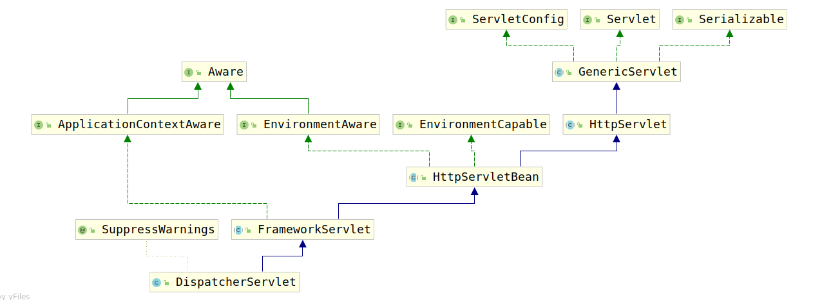

# 4. DispatcherServlet初始化

和`RootApplicationContext`不同，Spring MVC的WebApplicationContext是在Servlet生命周期中进行初始化和销毁的。也就是Servlet的init()方法用于初始化WebApplicationContext，那么这里开始考察`DispatcherServlet`。

如下是DispatcherServlet的类继承关系图：



`DispatcherServlet`的`init()`方法是由其父类`HttpServletBean`实现的，该实现比较特殊：

```java
public final void init() throws ServletException {
    // 读取web.xml文件配置
    PropertyValues pvs = new ServletConfigPropertyValues(getServletConfig(), this.requiredProperties);
    if (!pvs.isEmpty()) {
        try {
            // 将当前DispatcherServlet对象视作Bean
            BeanWrapper bw = PropertyAccessorFactory.forBeanPropertyAccess(this);
            ResourceLoader resourceLoader = new ServletContextResourceLoader(getServletContext());
            bw.registerCustomEditor(Resource.class, new ResourceEditor(resourceLoader, getEnvironment()));
            initBeanWrapper(bw);
            // 将web.xml中读取出的属性赋值给当前DispatcherServlet
            bw.setPropertyValues(pvs, true);
        }
        catch (BeansException ex) {
            if (logger.isErrorEnabled()) {
                logger.error("Failed to set bean properties on servlet '" + getServletName() + "'", ex);
            }
            throw ex;
        }
    }

    initServletBean();
}
```

该方法做了两件事：

1. 读取web.xml文件中的配置，将其给DispatcherServlet赋值，方便取出。
2. 调用initServletBean。

那么特殊的事情是什么呢？注意Spring MVC的容器中没有类型为`DispatcherServlet`的Bean，这里将`DispatcherServlet`作为Bean处理，当然也可能因为处理简单吧。注意查看如下代码：

```java
BeanWrapper bw = PropertyAccessorFactory.forBeanPropertyAccess(this);
```

这里传入的是this，因此改动都在当前对象上。当然这也就是一个小插曲罢了。最重要的还是`initServletBean()`方法。

该方法是由`FrameServlet`进行实现的，下面让我们查看`FrameServlet`的`initServletBean()`方法：

```java
protected final void initServletBean() throws ServletException {
    try {
        // 初始化WebApplicationContext
        this.webApplicationContext = initWebApplicationContext();
        // 初始化DispatcherServlet
        initFrameworkServlet();
    }
    catch (ServletException | RuntimeException ex) {
        logger.error("Context initialization failed", ex);
        throw ex;
    }
}
```

该方法完成了两个任务：

1. 初始化之前创建的WebApplicationContext
2. 初始化DispatcherServlet

`initFrameworkServlet()`是一个空方法，需要子类覆盖实现，然而基本的Spring MVC并没有实现，因此这里我们主要讨论`initWebApplicationContext()`方法。然而该方法又很长，笔者截取主要部分进行分析：

```java
protected WebApplicationContext initWebApplicationContext() {
    WebApplicationContext rootContext =
        WebApplicationContextUtils.getWebApplicationContext(getServletContext());
    WebApplicationContext wac = null;

    if (this.webApplicationContext != null) {
        wac = this.webApplicationContext;
        if (wac instanceof ConfigurableWebApplicationContext) {
            ConfigurableWebApplicationContext cwac = (ConfigurableWebApplicationContext) wac;
            if (!cwac.isActive()) {
                if (cwac.getParent() == null) {
                    cwac.setParent(rootContext);
                }
                configureAndRefreshWebApplicationContext(cwac);
            }
        }
    }

    return wac;
}
```

该方法的主要代码如上，其实，该方法的代码远不止这些，只是这里截取出比较重要的分析。可以看到代码只执行了一道逻辑：获取ServletContext中配置的RootApplicationContext rootContext，然后将创建的WebApplicationContext的父容器设置为rootContext，最后配置并刷新`WebApplicationContext`。

最后考察`configureAndRefreshWebApplicationContext(ConfigurableWebApplicationContext wac)`，该方法用于配置和刷新`WebApplicationContext`，源码如下：

```java
protected void configureAndRefreshWebApplicationContext(ConfigurableWebApplicationContext wac) {
    if (ObjectUtils.identityToString(wac).equals(wac.getId())) {
        if (this.contextId != null) {
            wac.setId(this.contextId);
        }
        else {
            wac.setId(ConfigurableWebApplicationContext.APPLICATION_CONTEXT_ID_PREFIX +
                ObjectUtils.getDisplayString(getServletContext().getContextPath()) + '/' + getServletName());
        }
    }

    wac.setServletContext(getServletContext());
    wac.setServletConfig(getServletConfig());
    wac.setNamespace(getNamespace());
    wac.addApplicationListener(new SourceFilteringListener(wac, new ContextRefreshListener()));

    ConfigurableEnvironment env = wac.getEnvironment();
    if (env instanceof ConfigurableWebEnvironment) {
        ((ConfigurableWebEnvironment) env).initPropertySources(getServletContext(), getServletConfig());
    }

    postProcessWebApplicationContext(wac);
    applyInitializers(wac);
    wac.refresh();
}
```
