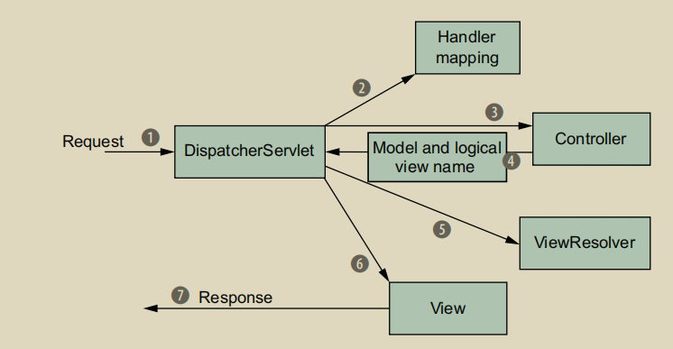

# doDispatch

Spring MVC的核心是`DispatcherServlet`，因此重点肯定在`Dispatch`上，真正的`Dispatch`方法就在这里执行，即`DispatcherServlet`的`doDispatch(..)`方法。

下面查看该方法源码，由于方法源码过长，因此，我会在注释中对代码进行解释：

```java
protected void doDispatch(HttpServletRequest request, HttpServletResponse response) throws Exception {
    // 保存传入的请求，用于之后对比使用
    HttpServletRequest processedRequest = request;
    // Spring MVC 支持拦截器功能，它将拦截器与真实的处理业务逻辑放在一条
    // 执行链中，然后按照这条执行链进行处理，该属性用来存储执行链
    HandlerExecutionChain mappedHandler = null;
    // 有些请求是上传文件的请求，这类请求的处理逻辑与正常请求不同
    // Spring MVC 将其包装成MultipartHttpServletRequest
    // 该属性用于判断，传入的请求是否是这类请求
    boolean multipartRequestParsed = false;

    WebAsyncManager asyncManager = WebAsyncUtils.getAsyncManager(request);

    try {
        // Spring MVC 采用的就是MVC模式，最重要的就是Model View Controller，为了将Model映射到View上，他将数据保存在ModelAndView中
        ModelAndView mv = null;
        // 该对象用于保存doDispatch方法执行过程中出现的异常
        Exception dispatchException = null;
        try {
            // 使用MultipartResolver判断请求是否是上传文件类型的请求
            // 如果是，则将其包装为MultipartHttpServletRequest
            processedRequest = checkMultipart(request);
            // 判断该请求是否是上传文件类型的请求
            multipartRequestParsed = (processedRequest != request);

            // 根据当前请求信息获取Handler执行链
            mappedHandler = getHandler(processedRequest);
            if (mappedHandler == null) {
                // 如果没有获取相应的执行器链则进行处理
                noHandlerFound(processedRequest, response);
                return;
            }

            // 根据Handler获取HandlerAdapter进行处理
            HandlerAdapter ha = getHandlerAdapter(mappedHandler.getHandler());

            // 如果handler支持last-modified缓存，那么进行处理
            String method = request.getMethod();
            boolean isGet = "GET".equals(method);
            if (isGet || "HEAD".equals(method)) {
                long lastModified = ha.getLastModified(request, mappedHandler.getHandler());
                if (new ServletWebRequest(request, response).checkNotModified(lastModified) && isGet) {
                    return;
                }
            }
            // 执行Interceptor的所有preHandle方法
            // 如果有一个返回false，那么终止处理请求
            if (!mappedHandler.applyPreHandle(processedRequest, response)) {
                return;
            }

            // 执行Controller中的业务逻辑
            mv = ha.handle(processedRequest, response, mappedHandler.getHandler());

            if (asyncManager.isConcurrentHandlingStarted()) {
                return;
            }
            // 根据配置的ViewNameTranslator，根据ModelAndView获取View名称
            applyDefaultViewName(processedRequest, mv);
            // 执行Interceptor的所有postHandle方法
            mappedHandler.applyPostHandle(processedRequest, response, mv);
        }
        catch (Exception ex) {
            dispatchException = ex;
        }
        catch (Throwable err) {
            // As of 4.3, we're processing Errors thrown from handler methods as well,
            // making them available for @ExceptionHandler methods and other scenarios.
            dispatchException = new NestedServletException("Handler dispatch failed", err);
        }
        // 使用将ModelAndView转化为View
        processDispatchResult(processedRequest, response, mappedHandler, mv, dispatchException);
    }
    catch (Exception ex) {
        // 处理Interceptor的afterCompletion方法
        triggerAfterCompletion(processedRequest, response, mappedHandler, ex);
    }
    catch (Throwable err) {
        // 处理Interceptor的afterCompletion方法
        triggerAfterCompletion(processedRequest, response, mappedHandler,
            new NestedServletException("Handler processing failed", err));
    }
    finally {
        if (asyncManager.isConcurrentHandlingStarted()) {
            // Instead of postHandle and afterCompletion
            if (mappedHandler != null) {
                mappedHandler.applyAfterConcurrentHandlingStarted(processedRequest, response);
            }
        }
        else {
            // 如果处理的请求是上传文件类型的请求
            // 则在处理之后清除数据
            if (multipartRequestParsed) {
                cleanupMultipart(processedRequest);
            }
        }
    }
}
```

上面的代码描述了`Dispatch`的大概过程。接下来我们会对该方法中重要步骤进行详细分析，这里给出需要分析的步骤列表：

1. checkMultipart(...)：检测请求是否是上传文件的请求
2. getHandler(HttpServletRequest):根据request数据寻找HandlerExectionChain
3. getHandlerAdapter(Object)：根据HandlerExectionChain获取对应的HandlerAdaptor.
4. mappedHandler.applyPreHandle(processedRequest, response)：执行Interceptor的preHandle方法
5. ha.handle(...)：HandlerAdaptor使用HandlerExectionChain处理业务请求
6. applyDefaultViewName(...)：根据请求以及结果，返回视图名称
7. mappedHandler.applyPostHandle(processedRequest, response, mv)： 执行Interceptor的postHandle方法
8. processDispatchResult(...)：根据ModelAndView以及异常返回结果
9. triggerAfterCompletion(...)：调用Interceptor的afterCompletion方法。

通过查看`doDispatch`方法可以看到，调用逻辑确实符合该图：



后面让我们对`doDispatch(..)`方法中的细节进行分析。
