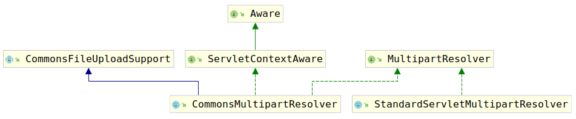

# 处理文件请求

在使用Spring MVC开发时，我们经常会遇到上传文件到服务器上的需求。为了完成这个需求，我们一般为Spring MVC配置一个MultipartResolver类型的Bean，然后为其配置一下，我们就可以在Controller中获取到一个类型为Multipart类型的对象了。这个`MultipartResolver类型的Bean`到底是在哪里被调用的呢？怎么将文件变成的`Multipart`类型的对象的呢？

让我们考虑`DispatcherServlet`中的`doDispatch(..)`中调用的`checkMultipart(...)`方法。源码如下：

```java
protected HttpServletRequest checkMultipart(HttpServletRequest request) throws MultipartException {
    if (this.multipartResolver != null && this.multipartResolver.isMultipart(request)) {
        if (WebUtils.getNativeRequest(request, MultipartHttpServletRequest.class) != null) {
            if (request.getDispatcherType().equals(DispatcherType.REQUEST)) {
                logger.trace("Request already resolved to MultipartHttpServletRequest, e.g. by MultipartFilter");
            }
        }
        else if (hasMultipartException(request)) {
            logger.debug("Multipart resolution previously failed for current request - " +
                "skipping re-resolution for undisturbed error rendering");
        }
        else {
            try {
                return this.multipartResolver.resolveMultipart(request);
            }
            catch (MultipartException ex) {
                if (request.getAttribute(WebUtils.ERROR_EXCEPTION_ATTRIBUTE) != null) {
                    logger.debug("Multipart resolution failed for error dispatch", ex);
                    // Keep processing error dispatch with regular request handle below
                }
                else {
                    throw ex;
                }
            }
        }
    }
    // If not returned before: return original request.
    return request;
}
```

代码很长，但是其实只做了两件事：

1. 检查request是否是上传文件的请求

    ```java
    if (this.multipartResolver != null && this.multipartResolver.isMultipart(request))
    ```

2. 解析请求

    ```java
    return this.multipartResolver.resolveMultipart(request);
    ```

考察`MultipartResolver`接口，默认情况下，该接口的实现有两种，分别是：

1. CommonsMultipartResolver
2. StandardServletMultipartResolver

类图如下：



这里我们以`StandardServletMultipartResolver`为例，解析该类实现的如下三个方法：

1. boolean isMultipart(HttpServletRequest request)：判断request是否是上传文件的request
2. MultipartHttpServletRequest resolveMultipart(HttpServletRequest request) throws MultipartException：解析request，提取其中的文件。
3. void cleanupMultipart(MultipartHttpServletRequest request)：清除文件

首先考察方法1：`isMultipart(...)`:

```java
public boolean isMultipart(HttpServletRequest request) {
    return StringUtils.startsWithIgnoreCase(request.getContentType(), "multipart/");
}
```

可以看到，判断一个请求是不是上传文件很简单，就是通过request的contentType是否是`multipart/`打头。

如果判定了一个请求是上传文件的请求就要通过方法2对其进行解析，现在考察方法2查看解析过程：

```java
public MultipartHttpServletRequest resolveMultipart(HttpServletRequest request) throws MultipartException {
    return new StandardMultipartHttpServletRequest(request, this.resolveLazily);
}
```

可以看到解析过程就是简单的构建了一个`StandardMultipartHttpServletRequest`，但是事实上，对request的解析就在`StandardMultipartHttpServletRequest`的构造器中：

```java
public StandardMultipartHttpServletRequest(HttpServletRequest request, boolean lazyParsing)
    throws MultipartException {

    super(request);
    if (!lazyParsing) {
        parseRequest(request);
    }
}
```

让我们查看`parseRequest(HttpServletRequest request)`方法的具体实现：

```java
private void parseRequest(HttpServletRequest request) {
    try {
        // 获取请求中所有的文件数据
        Collection<Part> parts = request.getParts();
        // 根据文件数据的个数初始化multipartParameterNames 列表的长度
        this.multipartParameterNames = new LinkedHashSet<>(parts.size());
        // 创建参数名、文件哈希表
        MultiValueMap<String, MultipartFile> files = new LinkedMultiValueMap<>(parts.size());
        // 解析数据，并保存到上述两个容器中
        for (Part part : parts) {
            String headerValue = part.getHeader(HttpHeaders.CONTENT_DISPOSITION);
            ContentDisposition disposition = ContentDisposition.parse(headerValue);
            String filename = disposition.getFilename();
            if (filename != null) {
                if (filename.startsWith("=?") && filename.endsWith("?=")) {
                    filename = MimeDelegate.decode(filename);
                }
                files.add(part.getName(), new StandardMultipartFile(part, filename));
            }
            else {
                this.multipartParameterNames.add(part.getName());
            }
        }
        // 将files放入到this.multipartFiles属性中
        setMultipartFiles(files);
    }
    catch (Throwable ex) {
        handleParseFailure(ex);
    }
}
```

可以看到，其实解析过程就是对一般的request进行封装，封装成`StandardMultipartHttpServletRequest`类型的对象，将request中的文件数据提取出来，放到`this.multipartFiles`属性中。

`this.multipartFiles`中的数据可以通过`getFile(String)`接口获取，而文件名可以通过`getFileNames()`接口获取。

最后在业务处理完这些文件数据后，要将其清除，否则会占用内存资源，因此就要调用方法3：`cleanupMultipart(MultipartHttpServletRequest request)`，该方法就简单的多，仅仅是对request中的每个文件调用delete()方法：

```java
public void cleanupMultipart(MultipartHttpServletRequest request) {
    if (!(request instanceof AbstractMultipartHttpServletRequest) ||
        ((AbstractMultipartHttpServletRequest) request).isResolved()) {
        try {
            for (Part part : request.getParts()) {
                if (request.getFile(part.getName()) != null) {
                    part.delete();
                }
            }
        }
        catch (Throwable ex) {
            LogFactory.getLog(getClass()).warn("Failed to perform cleanup of multipart items", ex);
        }
    }
}
```

该方法相对简单，这里不再赘述。
