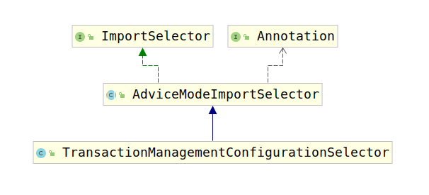

# TransactionManagementConfigurationSelector

根据上一节内容知道，该类用于创建Spring-tx中所用到的基本的Bean，首先考察该类的类继承结构图：



该类实现了ImportSelector接口，因此可知该类必须实现如下方法：

```java
String[] selectImports(AnnotationMetadata importingClassMetadata);
```

该方法返回了一个String数组，数组中的字符串表示要创建的bean的全类名，Spring会创建一个该类型的bean。

考察`TransactionManagementConfigurationSelector`可以看到该类并没有实现该方法，`TransactionManagementConfigurationSelector`类继承了`AdviceModeImportSelector`，而`AdviceModeImportSelector`实现了`ImportSelector`接口，考察AdviceModeImportSelector源码：

```java
@Override
public final String[] selectImports(AnnotationMetadata importingClassMetadata) {
    //获取EnableTransactionManagement注解中的属性
    Class<?> annType = GenericTypeResolver.resolveTypeArgument(getClass(), AdviceModeImportSelector.class);
    Assert.state(annType != null, "Unresolvable type argument for AdviceModeImportSelector");

    AnnotationAttributes attributes = AnnotationConfigUtils.attributesFor(importingClassMetadata, annType);
    if (attributes == null) {
        throw new IllegalArgumentException(String.format(
            "@%s is not present on importing class '%s' as expected",
            annType.getSimpleName(), importingClassMetadata.getClassName()));
    }

    AdviceMode adviceMode = attributes.getEnum(this.getAdviceModeAttributeName());
    //调用子类的selectImports(AdviceMode adviceMode)方法进行选择创建哪些bean
    String[] imports = selectImports(adviceMode);
    if (imports == null) {
        throw new IllegalArgumentException(String.format("Unknown AdviceMode: '%s'", adviceMode));
    }
    return imports;
}
```

所以真正创建了哪些类的bean仍是由子类`TransactionManagementConfigurationSelector`的`selectImports(AdviceMode adviceMode)`方法决定，源码如下：

```java
public class TransactionManagementConfigurationSelector extendsAdviceModeImportSelector<EnableTransactionManagement> {
    /**
    * {@inheritDoc}
    * @return {@link ProxyTransactionManagementConfiguration} or
    * {@code AspectJTransactionManagementConfiguration} for {@codePROXY} and
    * {@code ASPECTJ} values of {@linkEnableTransactionManagement#mode()}, respectively
    */
    @Override
    protected String[] selectImports(AdviceMode adviceMode) {
        switch (adviceMode) {
            //根据EnableTransactionManagement注解中的mode属性注册bean
            //注意默认情况下是PROXY
            case PROXY:
                return new String[]{AutoProxyRegistrar.class.getName(),ProxyTransactionManagementConfiguration.classgetName()};
            case ASPECTJ:
                return new String[]{TransactionManagementConfigUtilsTRANSACTION_ASPECT_CONFIGURATION_CLASS_NAME};
            default:
                return null;
        }
    }
}
```

由于默认情况下是PROXY，这里我们主要分析该情况。现在知道默认情况下创建`AutoProxyRegistrar`和`ProxyTransactionManagementConfiguration`类型的bean。
