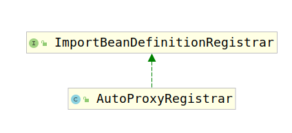

# AutoProxyRegistrar

通过上一节我们看到需要注册AutoProxyRegistrar类型的bean，实际上其实是使用`AutoProxyRegistrar`的逻辑进行bean注册。考察该类的类继承结构：



由于该类实现了`ImportBeanDefinitionRegistrar`接口，因此是根据如下方法进行bean定义创建：

```java
default void registerBeanDefinitions(AnnotationMetadata importingClassMetadata, BeanDefinitionRegistry registry) {
}
```

考察该方法具体实现如下：

```java
@Override
public void registerBeanDefinitions(AnnotationMetadata importingClassMetadata, BeanDefinitionRegistry registry) {
    boolean candidateFound = false;
    //获取@EnableTransactionManagement注解的属性
    Set<String> annoTypes = importingClassMetadata.getAnnotationTypes();
    for (String annoType : annoTypes) {
        AnnotationAttributes candidate = AnnotationConfigUtils.attributesFor(importingClassMetadata, annoType);
        if (candidate == null) {
            continue;
        }
        Object mode = candidate.get("mode");
        Object proxyTargetClass = candidate.get("proxyTargetClass");
        if (mode != null && proxyTargetClass != null && AdviceMode.class == mode.getClass() &&
                Boolean.class == proxyTargetClass.getClass()) {
            candidateFound = true;
            //根据注解属性创建bean
            if (mode == AdviceMode.PROXY) {
                //如果是PROXY模式，调用该方法注册bean
                AopConfigUtils.registerAutoProxyCreatorIfNecessary(registry);
                //如果proxyTargetClass是true的话，继续调用方法创建bean
                if ((Boolean) proxyTargetClass) {
                    AopConfigUtils.forceAutoProxyCreatorToUseClassProxying(registry);
                    return;
                }
            }
        }
    }
    if (!candidateFound) {
        String name = getClass().getSimpleName();
        logger.warn(String.format("%s was imported but no annotations were found " +
                        "having both 'mode' and 'proxyTargetClass' attributes of type " +
                        "AdviceMode and boolean respectively. This means that auto proxy " +
                        "creator registration and configuration may not have occurred as " +
                        "intended, and components may not be proxied as expected. Check to " +
                        "ensure that %s has been @Import'ed on the same class where these " +
                        "annotations are declared; otherwise remove the import of %s " +
                        "altogether.", name, name, name));
    }
}
```

因此可知具体的BeadDefinition创建逻辑在`AopConfigUtils.registerAutoProxyCreatorIfNecessary(registry);`中。

继续考察AopConfigUtils的`registerAutoProxyCreatorIfNecessary(BeanDefinitionRegistry registry)`方法：

```java
public static BeanDefinition registerAutoProxyCreatorIfNecessary(BeanDefinitionRegistry registry) {
    return registerAutoProxyCreatorIfNecessary(registry, null);
}

public static BeanDefinition registerAutoProxyCreatorIfNecessary(
    BeanDefinitionRegistry registry, @Nullable Object source) {

    return registerOrEscalateApcAsRequired(InfrastructureAdvisorAutoProxyCreator.class, registry, source);
}

private static BeanDefinition registerOrEscalateApcAsRequired(
    Class<?> cls, BeanDefinitionRegistry registry, @Nullable Object source) {

    Assert.notNull(registry, "BeanDefinitionRegistry must not be null");
    // 查询是否含有名为`org.springframework.aop.config.internalAutoProxyCreator`的beanDefinition
    if (registry.containsBeanDefinition(AUTO_PROXY_CREATOR_BEAN_NAME)) {
        // 获取该bean的beanDefinition
        BeanDefinition apcDefinition = registry.getBeanDefinition(AUTO_PROXY_CREATOR_BEAN_NAME);
        // 如果该bean的bean定义优先级高于原本的，那么实例化优先级高的。
        if (!cls.getName().equals(apcDefinition.getBeanClassName())) {
            int currentPriority = findPriorityForClass(apcDefinition.getBeanClassName());
            int requiredPriority = findPriorityForClass(cls);
            if (currentPriority < requiredPriority) {
                apcDefinition.setBeanClassName(cls.getName());
            }
        }
        return null;
    }

    RootBeanDefinition beanDefinition = new RootBeanDefinition(cls);
    beanDefinition.setSource(source);
    beanDefinition.getPropertyValues().add("order", Ordered.HIGHEST_PRECEDENCE);
    beanDefinition.setRole(BeanDefinition.ROLE_INFRASTRUCTURE);
    registry.registerBeanDefinition(AUTO_PROXY_CREATOR_BEAN_NAME, beanDefinition);
    return beanDefinition;
}
```

实际debug可以发现实例化的BeanDefinition是`org.springframework.aop.framework.autoproxy.InfrastructureAdvisorAutoProxyCreator`类型的bean。
