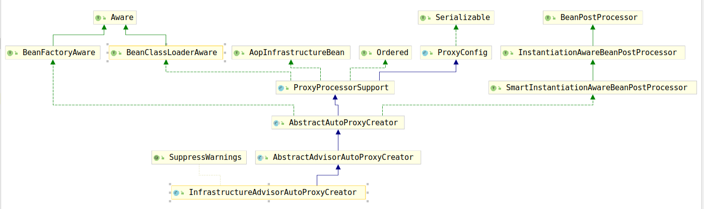

# InfrastructureAdvisorAutoProxyCreator

通过方法名就知道，该类是一个自动代理创建器，考察该类的类继承结构图：



可以看到该类继承自`AbstractAutoProxyCreator`，该类是AOP代理创建的主要类，再次考察该类的`postProcessAfterInitialization`方法：

```java
public Object postProcessAfterInitialization(@Nullable Object bean, String beanName) {
    if (bean != null) {
        Object cacheKey = getCacheKey(bean.getClass(), beanName);
        if (this.earlyProxyReferences.remove(cacheKey) != bean) {
            return wrapIfNecessary(bean, beanName, cacheKey);
        }
    }
    return bean;
}
```

考察其`wrapIfNecessary()`方法：

```java
...
// 该方法用于找出所有可用的Advice，并且该方法交给子类实现
Object[] specificInterceptors = getAdvicesAndAdvisorsForBean(bean.getClass(), beanName, null);
...
```

考察`AbstractAdvisorAutoProxyCreator`类的`getAdvicesAndAdvisorsForBean(Class<?> beanClass, String beanName, @Nullable TargetSource targetSource)`方法：

```java
protected Object[] getAdvicesAndAdvisorsForBean(
    Class<?> beanClass, String beanName, @Nullable TargetSource targetSource) {
    // 查找候选的advisor并返回
    List<Advisor> advisors = findEligibleAdvisors(beanClass, beanName);
    if (advisors.isEmpty()) {
        return DO_NOT_PROXY;
    }
    return advisors.toArray();
}
```

继续查看`findEligibleAdvisors(Class<?> beanClass, String beanName)`方法：

```java
protected List<Advisor> findEligibleAdvisors(Class<?> beanClass, String beanName) {
    // 查询所有候选的Advisor
    List<Advisor> candidateAdvisors = findCandidateAdvisors();
    // 查找可用的Advisor
    List<Advisor> eligibleAdvisors = findAdvisorsThatCanApply(candidateAdvisors, beanClass, beanName);
    // 进行用户自定义的扩展操作
    extendAdvisors(eligibleAdvisors);
    if (!eligibleAdvisors.isEmpty()) {
        // 对Advisor进行排序
        eligibleAdvisors = sortAdvisors(eligibleAdvisors);
    }
    return eligibleAdvisors;
}
```

考察`findCandidateAdvisors()`方法，该方法负责查询所有候选的Advisor:

```java
protected List<Advisor> findCandidateAdvisors() {
    Assert.state(this.advisorRetrievalHelper != null, "No BeanFactoryAdvisorRetrievalHelper available");
    return this.advisorRetrievalHelper.findAdvisorBeans();
}
```

根据上述代码可以看到，查询候选的Advisor的逻辑交给了`this.advisorRetrievalHelper`属性，那该属性是何时初始化的呢？考察该类的
`initBeanFactory(ConfigurableListableBeanFactory beanFactory)`方法：

```java
protected void initBeanFactory(ConfigurableListableBeanFactory beanFactory) {
    this.advisorRetrievalHelper = new BeanFactoryAdvisorRetrievalHelperAdapter(beanFactory);
}
```

可以看到该属性在上述方法中初始化，构造参数仅仅需要beanFactory。那么该方法在何时调用呢？继续考察该类的`setBeanFactory(BeanFactory beanFactory)`方法，代码如下：

```java
public void setBeanFactory(BeanFactory beanFactory) {
    super.setBeanFactory(beanFactory);
    if (!(beanFactory instanceof ConfigurableListableBeanFactory)) {
        throw new IllegalArgumentException(
                "AdvisorAutoProxyCreator requires a ConfigurableListableBeanFactory: " + beanFactory);
    }
    initBeanFactory((ConfigurableListableBeanFactory) beanFactory);
}
```

然而，通过查看`InfrastructureAdvisorAutoProxyCreator`发现，`InfrastructureAdvisorAutoProxyCreator`覆盖了`initBeanFactory(ConfigurableListableBeanFactory beanFactory)`方法：

```java
protected void initBeanFactory(ConfigurableListableBeanFactory beanFactory) {
    super.initBeanFactory(beanFactory);
    this.beanFactory = beanFactory;
}
```

不过这对`this.advisorRetrievalHelper`属性的初始化没有影响，只是给了beanFactory一次修改的机会。

接下来考察`InfrastructureAdvisorAutoProxyCreator`的另一个方法`isEligibleAdvisorBean(String beanName)`:该方法在`findCandidateAdvisors()`中使用。至于细节我们将在代理创建章节进行讨论。
