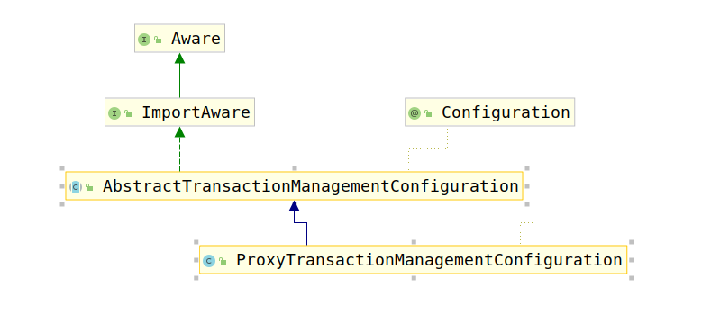

# ProxyTransactionManagementConfiguration

该类是Spring-tx基本Bean的配置类，与AutoProxyRegistrar的区别是：后者配置的是用于生成代理部分的bean（即AOP需要的基本bean），而此处创建的是业务需求的bean。

查看该类的类继承结构如下：



该类实现了`ImportAware`接口，该接口要求实现`setImportMetadata(AnnotationMetadata importMetadata)`方法，考察该类注释：

```java
/**
 * Interface to be implemented by any @{@link Configuration} class that wishes
 * to be injected with the {@link AnnotationMetadata} of the @{@code Configuration}
 * class that imported it.
 *
 * 该接口应该被Configuration注解标记的类实现，实现了该接口，则会将配置在@Configuration标记的类上的注解信息进行注入。
 *
 * Useful in conjunction with annotations that
 * use @{@link Import} as a meta-annotation.
 *
 * @author Chris Beams
 * @since 3.1
 */
```

ImportAware接口要求实现了如下方法：

```java
// 注入Configuration注解修饰的类的注解信息
void setImportMetadata(AnnotationMetadata importMetadata);
```

该接口让基于注解的配置成为可能。

接下来考虑`ProxyTransactionManagementConfiguration`的父类`AbstractTransactionManagementConfiguration`，该类主要完成了如下3件事情：

1. 保存`EnableTransactionManagement`注解的配置到`enableTx`属性
2. 通过`TransactionManagementConfigurer`进行动态配置
3. 创建`org.springframework.transaction.config.internalTransactionalEventListenerFactory`bean，用于事件创建。

考察源码如下：

```java
@Override
public void setImportMetadata(AnnotationMetadata importMetadata) {
    // 将EnableTransactionManagement中的属性进行存储
    // 存储到this.enableTx中
    // 1. 保存`EnableTransactionManagement`注解的配置到`enableTx`属性
    this.enableTx = AnnotationAttributes.fromMap(
            importMetadata.getAnnotationAttributes(EnableTransactionManagement.class.getName(), false));
    if (this.enableTx == null) {
        throw new IllegalArgumentException(
                "@EnableTransactionManagement is not present on importing class " + importMetadata.getClassName());
    }
}
```

```java
@Autowired(required = false)
void setConfigurers(Collection<TransactionManagementConfigurer> configurers) {
    if (CollectionUtils.isEmpty(configurers)) {
        return;
    }
    if (configurers.size() > 1) {
        throw new IllegalStateException("Only one TransactionManagementConfigurer may exist");
    }
    // 通过TransactionManagementConfigurer bean获取事务管理器配置
    TransactionManagementConfigurer configurer = configurers.iterator().next();
    // 将其设置到this.txManager中
    // 2. 通过`TransactionManagementConfigurer`进行动态配置
    this.txManager = configurer.annotationDrivenTransactionManager();
}
```

```java
@Bean(name = TransactionManagementConfigUtils.TRANSACTIONAL_EVENT_LISTENER_FACTORY_BEAN_NAME)
@Role(BeanDefinition.ROLE_INFRASTRUCTURE)
public static TransactionalEventListenerFactory transactionalEventListenerFactory() {
    // 3. 创建`org.springframework.transaction.config.internalTransactionalEventListenerFactory`bean，用于事件创建。
    return new TransactionalEventListenerFactory();
}
```

对于Spring-tx来说，事务管理器是一个特别的bean，因此将其提出到该类中，保证事务管理器bean的创建得到保证。

最后查看`ProxyTransactionManagementConfiguration`，该类只是简单的注册几个基础并且必要的bean，注册的bean有如下几个：

1. BeanFactoryTransactionAttributeSourceAdvisor
2. TransactionAttributeSource
3. TransactionInterceptor

首先考察`BeanFactoryTransactionAttributeSourceAdvisor`的创建：

```java
public BeanFactoryTransactionAttributeSourceAdvisor transactionAdvisor(
        TransactionAttributeSource transactionAttributeSource,
        TransactionInterceptor transactionInterceptor) {
    // 创建BeanFactoryTransactionAttributeSourceAdvisor
    BeanFactoryTransactionAttributeSourceAdvisor advisor = new BeanFactoryTransactionAttributeSourceAdvisor();
    // 设置TransactionAttributeSource
    advisor.setTransactionAttributeSource(transactionAttributeSource);
    // 设置Advice
    advisor.setAdvice(transactionInterceptor);
    // 设置调用的order
    if (this.enableTx != null) {
        advisor.setOrder(this.enableTx.<Integer>getNumber("order"));
    }
    return advisor;
}
```

根据之前AOP源码的分析，我们知道代理都是通过Advisor进行创建的，创建他们需要知道在何处进行动态代理包装（ponintcut指定），拦截到被代理的方法应该进行何种操作（Advice指定）。

而剩下的两个bean的创建即是创建了`BeanFactoryTransactionAttributeSourceAdvisor`bean创建需要的依赖bean:

```java
@Bean
@Role(BeanDefinition.ROLE_INFRASTRUCTURE)
public TransactionAttributeSource transactionAttributeSource() {
    return new AnnotationTransactionAttributeSource();
}

@Bean
@Role(BeanDefinition.ROLE_INFRASTRUCTURE)
public TransactionInterceptor transactionInterceptor(
        TransactionAttributeSource transactionAttributeSource) {
    TransactionInterceptor interceptor = new TransactionInterceptor();
    interceptor.setTransactionAttributeSource(transactionAttributeSource);
    if (this.txManager != null) {
        interceptor.setTransactionManager(this.txManager);
    }
    return interceptor;
}
```

至此，所有Spring-tx运行需要的基本bean全部创建完成。
