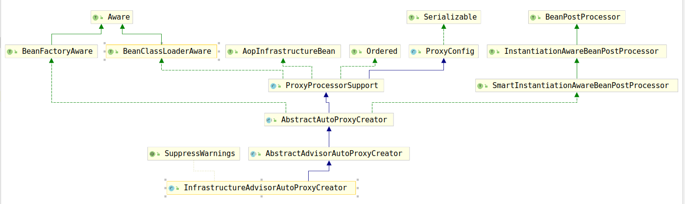

# InfrastructureAdvisorAutoProxyCreator初始化

通过第一章的讲解，我们了解到所有的Spring-tx的代理其实是使用`InfrastructureAdvisorAutoProxyCreator`进行创建的，所以首先考察该类的bean的创建逻辑。

由于该Bean实现了BeanPostProcessor，根据IOC源码分析其实可以知道，该bean是由`AbstractApplicationContext`的`registerBeanPostProcessors(ConfigurableListableBeanFactory beanFactory)`方法创建的，创建bean的流程与普通bean相似，这里我们只考察关键方法：

```java
@Override
protected void initBeanFactory(ConfigurableListableBeanFactory beanFactory) {
    super.initBeanFactory(beanFactory);
    this.beanFactory = beanFactory;
}
```

该方法是在何时调用的，因为该方法为`InfrastructureAdvisorAutoProxyCreator`提供了`beanFactory`，为后面执行最为关键的`isEligibleAdvisorBean(String beanName)`选择候选的bean提供了依据。

再次考察`InfrastructureAdvisorAutoProxyCreator`的类继承结构图：



我们发现该类实现了`BeanFactoryAware`接口，根据IOC的源码分析，我们知道，该接口的调用是在bean创建后的初始化过程中完成的，考察`AbstractAutowireCapableBeanFactory`的`initializeBean(final String beanName, final Object bean, @Nullable RootBeanDefinition mbd)`方法，我们可以看到`invokeAwareMethods(beanName, bean);`这行代码，该行代码用于执行所有的`Aware`方法，`BeanFactoryAware`接口要求将`BeanFactory`注入到bean中，注入逻辑在`setBeanFactory(BeanFactory beanFactory)`中。`InfrastructureAdvisorAutoProxyCreator`并没有实现该方法，但是其父类`AbstractAdvisorAutoProxyCreator`实现了该方法：

```java
public void setBeanFactory(BeanFactory beanFactory) {
    // 超类实现相对简单
    // this.beanFactory = beanFactory;
    // 这里为了方便直接将父类代码写在这里了
    super.setBeanFactory(beanFactory);
    if (!(beanFactory instanceof ConfigurableListableBeanFactory)) {
        throw new IllegalArgumentException(
            "AdvisorAutoProxyCreator requires a ConfigurableListableBeanFactory: " + beanFactory);
    }
    // 所以复杂的初始化逻辑交给了该方法
    initBeanFactory((ConfigurableListableBeanFactory) beanFactory);
}
```

继续考察`initBeanFactory(ConfigurableListableBeanFactory beanFactory)`方法：

```java
protected void initBeanFactory(ConfigurableListableBeanFactory beanFactory) {
    this.advisorRetrievalHelper = new BeanFactoryAdvisorRetrievalHelperAdapter(beanFactory);
}
```

通过该方法创建了`BeanFactoryAdvisorRetrievalHelperAdapter`并将其注入到`this.advisorRetrievalHelper`属性中。

现在我们终于可以考察一下`InfrastructureAdvisorAutoProxyCreator`的`initBeanFactory(ConfigurableListableBeanFactory beanFactory)`方法了：

```java
protected void initBeanFactory(ConfigurableListableBeanFactory beanFactory) {
    // 即上面介绍过的创建BeanFactoryAdvisorRetrievalHelperAdapter
    super.initBeanFactory(beanFactory);
    // 将beanFactory在InfrastructureAdvisorAutoProxyCreator中存储一份快照
    // 方便isEligibleAdvisorBean(String beanName)使用
    this.beanFactory = beanFactory;
}
```

至此，`InfrastructureAdvisorAutoProxyCreator`类bean的初始化重点已经介绍完毕。
