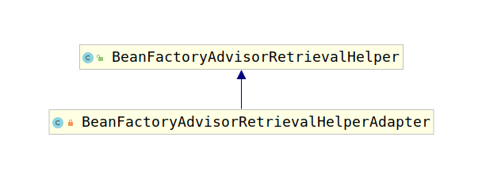

# BeanFactoryAdvisorRetrievalHelperAdapter

根据上一节，我们知道spring-tx创建代理所用的候选Advisor均交给`BeanFactoryAdvisorRetrievalHelperAdapter`进行查找，查找方法是该类的`findAdvisorBeans()`方法，接下来我们对该类进行考察，首先考察该类的类继承结构图：



该类是`AbstractAdvisorAutoProxyCreator`的内部类，因此可以调用`AbstractAdvisorAutoProxyCreator`的方法。考察该类代码：

```java
private class BeanFactoryAdvisorRetrievalHelperAdapter extends BeanFactoryAdvisorRetrievalHelper {

    public BeanFactoryAdvisorRetrievalHelperAdapter(ConfigurableListableBeanFactory beanFactory) {
        super(beanFactory);
    }

    @Override
    protected boolean isEligibleBean(String beanName) {
        return AbstractAdvisorAutoProxyCreator.this.isEligibleAdvisorBean(beanName);
    }
}
```

通过类名我们看到该类是一个适配器，但是是通过继承实现的。可以看到`BeanFactoryAdvisorRetrievalHelper`的`isEligibleBean(String beanName)`方法是交给`AbstractAdvisorAutoProxyCreator`实现的，所以确实是一个适配器。该适配器使用户可以自定义筛选规则。考察`BeanFactoryAdvisorRetrievalHelper`的`findAdvisorBeans()`方法：

```java
public List<Advisor> findAdvisorBeans() {
    // Determine list of advisor bean names, if not cached already.
    // 从缓存中获取AdvisorBean的名称
    String[] advisorNames = this.cachedAdvisorBeanNames;
    if (advisorNames == null) {
        // Do not initialize FactoryBeans here: We need to leave all regular beans
        // uninitialized to let the auto-proxy creator apply to them!
        // 从BeanFactory中获取所有类型为Advisor的Bean名称
        advisorNames = BeanFactoryUtils.beanNamesForTypeIncludingAncestors(
                this.beanFactory, Advisor.class, true, false);
        // 将Bean名称缓存下来
        this.cachedAdvisorBeanNames = advisorNames;
    }
    // 如果没有可用的bean名称，直接返回
    if (advisorNames.length == 0) {
        return new ArrayList<>();
    }

    List<Advisor> advisors = new ArrayList<>();
    for (String name : advisorNames) {
        // 使用isEligibleBean(String)对所有的Advisor类bean进行筛选
        if (isEligibleBean(name)) {
            // 如果这个bean正在创建则跳过
            if (this.beanFactory.isCurrentlyInCreation(name)) {
                if (logger.isTraceEnabled()) {
                    logger.trace("Skipping currently created advisor '" + name + "'");
                }
            }
            else {
                // 否则将这个bean加入到返回列表中
                try {
                    advisors.add(this.beanFactory.getBean(name, Advisor.class));
                }
                catch (BeanCreationException ex) {
                    Throwable rootCause = ex.getMostSpecificCause();
                    if (rootCause instanceof BeanCurrentlyInCreationException) {
                        BeanCreationException bce = (BeanCreationException) rootCause;
                        String bceBeanName = bce.getBeanName();
                        if (bceBeanName != null && this.beanFactory.isCurrentlyInCreation(bceBeanName)) {
                            if (logger.isTraceEnabled()) {
                                logger.trace("Skipping advisor '" + name +
                                        "' with dependency on currently created bean: " + ex.getMessage());
                            }
                            // Ignore: indicates a reference back to the bean we're trying to advise.
                            // We want to find advisors other than the currently created bean itself.
                            continue;
                        }
                    }
                    throw ex;
                }
            }
        }
    }
    return advisors;
}
```

考察`BeanFactoryAdvisorRetrievalHelper`类，发现其`isEligibleBean(String beanName)`方法默认返回true，具体判断逻辑是交给子类实现的，所以`findAdvisorBeans()`又是个模板方法。

```java
protected boolean isEligibleBean(String beanName) {
    return true;
}
```

这时，考虑InfrastructureAdvisorAutoProxyCreator的`isEligibleAdvisorBean(String beanName)`方法：

```java
protected boolean isEligibleAdvisorBean(String beanName) {
    return (this.beanFactory != null && this.beanFactory.containsBeanDefinition(beanName) &&
            this.beanFactory.getBeanDefinition(beanName).getRole() == BeanDefinition.ROLE_INFRASTRUCTURE);
}
```

只要beanFactory包含这个bean，并且这个bean角色是ROLE_INFRASTRUCTURE就会被使用。这也就是为何第一章创建bean时，每个Bean上都有一个Role注解的原因。
