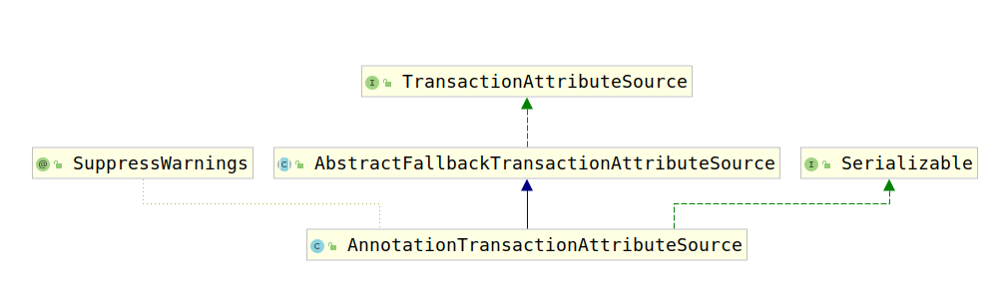

# TransactionAttributeSource

在spring-tx基础bean创建时，使用如下代码创建了一个TransactionAttribute类型的bean:

```java
@Bean
@Role(BeanDefinition.ROLE_INFRASTRUCTURE)
public TransactionAttributeSource transactionAttributeSource() {
    return new AnnotationTransactionAttributeSource();
}
```

可知该类名为`AnnotationTransactionAttributeSource`，考察其类继承结构图如下：



首先考虑`TransactionAttributeSource`接口，该接口是Spring-tx的事务配置元数据持有者，通过实现该接口的各个实现类获得元数据。该接口要求实现两个方法：

1. isCandidateClass(Class<?> targetClass)
2. getTransactionAttribute(Method method, @Nullable Class<?> targetClass)

首先考察第一个方法`isCandidateClass(Class<?> targetClass)`，源码如下：

```java
/**
 * Determine whether the given class is a candidate for transaction attributes
 * in the metadata format of this {@code TransactionAttributeSource}.
 * 决定给定的类在TransactionAttributeSource中是否进行了配置。
 * <p>If this method returns {@code false}, the methods on the given class
 * will not get traversed for {@link #getTransactionAttribute} introspection.
 * 如果此方法返回false，则不会遍历给定类上的方法以进行
 * getTransactionAttribute（java.lang.reflect.Method，java.lang.Class <？>）查询。
 * Returning {@code false} is therefore an optimization for non-affected
 * classes, whereas {@code true} simply means that the class needs to get
 * fully introspected for each method on the given class individually.
 * 因此，返回false是对不受影响的类的优化，而返回true仅仅意味着该类需要对给定类上的每个方法分别进行全面查询。
 * @param targetClass the class to introspect
 * @return {@code false} if the class is known to have no transaction
 * attributes at class or method level; {@code true} otherwise. The default
 * implementation returns {@code true}, leading to regular introspection.
 * @since 5.2
 */
default boolean isCandidateClass(Class<?> targetClass) {
    return true;
}
```

```java
/**
 * Return the transaction attribute for the given method,
 * or {@code null} if the method is non-transactional.
 * 返回给定方法上的事务相关的配置属性，如果该方法不需要事务，那么返回null。
 * @param method the method to introspect
 * @param targetClass the target class (may be {@code null},
 * in which case the declaring class of the method must be used)
 * @return the matching transaction attribute, or {@code null} if none found
 */
@Nullable
TransactionAttribute getTransactionAttribute(Method method, @Nullable Class<?> targetClass);
```

考虑`TransactionAttributeSource`的抽象类实现`AbstractFallbackTransactionAttributeSource`，查看该类注释：

```java
/**
 * Abstract implementation of {@link TransactionAttributeSource} that caches
 * attributes for methods and implements a fallback policy: 1. specific target
 * method; 2. target class; 3. declaring method; 4. declaring class/interface.
 *
 *该类是TransactionAttributeSource接口的抽象实现，该实现缓存了如下方法的属性并且实现了回滚策略：
 * 1. 指定目标的方法 2. 指定类 3. 声明方法 4. 声明类
 *
 * <p>Defaults to using the target class's transaction attribute if none is
 * associated with the target method. Any transaction attribute associated with
 * the target method completely overrides a class transaction attribute.
 * 默认情况下，如果查询与事务属性不相关联的方法，那么会返回默认值。
 * If none found on the target class, the interface that the invoked method
 * has been called through (in case of a JDK proxy) will be checked.
 * 如果在目标类上未找到任何接口，则将检查已调用调用方法的接口（对于JDK代理而言）。
 * <p>This implementation caches attributes by method after they are first used.
 * 在第一次使用时会缓存方法的事务属性。
 * If it is ever desirable to allow dynamic changing of transaction attributes
 * (which is very unlikely), caching could be made configurable. Caching is
 * desirable because of the cost of evaluating rollback rules.
 * 如果曾经希望允许动态更改事务属性（这是不太可能的），则可以使缓存可配置。
 * 缓存是可取的，因为需要评估回滚规则。
 *
 * @author Rod Johnson
 * @author Juergen Hoeller
 * @since 1.1
 */
```

默认情况下的空属性实现如下：

```java
private static final TransactionAttribute NULL_TRANSACTION_ATTRIBUTE = new DefaultTransactionAttribute() {
    @Override
    public String toString() {
        return "null";
    }
};
```

缓存通过attributeCache属性完成：

```java
private final Map<Object, TransactionAttribute> attributeCache = new ConcurrentHashMap<>(1024);
```

接下来是三个模板方法，因为要使用代理，所以必要的有个缓存的key，首先考虑该方法：

```java
protected Object getCacheKey(Method method, @Nullable Class<?> targetClass) {
    return new MethodClassKey(method, targetClass);
}
```

该CacheKey根据传入的method全名和targetClass全名做唯一区分。根据这个`MethodClassKey`，该类提供了两个查询属性的方法：

1. `getTransactionAttribute(Method method, @Nullable Class<?> targetClass)`
2. `computeTransactionAttribute(Method method, @Nullable Class<?> targetClass)`

其中方法1通过缓存获取方法的事务相关配置，方法2则直接获取事务相关配置。

下面首先考虑方法1：

```java
public TransactionAttribute getTransactionAttribute(Method method, @Nullable Class<?> targetClass) {
    // 如果方法是Object的默认方法则返回null;
    if (method.getDeclaringClass() == Object.class) {
        return null;
    }

    // First, see if we have a cached value.
    // 首先获取CacheKey
    Object cacheKey = getCacheKey(method, targetClass);
    // 根据cacheKey从缓存中获取对应的属性
    TransactionAttribute cached = this.attributeCache.get(cacheKey);
    // 如果缓存存在
    if (cached != null) {
        // Value will either be canonical value indicating there is no transaction attribute,
        // or an actual transaction attribute.
        // 如果缓存中是NULL_TRANSACTION_ATTRIBUTE，那么返回null
        if (cached == NULL_TRANSACTION_ATTRIBUTE) {
            return null;
        }
        // 否则返回缓存中的值
        else {
            return cached;
        }
    }
    else {
        // We need to work it out.
        // 获取真正的事务属性
        TransactionAttribute txAttr = computeTransactionAttribute(method, targetClass);
        // Put it in the cache.
        // 将查询到的数据推送到缓存
        if (txAttr == null) {
            this.attributeCache.put(cacheKey, NULL_TRANSACTION_ATTRIBUTE);
        }
        else {
            String methodIdentification = ClassUtils.getQualifiedMethodName(method, targetClass);
            if (txAttr instanceof DefaultTransactionAttribute) {
                ((DefaultTransactionAttribute) txAttr).setDescriptor(methodIdentification);
            }
            if (logger.isTraceEnabled()) {
                logger.trace("Adding transactional method '" + methodIdentification + "' with attribute: " + txAttr);
            }
            this.attributeCache.put(cacheKey, txAttr);
        }
        return txAttr;
    }
}
```
