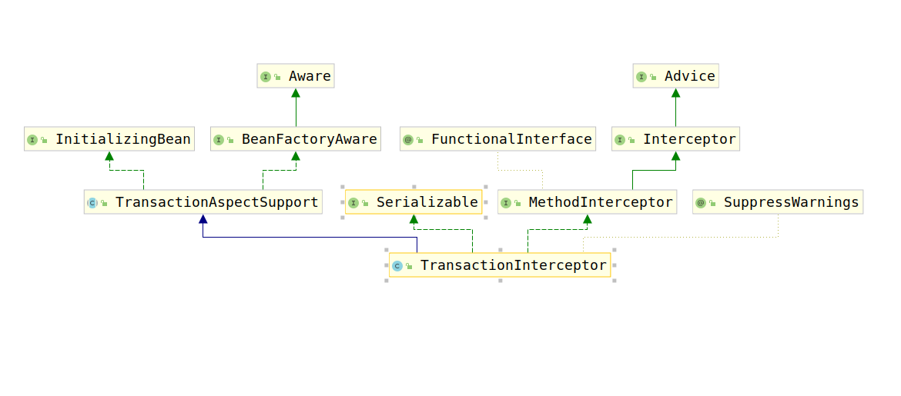

# TransactionInterceptor

spring-tx的代理逻辑均在该类的`invoke(MethodInvocation invocation) throws Throwable`方法，考察该类的类继承结构图：



上图中的类只有`TransactionAspectSupport`没有分析过，该类其实是为`TransactionInterceptor`保存并提供spring-tx的基本bean以及配置信息，接下来我们会对其进行详细的分析，首先先对`TransactionInterceptor`的`invoke(MethodInvocation invocation) throws Throwable`进行分析。

```java
public Object invoke(MethodInvocation invocation) throws Throwable {
    // Work out the target class: may be {@code null}.
    // The TransactionAttributeSource should be passed the target class
    // as well as the method, which may be from an interface.
    // 获取被拦截的Class对象
    Class<?> targetClass = (invocation.getThis() != null ? AopUtils.getTargetClass(invocation.getThis()) : null);

    // Adapt to TransactionAspectSupport's invokeWithinTransaction...
    // 根据该Class对象、调用的方法、以及回调逻辑对其调用事务执行逻辑
    return invokeWithinTransaction(invocation.getMethod(), targetClass, invocation::proceed);
}
```

考察`TransactionAspectSupport`的`invokeWithinTransaction(Method method, @Nullable Class<?> targetClass,final InvocationCallback invocation) throws Throwable`方法，该方法负责主要的事务调用逻辑，由于代码相对较长，这里我们分解其进行分析，大致伪代码如下：

```java
protected Object invokeWithinTransaction(Method method, @Nullable Class<?> targetClass,
        final InvocationCallback invocation) throws Throwable {
    if (this.reactiveAdapterRegistry != null) {
        // 1.如果配置了响应式编程的支持，则进行响应式处理。
        ...
    }
    // 2.获取spring-tx基本bean以及针对于该方法调用的TransactionAttribute
    ...
    if (txAttr == null || !(tm instanceof CallbackPreferringPlatformTransactionManager)) {
        // 3.如果事务配置为null或者事务管理器是CallbackPreferringPlatformTransactionManager
        ...
    }else {
        // 4.否则执行如下逻辑
        ...
    }
}
```

本次源码分析不考虑响应式编程支持，所以我们不考虑第一部分，下面我们考察`第二部分：获取spring-tx基本bean以及针对于该方法调用的TransactionAttribute`源码如下：

```java
// 获取TransactionAttributeSource
TransactionAttributeSource tas = getTransactionAttributeSource();
// 获取类与方法对应的TransactionAttribute
final TransactionAttribute txAttr = (tas != null ? tas.getTransactionAttribute(method, targetClass) : null);
// 通过TransactionAttribute决定使用的事务管理器
final PlatformTransactionManager tm = determineTransactionManager(txAttr);
// 获取方法的唯一认证标签
final String joinpointIdentification = methodIdentification(method, targetClass, txAttr);
```

接下来对上述方法进行逐一考察，首先考察`getTransactionAttributeSource()`方法：

```java
public TransactionAttributeSource getTransactionAttributeSource() {
    return this.transactionAttributeSource;
}
```

该方法仅仅是一个getter方法，那么`this.transactionAttributeSource`属性是何时初始化的呢？考虑`TransactionInterceptor`类型bean的创建过程，即`ProxyTransactionManagementConfiguration`中的创建Bean过程：

```java
public TransactionInterceptor transactionInterceptor(
    TransactionAttributeSource transactionAttributeSource) {
    TransactionInterceptor interceptor = new TransactionInterceptor();
    interceptor.setTransactionAttributeSource(transactionAttributeSource);
    if (this.txManager != null) {
        interceptor.setTransactionManager(this.txManager);
    }
    return interceptor;
}
```

由此可见，该transactionAttributeSource是注入进来的。

接下来继续考虑如下代码：

```java
final TransactionAttribute txAttr = (tas != null ? tas.getTransactionAttribute(method, targetClass) : null);
```

这段代码相对简单，我们已经介绍过了TransactionAttributeSource接口，仅仅是通过该接口查找出targetClass的method方法对应的TransactionAttribute。

由于`Transactional`注解可以对使用的事务管理器进行配置，因此，此处需要使用TransactionAttribute进行获取对应的事务管理器：

```java
protected PlatformTransactionManager determineTransactionManager(@Nullable TransactionAttribute txAttr) {
    // Do not attempt to lookup tx manager if no tx attributes are set
    // 如果事务配置属性是null 或者 beanFactory是null
    if (txAttr == null || this.beanFactory == null) {
        // 获取之前配置的事务管理器
        // 将事务管理器转成PlatformTransactionManager
        return asPlatformTransactionManager(getTransactionManager());
    }
    // 获取事务配置的Qualifier属性，可以通过该属性进行事务管理器bean查询
    String qualifier = txAttr.getQualifier();
    if (StringUtils.hasText(qualifier)) {
        // 通过qualifier属性获取事务管理器，类似于@Qualifier注解的使用方法
        return determineQualifiedTransactionManager(this.beanFactory, qualifier);
    }
    // 通过配置的bean名称获取事务管理器
    else if (StringUtils.hasText(this.transactionManagerBeanName)) {
        return determineQualifiedTransactionManager(this.beanFactory, this.transactionManagerBeanName);
    }
    else {
        // 使用默认的事务管理器
        PlatformTransactionManager defaultTransactionManager = asPlatformTransactionManager(getTransactionManager());
        if (defaultTransactionManager == null) {
            defaultTransactionManager = asPlatformTransactionManager(
                    this.transactionManagerCache.get(DEFAULT_TRANSACTION_MANAGER_KEY));
            if (defaultTransactionManager == null) {
                defaultTransactionManager = this.beanFactory.getBean(PlatformTransactionManager.class);
                this.transactionManagerCache.putIfAbsent(
                        DEFAULT_TRANSACTION_MANAGER_KEY, defaultTransactionManager);
            }
        }
        return defaultTransactionManager;
    }
}
```

经过上述步骤，已经得到了事务管理器，下面需要通过该事务管理器管理事务，但是方法之间需要一个唯一标示，这里给出创造唯一标示的方法：

```java
private String methodIdentification(Method method, @Nullable Class<?> targetClass,
    @Nullable TransactionAttribute txAttr) {

    String methodIdentification = methodIdentification(method, targetClass);
    if (methodIdentification == null) {
        if (txAttr instanceof DefaultTransactionAttribute) {
            methodIdentification = ((DefaultTransactionAttribute) txAttr).getDescriptor();
        }
        if (methodIdentification == null) {
            methodIdentification = ClassUtils.getQualifiedMethodName(method, targetClass);
        }
    }
    return methodIdentification;
}

protected String methodIdentification(Method method, @Nullable Class<?> targetClass) {
    return null;
}
```

通过上述代码可以知道，该唯一标示可以通过`methodIdentification(Method method, @Nullable Class<?> targetClass)`进行自定义策略，否则默认是TransactionAttribute的描述符或者是方法的全限定名。

由于本例中使用的事务管理器是`DataSourceTransactionManager`而不是`CallbackPreferringPlatformTransactionManager`，因此我们考虑第三部分代码：

```java
// 创建事务
TransactionInfo txInfo = createTransactionIfNecessary(tm, txAttr, joinpointIdentification);

Object retVal;
try {
    // This is an around advice: Invoke the next interceptor in the chain.
    // This will normally result in a target object being invoked.
    // 执行业务
    retVal = invocation.proceedWithInvocation();
}
catch (Throwable ex) {
    // target invocation exception
    // 抛出异常后处理
    completeTransactionAfterThrowing(txInfo, ex);
    throw ex;
}
finally {
    // 清除事务信息
    cleanupTransactionInfo(txInfo);
}

if (vavrPresent && VavrDelegate.isVavrTry(retVal)) {
    // Set rollback-only in case of Vavr failure matching our rollback rules...
    TransactionStatus status = txInfo.getTransactionStatus();
    if (status != null && txAttr != null) {
        retVal = VavrDelegate.evaluateTryFailure(retVal, txAttr, status);
    }
}
// 提交事务
commitTransactionAfterReturning(txInfo);
return retVal;
```

接下来我们对事务的创建进行分析。
