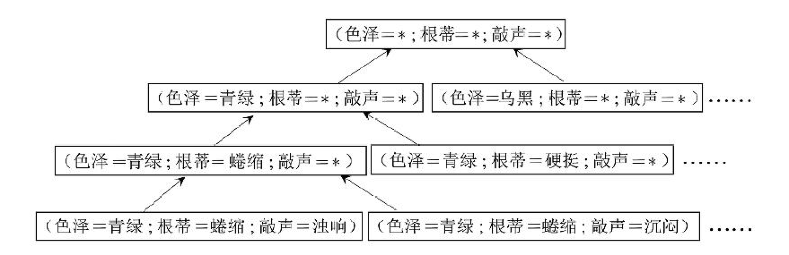

# 1.绪论


## 1.1 引言

机器学习致力于研究如何通过计算的手段，利用经验来改善系统自身的性能，在计算机系统中，“经验”通常以“数据”的形式存在，机器学习的主要研究内容是从“模型”中产生“模型”的算法，即学习算法。

如果说计算机科学是研究关于“算法”的学问，机器学习是研究关于“学习算法”的学问。本文用“模型”泛指从数据中得到的模型。

## 1.2 基本语句

要进行机器学习首先需要数据。例如如下几条数据：


这些数据的集合称为`数据集`。

每条数据是关于一个事件或对象的描述，称为一个`“示例”或“样本”`。本数据集共有4个`样本`。注意，`“示例”或“样本”`数据不包含`好瓜`这一列的数据，即`（“色泽”、“根蒂”、“敲声”）`这三列组成的数据才是。

样本中反映事件或对象在某方面的表现或性质的事项，称为`“属性”或“特征”`。例如，本数据集中的样本，都具有如下3个`属性`：`色泽、根蒂、响声`。

属性上的取值，称为`“属性值”`。例如，在本数据集中，`色泽`这一属性，出现的`属性值`有`青绿和乌黑`两种。

属性张成的空间称为`“属性空间”，“样本空间”或“输入空间”`，例如，我们把`“色泽”、“根蒂”、“响声”`作为3个坐标轴，则他们张成一个用于描述西瓜的三维空间。

由于空间中每个点对应一个坐标向量，因此，我们也把每一个样本称为一个`“特征向量”`。

对于最终要考察的真实结果，称为`“标记”`，即本例中的`好瓜列`。拥有了标记信息的`示例`，就称为`样例`。所有样例的集合称为`“样例空间”或“输出空间”`。


一般的，将D={x1,x2,x3...,xm}表示m个`示例`的`数据集`，每个`示例`由d个`属性`描述（上例中是3个属性）。每个`示例`xi=(xi1,xi2,...,xid)是d维样本空间X（`特征空间`）中的一个向量（`“特征向量”`），d即样本空间X的维数。

对于样例的表示采用`(xi,yi)`这种形式，其中每条`(xi,yi)`形式的数据即为一条`“样例”`，而`yi`所有出现的值的集合称为`"标记空间"或“输出空间”`。


从数据中学得`“模型”`的过程称为`“学习”或“训练”`。训练过程使用的数据称为`“训练数据”`，其中每个样本称为`“训练样本”`，训练样本组成的集合称为`“训练集”`，学得模型对应了关于数据的某种潜在规律，称为`“假设”`，这种潜在规律自身，则称为`“真实”或“真相”`。

对于`标记空间`中的数据，如果是离散值，此类学习任务称为`“分类”`；如果是连续值，此类学习任务称为`“回归”`。若只涉及两个类别，则称为`“二分类任务”`（一个分类为正类，另一个为反类），涉及多个分类，则称为`“多分类任务”`。

学得模型后，进行预测的过程称为`“测试”`，被预测的样本称为`“测试样本”`。

除了`分类`以外，还可以进行`“聚类”`操作，即将训练集中的示例分成若干组，每组称为一个`“簇”`，这些自行组成的簇可能对应一些潜在的概念划分。这样的学习过程有助于我们了解数据的潜在规律，能为更深入地分析数据建立基础。

根据训练数据是否拥有标记信息，学习任务大致可分为两大类：`“监督学习”`和`“无监督学习”`,分类和回归是前者的代表，而聚类则是后者的代表。

机器学习的目标是使学得的模型能很好地适用于`“新样本”`，而不是仅仅在训练样本上作用的很好。即便对于聚类这样的无监督学习任务，我们也希望学得的簇划分能适用于不在训练集中的样本。学得模型适用于新样本的能力，称为`“泛化”`能力。具有强泛化能力的模型能很好的适用于整个样本空间。

## 1.3 假设空间

归纳与演绎是科学推理的两大基本手段。前者是从特殊到一般的`“泛化”`过程，即从具体的事实归结出一般的规律；后者则是从一般到特殊的`“特化”`过程，即从基础原理推演出具体状况。

归纳和学习有狭义和广义之分，广义的归纳学习大体相当于从样例中学习，而狭义的归纳学习则要求从训练数据中学得概念，因此也称为`“概念学习”或“概念形成”`。

概念学习中最基本的是布尔概念学习，即对“是”“不是”这样的可表示为0/1布尔值的目标概念的学习。

我们可以把学习过程看做在一个在所有假设组成的空间中进行搜索的过程。搜索的目标是找到与训练集匹配的假设，假设的表示一旦确定，假设空间以及规模的大小就确定了。

以如下数据集为例：


假设空间由由形如`（色泽=？）∧（根蒂=？）∧（敲声=？）`的可能取值所组成。例如色泽属性有两个取值`青绿、乌黑、浅白`，也要考虑到该值不影响结果的情况，即该属性取任何值都能达到结果的情况，因此，三个属性`色泽、根蒂、敲声`分别有`3、3、3`种可能的取值，则假设空间规模大小为`4*4*4=64`。然而还要考虑到，上面3个属性完全不影响结果，即三个属性任意取值，都无法决定是好瓜的情况，因此还需要添加一种情况，因此假设空间规模大小为`64+1=65`。



可以有很多种策略对该树进行搜索，最终将获得与训练集一直的假设，这就是我们学习的成果。

需要注意的是，现实问题中我们面临很大的假设空间，但学习过程是基于有限样本训练集进行的，因此可能有多个假设和训练集一致，即存在着一个与训练集一致的假设集合，我们称之为版本空间。


## 1.4 归纳偏好

通过上面给出的训练样本，无法判断上述三个假设哪一个更好。然而对于一个具体的学习算法来说，它必须要产生一个模型，这时算法的偏好就会起到重要作用。

机器学习算法在学习过程中对某种类型假设的偏好，称为“归纳偏好”（inductivebias），或简称为“偏好”。

任何一个有效的机器学习算法必有其归纳偏好，否则它将被假设空间中看似在训练集上“等效”的假设所迷惑，而无法产生确定的学习结果。可以想象，如果没有偏好，学得模型时而告诉我们它是好的、时而告诉我们它是不好的，这样的学习结果显然没有意义。

要学得一个与训练集一致的模型，相当于找到一条穿过所有训练样本点的曲线。显然，对有限个样本点组成的训练集，存在着很多条曲线与其一致。我们的学习算法必须有某种偏好，才能产出它认为“正确”的模型，如下图所示：


训练集数据所有样例标出的点，如上图所示，使用不同的模型，构建的模型图像分别是A、B两条线，这两个模型都由训练集训练出来的，A模型更平滑，B模型波动更大。

归纳偏好可看作学习算法自身在一个可能很庞大的假设空间中对假设进行选择的启发式或“价值观”。那么，有没有一般性的原则来引导算法确立“正确的”偏好呢？“奥卡姆剃刀”（Occam'srazor）是一种常用的、自然科学研究中最基本的原则，即“若有多个假设与观察一致，则选最简单的那个”。如果采用这个原则，并且假设我们认为“更平滑”意味着“更简单”。即A模型比B会好很多。

然而，奥卡姆剃刀并非唯一可行的原则。也就是说在某些情况下可能B模型比A模型更好。事实上，归纳偏好对应了学习算法本身所做出的关于“什么样的模型更好”的假设。

根据“没有免费的午餐”定理（NoFreeLunchTheorem，简称NFL定理），所有“问题”出现的机会相同、或所有问题同等重要的情况下，AB模型的期望性是相同的。

简单对NFL进行论证，我们考虑西瓜这个二分类问题，假设样本空间χ和假设空间H都是离散的，令`P(h|X,εa)`代表算法εa基于训练数据X产生假设h的概率，再令f代表我们期望学习的真实目标函数。可以计算一下εa的训练集外误差，来判断εa的准确度，可以使用该公式计算：


其中Ⅱ（·）是指示函数，若·为真则取值1，否则取值0。


表示了x取测试集中的数据（样本空间-训练集），考察如下式子：


首先说一下h和f这两个假设，这里我们可以将假设看为一种对应关系，即一个函数，因此`h(x)≠f(x)`代表`假设与实际的结果不相同`，可以理解为预测错误。对于`h(x)和f(x)的关系`有如下结果：

```
Ⅱ（h(x)≠f(x)）= 1
Ⅱ（h(x)=f(x)）= 0
```

因此，上面的式子就表示`假设h对于测试集中的数据的预测与实际不符的概率`。但是对于某个算法来说，可能有多个假设可以应用于测试集的数据，考察上面西瓜的版本空间，`（青绿，蜷缩，沉闷）`这条示例对于西瓜的样本空间有多种预测结果，因此在计算概率时需要考虑多种假设的情况，因此，最终公式为：


刚才考虑了算法εa产生了多种假设h，实际上也有多种的事实f，因此，要计算`算法εa对于测试集中的数据的预测与实际不符的概率`就需要将所有的事实f都考虑进来，因此公式转化为：


NFL有一个比较重要的条件，即`所有“问题”出现的机会相同、或所有问题同等重要的情况下`，如果满足这个条件，f是均匀分布的函数，均匀分布的函数从概率的角度来看会有一半与h（x）符合，一半与h（x）不符合，因此：


这个公式的推算结果无论如何不会与选用的算法有关，甚至可以看做是一个常量。因此整个公式的结果也不会与选用的算法有关。

然而在事实情况下，不能达到这个理想条件（即`所有“问题”出现的机会相同、或所有问题同等重要的情况下`），因此，NFL定理最重要的寓意，是让我们清楚地认识到，脱离具体问题，空泛地谈论“什么学习算法更好”毫无意义，因为若考虑所有潜在的问题，则所有学习算法都一样好。要谈论算法的相对优劣，必须要针对具体的学习问题；在某些问题上表现好的学习算法，在另一些问题上却可能不尽如人意，学习算法自身的归纳偏好与问题是否相配，往往会起到决定性的作用。
