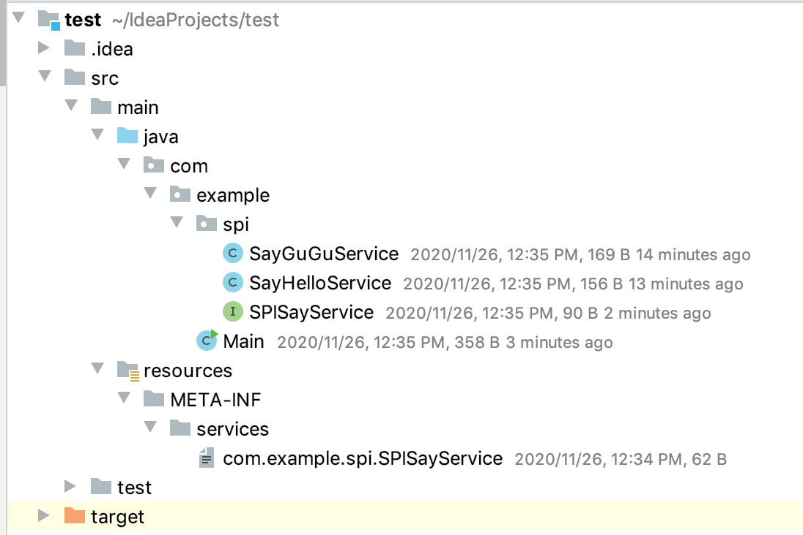
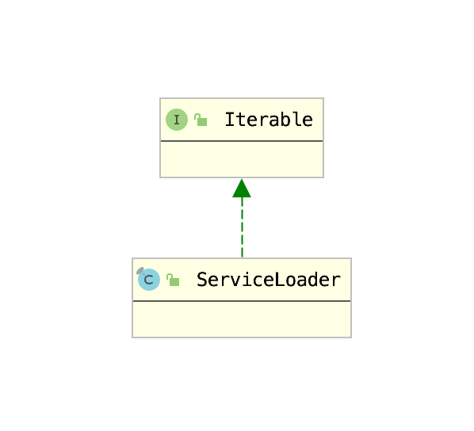

# 1. SPI

作为一个框架，必须要拥有一个自己的Bean管理机制（否则可能会因为Bean管理不当导致性能问题）。例如Spring的ioc、Mybatis的Configuration，`Dubbo采用一种称为SPI的机制进行Bean管理`。

`SPI` 全称为 (`Service Provider Interface`) ，是`JDK内置的一种服务提供发现机制`。SPI是一种动态替换实现的机制，例如有一个接口，其要求实现功能a，在jar包A中，但是其实现在jar包B中，因此在jar包A中需要一种机制，对jar包B中的实现进行发现和实例化，SPI就帮你完成这件事情。

 

在现实生活中有很多这样对案例，典型的例子就是`java.sql.Driver接口`，其他不同厂商可以针对同一接口做出不同的实现，mysql和postgresql都有不同的实现提供给用户。

虽然实现是交给实现方的，但是调用方仍然需要将实现方实现的Class对象实例化，因此需要对实现类进行类加载。这就要交给SPI机制来完成。通过该机制发现具体对实现类，然后进行类加载，进行实例化，以供调用方使用。

## 1.1 SPI基本使用


为了演示Jdk的SPI机制，笔者提供了一个用于sayHello()的Service。

1. 创建一个Service接口

    ```java
    package com.example.spi;

    public interface SPISayService {

        public void sayHello();
    }
    ```

2. 实现Service接口

    SPI本身就用于加载实现方的自定义实现，因此，这里准备两个自定义实现，分别用于SayHello和SayGuGu。实现如下：

    ```java
    package com.example.spi;

    public class SayHelloService implements SPISayService {
        public void sayHello() {
            System.out.println("Hello");
        }
    }
    ```


    ```java
    package com.example.spi;

    public class SayGuGuService implements SPISayService {
        @Override
        public void sayHello() {
            System.out.println("Gu Gu");
        }
    }
    ```
3. 通过一个与接口名相同的文件，给接口与实现创建联系，文件的内容就是接口实现的全限定类名，如果实现类有多个，那么用换行区分。本例中创建的文件名为`com.example.spi.SPISayService`，其中的内容如下：

    ```
    com.example.spi.SayHelloService
    com.example.spi.SayGuGuService
    ```
4. 根据Java文档的规定，上述创建的配置文件必须放在一个固定位置，即`META-INF/services`目录下。项目目录结构如下：

    

5. 创建调用方法，通过ServiceLoader加载实现，并使用。

    ```java
    package com.example;

    import com.example.spi.SPISayService;

    import java.util.ServiceLoader;

    public class Main {

        public static void main(String[] args) {
            ServiceLoader<SPISayService> service = ServiceLoader.load(SPISayService.class);
            for (SPISayService spiSayService : service) {
                spiSayService.sayHello();
            }
        }
    }
    ```

    运行结果如下：

    ```shell
    Hello
    Gu Gu
    ```

    可以看到ServiceLoader成功加载了所有的实现。

## 1.2 SPI机制源码分析

如果要使用SPI机制，除了需要提供实现类以外，还需要在`META-INF/service`目录下创建一个以接口名称命名的文件，用于声明接口与实现类的关系。最后由ServiceLoader加载使用，ServiceLoader加载使用的代码如下：

```java
// 1) 构建ServiceLoader
ServiceLoader<SPISayService> service = ServiceLoader.load(SPISayService.class);
// 2) 使用迭代器使用接口
for (SPISayService spiSayService : service) {
    spiSayService.sayHello();
}
```

由于只有实现了Iterable接口的对象才能使用for-each语句，这里首先查看一下ServiceLoader的类继承结构：



由此可见，步骤1用于构建ServiceLoader，步骤2用于通过迭代器调用接口方法。下面考察ServiceLoader的构建方法`ServiceLoader.load(Class)`：

```java
public static <S> ServiceLoader<S> load(Class<S> service) {
    // 3) 获取线程上下文类加载器
    ClassLoader cl = Thread.currentThread().getContextClassLoader();
    return ServiceLoader.load(service, cl);
}

public static <S> ServiceLoader<S> load(Class<S> service,
                                            ClassLoader loader)
{
    // 4）构建ServiceLoader
    return new ServiceLoader<>(service, loader);
}
```

步骤3首先获取了线程上下文类加载器，主要原因是因为由于接口实现类模块的类加载器不一定与接口声明类的类加载器相同。例如：jdbc中java.sql.Driver由Bootstrap ClassLoader加载，而接口实现类却要通过ApplicationClassLoader加载。所以需要通过线程上下文获取类加载器。

获取完毕类加载器之后，便只需要加载实现类，构造对象实例即可，这部分功能都由步骤4完成，即构造器构造`ServiceLoader`。

```java
  private ServiceLoader(Class<S> svc, ClassLoader cl) {
        // 5) 初始化ServiceLoader的基础属性
        service = Objects.requireNonNull(svc, "Service interface cannot be null");
        loader = (cl == null) ? ClassLoader.getSystemClassLoader() : cl;
        acc = (System.getSecurityManager() != null) ? AccessController.getContext() : null;
        // 6 构造迭代器
        reload();
    }

    public void reload() {
        // 7 清除已加载记录
        providers.clear();
        // 8 构造迭代器
        lookupIterator = new LazyIterator(service, loader);
    }

```

作为服务的加载器，肯定要记录要加载的类以及使用的类加载器，步骤5就是用于做这个的。待信息记录完毕之后就可以开始加载接口的实现类，并构造迭代器了，即步骤6。步骤6中，首先通过步骤7，清空了providers这一属性的值，然后在步骤8中，使用接口类的Class对象以及ClassLoader构建LazyIterator。迭代器的名字是`LazyIterator`，看来只有在使用时才会加载。

此时我们将关注点移到`LazyIterator`上。首先考察`LazyIterator`的构造方法：

```java
private LazyIterator(Class<S> service, ClassLoader loader) {
    this.service = service;
    this.loader = loader;
}
```

构造器只是简单记录一下配置罢了。作为一个迭代器，最重要的就是两个方法：

1. hasNext()
2. next()

考察`LazyIterator`的上述两个方法的实现：

1. hasNext()

    ```java
    public boolean hasNext() {
        if (acc == null) {
            return hasNextService();
        } else {
            PrivilegedAction<Boolean> action = new PrivilegedAction<Boolean>() {
                        public Boolean run() { return hasNextService(); }
            };
            return AccessController.doPrivileged(action, acc);
        }
    }
    ```

    hasNext()方法的核心逻辑都在hasNextService()中：

    ```java
    private static final String PREFIX = "META-INF/services/";
    private boolean hasNextService() {
        if (nextName != null) {
            return true;
        }
        if (configs == null) {
            try {
                // 通过META-INF/services+service的全限定名
                String fullName = PREFIX + service.getName();
                if (loader == null)
                    configs = ClassLoader.getSystemResources(fullName);
                else
                    // 加载配置文件
                    configs = loader.getResources(fullName);
            } catch (IOException x) {
                fail(service, "Error locating configuration files", x);
            }
        }
        while ((pending == null) || !pending.hasNext()) {
            if (!configs.hasMoreElements()) {
                return false;
            }
            // 解析配置文件
            pending = parse(service, configs.nextElement());
        }
        nextName = pending.next();
        return true;
    }
    ```
    LazyIterator 首先根据service的全限定名获取配置文件名，然后通过类加载器进行加载，最后将配置文件进行解析。配置文件中本身就是每行一个的接口实现类的全限定名，这里就将其解析为一个ArrayList，并将链表的迭代器暴露出来，最后由pending属性保存。（该属性用于保存实现类类名列表的迭代器）。

2. next()

    ```java
    public S next() {
        if (acc == null) {
            return nextService();
        } else {
            PrivilegedAction<S> action = new PrivilegedAction<S>() {
                public S run() { return nextService(); }
            };
            return AccessController.doPrivileged(action, acc);
        }
    }
    ```

    next()方法的主要逻辑也是在nextService()中。

    ```java
    private S nextService() {
        if (!hasNextService())
            throw new NoSuchElementException();
        // 获取实现类全限定名
        String cn = nextName;
        nextName = null;
        Class<?> c = null;
        try {
            // 使用类加载器加载
            c = Class.forName(cn, false, loader);
        } catch (ClassNotFoundException x) {
            fail(service, "Provider " + cn + " not found");
        }
        if (!service.isAssignableFrom(c)) {
            fail(service,"Provider " + cn  + " not a subtype");
        }
        try {
            // 通过反射创建具体对象
            // 并将对象强转成声明的类
            S p = service.cast(c.newInstance());
            // 将生成的对象保存在provider对象中
            providers.put(cn, p);
            return p;
        } catch (Throwable x) {
            fail(service,
             "Provider " + cn + " could not be instantiated", x);
        }
        throw new Error();          // This cannot happen
    }
    ```

至此，Jdk原生的SPI原理就已分析完毕。

然而考察源码，我们可以发现原生SPI有如下弊端：

1. 原生SPI的实例化过程是顺序实例化的，如果想实例化其中一个相对来说比较困难，只能全部都实例化之后再进行选择。
2. 实例化只能简单通过反射创建，如果要对创建好的对象进行二次包装，只能用户手动完成。

因此，Dubbo实现了自己的扩展实现。

## 1.3 Dubbo的ExtensionLoader

Jdk的SPI实现通过`ServiceLoader`，Dubbo的SPI实现则通过`org.apache.dubbo.common.extension.ExtensionLoader`。通过`ExtensionLoader`获取接口实现是通过如下代码：

```java
ExtensionLoader.getExtensionLoader(
    // 接口名
    Protocol.class
    
    ).getExtension(String name)
```

获取实现类对象需要如下两个步骤：

1. 通过接口的Class对象获取ExtensionLoader
2. 通过ExtensionLoader根据名字获取实现类

这里对步骤2进行一下解释，JDK的SPI机制是`ExtensionLoader对实现类进行遍历实例化`，然后`再交给调用端去选择一个合适的实例`，Dubbo则是通过一个名字，`由ExtensionLoader选择合适的实现类再进行实例化`。`那么ExtensionLoader如何通过名字选择实现类呢？`这得益于Dubbo的SPI提供的配置文件。

Dubbo的SPI与Jdk的SPI的关联文件格式有些不同，后者仅仅是每行一个实现类的全限定类名，而Dubbo的配置文件是一个key-value格式的配置文件，key和value使用`=`连接。笔者此处给出一个例子，这是Dubbo`org.apache.dubbo.metadata.store.MetadataReportFactory`的具体实现：

```shell
zookeeper=org.apache.dubbo.metadata.store.zookeeper.ZookeeperMetadataReportFactory
redis=org.apache.dubbo.metadata.store.redis.RedisMetadataReportFactory
consul=org.apache.dubbo.metadata.store.consul.ConsulMetadataReportFactory
```

使用这种方式就解决JDK SPI的第一个缺点：`原生SPI的实例化过程是顺序实例化的，如果想实例化其中一个相对来说比较困难，只能全部都实例化之后再进行选择。`如果需要选择一个具体的实现，那么必须要有一个标识来唯一确认这个实现，key就是唯一标识，value就是具体实现的全限定类名。

下面笔者将详细分析Dubbo SPI的具体实现。


### 1.2.1  通过接口的Class对象获取ExtensionLoader

与JDK的SPI机制一样，Dubbo的也是使用一个`ExtensionLoader`。Dubbo通过`ExtensionLoader.getExtensionLoader(Class<?>)`方法获取具体Class的`ExtensionLoader`：

```java
// ExtensionLoader的缓存
private static final ConcurrentMap<Class<?>, ExtensionLoader<?>> EXTENSION_LOADERS = new ConcurrentHashMap<>();

// 判断Class是否被SPI注解修饰
private static <T> boolean withExtensionAnnotation(Class<T> type) {
    return type.isAnnotationPresent(SPI.class);
}

public static <T> ExtensionLoader<T> getExtensionLoader(Class<T> type) {
    if (type == null) {
        throw new IllegalArgumentException("Extension type == null");
    }
    if (!type.isInterface()) {
        throw new IllegalArgumentException("Extension type (" + type + ") is not an interface!");
    }
    if (!withExtensionAnnotation(type)) {
        throw new IllegalArgumentException("Extension type (" + type +
                ") is not an extension, because it is NOT annotated with @" + SPI.class.getSimpleName() + "!");
    }
    // 创建并缓存
    ExtensionLoader<T> loader = (ExtensionLoader<T>) EXTENSION_LOADERS.get(type);
    if (loader == null) {
        EXTENSION_LOADERS.putIfAbsent(type, new ExtensionLoader<T>(type));
        loader = (ExtensionLoader<T>) EXTENSION_LOADERS.get(type);
    }
    return loader;
}
```

在这里，Dubbo对`ExtensionLoader`做了缓存，缓存在`EXTENSION_LOADERS`中，这也印证了Dubbo使用`ExtensionLoader`做Bean管理这一点。截止到这里，我们也只是了解了Dubbo对`ExtensionLoader`的管理模式，但是具体创建`ExtensionLoader`的流程还是未知的，这里我们对其进行介绍：

```java
private ExtensionLoader(Class<?> type) {
    this.type = type;
    objectFactory = (type == ExtensionFactory.class ? null : ExtensionLoader.getExtensionLoader(ExtensionFactory.class).getAdaptiveExtension());
}
```

可以看到Dubbo在创建`ExtensionLoader`时，实际上调用的是`getAdaptiveExtension()`方法，方法名含义为`获取自适应扩展`，这里我们对其简单解释一下。

由于Dubbo使用了自己的SPI机制，希望通过类似于插件似的方式提供用户自定义的扩展，具体的扩展实现类是通过配置文件中的名字来一一对应的，因此可以通过`getExtension(String)`获取。因此就需要一个调用`getExtension(String)`方法获取真实实例的地方，Dubbo做了一个代理，将真实实现代理给`自适应扩展实例`。以`Protocol`接口为例：

```java
@SPI("dubbo")
public interface Protocol {
    int getDefaultPort();

    @Adaptive
    <T> Exporter<T> export(Invoker<T> invoker) throws RpcException;

    @Adaptive
    <T> Invoker<T> refer(Class<T> type, URL url) throws RpcException;

    void destroy();
}
```

其要求实现两个方法：`export`和`refer`，Dubbo生成的代理如下：

```java
package org.apache.dubbo.rpc;
import org.apache.dubbo.common.extension.ExtensionLoader;
public class Protocol$Adaptive implements org.apache.dubbo.rpc.Protocol {
    public void destroy()  {
        throw new UnsupportedOperationException("The method public abstract void org.apache.dubbo.rpc.Protocol.destroy() of interface org.apache.dubbo.rpc.Protocol is not adaptive method!");
    }
    public int getDefaultPort()  {
        throw new UnsupportedOperationException("The method public abstract int org.apache.dubbo.rpc.Protocol.getDefaultPort() of interface org.apache.dubbo.rpc.Protocol is not adaptive method!");
    }
    public org.apache.dubbo.rpc.Exporter export(org.apache.dubbo.rpc.Invoker arg0) throws org.apache.dubbo.rpc.RpcException {
        if (arg0 == null) throw new IllegalArgumentException("org.apache.dubbo.rpc.Invoker argument == null");
        if (arg0.getUrl() == null) throw new IllegalArgumentException("org.apache.dubbo.rpc.Invoker argument getUrl() == null");
        org.apache.dubbo.common.URL url = arg0.getUrl();
        String extName = ( url.getProtocol() == null ? "dubbo" : url.getProtocol() );
        if(extName == null) throw new IllegalStateException("Failed to get extension (org.apache.dubbo.rpc.Protocol) name from url (" + url.toString() + ") use keys([protocol])");
        org.apache.dubbo.rpc.Protocol extension = (org.apache.dubbo.rpc.Protocol)ExtensionLoader.getExtensionLoader(org.apache.dubbo.rpc.Protocol.class).getExtension(extName);
        return extension.export(arg0);
    }
    public org.apache.dubbo.rpc.Invoker refer(java.lang.Class arg0, org.apache.dubbo.common.URL arg1) throws org.apache.dubbo.rpc.RpcException {
        if (arg1 == null) throw new IllegalArgumentException("url == null");
        org.apache.dubbo.common.URL url = arg1;
        String extName = ( url.getProtocol() == null ? "dubbo" : url.getProtocol() );
        if(extName == null) throw new IllegalStateException("Failed to get extension (org.apache.dubbo.rpc.Protocol) name from url (" + url.toString() + ") use keys([protocol])");
        org.apache.dubbo.rpc.Protocol extension = (org.apache.dubbo.rpc.Protocol)ExtensionLoader.getExtensionLoader(org.apache.dubbo.rpc.Protocol.class).getExtension(extName);
        return extension.refer(arg0, arg1);
    }
}
```

可以看到，`自适应扩展`将方法调用都代理给了`getExtensionLoader(org.apache.dubbo.rpc.Protocol.class).getExtension(extName)方法`获取到的实例。需要注意以下两点：

1. `自适应扩展`提供了调用`getExtension(extName)`方法时的默认扩展名，`Protocol`的默认扩展名是`dubbo`，因为`Protocol接口`被`@SPI("dubbo")`所修饰。
2. `自适应扩展`仅代理了部分方法，例如`Protocol`的自适应扩展仅代理了：`export`和`refer`，因为`Protocol接口`仅这两个接口被`@Adaptive`修饰。

因此我们接下来需要分析`自适应扩展的生成过程`，这部分我们放在[这篇文章](./1-1.自适应扩展的创建.md)进行分析。

## 1.4 ExtensionLoader的使用

Dubbo的`ExtensionLoader`提供两个方法根据名字获取具体实现的实例：

1. 通过名字创建单个实例-`getExtension(String name)`
2. 创建多个实例-`getActivateExtension(URL url, String[] values, String group)`

### 1.4.1 通过名字创建单个实例

考察`getExtension(String name)`方法源码：

```java
public T getExtension(String name) {
    if (StringUtils.isEmpty(name)) {
        throw new IllegalArgumentException("Extension name == null");
    }
    if ("true".equals(name)) {
        return getDefaultExtension();
    }
    // 尝试从缓存中获取
    Holder<Object> holder = getOrCreateHolder(name);
    Object instance = holder.get();
    if (instance == null) {
        synchronized (holder) {
            instance = holder.get();
            if (instance == null) {
                // 缓存中没有则创建一个新的实例
                instance = createExtension(name);
                holder.set(instance);
            }
        }
    }
    return (T) instance;
}

public T getDefaultExtension() {
        getExtensionClasses();
    if (StringUtils.isBlank(cachedDefaultName) || "true".equals(cachedDefaultName)) {
            return null;
    }
    return getExtension(cachedDefaultName);
}
```

可以看到，如果传入的名称是`"true"`，那么直接获取默认实现，获取默认实现的方式也只是`通过默认实现名调用getExtension(String)方法获取实现`。否则根据`name`获取实例，在获取实例时会进入缓存，尝试获取已创建的实例：

```java
private Holder<Object> getOrCreateHolder(String name) {
    Holder<Object> holder = cachedInstances.get(name);
    if (holder == null) {
        cachedInstances.putIfAbsent(name, new Holder<>());
        holder = cachedInstances.get(name);
    }
    return holder;
}
```

如果缓存中获取不到已创建的实例，那么会调用`createExtension(String name)`方法进行创建，源码如下：

```java
private T createExtension(String name) {
    // 获取所有扩展类Class对象
    // 根据name获取Class对象
    Class<?> clazz = getExtensionClasses().get(name);
    if (clazz == null) {
        throw findException(name);
    }
    try {
        // 获取缓存中的对象
        // 如果缓存中没有，那么通过反射创建对象
        T instance = (T) EXTENSION_INSTANCES.get(clazz);
        if (instance == null) {
            EXTENSION_INSTANCES.putIfAbsent(clazz, clazz.newInstance());
            instance = (T) EXTENSION_INSTANCES.get(clazz);
        }
        // 依赖注入
        injectExtension(instance);
        Set<Class<?>> wrapperClasses = cachedWrapperClasses;
        // 使用Wrapper类包装
        if (CollectionUtils.isNotEmpty(wrapperClasses)) {
            for (Class<?> wrapperClass : wrapperClasses) {
                instance = injectExtension((T) wrapperClass.getConstructor(type).newInstance(instance));
            }
        }
        return instance;
    } catch (Throwable t) {
        throw new IllegalStateException("Extension instance (name: " + name + ", class: " +
                type + ") couldn't be instantiated: " + t.getMessage(), t);
    }
}
```

可以看到，`createExtension(String name)`方法执行了如下6步：

1. 获取所有的扩展类Class对象
2. 根据name获取具体的扩展类Class对象
3. 通过扩展类Class对象获取缓冲中已实例化过的扩展类对象
4. 如果没获取到，则通过反射实例化扩展类对象
5. 对扩展类对象进行依赖注入
6. 通过包装类包装扩展类对象（装饰器模式）。

需要注意这里的`EXTENSION_INSTANCES`缓存与刚才提到的`cachedInstances`缓存是有一定区别的，前者是扩展类的直接实例，不存在任何包装类修饰，后者则是包装类修饰后的实例。篇幅原因，笔者将在这篇文章中对其另做分析。

### 1.4.2 创建多个实例

在Spring中提供了这样的功能，通过类型可以注入一组Bean。例如，如果你的Bean中指定了这样一个属性：

```java
public class A  {
    @Autowired
    private List<B> b;
}
```

Spring会将容器中所有父类是B的Bean全部注入到b属性中。Dubbo也需要这样的功能，例如在选择Filter时，需要选择使用哪些的Filter，这类似于模糊查询。Dubbo使用一个叫做激活点`Activate`的概念来管理Bean。例如，参考异常处理过滤器`ExceptionFilter`：
```java
@Activate(group = Constants.PROVIDER)
public class ExceptionFilter implements Filter {}
```

`ExceptionFilter`声明只有是服务提供者的情况下，这个过滤器才生效。而完成通过组查找激活的扩展这一方法的功能通过`getActivateExtension(URL url, String[] values, String group)`完成。

考察`getActivateExtension(URL url, String[] values, String group)`方法源码：

```java
    public List<T> getActivateExtension(URL url, String[] values, String group) {
        List<T> exts = new ArrayList<>();
        List<String> names = values == null ? new ArrayList<>(0) : Arrays.asList(values);
        if (!names.contains(Constants.REMOVE_VALUE_PREFIX + Constants.DEFAULT_KEY)) {
            // 加载所有扩展实现类
            getExtensionClasses();
            for (Map.Entry<String, Object> entry : cachedActivates.entrySet()) {
                // 获取所有的激活点
                String name = entry.getKey();
                Object activate = entry.getValue();

                String[] activateGroup, activateValue;
                // 获取激活点配置的Group和value
                if (activate instanceof Activate) {
                    activateGroup = ((Activate) activate).group();
                    activateValue = ((Activate) activate).value();
                } else if (activate instanceof com.alibaba.dubbo.common.extension.Activate) {
                    activateGroup = ((com.alibaba.dubbo.common.extension.Activate) activate).group();
                    activateValue = ((com.alibaba.dubbo.common.extension.Activate) activate).value();
                } else {
                    continue;
                }
                // 满足激活点
                if (isMatchGroup(group, activateGroup)) {
                    T ext = getExtension(name);
                    if (!names.contains(name)
                            && !names.contains(Constants.REMOVE_VALUE_PREFIX + name)
                            && isActive(activateValue, url)) {
                        exts.add(ext);
                    }
                }
            }
            // 通过ActivateComparator排序
            exts.sort(ActivateComparator.COMPARATOR);
        }
        List<T> usrs = new ArrayList<>();
        for (int i = 0; i < names.size(); i++) {
            String name = names.get(i);
            if (!name.startsWith(Constants.REMOVE_VALUE_PREFIX)
                    && !names.contains(Constants.REMOVE_VALUE_PREFIX + name)) {
                if (Constants.DEFAULT_KEY.equals(name)) {
                    if (!usrs.isEmpty()) {
                        exts.addAll(0, usrs);
                        usrs.clear();
                    }
                } else {
                    T ext = getExtension(name);
                    usrs.add(ext);
                }
            }
        }
        if (!usrs.isEmpty()) {
            exts.addAll(usrs);
        }
        return exts;
    }
```

`getActivateExtension(URL url, String[] values, String group)`方法获取了所有的激活点与当前组属性和扩展名称匹配，选择出对应的扩展类名称，并通过`ActivateComparator`排序，最后通过getExtension方法获取对应的扩展类实现，并返回。

## 总结

本篇文章主要对Dubbo的SPI进行了简单的介绍。每个框架都有自己的Bean管理模块，Dubbo选择使用SPI，这使得Dubbo的通用性大大提升，只要你具有JDK环境，就可以使用Dubbo。

相对于Jdk的SPI，Dubbo的SPI支持了更多的功能：

1. 原生SPI的实例化过程是顺序实例化的，如果想实例化其中一个相对来说比较困难，只能全部都实例化之后再进行选择。
2. 实例化只能简单通过反射创建，如果要对创建好的对象进行二次包装，只能用户手动完成。

其中第一点通过Dubbo提供的`自适应扩展实现`，第二点则通过`获取扩展时的装饰器模式实现`，这两笔者会在后面的文章对其进行详细解释与描述。
