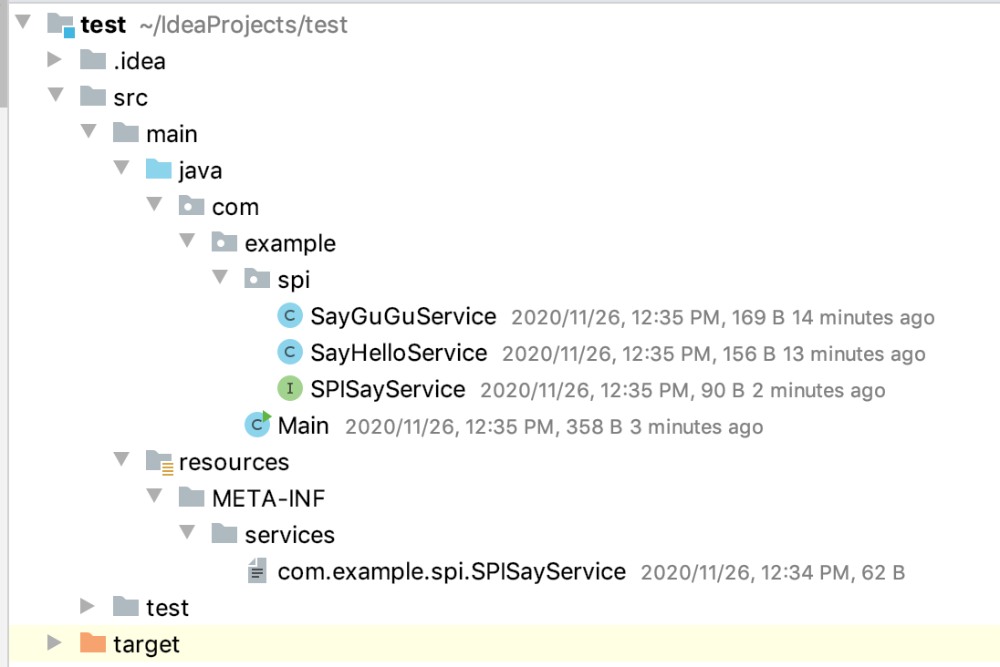
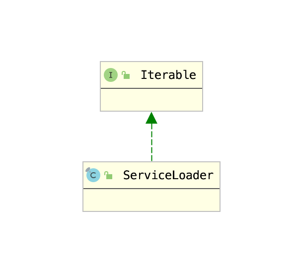

# 1. SPI

`SPI` 全称为 (`Service Provider Interface`) ，是`JDK内置的一种服务提供发现机制`。SPI是一种动态替换发现的机制， 比如有个接口，想运行时动态的给它添加实现，你只需要添加一个实现，而Java的SPI机制可以为某个接口寻找服务实现。

 

基于面向抽象编程的思想，通常调用方基于接口进行代码编写，而对具体对实现并不关心。在现实生活中有很多这样对案例，典型对例子就是`java.sql.Driver接口`，其他不同厂商可以针对同一接口做出不同的实现，mysql和postgresql都有不同的实现提供给用户。

虽然实现是交给实现方的，但是调用方仍然需要将实现方实现的Class对象实例化，因此需要对实现类进行类加载。这就要交给SPI机制来完成。通过该机制发现具体对实现类，然后进行类加载，进行实例化，以供调用方使用。

## 1.1 SPI基本使用

如果需要使用Jdk提供的SPI，可以按照如下步骤：

1. 创建一个Service接口

    ```java
    package com.example.spi;

    public interface SPISayService {

        public void sayHello();
    }
    ```

    本例我们通过一个用于sayHello()的Service来演示Jdk的SPI机制。
2. 实现Service接口

    SPI本身就用于加载实现方的自定义实现，因此，这里准备两个自定义实现，分别用于SayHello和SayGuGu。实现如下：

    ```java
    package com.example.spi;

    public class SayHelloService implements SPISayService {
        public void sayHello() {
            System.out.println("Hello");
        }
    }
    ```


    ```java
    package com.example.spi;

    public class SayGuGuService implements SPISayService {
        @Override
        public void sayHello() {
            System.out.println("Gu Gu");
        }
    }
    ```
3. 通过一个与接口名相同的文件，给接口与实现创建联系，文件的内容就是接口实现的全限定类名，如果实现类有多个，那么用换行区分。本例中创建的文件名为`com.example.spi.SPISayService`，其中的内容如下：

    ```
    com.example.spi.SayHelloService
    com.example.spi.SayGuGuService
    ```
4. 根据Java文档的规定，上述创建的配置文件必须放在一个固定位置，即`META-INF/services`目录下。项目目录结构如下：

    

5. 创建调用方法，通过ServiceLoader加载实现，并使用。

    ```java
    package com.example;

    import com.example.spi.SPISayService;

    import java.util.ServiceLoader;

    public class Main {

        public static void main(String[] args) {
            ServiceLoader<SPISayService> service = ServiceLoader.load(SPISayService.class);
            for (SPISayService spiSayService : service) {
                spiSayService.sayHello();
            }
        }
    }
    ```

    运行结果如下：

    ```shell
    Hello
    Gu Gu
    ```

    可以看到ServiceLoader成功加载了所有的实现。

## 1.2 SPI机制源码分析

如果要使用SPI机制，除了需要提供实现类以外，还需要在`META-INF/service`目录下创建一个以接口名称命名的文件，用于声明接口与实现类的关系。最后由ServiceLoader加载使用，ServiceLoader加载使用的代码如下：

```java
// 1) 构建ServiceLoader
ServiceLoader<SPISayService> service = ServiceLoader.load(SPISayService.class);
// 2) 使用迭代器使用接口
for (SPISayService spiSayService : service) {
    spiSayService.sayHello();
}
```

由于只有实现了Iterable接口的对象才能使用for-each语句，这里首先查看一下ServiceLoader的类继承结构：



由此可见，步骤1用于构建ServiceLoader，步骤2用于通过迭代器调用接口方法。下面考察ServiceLoader的构建方法`ServiceLoader.load(Class)`：

```java
public static <S> ServiceLoader<S> load(Class<S> service) {
    // 3) 获取线程上下文类加载器
    ClassLoader cl = Thread.currentThread().getContextClassLoader();
    return ServiceLoader.load(service, cl);
}

public static <S> ServiceLoader<S> load(Class<S> service,
                                            ClassLoader loader)
{
    // 4）构建ServiceLoader
    return new ServiceLoader<>(service, loader);
}
```

步骤3首先获取了线程上下文类加载器，主要原因是因为由于接口实现类模块的类加载器不一定与接口声明类的类加载器相同。例如：jdbc中java.sql.Driver由Bootstrap ClassLoader加载，而接口实现类却要通过ApplicationClassLoader加载。所以需要通过线程上下文获取类加载器。

获取完毕类加载器之后，便只需要加载实现类，构造对象实例即可，这部分功能都由步骤4完成，即构造器构造`ServiceLoader`。

```java
  private ServiceLoader(Class<S> svc, ClassLoader cl) {
        // 5) 初始化ServiceLoader的基础属性
        service = Objects.requireNonNull(svc, "Service interface cannot be null");
        loader = (cl == null) ? ClassLoader.getSystemClassLoader() : cl;
        acc = (System.getSecurityManager() != null) ? AccessController.getContext() : null;
        // 6 构造迭代器
        reload();
    }

    public void reload() {
        // 7 清除已加载记录
        providers.clear();
        // 8 构造迭代器
        lookupIterator = new LazyIterator(service, loader);
    }

```

作为服务的加载器，肯定要记录要加载的类以及使用的类加载器，步骤5就是用于做这个的。待信息记录完毕之后就可以开始加载接口的实现类，并构造迭代器了，即步骤6。步骤6中，首先通过步骤7，清空了providers这一属性的值，然后在步骤8中，使用接口类的Class对象以及ClassLoader构建LazyIterator。迭代器的名字是`LazyIterator`，看来只有在使用时才会加载。

此时我们将关注点移到`LazyIterator`上。首先考察`LazyIterator`的构造方法：

```java
private LazyIterator(Class<S> service, ClassLoader loader) {
    this.service = service;
    this.loader = loader;
}
```

构造器只是简单记录一下配置罢了。作为一个迭代器，最重要的就是两个方法：

1. hasNext()
2. next()

考察`LazyIterator`的上述两个方法的实现：

1. hasNext()

    ```java
    public boolean hasNext() {
        if (acc == null) {
            return hasNextService();
        } else {
            PrivilegedAction<Boolean> action = new PrivilegedAction<Boolean>() {
                        public Boolean run() { return hasNextService(); }
            };
            return AccessController.doPrivileged(action, acc);
        }
    }
    ```

    hasNext()方法的核心逻辑都在hasNextService()中：

    ```java
    private static final String PREFIX = "META-INF/services/";
    private boolean hasNextService() {
        if (nextName != null) {
            return true;
        }
        if (configs == null) {
            try {
                // 通过META-INF/services+service的全限定名
                String fullName = PREFIX + service.getName();
                if (loader == null)
                    configs = ClassLoader.getSystemResources(fullName);
                else
                    // 加载配置文件
                    configs = loader.getResources(fullName);
            } catch (IOException x) {
                fail(service, "Error locating configuration files", x);
            }
        }
        while ((pending == null) || !pending.hasNext()) {
            if (!configs.hasMoreElements()) {
                return false;
            }
            // 解析配置文件
            pending = parse(service, configs.nextElement());
        }
        nextName = pending.next();
        return true;
    }
    ```
    LazyIterator 首先根据service的全限定名获取配置文件名，然后通过类加载器进行加载，最后将配置文件进行解析。配置文件中本身就是每行一个的接口实现类的全限定名，这里就将其解析为一个ArrayList，并将链表的迭代器暴露出来，最后由pending属性保存。（该属性用于保存实现类类名列表的迭代器）。

2. next()

    ```java
    public S next() {
        if (acc == null) {
            return nextService();
        } else {
            PrivilegedAction<S> action = new PrivilegedAction<S>() {
                public S run() { return nextService(); }
            };
            return AccessController.doPrivileged(action, acc);
        }
    }
    ```

    next()方法的主要逻辑也是在nextService()中。

    ```java
    private S nextService() {
        if (!hasNextService())
            throw new NoSuchElementException();
        // 获取实现类全限定名
        String cn = nextName;
        nextName = null;
        Class<?> c = null;
        try {
            // 使用类加载器加载
            c = Class.forName(cn, false, loader);
        } catch (ClassNotFoundException x) {
            fail(service, "Provider " + cn + " not found");
        }
        if (!service.isAssignableFrom(c)) {
            fail(service,"Provider " + cn  + " not a subtype");
        }
        try {
            // 通过反射创建具体对象
            // 并将对象强转成声明的类
            S p = service.cast(c.newInstance());
            // 将生成的对象保存在provider对象中
            providers.put(cn, p);
            return p;
        } catch (Throwable x) {
            fail(service,
             "Provider " + cn + " could not be instantiated", x);
        }
        throw new Error();          // This cannot happen
    }
    ```

至此，Jdk原生的SPI原理就已分析完毕。

然而考察源码，我们可以发现原生SPI有如下弊端：

1. 原生SPI的实例化过程是顺序实例化的，如果想实例化其中一个相对来说比较困难，只能全部都实例化之后再进行选择。
2. 实例化只能简单通过反射创建，如果要对创建好的对象进行二次包装，只能用户手动完成。

因此，Dubbo实现了自己的扩展实现。

## 1.3 Dubbo的ExtensionLoader

Jdk的SPI实现通过`ServiceLoader`，Dubbo的SPI实现则通过`ExtensionLoader`。通过`ExtensionLoader`获取接口实现是通过如下代码：

```java
ExtensionLoader.getExtensionLoader(
    // 接口名
    Protocol.class
    
    ).getExtension(String name)
```

获取实现类对象需要如下两个步骤：

1. 通过接口的Class对象获取ExtensionLoader
2. 通过ExtensionLoader根据名字获取实现类

这里对步骤2进行一下解释，Dubbo的SPI与Jdk的SPI的关联文件格式有些不同，后者仅仅是每行一个实现类，而前者则是如下类型：

```shell
zookeeper=org.apache.dubbo.metadata.store.zookeeper.ZookeeperMetadataReportFactory
redis=org.apache.dubbo.metadata.store.redis.RedisMetadataReportFactory
consul=org.apache.dubbo.metadata.store.consul.ConsulMetadataReportFactory
```

Dubbo的配置文件，每行都是一个key-value形式的字符串，前者就是刚才提到的名字，而后者是具体的实现，因此，才会有第二步通过名字获取实现类。

接下来分析上面的两个步骤:

步骤1的核心逻辑是`ExtensionLoader.getExtensionLoader(Class<?>)`方法：

```java
// ExtensionLoader的缓存
private static final ConcurrentMap<Class<?>, ExtensionLoader<?>> EXTENSION_LOADERS = new ConcurrentHashMap<>();

// 判断Class是否被SPI注解修饰
private static <T> boolean withExtensionAnnotation(Class<T> type) {
    return type.isAnnotationPresent(SPI.class);
}

public static <T> ExtensionLoader<T> getExtensionLoader(Class<T> type) {
    if (type == null) {
        throw new IllegalArgumentException("Extension type == null");
    }
    if (!type.isInterface()) {
        throw new IllegalArgumentException("Extension type (" + type + ") is not an interface!");
    }
    if (!withExtensionAnnotation(type)) {
        throw new IllegalArgumentException("Extension type (" + type +
                ") is not an extension, because it is NOT annotated with @" + SPI.class.getSimpleName() + "!");
    }
    // 创建并缓存
    ExtensionLoader<T> loader = (ExtensionLoader<T>) EXTENSION_LOADERS.get(type);
    if (loader == null) {
        EXTENSION_LOADERS.putIfAbsent(type, new ExtensionLoader<T>(type));
        loader = (ExtensionLoader<T>) EXTENSION_LOADERS.get(type);
    }
    return loader;
}
```

可以看到，这里是用`ExtensionLoader`作为Spring的BeanFactory了，用于创建和存储对象。考察`ExtensionLoader`的构造器：

```java
private ExtensionLoader(Class<?> type) {
    this.type = type;
    objectFactory = (type == ExtensionFactory.class ? null : ExtensionLoader.getExtensionLoader(ExtensionFactory.class).getAdaptiveExtension());
}
```

可以看到和步骤2类似的方法：`getAdaptiveExtension()`，方法名含义为`获取自适应扩展`，这里我们对其进行解释。由于Dubbo使用了自己的SPI机制，原因也就是希望通过类似于插件似的方式提供用户自定义的扩展，具体的扩展实现类是通过配置文件中的名字来一一对应的，因此可以通过`getExtension(String)`获取，但是终归需要一个统一入口调用`getExtension(String)`方法，而这个统一入口就是`getAdaptiveExtension`方法返回的结果，即这个自适应扩展类，由于是统一入口，因此这个自适应扩展类也只用创建一次。我们首先分析`getAdaptiveExtension()`方法，再分析`getExtension(String)`方法。

```java
private final Holder<Object> cachedAdaptiveInstance = new Holder<>();

public T getAdaptiveExtension() {
    Object instance = cachedAdaptiveInstance.get();
    if (instance == null) {
        if (createAdaptiveInstanceError == null) {
            // 双重加锁创建自适应扩展
            synchronized (cachedAdaptiveInstance) {
                instance = cachedAdaptiveInstance.get();
                if (instance == null) {
                    try {
                        instance = createAdaptiveExtension();
                        cachedAdaptiveInstance.set(instance);
                    } catch (Throwable t) {
                        createAdaptiveInstanceError = t;
                        throw new IllegalStateException("Failed to create adaptive instance: " + t.toString(), t);
                    }
                }
            }
        } else {
            throw new IllegalStateException("Failed to create adaptive instance: " + createAdaptiveInstanceError.toString(), createAdaptiveInstanceError);
        }
    }

    return (T) instance;
}
```

可以看到，这里仅仅是通过`双重加锁校验`和`createAdaptiveExtension()方法`创建一个自适应扩展实例，然后保存在`cachedAdaptiveInstance`中。`cachedAdaptiveInstance`是`ExtensionLoader`中的一个final属性，保证该属性是个单例。考察`createAdaptiveExtension方法`：

```java
private T createAdaptiveExtension() {
    try {
        return injectExtension((T) getAdaptiveExtensionClass().newInstance());
    } catch (Exception e) {
        throw new IllegalStateException("Can't create adaptive extension " + type + ", cause: " + e.getMessage(), e);
    }
}
```

该方法核心代码只有一行，即：

```java
return injectExtension((T) getAdaptiveExtensionClass().newInstance());
```

但是这行代码做了三件事：

1. getAdaptiveExtensionClass：获取自适应扩展的Class对象

    ```java
    private Class<?> getAdaptiveExtensionClass() {
        getExtensionClasses();
        if (cachedAdaptiveClass != null) {
            return cachedAdaptiveClass;
        }
        return cachedAdaptiveClass = createAdaptiveExtensionClass();
    }
    ```

    这里有一个短路操作。Dubbo SPI首先通过`getExtensionClasses()`方法加载所有用户实现类，如果实现类中有自适应扩展实现，那么直接使用，否则，就调用`createAdaptiveExtensionClass()`方法创建一个。这里由于创建过程相对来说比较简单，优先分析该方法：

    ```java
    private Class<?> createAdaptiveExtensionClass() {
        String code = new AdaptiveClassCodeGenerator(type, cachedDefaultName).generate();
        ClassLoader classLoader = findClassLoader();
        org.apache.dubbo.common.compiler.Compiler compiler = ExtensionLoader.getExtensionLoader(org.apache.dubbo.common.compiler.Compiler.class).getAdaptiveExtension();
        return compiler.compile(code, classLoader);
    }
    ```

    创建自适应扩展实际上是使用`AdaptiveClassCodeGenerator`生成静态代码，然后加载到虚拟机中使用。但是由于有些接口提供了自定义扩展，这时就需要首先调用`getExtensionClasses()`方法加载所有扩展。

    ```java
    private Map<String, Class<?>> getExtensionClasses() {
        Map<String, Class<?>> classes = cachedClasses.get();
        if (classes == null) {
            synchronized (cachedClasses) {
                classes = cachedClasses.get();
                if (classes == null) {
                    classes = loadExtensionClasses();
                    cachedClasses.set(classes);
                }
            }
        }
        return classes;
    }
    ```

    这里又是双重加锁，如果扩展类已经加载过，便存储于缓存中，不再重复加载，否则调用`loadExtensionClasses()`方法加载，考察该方法：

    ```java
    private static final String SERVICES_DIRECTORY = "META-INF/services/";

    private static final String DUBBO_DIRECTORY = "META-INF/dubbo/";

    private static final String DUBBO_INTERNAL_DIRECTORY = DUBBO_DIRECTORY + "internal/";

    private Map<String, Class<?>> loadExtensionClasses() {
        // 获取接口上的SPI注解
        // 如果注解的value不为空，将其设置为默认的扩展
        // 将其存储在cachedDefaultName属性中。
        cacheDefaultExtensionName();

        Map<String, Class<?>> extensionClasses = new HashMap<>();
        loadDirectory(extensionClasses, DUBBO_INTERNAL_DIRECTORY, type.getName());
        loadDirectory(extensionClasses, DUBBO_INTERNAL_DIRECTORY, type.getName().replace("org.apache", "com.alibaba"));
        loadDirectory(extensionClasses, DUBBO_DIRECTORY, type.getName());
        loadDirectory(extensionClasses, DUBBO_DIRECTORY, type.getName().replace("org.apache", "com.alibaba"));
        loadDirectory(extensionClasses, SERVICES_DIRECTORY, type.getName());
        loadDirectory(extensionClasses, SERVICES_DIRECTORY, type.getName().replace("org.apache", "com.alibaba"));
        return extensionClasses;
    }
    ```

    可以看到，这里与Jdk原生SPI的实现很相似，都是加载目录中的配置文件，只不过，Jdk原生SPI加载的是`META-INF/services`目录，而Dubbo加载的是`META-INF/services/`、`META-INF/dubbo/`、`META-INF/dubbo/internal`三个目录罢了。加载目录的逻辑也只是单纯根据ClassLoader进行加载：

    ```java
    private void loadDirectory(Map<String, Class<?>> extensionClasses, String dir, String type) {
        String fileName = dir + type;
        try {
            Enumeration<java.net.URL> urls;
            ClassLoader classLoader = findClassLoader();
            if (classLoader != null) {
                urls = classLoader.getResources(fileName);
            } else {
                urls = ClassLoader.getSystemResources(fileName);
            }
            if (urls != null) {
                while (urls.hasMoreElements()) {
                    java.net.URL resourceURL = urls.nextElement();
                    loadResource(extensionClasses, classLoader, resourceURL);
                }
            }
        } catch (Throwable t) {
            logger.error("Exception occurred when loading extension class (interface: " +
                    type + ", description file: " + fileName + ").", t);
        }
    }
    ```

    这里我们主要考察`loadResource(...)`方法：

    ```java
    private void loadResource(Map<String, Class<?>> extensionClasses, ClassLoader classLoader, java.net.URL resourceURL) {
        try {
            try (BufferedReader reader = new BufferedReader(new InputStreamReader(resourceURL.openStream(), StandardCharsets.UTF_8))) {
                String line;
                while ((line = reader.readLine()) != null) {
                    final int ci = line.indexOf('#');
                    if (ci >= 0) {
                        line = line.substring(0, ci);
                    }
                    line = line.trim();
                    if (line.length() > 0) {
                        try {
                            String name = null;
                            int i = line.indexOf('=');
                            if (i > 0) {
                                name = line.substring(0, i).trim();
                                line = line.substring(i + 1).trim();
                            }
                            if (line.length() > 0) {
                                loadClass(extensionClasses, resourceURL, Class.forName(line, true, classLoader), name);
                            }
                        } catch (Throwable t) {
                            IllegalStateException e = new IllegalStateException("Failed to load extension class (interface: " + type + ", class line: " + line + ") in " + resourceURL + ", cause: " + t.getMessage(), t);
                            exceptions.put(line, e);
                        }
                    }
                }
            }
        } catch (Throwable t) {
            logger.error("Exception occurred when loading extension class (interface: " +
                    type + ", class file: " + resourceURL + ") in " + resourceURL, t);
        }
    }
    ```

    该方法也和Jdk原生SPI相似，通过IO接口读取文件，然后按行读取。与原生SPI的区别就是，这里要将每行数据解析为key-value的形式，然后根据key-value的值通过`loadClass(...)`方法加载类。

    ```java
    private void loadClass(Map<String, Class<?>> extensionClasses, java.net.URL resourceURL, Class<?> clazz, String name) throws NoSuchMethodException {
        if (!type.isAssignableFrom(clazz)) {
            throw new IllegalStateException("Error occurred when loading extension class (interface: " +
                    type + ", class line: " + clazz.getName() + "), class "
                    + clazz.getName() + " is not subtype of interface.");
        }
        // 如果类被Adaptive注解修饰
        // 将类保存在cachedAdaptiveClass属性中
        if (clazz.isAnnotationPresent(Adaptive.class)) {
            cacheAdaptiveClass(clazz);
        // 如果当前类的构造器的参数是当前接口类型
        // 那么将当前类视为Wrapper（包装器）
        // 保存在cachedWrapperClasses属性中
        } else if (isWrapperClass(clazz)) {
            cacheWrapperClass(clazz);
        } else {
            clazz.getConstructor();
            if (StringUtils.isEmpty(name)) {
                name = findAnnotationName(clazz);
                if (name.length() == 0) {
                    throw new IllegalStateException("No such extension name for the class " + clazz.getName() + " in the config " + resourceURL);
                }
            }
            // 获取当前类所对应的name
            String[] names = NAME_SEPARATOR.split(name);
            if (ArrayUtils.isNotEmpty(names)) {
                // 将名字与激活条件的对应关系存储到cachedActivates中
                cacheActivateClass(clazz, names[0]);
                for (String n : names) {
                    // 缓存名字和实现类的关系
                    cacheName(clazz, n);
                    // 构造返回结果
                    saveInExtensionClass(extensionClasses, clazz, name);
                }
            }
        }
    }
    ```

2. newInstance：根据获取的Class对象创建对象
3. injectExtension：为创建好的对象进行依赖注入

    ```java
    private T injectExtension(T instance) {
        try {
            if (objectFactory != null) {
                // 遍历所有方法查找Setter方法
                for (Method method : instance.getClass().getMethods()) {
                    if (isSetter(method)) {
                        
                        if (method.getAnnotation(DisableInject.class) != null) {
                            continue;
                        }
                        Class<?> pt = method.getParameterTypes()[0];
                        // 如果方法的入参是基础类型，则跳过
                        if (ReflectUtils.isPrimitives(pt)) {
                            continue;
                        }
                        try {
                            // 通过setter方法获取name
                            String property = getSetterProperty(method);
                            // 根据name获取对应实现
                            Object object = objectFactory.getExtension(pt, property);
                            if (object != null) {
                                // 执行setter方法进行依赖注入
                                method.invoke(instance, object);
                            }
                        } catch (Exception e) {
                            logger.error("Failed to inject via method " + method.getName()
                                    + " of interface " + type.getName() + ": " + e.getMessage(), e);
                        }
                    }
                }
            }
        } catch (Exception e) {
            logger.error(e.getMessage(), e);
        }
        return instance;
    }
    ```

    这里的根据Setter方法进行依赖注入还是比较简单的，仅仅是通过反射，但是困难的是如何找到对应的实现类对象，查找对象是通过`objectFactory.getExtension(pt, property)`获取的，其中`objectFactory`是`AdaptiveExtensionFactory`类型，考察其`getExtension(Class<T> type, String name)`方法：

    ```java
    private final List<ExtensionFactory> factories;
    public <T> T getExtension(Class<T> type, String name) {
        for (ExtensionFactory factory : factories) {
            T extension = factory.getExtension(type, name);
            if (extension != null) {
                return extension;
            }
        }
        return null;
    }
    ```

    可以看到是遍历`factories`进行扩展，考察该类的构造器，查看`factories`属性的填充逻辑：

    ```java
    public AdaptiveExtensionFactory() {
        // 获取ExtensionFactory的ExtensionLoader
        ExtensionLoader<ExtensionFactory> loader = ExtensionLoader.getExtensionLoader(ExtensionFactory.class);
        List<ExtensionFactory> list = new ArrayList<ExtensionFactory>();
        // 查找所有支持的ExtensionFactory
        // 根据name初始化所有的ExtensionFactory然后填充到factories中
        for (String name : loader.getSupportedExtensions()) {
            list.add(loader.getExtension(name));
        }
        factories = Collections.unmodifiableList(list);
    }
    ```

    考察dubbo的`org.apache.dubbo.common.extension.ExtensionFactory`文件，查看其中默认提供的`ExtensionFactory`扩展，分别是

    ```shell
    adaptive=org.apache.dubbo.common.extension.factory.AdaptiveExtensionFactory
    spi=org.apache.dubbo.common.extension.factory.SpiExtensionFactory
    spring=org.apache.dubbo.config.spring.extension.SpringExtensionFactory
    ```

    这里我们考察`SpiExtensionFactory`的具体实现：

    ```java
    public class SpiExtensionFactory implements ExtensionFactory {

        @Override
        public <T> T getExtension(Class<T> type, String name) {
            if (type.isInterface() && type.isAnnotationPresent(SPI.class)) {
                // 根据class对象获取ExtensionLoader
                // 通过ExtensionLoader获取自定义扩展
                ExtensionLoader<T> loader = ExtensionLoader.getExtensionLoader(type);
                if (!loader.getSupportedExtensions().isEmpty()) {
                    return loader.getAdaptiveExtension();
                }
            }
            return null;
        }
    }
    ```

    如此，便可以查找到所有的实现类实例了。

经过上述过程，ExtensionLoader便已创建完成了，如此就可以通过`ExtensionLoader`使用name创建实现类实例。

## 1.4 ExtensionLoader的使用

现在我们已知`ExtensionLoader`用于创建实现类实例，事实上，创建实例有两种创建方式：

1. 通过名字创建单个实例-`getExtension(String name)`
2. 创建多个实例-`getActivateExtension(URL url, String[] values, String group)`

### 1.4.1 通过名字创建单个实例

考察`getExtension(String name)`方法源码：

```java
public T getExtension(String name) {
    if (StringUtils.isEmpty(name)) {
        throw new IllegalArgumentException("Extension name == null");
    }
    if ("true".equals(name)) {
        return getDefaultExtension();
    }
    Holder<Object> holder = getOrCreateHolder(name);
    Object instance = holder.get();
    if (instance == null) {
        synchronized (holder) {
            instance = holder.get();
            if (instance == null) {
                instance = createExtension(name);
                holder.set(instance);
            }
        }
    }
    return (T) instance;
}

public T getDefaultExtension() {
        getExtensionClasses();
    if (StringUtils.isBlank(cachedDefaultName) || "true".equals(cachedDefaultName)) {
            return null;
    }
    return getExtension(cachedDefaultName);
}
```

可以看到，如果传入的名称是`"true"`，那么直接获取默认实现，否则根据`name`获取实例：

```java
private T createExtension(String name) {
    // 获取所有扩展类Class对象
    // 根据name获取Class对象
    Class<?> clazz = getExtensionClasses().get(name);
    if (clazz == null) {
        throw findException(name);
    }
    try {
        // 获取缓存中的对象
        // 如果缓存中没有，那么通过反射创建对象
        T instance = (T) EXTENSION_INSTANCES.get(clazz);
        if (instance == null) {
            EXTENSION_INSTANCES.putIfAbsent(clazz, clazz.newInstance());
            instance = (T) EXTENSION_INSTANCES.get(clazz);
        }
        // 依赖注入
        injectExtension(instance);
        Set<Class<?>> wrapperClasses = cachedWrapperClasses;
        // 使用Wrapper类包装
        if (CollectionUtils.isNotEmpty(wrapperClasses)) {
            for (Class<?> wrapperClass : wrapperClasses) {
                instance = injectExtension((T) wrapperClass.getConstructor(type).newInstance(instance));
            }
        }
        return instance;
    } catch (Throwable t) {
        throw new IllegalStateException("Extension instance (name: " + name + ", class: " +
                type + ") couldn't be instantiated: " + t.getMessage(), t);
    }
}
```

### 1.4.2 创建多个实例

考察`getActivateExtension(URL url, String[] values, String group)`方法源码：

```java
    public List<T> getActivateExtension(URL url, String[] values, String group) {
        List<T> exts = new ArrayList<>();
        List<String> names = values == null ? new ArrayList<>(0) : Arrays.asList(values);
        if (!names.contains(Constants.REMOVE_VALUE_PREFIX + Constants.DEFAULT_KEY)) {
            // 加载所有扩展实现类
            getExtensionClasses();
            for (Map.Entry<String, Object> entry : cachedActivates.entrySet()) {
                // 获取所有的激活点
                String name = entry.getKey();
                Object activate = entry.getValue();

                String[] activateGroup, activateValue;
                // 获取激活点配置的Group和value
                if (activate instanceof Activate) {
                    activateGroup = ((Activate) activate).group();
                    activateValue = ((Activate) activate).value();
                } else if (activate instanceof com.alibaba.dubbo.common.extension.Activate) {
                    activateGroup = ((com.alibaba.dubbo.common.extension.Activate) activate).group();
                    activateValue = ((com.alibaba.dubbo.common.extension.Activate) activate).value();
                } else {
                    continue;
                }
                // 满足激活点
                if (isMatchGroup(group, activateGroup)) {
                    T ext = getExtension(name);
                    if (!names.contains(name)
                            && !names.contains(Constants.REMOVE_VALUE_PREFIX + name)
                            && isActive(activateValue, url)) {
                        exts.add(ext);
                    }
                }
            }
            // 通过ActivateComparator排序
            exts.sort(ActivateComparator.COMPARATOR);
        }
        List<T> usrs = new ArrayList<>();
        for (int i = 0; i < names.size(); i++) {
            String name = names.get(i);
            if (!name.startsWith(Constants.REMOVE_VALUE_PREFIX)
                    && !names.contains(Constants.REMOVE_VALUE_PREFIX + name)) {
                if (Constants.DEFAULT_KEY.equals(name)) {
                    if (!usrs.isEmpty()) {
                        exts.addAll(0, usrs);
                        usrs.clear();
                    }
                } else {
                    T ext = getExtension(name);
                    usrs.add(ext);
                }
            }
        }
        if (!usrs.isEmpty()) {
            exts.addAll(usrs);
        }
        return exts;
    }
```

至此Dubbo的SPI的主体部分就分析完毕了。
