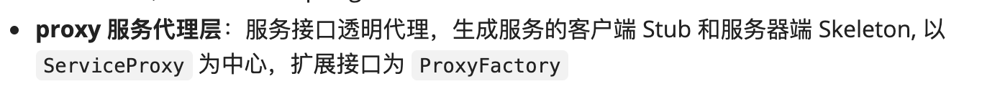
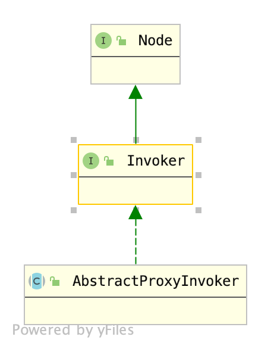

# ProxyFactory生成代理

通过[Provider](./2.Provider.md)这篇文章，我们了解到，Dubbo服务暴露通过`ServiceConfig.export()`方法进行暴露，真正暴露到外部，负责处理业务的也不是实现本身，而是一个代理，这个代理由`ProxyFactory`生成。不过与其说是代理，不如说是命令模式的具体实现，执行器是`ProxyFactory`生成对象，执行单是`<被执行者,方法名,参数>`三元组。

Dubbo对ProxyFactory层描述是这样的：



对于Dubbo的Provider来说，只负责生成Invoker，即服务端代理。这里我们考察`ProxyFactory`接口：

```java
@SPI("javassist")
public interface ProxyFactory {

    @Adaptive({Constants.PROXY_KEY})
    <T> T getProxy(Invoker<T> invoker) throws RpcException;

    @Adaptive({Constants.PROXY_KEY})
    <T> T getProxy(Invoker<T> invoker, boolean generic) throws RpcException;

   @Adaptive({Constants.PROXY_KEY})
    <T> Invoker<T> getInvoker(T proxy, Class<T> type, URL url) throws RpcException;

}
```

对于服务端来说，我们只关心`getInvoker(T proxy, Class<T> type, URL url)`方法。接口表明Dubbo默认使用`javassist`这个名字所指定的实现。

查看Dubbo SPI关于`org.apache.dubbo.rpc.ProxyFactory`的配置文件：

```
stub=org.apache.dubbo.rpc.proxy.wrapper.StubProxyFactoryWrapper
jdk=org.apache.dubbo.rpc.proxy.jdk.JdkProxyFactory
javassist=org.apache.dubbo.rpc.proxy.javassist.JavassistProxyFactory
```

`javassist`对应的`SPI`实现是`JavassistProxyFactory`，那么`ProxyFactory的自适应代理`是通过URL的哪个字段获取SPI实现名字的呢？查看`ProxyFactory`类型的自适应代理：

```java
package org.apache.dubbo.rpc;
import org.apache.dubbo.common.extension.ExtensionLoader;
public class ProxyFactory$Adaptive implements org.apache.dubbo.rpc.ProxyFactory {
    public org.apache.dubbo.rpc.Invoker getInvoker(java.lang.Object arg0, java.lang.Class arg1, org.apache.dubbo.common.URL arg2) throws org.apache.dubbo.rpc.RpcException {
        if (arg2 == null) throw new IllegalArgumentException("url == null");
        org.apache.dubbo.common.URL url = arg2;
        String extName = url.getParameter("proxy", "javassist");
        if(extName == null) throw new IllegalStateException("Failed to get extension (org.apache.dubbo.rpc.ProxyFactory) name from url (" + url.toString() + ") use keys([proxy])");
        org.apache.dubbo.rpc.ProxyFactory extension = (org.apache.dubbo.rpc.ProxyFactory)ExtensionLoader.getExtensionLoader(org.apache.dubbo.rpc.ProxyFactory.class).getExtension(extName);
        return extension.getInvoker(arg0, arg1, arg2);
}
    public java.lang.Object getProxy(org.apache.dubbo.rpc.Invoker arg0, boolean arg1) throws org.apache.dubbo.rpc.RpcException {
        if (arg0 == null) throw new IllegalArgumentException("org.apache.dubbo.rpc.Invoker argument == null");
        if (arg0.getUrl() == null) throw new IllegalArgumentException("org.apache.dubbo.rpc.Invoker argument getUrl() == null");
        org.apache.dubbo.common.URL url = arg0.getUrl();
        String extName = url.getParameter("proxy", "javassist");
        if(extName == null) throw new IllegalStateException("Failed to get extension (org.apache.dubbo.rpc.ProxyFactory) name from url (" + url.toString() + ") use keys([proxy])");
        org.apache.dubbo.rpc.ProxyFactory extension = (org.apache.dubbo.rpc.ProxyFactory)ExtensionLoader.getExtensionLoader(org.apache.dubbo.rpc.ProxyFactory.class).getExtension(extName);
        return extension.getProxy(arg0, arg1);
    }
    public java.lang.Object getProxy(org.apache.dubbo.rpc.Invoker arg0) throws org.apache.dubbo.rpc.RpcException {
        if (arg0 == null) throw new IllegalArgumentException("org.apache.dubbo.rpc.Invoker argument == null");
        if (arg0.getUrl() == null) throw new IllegalArgumentException("org.apache.dubbo.rpc.Invoker argument getUrl() == null");
        org.apache.dubbo.common.URL url = arg0.getUrl();
        String extName = url.getParameter("proxy", "javassist");
        if(extName == null) throw new IllegalStateException("Failed to get extension (org.apache.dubbo.rpc.ProxyFactory) name from url (" + url.toString() + ") use keys([proxy])");
        org.apache.dubbo.rpc.ProxyFactory extension = (org.apache.dubbo.rpc.ProxyFactory)ExtensionLoader.getExtensionLoader(org.apache.dubbo.rpc.ProxyFactory.class).getExtension(extName);
        return extension.getProxy(arg0);
    }
}
```

可以看到如下这行代码：

```java
String extName = url.getParameter("proxy", "javassist");
```

ProxyFactory的自适应代理通过URL中的`proxy`参数判断使用的`ProxyFactory`。

接下来让我们看一下`JavassistProxyFactory`和`JdkProxyFactory`中`getInvoker(T proxy, Class<T> type, URL url)方法`的具体实现。

## JdkProxyFactory

```java
@Override
public <T> Invoker<T> getInvoker(T proxy, Class<T> type, URL url) {
    return new AbstractProxyInvoker<T>(proxy, type, url) {
        @Override
        protected Object doInvoke(T proxy, String methodName,
                                  Class<?>[] parameterTypes,
                                  Object[] arguments) throws Throwable {
            Method method = proxy.getClass().getMethod(methodName, parameterTypes);
            return method.invoke(proxy, arguments);
        }
    };
}
```

Dubbo定义了一个抽象类`AbstractProxyInvoker`，在进行方法执行时，会将方法名和参数交给Invoker，然后交由代理执行，`JdkProxyFactory`的实现方案就是通过反射机制调用特定方法。

## JavassistProxyFactory

```java
public <T> Invoker<T> getInvoker(T proxy, Class<T> type, URL url) {
    final Wrapper wrapper = Wrapper.getWrapper(proxy.getClass().getName().indexOf('$') < 0 ? proxy.getClass() : type);
    return new AbstractProxyInvoker<T>(proxy, type, url) {
        @Override
        protected Object doInvoke(T proxy, String methodName,
                                  Class<?>[] parameterTypes,
                                  Object[] arguments) throws Throwable {
            return wrapper.invokeMethod(proxy, methodName, parameterTypes, arguments);
        }
    };
}
```

`JavassistProxyFactory`与`JdkProxyFactory`不同，`JdkProxyFactory`不生成任何代理，由通过反射直接调用对应的方法，通过反射查出来的method本身就是一个执行器。而`JavassistProxyFactory`则不同，不能借助反射，那么执行器就只能重新生成，因此`JavassistProxyFactory`使用`Wrapper`生成了一个执行器，生成逻辑即`getWrapper(Class<?> c)`方法：

```java

private static final Map<Class<?>, Wrapper> WRAPPER_MAP = new ConcurrentHashMap<Class<?>, Wrapper>();

public static Wrapper getWrapper(Class<?> c) {
    while (ClassGenerator.isDynamicClass(c)) // can not wrapper on dynamic class.
    {
        c = c.getSuperclass();
    }
    if (c == Object.class) {
        return OBJECT_WRAPPER;
    }
    Wrapper ret = WRAPPER_MAP.get(c);
    if (ret == null) {
        ret = makeWrapper(c);
        WRAPPER_MAP.put(c, ret);
    }
    return ret;
}
```

Wrapper使用`WRAPPER_MAP`做了一个缓存，避免重复生成，真正的生成Wrapper的逻辑在`makeWrapper(Class<?> c)`方法中。

例如，Dubbo要暴露的接口是`GreetingService`：

```java
public interface GreetingService {
	String sayHello(String name);
	
	Result<String> testGeneric(PoJo poJo);
}
```

那么生成的`Wrapper`类代码如下：

```java
public class org.apache.dubbo.common.bytecode.Wrapper0 extends org.apache.dubbo.common.bytecode.Wrapper {
    public static String[] pns;
    public static java.util.Map pts;
    public static String[] mns;
    public static String[] dmns;
    public static Class[] mts0;
    public static Class[] mts1;

    public String[] getPropertyNames(){ return pns; }

    public boolean hasProperty(String n){ return pts.containsKey($1); }

    public Class getPropertyType(String n){ return (Class)pts.get($1); }

    public String[] getMethodNames(){ return mns; }

    public String[] getDeclaredMethodNames(){ return dmns; }

    public void setPropertyValue(Object o, String n, Object v){ 
        com.books.dubbo.demo.api.GreetingService w; 
        try{ 
            w = ((com.books.dubbo.demo.api.GreetingService)$1); 
        } catch(Throwable e) { 
            throw new IllegalArgumentException(e); 
        } 
        throw new org.apache.dubbo.common.bytecode.NoSuchPropertyException("Not found property \""+$2+"\" field or setter method in class com.books.dubbo.demo.api.GreetingService."); 
    }

    public Object getPropertyValue(Object o, String n) {
        com.books.dubbo.demo.api.GreetingService w; 
        try{
            w = ((com.books.dubbo.demo.api.GreetingService)$1);
        } catch (Throwable e) {
            throw new IllegalArgumentException(e); 
        } 
        throw new org.apache.dubbo.common.bytecode.NoSuchPropertyException("Not found property \""+$2+"\" field or setter method in class com.books.dubbo.demo.api.GreetingService."); 
    }

    public Object invokeMethod(Object o, String n, Class[] p, Object[] v) throws java.lang.reflect.InvocationTargetException{ 
        com.books.dubbo.demo.api.GreetingService w;
        try{ 
            w = ((com.books.dubbo.demo.api.GreetingService)$1); 
        }catch(Throwable e){
            throw new IllegalArgumentException(e);
        } 
        try { 
            if( "sayHello".equals( $2 )  &&  $3.length == 1 ) {
                return ($w)w.sayHello((java.lang.String)$4[0]);
            } 
            if( "testGeneric".equals( $2 )  &&  $3.length == 1 ) {  
                return ($w)w.testGeneric((com.books.dubbo.demo.api.PoJo)$4[0]); 
            } 
        } catch(Throwable e) {
            throw new java.lang.reflect.InvocationTargetException(e);  } throw new org.apache.dubbo.common.bytecode.NoSuchMethodException("Not found method \""+$2+"\" in class com.books.dubbo.demo.api.GreetingService.");
        }
}
```

方法中的`$+数字`表示方法的形参，例如，`$1`就表示第一个参数，`$2`表示第二个参数，如果你使用过`shell脚本`，你对这个应该会比较了解。可以看到，与`JdkProxyFactory`不同的是，`invokeMethod`使用`方法名+参数长度（其实还有参数类型，只不过笔者的例子没有显示，读者可以创建一个重载的例子debug看下）`来判断调用实现的哪个方法，避免了使用反射，反射是一种性能开销相对较大的方式，Dubbo采用这种方式进行优化，那么使用反射的代价很大么？我们可以查看Java给出的[官方文档](https://docs.oracle.com/javase/tutorial/reflect/index.html)，有写如下这句话

```
Reflection is powerful, but should not be used indiscriminately. If it is possible to perform an operation without using reflection, then it is preferable to avoid using it. The following concerns should be kept in mind when accessing code via reflection.

Performance Overhead
Because reflection involves types that are dynamically resolved, certain Java virtual machine optimizations can not be performed. Consequently, reflective operations have slower performance than their non-reflective counterparts, and should be avoided in sections of code which are called frequently in performance-sensitive applications.
```

它强调，反射需要动态的解析类型信息，这样JVM的优化就失效了，开发者不应该频繁的使用反射。再看我们现在使用的地方，RPC场景，每个RPC应用就会进行一次代理操作，如果使用反射就会造成巨大的性能开销。因此Dubbo给出了这样的方式处理。

生成`Wrapper`字节码的代码在`Wrapper.makeWrapper(Class<?> c)`方法中，如果读者比较感兴趣，可以自行分析，这部分代码仅仅是一系列的字符串拼接。

## AbstractProxyInvoker

通过上面的介绍，你已经对`ProxyFactory`有了一定的认识，但是你有没有发现一点，无论是`JavassistProxyFactory`还是`JdkProxyFactory`，他们返回的对象都是`AbstractProxyInvoker`类型的。类继承图如下：



该类有三个属性：

```java
    // 被代理的实现
    private final T proxy;
    // 被代理的接口类型
    private final Class<T> type;
    // 服务配置URL
    private final URL url;
```

当RPC请求到达服务端时，服务端通过Invoker的`invoke(Invocation invocation)`方法，执行具体的业务操作。

```java
@Override
public Result invoke(Invocation invocation)throws RpcException {
    // 创建RPCContext
    RpcContext rpcContext = RpcContext.getContext();
    try {
        // 执行具体的业务逻辑
        Object obj = doInvoke(proxy, invocation.getMethodName(), invocation.getParameterTypes(), invocation.getArguments());
        // 根据是否异步调用返回RpcResult
        if (RpcUtils.isReturnTypeFuture(invocation)) {
            return new AsyncRpcResult((CompletableFuture<Object>) obj);
        } else if (rpcContext.isAsyncStarted()) { // ignore obj in case of RpcContext.startAsync()? always rely on user to write back.
            return new AsyncRpcResult(((AsyncContextImpl)(rpcContext.getAsyncContext())).getInternalFuture());
        } else {
            return new RpcResult(obj);
        }
    } catch (InvocationTargetException e) {
        // TODO async throw exception before async thread write back, should stop asyncContext
        if (rpcContext.isAsyncStarted() && !rpcContext.stopAsync()) {
            logger.error("Provider async started, but got an exception from the original method, cannot write the exception back to consumer because an async result may have returned the new thread.", e);
        }
        return new RpcResult(e.getTargetException());
    } catch (Throwable e) {
        throw new RpcException("Failed to invoke remote proxy method " + invocation.getMethodName() + " to " + getUrl() + ", cause: " + e.getMessage(), e);
    }
}
```

可以看到`invoke(Invocation invocation)`为`doInvoke(T proxy, String methodName, Class<?>[] parameterTypes, Object[] arguments)`封装了结果数据，并进行了异常拦截。

至此ProxyFactory在服务端的作用就解释完毕了。笔者曾经有如此一个需求，配置文件给出方法名与URL的调用关系，希望通过Dubbo的方式请求Http协议的服务，这样可以不对老系统进行修改就整合Dubbo，便可以在ProxyFactory中实现。

## 总结

本篇文章主要介绍了ProxyFactory在Provider端的职责，即为接口与具体实现创建执行器，使得可以通过方法名和参数找到对应的实现，Dubbo自身提供了两种实现方式：

1. JdkProxyFactory：通过反射实现调用
2. JavassistProxyFactory：通过Wrapper生成字节码，进而生成执行器

为了不使用反射，避免性能问题，JavassistProxyFactory采用生成字节码的方式处理，采用判断方法签名的方式进行路由。

最后介绍了Invoker的具体执行过程。
