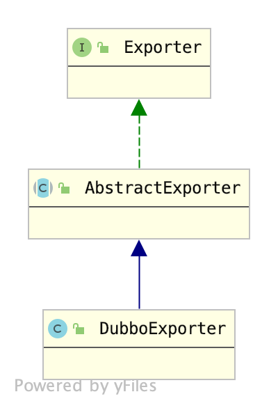
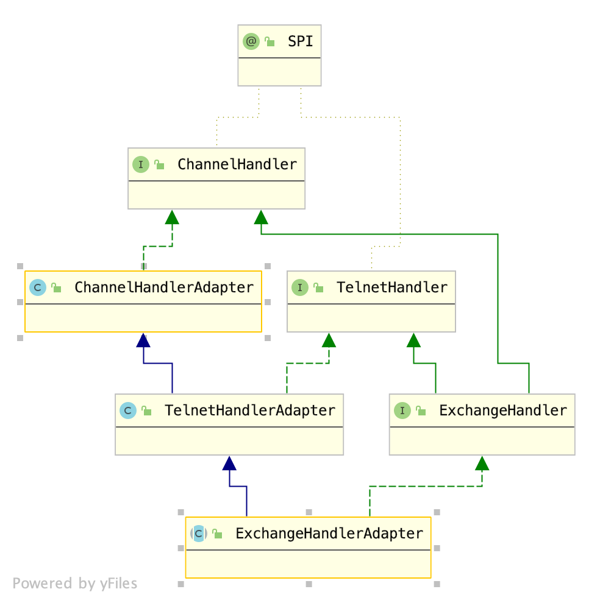
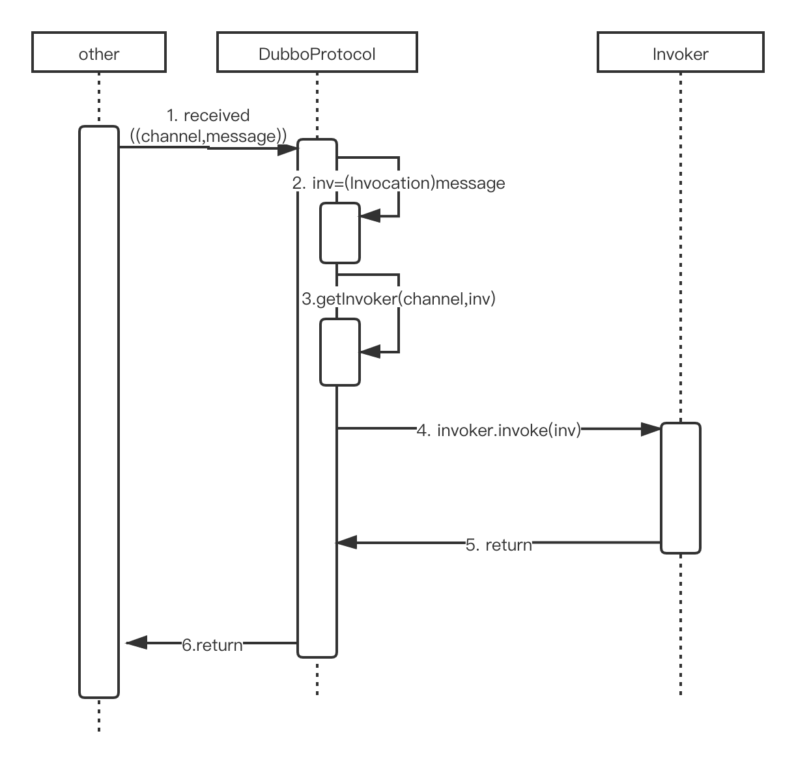

# Protocol

通过[Provider](./2.Provider.md)这篇文章，我们了解到，Dubbo服务暴露通过`ServiceConfig.export()`方法进行暴露，真正暴露到外部，而暴露到远程服务时有两种方式：

1. 暴露到服务注册中心
2. 直连方式暴露

暴露到服务注册中心时由`RegistryProtocol.export()`与服务注册中心进行交互，而直连方式暴露时由`业务协议.export()`进行服务暴露。

其实暴露到服务注册中心的处理逻辑包含直连方式的处理逻辑，因此，为了较为清晰的拆解这个问题，笔者先介绍直连方式暴露服务的逻辑，再介绍暴露到服务注册中心的逻辑。

## 1. 直连方式暴露

通过直连方式暴露服务运行的是`ServiceConfig.doExportUrlsFor1Protocol(...)`中的这部分逻辑：

```java
Invoker<?> invoker = proxyFactory.getInvoker(ref, (Class) interfaceClass, url);
DelegateProviderMetaDataInvoke wrapperInvoker = newDelegateProviderMetaDataInvoke(invoker, this);
Exporter<?> exporter =protocol.export(wrapperInvoker;
exporters.add(exporter);
```

其中ProxyFactory生成Invoker的相关逻辑请参考[2-1.ProxyFactory](./2-1.ProxyFactory.md)。这里主要介绍

```java
Exporter<?> exporter =protocol.export(wrapperInvoker;
```

经过之前的分析，我们知道这里的`protocol`是一个自适应代理，具体调用的`Protocol`实现取决于`wrapperInvoker.getUrl()`获取到的URL的具体协议，按照笔者提供的例子，这里的URL应为：

```
dubbo://192.168.12.64:20880/com.books.dubbo.demo.api.GreetingService?anyhost=true&application=first-dubbo-provider&bind.ip=192.168.12.64&bind.port=20880&default.deprecated=false&default.dynamic=false&default.register=true&deprecated=false&dubbo=2.0.2&dynamic=false&generic=false&group=dubbo&interface=com.books.dubbo.demo.api.GreetingService&methods=sayHello,testGeneric&pid=4385&register=true&release=2.7.1&revision=1.0.0&side=provider&timestamp=1610713667487&version=1.0.0
```

即服务URL。可以看到，协议名为dubbo，参考SPI配置文件`org.apache.dubbo.rpc.Protocol`：

```java
dubbo=org.apache.dubbo.rpc.protocol.dubbo.DubboProtocol
```

自适应代理将调用逻辑最后交给`DubboProtocol`处理，即这里调用的是`DubboProtocol.export(Invoker<T> invoker)`方法。

注意，DubboProtocol的功能是将Service暴露到外部，以供调用端访问，我们可以称之为是将接口导出到外部，因此`DubboProtocol.export(Invoker<T> invoker)`的结果是一个`Exporter`对象。查看`Exporter`接口代码：

```java
public interface Exporter<T> {
    Invoker<T> getInvoker();

    void unexport();
}
```

可以看到， `Exporter`暴露了两个方法：

1. getInvoker()：之前已经提到，invoker是Dubbo暴露出去的服务的一个代理，真正实现业务操作都需要通过invoker进行代理（路由）。
2. unexport()：服务要隐藏时需要使用该方法。

我们都知道Dubbo底层默认使用的是Netty，那么Dubbo的Exporter到底如何与Netty进行整合呢？这里考察`org.apache.dubbo.rpc.protocol.dubbo.DubboProtocol#export`方法：

```java
public <T> Exporter<T> export(Invoker<T> invoker) throws RpcException {
    URL url = invoker.getUrl();
    // 获取服务唯一标识
    String key = serviceKey(url);
    // 封装Exporter
    DubboExporter<T> exporter = new DubboExporter<T>(invoker, key, exporterMap);
    exporterMap.put(key, exporter);
    // 处理Stub
    Boolean isStubSupportEvent = url.getParameter(Constants.STUB_EVENT_KEY, Constants.DEFAULT_STUB_EVENT);
    Boolean isCallbackservice = url.getParameter(Constants.IS_CALLBACK_SERVICE, false);
    if (isStubSupportEvent && !isCallbackservice) {
        String stubServiceMethods = url.getParameter(Constants.STUB_EVENT_METHODS_KEY);
        if (stubServiceMethods == null || stubServiceMethods.length() == 0) {
            if (logger.isWarnEnabled()) {
                logger.warn(new IllegalStateException("consumer [" + url.getParameter(Constants.INTERFACE_KEY) +
                        "], has set stubproxy support event ,but no stub methods founded."));
            }
        } else {
            stubServiceMethodsMap.put(url.getServiceKey(), stubServiceMethods);
        }
    }
    // 创建Netty - server
    openServer(url);
    // 整合序列化优化器
    optimizeSerialization(url);
    return exporter;
}
```

该方法主要处理了5件事：

1. 获取服务唯一标识
2. 将服务封装成Exporter，并放入exporterMap中
3. 处理Stub
4. 启动Netty服务器
5. 整合序列化优化器

这里，我们主要关注1、2、4，这三件事。原因是：

1. 我们需要了解Dubbo对服务划分的粒度以及定义
2. 由代码可以看出，Exporter并没有与Netty服务进行直接交互，所以exporterMap就成为了关键。
4. Netty服务器启动过程中必然有整合Dubbo业务的配置，所以需要详细讨论

至于剩下两部分：

3. Stub是Dubbo的一个小插件，其功能我们在分析完Provider流程后会进行讨论
5. 序列化部分是Dubbo的一个大模块，这个模块需要进行详细讨论，这里便不再分析。

### 1.1 Dubbo 服务划分

对于Dubbo来说，一个服务由四元组组成：`<协议端口,服务名,版本号,服务分组>`，这唯一确定了一个服务。`DubboProtocol.export(xxx)`方法中，通过URL获取这四元组中的内容：

```java
URL url = invoker.getUrl();
String key = serviceKey(url);
```
这里获取到的URL就是描述服务本身的服务URL，`serviceKey(String)`方法负责从URL中提取上面所说的四元组：

```java
protected static String serviceKey(URL url) {
    // 获取URL中指定的协议端口号
    int port = url.getParameter(Constants.BIND_PORT_KEY, url.getPort());
    // 通过协议端口号+serviceName+服务版本号+服务组别名称 获取serviceKey
    return serviceKey(port, url.getPath(), url.getParameter(Constants.VERSION_KEY),
            url.getParameter(Constants.GROUP_KEY));
}
// 该方法负责将上述四元组格式化为 
//        服务组别/服务名:版本号:端口号
// 的格式
protected static String serviceKey(int port, String serviceName,String serviceVersion, String serviceGroup) {
    return ProtocolUtils.serviceKey(port, serviceName, serviceVersion, serviceGroup);
}
```

### 1.2 封装Exporter

对于Protocol这一层，输入是服务URL，输出是Exporter即导出器，DubboProtocol生成的是`DubboExporter`，类继承结构如下:



`Exporter`接口已经介绍过了，这里笔者继续介绍`AbstractExporter`，该类主要提供了`Exporter`的一些基础属性以及基础的销毁方法，保证了Log的统一，存储了Invoker，最后保证了销毁时必须对invoker进行销毁的逻辑。

如：

1. Log相关，保证了Log的统一
   ```java
    protected final Logger logger = LoggerFactory.getLogger(getClass());
   ```
2. 基础属性，存储了Invoker
   ```java
    private final Invoker<T> invoker;
   ```
3. 销毁相关，销毁时必须对invoker进行销毁的逻辑
   ```java
    private volatile boolean unexported = false;
    @Override
    public void unexport() {
        if (unexported) {
            return;
        }
        unexported = true;
        getInvoker().destroy();
    }
   ```

对于DubboExporter来说，笔者已经提到，DubboExporter并没有直接交给Netty来进行暴露，而是存放到了一个名为`exporterMap`的Map中，那么服务暴露必然和`exporterMap`有关。然而当服务销毁时自然要维护`exporterMap`，因此`DubboExporter`提供了这种支持：

```java
private final Map<String, Exporter<?>> exporterMap;
@Override
public void unexport() {
    super.unexport();
    exporterMap.remove(key);
}
```

### 1.3 开启Netty服务

DubboProtocol中，通过`openServer(URL url)`方法开启端口监听。
```java
private void openServer(URL url) {
// find server.
String key = url.getAddress();
//client can export a service which's only forserver to invoke
boolean isServer = url.getParameter(ConstantsIS_SERVER_KEY, true);
if (isServer) {
    ExchangeServer server = serverMap.get(key);
    if (server == null) {
        synchronized (this) {
            server = serverMap.get(key);
            if (server == null) {
                serverMap.put(key, createServer(url));
            }
        }
    } else {
        // server supports reset, use together with override
        server.reset(url);
    }
}
```


防止重复创建Server，Netty这里设置了一个缓存`ServerMap`，缓存的key是本服务的host+port，value就是具建的Server对象。Dubbo将其称为`ExchangeServer`。新建hangeServer`的方法是`createServer(URL url)`。

```java
private ExchangeServer createServer(URL url) {
    url = URLBuilder.from(url)
            // send readonly event when server closes, it's enabled by default
            .addParameterIfAbsent(Constants.CHANNEL_READONLYEVENT_SENT_KEY, Boolean.TRUE.toString())
            // 健康监测
            .addParameterIfAbsent(Constants.HEARTBEAT_KEY, String.valueOf(Constants.DEFAULT_HEARTBEAT))
            .addParameter(Constants.CODEC_KEY, DubboCodec.NAME)
            .build();
    // 代码点1 获取服务器类型，如果不指定默认是dubbo
    String str = url.getParameter(Constants.SERVER_KEY, Constants.DEFAULT_REMOTING_SERVER);
    // 代码点2 通过服务器类型查找Transporter
    if (str != null && str.length() > 0 && !ExtensionLoader.getExtensionLoader(Transporter.class).hasExtension(str)) {
        throw new RpcException("Unsupported server type: " + str + ", url: " + url);
    }
    ExchangeServer server;
    try {
        // 代码点3 通过URL开启服务器端口监听功能
        server = Exchangers.bind(url, requestHandler);
    } catch (RemotingException e) {
        throw new RpcException("Fail to start server(url: " + url + ") " + e.getMessage(), e);
    }
    // 代码点4 校验客户端是否支持
    str = url.getParameter(Constants.CLIENT_KEY);
    if (str != null && str.length() > 0) {
        Set<String> supportedTypes = ExtensionLoader.getExtensionLoader(Transporter.class).getSupportedExtensions();
        if (!supportedTypes.contains(str)) {
            throw new RpcException("Unsupported client type: " + str);
        }
    }
    return server;
}
```
该方法主要处理了如下4个步骤：

1. 通过URL中的`server`属性获取服务器类型，默认是`netty`
2. 通过服务器类型查找`Transporter`
   Dubbo将具体进行端口暴露的服务器称为`Transporter`，这里默认获取到的是netty对应的`org.apache.dubbo.remoting.transport.netty4.NettyTransporter`。
3. 通过URL开启服务器端口监听功能
4. 校验客户端是否支持

这里我们主要考察第3步：

```java
ExchangeServer server;
try {
    server = Exchangers.bind(url, requestHandler);
} catch (RemotingException e) {
    throw new RpcException("Fail to start server(url: " + url + ") " + e.getMessage(), e);
}
```

可以看到，Dubbo开启端口监听服务是交给`Exchangers`完成的，入参有两个，其中的url读者应该比较了解了，而`requestHandler`又是什么呢？

众所周知Netty是基于事件监听机制的服务端框架，这种机制广泛应用于各种中间件，例如redis、zookeeper。Dubbo默认使用的是netty，它将这种模式进行了封装，`requestHandler`用于处理业务逻辑，里面对应的几个方法分别处理不同的事件。关于Netty具体的细节，笔者之后会在其余的部分进行讲解。这里对`requestHandler`进行简单讲解。`requestHandler`的类型是`ExchangeHandlerAdapter`，该类是一个抽象类，考察其类继承关系：



其中各类的职责如下：

1. ChannelHandler：规定网络事件处理所需要的方法，ChannelHandler共规定了5个方法：
   1. connected：与客户端建立连接
   2. disconnected：与客户端断开连接
   3. sent：需要进行数据发送
   4. received：读取到数据
   5. caught：抛出异常
2. TelnetHandler：处理Telnet访问
3. ExchangeHandler：Dubbo将TCP协议传输的数据同样封装了Request和Response，ExchangeHandler处理了对应的逻辑

其余的类，除了`TelnetHandlerAdapter`，提供的都是一些空方法，而`TelnetHandlerAdapter`提供了处理telnet访问Dubbo的处理逻辑。

`ChannelHandler`用于将事件监听机制和具体的业务方法联系在一起。具体如何进行联系的，笔者会在介绍服务调用时具体流程的文章中介绍。

接下来继续介绍`Exchangers.bind(url,requestHandler)`这个方法：

```java
public static ExchangeServer bind(URL url, ExchangeHandler handler) throws RemotingException {
    if (url == null) {
        throw new IllegalArgumentException("url == null");
    }
    if (handler == null) {
        throw new IllegalArgumentException("handler == null");
    }
    // 代码点1 指定Exchanger使用的codec参数
    url = url.addParameterIfAbsent(Constants.CODEC_KEY, "exchange");
    // 代码点3 将requestHandler绑定到Exchanger上
    return getExchanger(url).bind(url, handler);
}

public static Exchanger getExchanger(URL url) {
    String type = url.getParameter(Constants.EXCHANGER_KEY, Constants.DEFAULT_EXCHANGER);
    //代码点2 根据Exchanger类型获取Exchanger
    return getExchanger(type);
}
public static Exchanger getExchanger(Stringtype) {
    return ExtensionLoader.getExtensionLoader(Exchanger.class).getExtension(type);
}
```

`Exchangers.bind(url,requestHandler)`方法进行了3步操作：

1. 如果URL没有指定codec参数，那么为其添加参数`codec=exchange`
2. 根据URL获取Exchanger，默认使用的是`HeaderExchanger`
3. 将Protocol层提供的RequestHandler绑定到Exchanger上

这里有一个疑问，为何要给URL中添加`codec=exchange`参数？这个问题我们会在介绍Exchanger中进行解答。

下面我们先看`getExchanger(url).bind(url, handler)`这行代码。经过上面的分析我们已经了解到，`getExchanger(url)`默认使用的是`HeaderExchanger`，考察该类的`bind(URL url, ExchangeHandler handler)`方法：

```java
@Override
public ExchangeServer bind(URL url,ExchangeHandler handler) throwsRemotingException {
    return new HeaderExchangeServer(Transporters.bind(url, new DecodeHandler(new HeaderExchangeHandler(handler))));
}
```

`HeaderExchanger`使用装饰器模式，为`handler`添加了两层装饰器`DecodeHandler`和`HeaderExchangeHandler`，并将Server使用`HeaderExchangeServer`进行装饰。至于这三个类的具体作用，将会在介绍Exchanger时进行详细介绍。

## 2. 直连方式处理请求

在上面，笔者提到了`DubboProtocol`中的`requestHandler`属性，该属性是`ExchangeHandlerAdapter`类型，其功能就是将Dubbo调用转化为`Invocation`交给`Invoker`进行处理。

当Consumer调用Provider时，ExchangeHandler会将请求转到`requestHandler.received(Channel channel, Object message)`方法，即`DubboProtocol.requestHandler.received(Channel channel, Object message)方法`，源码如下：

```java
@Override
public void received(Channel channel,Object message) throws RemotingException {
    if (message instanceof Invocation) {
        reply((ExchangeChannel) channel, message);
    } else {
        super.received(channel, message);
    }
}
```

如果是Dubbo协议的RPC调用，message是Invocation类型，会调用`reply(ExchangeChannel channel, Object message)`方法：

```java
@Override
public CompletableFuture<Object> reply(ExchangeChannel channel, Object message)throws RemotingException {
    if (!(message instanceof Invocation)) {
        throw new RemotingException(channel, "Unsupported request: "
                + (message == null ? null : (message.getClass().getName() + ": " + message))
                + ", channel: consumer: " + channel.getRemoteAddress() + " --> provider: " + channel.getLocalAddress());
    }
    // 获取Invocation对象
    Invocation inv = (Invocation) message;
    // 通过Invocation对象获取执行器
    Invoker<?> invoker = getInvoker(channel, inv);
    // need to consider backward-compatibility if it's a callback
    if (Boolean.TRUE.toString().equals(inv.getAttachments().get(IS_CALLBACK_SERVICE_INVOKE))) {
        String methodsStr = invoker.getUrl().getParameters().get("methods");
        boolean hasMethod = false;
        if (methodsStr == null || !methodsStr.contains(",")) {
            hasMethod = inv.getMethodName().equals(methodsStr);
        } else {
            String[] methods = methodsStr.split(",");
            for (String method : methods) {
                if (inv.getMethodName().equals(method)) {
                    hasMethod = true;
                    break;
                }
            }
        }
        if (!hasMethod) {
            logger.warn(new IllegalStateException("The methodName " + inv.getMethodName()
                    + " not found in callback service interface ,invoke will be ignored."
                    + " please update the api interface. url is:"
                    + invoker.getUrl()) + " ,invocation is :" + inv);
            return null;
        }
    }
    // 构建RPCContext
    RpcContext rpcContext = RpcContext.getContext();
    rpcContext.setRemoteAddress(channel.getRemoteAddress());
    // 使用执行器执行具体的业务逻辑
    Result result = invoker.invoke(inv);
    if (result instanceof AsyncRpcResult) {
        return ((AsyncRpcResult) result).getResultFuture().thenApply(r -> (Object) r);
    } else {
        return CompletableFuture.completedFuture(result);
    }
}
```

`reply(ExchangeChannel channel, Object message)`在接收到RPC调用后，会根据客户端传入的消息，获取对应的执行器`Invoker`，然后通过方法名和参数唯一确定一个方法，进行业务逻辑调用。经过上一节的描述我们已经了解到，对于每个`Invoker`都会被包装为`Exporter`，然后放入`exporterMap`中，其中`exporterMap`的key是通过`serviceKey`方法获取的。`serviceKey`通过4个参数获取key:`服务组别/服务名:版本号:端口号`。

`getInvoker(Invocation)`就通过相同的方式获取serviceKey，然后取出对应的`Exporter`，再由`Exporter`获取`Invoker`执行具体的业务逻辑。如下XML所示。




## 总结

本节主要介绍了Dubbo采用直连方式暴露服务时，Protocol的主要流程，以及在Dubbo处理RPC调用时Protocol层的主要操作流程。

Dubbo的Protocol层上层是Invoker，下层是Exchanger，笔者接下来会对Exchanger层进行介绍。