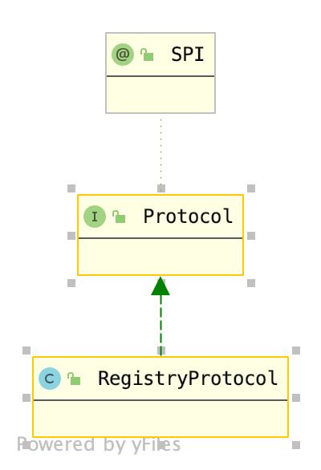

# 2-3 RegistryProtocol

通过[Provider](./2.Provider.md)这篇文章，我们了解到，Dubbo服务暴露通过`ServiceConfig.export()`方法进行暴露，真正暴露到外部，而暴露到远程服务时有两种方式：

1. 暴露到服务注册中心
2. 直连方式暴露

暴露到服务注册中心时由`RegistryProtocol.export()`与服务注册中心进行交互，而直连方式暴露时由`业务协议.export()`进行服务暴露。

[2-2.Protocol](./2-2.Protocol.md)描述了直连方式暴露服务的主要流程，以及RPC请求到达时，服务端如何对其进行处理的。本节主要描述将服务暴露到服务注册中心这种方式的主要流程。

Dubbo将`将服务暴露到服务注册中心`和`暴露服务到外网`分为两步处理，后者就是通过[2-2.Protocol](./2-2.Protocol.md)描述的过程进行处理的。而前者则是通过`RegistryProtocol`处理的，我们甚至可以说，Dubbo一切与服务注册中心的交互都是由`RegistryProtocol`处理的。

`RegistryProtocol`的类继承结构如下图所示：



该类实现了`Protocol`接口，对于服务提供方，我们只关注`Protocol.export(Invoker<T> invoker)`方法，该方法负责创建Exporter，下面我们对该方法进行分析。

## 1. 为何调用的是RegistryProtocol？

首先回顾一下，调用`ServiceConfig`调用`RegistryProtocol`的大体流程，在进行服务暴露时，`ServiceConfig`创造了两类URL，一个是服务注册中心URL（registry开头），另一个是服务本身的URL。Dubbo将服务本身的URL进行URL编码，然后作为服务注册中心URL的`export`参数，具体实现代码如下：

```java
Invoker<?> invoker = proxyFactory.getInvoker(ref, (Class) interfaceClass, registryURL.addParameterAndEncoded(Constants.EXPORT_KEY, url.toFullString()));
```

因此，invoker的getURL()接口获取到的就是`registryURL`，而`registryURL`的协议是`registry`，所以`protocol`自适应代理获取到的`Protocol`就是`RegistryProtocol`。

## 2. RegistryProtocol的主要流程

考察`RegistryProtocol.export`方法的主要流程：

```java
public <T> Exporter<T> export(final Invoker<T> originInvoker) throws RpcException {
    // 代码点1 获取注册中心URL以及服务URL
    URL registryUrl = getRegistryUrl(originInvoker);
    // url to export locally
    URL providerUrl = getProviderUrl(originInvoker);
    // 代码点2 创建监听器
    final URL overrideSubscribeUrl = getSubscribedOverrideUrl(providerUrl);
    final OverrideListener overrideSubscribeListener = new OverrideListener(overrideSubscribeUrl, originInvoker);
    overrideListeners.put(overrideSubscribeUrl, overrideSubscribeListener);
    providerUrl = overrideUrlWithConfig(providerUrl, overrideSubscribeListener);
    // 代码点3 暴露服务
    final ExporterChangeableWrapper<T> exporter = doLocalExport(originInvoker, providerUrl);
    // 代码点4 获取服务注册中心
    final Registry registry = getRegistry(originInvoker);
    final URL registeredProviderUrl = getRegisteredProviderUrl(providerUrl, registryUrl);
    ProviderInvokerWrapper<T> providerInvokerWrapper = ProviderConsumerRegTable.registerProvider(originInvoker,
            registryUrl, registeredProviderUrl);
    // 代码点5 注册服务到注册中心
    boolean register = registeredProviderUrl.getParameter("register", true);
    if (register) {
        register(registryUrl, registeredProviderUrl);
        providerInvokerWrapper.setReg(true);
    }

    registry.subscribe(overrideSubscribeUrl, overrideSubscribeListener);
    exporter.setRegisterUrl(registeredProviderUrl);
    exporter.setSubscribeUrl(overrideSubscribeUrl);

    return new DestroyableExporter<>(exporter);
}
```

该方法主要完成了5个步骤：

1. 获取注册中心URL和服务URL
   通过第一部分的介绍，我们已经知道，`ServiceConfig`在暴露服务时给`Protocol`传入的URL包含了两部分信息：
   - 服务注册中心URL
   - 服务本身URL
   
   但将这两部分信息拼接成了一个URL，现在需要将其分开，对应的方法就是`getRegistryUrl`和`getProviderUrl`。

   在笔者的主机中，`RegistryProtocol.export`获取到的URL是：

   ```
    registry://localhost:2181/org.apache.dubbo.registry.RegistryService?application=first-dubbo-provider&dubbo=2.0.2&export=dubbo%3A%2F%2F192.168.12.64%3A20880%2Fcom.books.dubbo.demo.api.GreetingService%3Fanyhost%3Dtrue%26application%3Dfirst-dubbo-provider%26bind.ip%3D192.168.12.64%26bind.port%3D20880%26default.deprecated%3Dfalse%26default.dynamic%3Dfalse%26default.register%3Dtrue%26deprecated%3Dfalse%26dubbo%3D2.0.2%26dynamic%3Dfalse%26generic%3Dfalse%26group%3Ddubbo%26interface%3Dcom.books.dubbo.demo.api.GreetingService%26methods%3DsayHello%2CtestGeneric%26pid%3D5025%26register%3Dtrue%26release%3D2.7.1%26revision%3D1.0.0%26side%3Dprovider%26timestamp%3D1611734361833%26version%3D1.0.0&pid=5025&registry=zookeeper&release=2.7.1&timestamp=1611734361816
   ```

    registryUrl获取方法为:

    上面的URL将`registry`字段设置成协议，并删除该字段，如果没有这个字段，协议设置为`dubbo`，处理结果如下：

    ```
    zookeeper://localhost:2181/org.apache.dubbo.registry.RegistryService?application=first-dubbo-provider&dubbo=2.0.2&export=dubbo%3A%2F%2F192.168.12.64%3A20880%2Fcom.books.dubbo.demo.api.GreetingService%3Fanyhost%3Dtrue%26application%3Dfirst-dubbo-provider%26bind.ip%3D192.168.12.64%26bind.port%3D20880%26default.deprecated%3Dfalse%26default.dynamic%3Dfalse%26default.register%3Dtrue%26deprecated%3Dfalse%26dubbo%3D2.0.2%26dynamic%3Dfalse%26generic%3Dfalse%26group%3Ddubbo%26interface%3Dcom.books.dubbo.demo.api.GreetingService%26methods%3DsayHello%2CtestGeneric%26pid%3D5025%26register%3Dtrue%26release%3D2.7.1%26revision%3D1.0.0%26side%3Dprovider%26timestamp%3D1611734361833%26version%3D1.0.0&pid=5025&release=2.7.1&timestamp=1611734361816
    ```
    
    服务URL的获取方法是：原URL的export属性进行URL解码，本例中获取到的该URL是：

    ```
    dubbo://192.168.12.64:20880/com.books.dubbo.demo.api.GreetingService?anyhost=true&application=first-dubbo-provider&bind.ip=192.168.12.64&bind.port=20880&default.deprecated=false&default.dynamic=false&default.register=true&deprecated=false&dubbo=2.0.2&dynamic=false&generic=false&group=dubbo&interface=com.books.dubbo.demo.api.GreetingService&methods=sayHello,testGeneric&pid=5025&register=true&release=2.7.1&revision=1.0.0&side=provider&timestamp=1611734361833&version=1.0.0
    ```

2. 创建监听器
   这部分首先通过`getSubscribedOverrideUrl`方法对上面获取到的服务URL进行处理，处理过程为：
   1. 修改协议名为provider
   2. 为URL添加默认参数

    然后为Provider创建了一个监听器，类型是OverrideListener，目的是为了方便服务注册中心信息修改之后可以得到通知，对于监听器的具体执行逻辑，将在第5步讲解。
3. 暴露服务
   我们已经知道`RegistryProtocol`仅仅用于与服务注册中心进行交互，真正的服务暴露仍然是通过[上一节](./2-2.Protocol.md)所描述的直连暴露方式进行服务暴露，调用对应的业务Protocol的方法就是下面这行代码。
    ```java
    final ExporterChangeableWrapper<T> exporter = doLocalExport(originInvoker, providerUrl);
    ```
    注意这里传入的是providerUrl，这样就和[上一节](./2-2.Protocol.md)讲述的场景完全相同了，考察`doLocalExport`方法源码如下：

    ```java
    private final ConcurrentMap<String, ExporterChangeableWrapper<?>> bounds = new ConcurrentHashMap<>();

    private <T> ExporterChangeableWrapper<T> doLocalExport(final Invoker<T> originInvoker, URL providerUrl) {
        String key = getCacheKey(originInvoker);

        return (ExporterChangeableWrapper<T>) bounds.computeIfAbsent(key, s -> {
            Invoker<?> invokerDelegete = new InvokerDelegate<>(originInvoker, providerUrl);
            return new ExporterChangeableWrapper<>((Exporter<T>) protocol.export(invokerDelegete), originInvoker);
        });
    }
    ```

    注意，这里`protocol.export(invokerDelegete)`处理的是`invokerDelegete`，而不是`originInvoker`，否则，就会再调用回`RegistryProtocol`。

4. 获取服务注册中心客户端实例
    服务暴露之后需要与服务注册中心进行交流，这种交流是通过一个客户端程序，对于Dubbo来说，服务注册中心有多种，因此他们被同一封装成了`Registry`接口。而获取具体实现的方法是`getRegistry(final Invoker<?> originInvoker)`：

    ```java
    private RegistryFactory registryFactory;

    public void setRegistryFactory(RegistryFactory registryFactory) {
        this.registryFactory = registryFactory;
    }

    private Registry getRegistry(final Invoker<?> originInvoker) {
        URL registryUrl = getRegistryUrl(originInvoker);
        return registryFactory.getRegistry(registryUrl);
    }
    ```    

    根据之前SPI中描述的自动注入的逻辑，这里Dubbo会将一个`RegistryFactory`类型的自适应代理注入，考察`RegistryFactory`接口：

    ```java
    @SPI("dubbo")
    public interface RegistryFactory {
        @Adaptive({"protocol"})
        Registry getRegistry(URL url);
    }
    ```

    可以看到，`RegistryFactory`通过url的协议获取对应的Registry，笔者这里使用的是`zk`，因此这里找到`ZookeeperRegistryFactory`类：
    
    ```java
    public class ZookeeperRegistryFactory extends AbstractRegistryFactory {
        @Override
        public Registry createRegistry(URL url) {
            return new ZookeeperRegistry(url, zookeeperTransporter);
        }

    }
    ```

5. 注册服务到服务注册中心

    将服务注册到服务注册中心时，存入的元数据仍然是一个URL，不过不是上面提到的3个URL中的任意一个，而是另一条URL。这个URL是通过Provider URL进行转换过来的，存储这个URL是因为Provider URL有许多运行时相关的配置，而服务注册中心中的配置应与运行状态无关，因此，Dubbo对Provider URL进行了转化，负责转化的方法是`getRegisteredProviderUrl`，由于只是字符串操作，这里不多赘述。

    获取到需要注册的信息后，需要将这部分信息存储到服务注册中心中，即执行注册方法：

    ```java
    register(registryUrl, registeredProviderUrl);
    
    public void register(URL registryUrl, URL registeredProviderUrl) {
        Registry registry = registryFactory.getRegistry(registryUrl);
        registry.register(registeredProviderUrl);
    }
    ```

    这里重复了根据URL获取Registry的步骤，最终获取到的仍是之前的Registry，这里以`ZookeeperRegistry`为例：

    ```java
    @Override
    public void register(URL url) {
        ...
        try {
            // Sending a registration request to the server side
            doRegister(url);
        } catch (Exception e) {
            ...
        }
    }

    @Override
    public void doRegister(URL url) {
        try {
            zkClient.create(toUrlPath(url), url.getParameter(Constants.DYNAMIC_KEY, true));
        } catch (Throwable e) {
            throw new RpcException("Failed to register " + url + " to zookeeper " + getUrl() + ", cause: " + e.getMessage(), e);
        }
    }
    ```    

    注意，这里作为输入参数的URL，是上面进行转化过的与执行状态无关的URL，但是仍然只是URL，对于ZK，要把URL转化成一个路径，`toUrlPath(String)`就做了这样一件事。路径格式：

    1. 