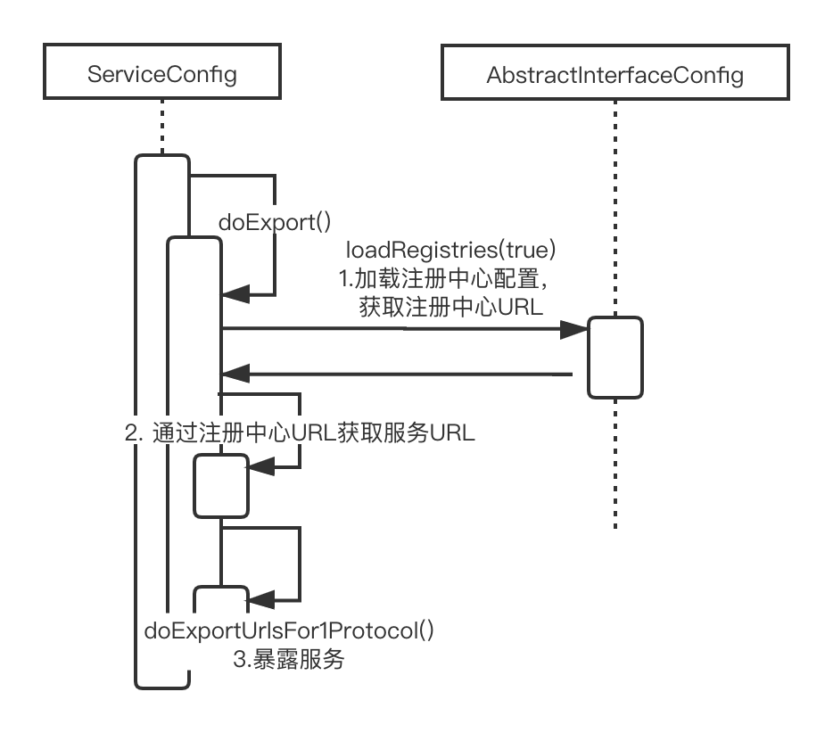

# 2.Provider

Dubbo的Provider端首先必须要先将服务对外暴露，Consumer才可以进行调用。

通常情况下，Provider是通过一个如下结构的XML文件将服务对外暴露的：

```xml
<?xml version="1.0" encoding="UTF-8"?>
<beans xmlns="http://www.springframework.org/schema/beans"
       xmlns:xsi="http://www.w3.org/2001/XMLSchema-instance"
       xmlns:dubbo="http://dubbo.apache.org/schema/dubbo"
       xsi:schemaLocation="http://www.springframework.org/schema/beans        http://www.springframework.org/schema/beans/spring-beans-4.3.xsd        http://dubbo.apache.org/schema/dubbo        http://dubbo.apache.org/schema/dubbo/dubbo.xsd">

    <!-- 提供方应用信息，用于计算依赖关系 -->
    <dubbo:application name="topic-service" organization="xdk" />

    <!-- 使用multicast广播注册中心暴露服务地址 -->
    <dubbo:registry  address="zookeeper://172.16.208.180:2181,172.16.208.181:2181,172.16.208.182:2181" />
    <!-- 用dubbo协议在20880端口暴露服务 -->
    <dubbo:protocol name="dubbo" port="20880" />

    <!-- 声明需要暴露的服务接口 -->
    <dubbo:service interface="com.sharedaka.topic.business.service.XdkHabitTopicService" ref="xdkHabitTopicService" group="PROD" validation="true" version="1.0.0" />

    <!-- 和本地bean一样实现服务 -->
    <bean id="xdkHabitTopicService" class="com.sharedaka.topic.business.service.impl.XdkHabitTopicServiceImpl" />
</beans>
```

Dubbo将该XML文件解析成对应的ServiceConfig对象，然后将Service暴露出去，即完成了服务的暴露。我们可以不使用XML文件进行服务的暴露：

```java
public class ApiProvider {

	public static void main(String[] args) throws IOException {
		// 1.创建ServiceConfig实例
		ServiceConfig<GreetingService> serviceConfig = new ServiceConfig<GreetingService>();
		// 2.设置应用程序配置
		serviceConfig.setApplication(new ApplicationConfig("first-dubbo-provider"));

		// 3.设置服务注册中心信息
		RegistryConfig registryConfig = new RegistryConfig("zookeeper://localhost:2181");
		serviceConfig.setRegistry(registryConfig);
		// 4.设置接口与实现类
		serviceConfig.setInterface(GreetingService.class);
		serviceConfig.setRef(new GreetingServiceImpl());

		// 5.设置服务分组与版本 
		serviceConfig.setVersion("1.0.0");
		serviceConfig.setGroup("dubbo");
		
		// 6.导出服务
		serviceConfig.export();

		// 7.挂起线程，避免服务停止
		System.out.println("server is started");
		System.in.read();
	}
}
```

上述代码将服务暴露分为6步，其中前5步都是组装配置，第6步暴露服务。考察Dubbo的架构图：


对于服务提供方来看，Config和Service层是接口层。Service就是服务提供方负责实现的接口，而Config则是Dubbo相关配置，对于服务提供方来说，使用的是`org.apache.dubbo.config.ServiceConfig`。该类的类继承结构图如下：


由于ServiceConfig中配置项过多，为了不让读者感觉过于枯燥，笔者准备在源码分析过程中进行介绍。

`serviceConfig.export();`是暴露服务的核心方法，下面我们开始对其进行分析。

## 2.1 服务暴露 - ServiceConfig.export()

由于ServiceConfig的复杂性，服务在暴露之前会首先进行校验，然后再进行服务暴露，`ServiceConfig.export()`方法源码如下：

```java
// 延迟暴露定时任务
private static final ScheduledExecutorService delayExportExecutor = Executors.newSingleThreadScheduledExecutor(new NamedThreadFactory("DubboServiceDelayExporter", true));

public synchronized void export() {
    // 1. 校验和更新子配置
    checkAndUpdateSubConfigs();

    if (!shouldExport()) {
        return;
    }
    // 2. 处理延迟暴露
    if (shouldDelay()) {
        delayExportExecutor.schedule(this::doExport, delay, TimeUnit.MILLISECONDS);
    } else {
        // 3. 暴露服务
        doExport();
    }
}
```

Dubbo提供了延迟暴露的功能，可以指定一个时间，在这段时间之后进行再暴露服务，实现这个功能是通过一个定时任务处理器，即`delayExportExecutor`完成的。核心的暴露服务逻辑在`doExport()`方法中。

```java
protected synchronized void doExport() {
    // 校验服务是否导出
    // 避免重复导出服务
    if (unexported) {
        throw new IllegalStateException("The service " + interfaceClass.getName() + " has already unexported!");
    }
    if (exported) {
        return;
    }
    exported = true;

    if (StringUtils.isEmpty(path)) {
        path = interfaceName;
    }
    // 暴露服务
    doExportUrls();
}
```

在Dubbo中，每个服务对应一个URL，然后将这个URL注册到服务注册中心，`<协议,服务>`二元组唯一标识一个服务，因此这里使用的方法名是`doExportUrls()`，源码如下：

```java
private void doExportUrls() {
    // 1. 加载注册中心配置，获取注册中心URL
    List<URL> registryURLs = loadRegistries(true);
    for (ProtocolConfig protocolConfig : protocols) {
        // 2. 通过注册中心URL获取服务URL
        // 2-1. 获取服务名称
        String pathKey = URL.buildKey(getContextPath(protocolConfig).map(p -> p + "/" + path).orElse(path), group, version);
        // 2-2. 构建服务Provider实体
        ProviderModel providerModel = new ProviderModel(pathKey, ref, interfaceClass);
        // 2-3. 服务实体初始化，注册到providedServices
        ApplicationModel.initProviderModel(pathKey, providerModel);
        // 3. 暴露服务
        doExportUrlsFor1Protocol(protocolConfig, registryURLs);
    }
}
```

由于后面的调用逻辑比较复杂，这里给出时序图：



这里我们主要关注1、3两个步骤：

1. 加载注册中心配置-loadRegistries(boolean)，源码如下：

```java
protected List<URL> loadRegistries(boolean provider) {
    // check && override if necessary
    List<URL> registryList = new ArrayList<URL>();
    // 获取注册中心地址
    if (CollectionUtils.isNotEmpty(registries)) {
        for (RegistryConfig config : registries) {
            String address = config.getAddress();
            // 尝试添加默认注册中心地址
            if (StringUtils.isEmpty(address)) {
                address = Constants.ANYHOST_VALUE;
            }
            // 注册中心可用
            if (!RegistryConfig.NO_AVAILABLE.equalsIgnoreCase(address)) {
                // 构建注册中心服务包装URL
                Map<String, String> map = new HashMap<String, String>();
                // 给URL添加应用名
                appendParameters(map, application);
                // 根据RegistryConfig添加URL属性
                appendParameters(map, config);
                map.put(Constants.PATH_KEY, RegistryService.class.getName());
                appendRuntimeParameters(map);
                if (!map.containsKey(Constants.PROTOCOL_KEY)) {
                    map.put(Constants.PROTOCOL_KEY, Constants.DUBBO_PROTOCOL);
                }
                List<URL> urls = UrlUtils.parseURLs(address, map);
                // 注册中心URL可能是多个，因此这里是多个URL
                for (URL url : urls) {
                    url = URLBuilder.from(url)
                            .addParameter(Constants.REGISTRY_KEY, url.getProtocol())
                            .setProtocol(Constants.REGISTRY_PROTOCOL)
                            .build();
                    if ((provider && url.getParameter(Constants.REGISTER_KEY, true))
                            || (!provider && url.getParameter(Constants.SUBSCRIBE_KEY, true))) {
                        registryList.add(url);
                    }
                }
            }
        }
    }
    return registryList;
}
```

Dubbo支持多种注册中心，他们统一由`org.apache.dubbo.registry.integration.RegistryProtocol`进行处理，`RegistryProtocol`是接口`Protocol`的一种实现，考察Dubbo自身的SPI配置文件`org.apache.dubbo.rpc.Protocol`：

```
registry=org.apache.dubbo.registry.integration.RegistryProtocol
```

参考[1-0.SPI](./../1.SPI/1-0.SPI.md)可以知道，获取RegistryProtocol需要通过ExtensionLoader通过registry这个名字获取，`loadRegistries(boolean)`就指定了这个名字，这里仍以`ApiProvider`举例，`ApiProvider`配置如下：

- 注册中心URL：zookeeper://localhost:2181
- 应用名：first-dubbo-provider

`loadRegistries(boolean)`为其添加了一些基础配置：

- 处理类(path)：org.apache.dubbo.registry.integration.RegistryProtocol
- 应用名(application):first-dubbo-provider
- 协议名(protocol):dubbo
- 协议版本(version): 2.0.2
- 应用pid(pid):2664
- Dubbo包版本(release): 2.7.1
- 创建时间戳(timestamp): XXXX

拼接成URL为：`registry://localhost:2181/org.apache.dubbo.registry.RegistryService?application=first-dubbo-provider&dubbo=2.0.2&pid=2664&registry=zookeeper&release=2.7.1&timestamp=1610539655399`，`doExportUrlsFor1Protocol(ProtocolConfig protocolConfig, List<URL> registryURLs)`使用这个链接去暴露服务。

3. 为某个特定协议暴露服务-`doExportUrlsFor1Protocol(ProtocolConfig protocolConfig, List<URL> registryURLs)`

```java
private void doExportUrlsFor1Protocol(ProtocolConfig protocolConfig, List<URL> registryURLs) {
    // 根据配置文件拼接URL
    ...
    // 1. 获取服务暴露范围
    String scope = url.getParameter(Constants.SCOPE_KEY);
        // don't export when none is configured
    if (!Constants.SCOPE_NONE.equalsIgnoreCase(scope)) {
        // 2. 导出本地服务
        if (!Constants.SCOPE_REMOTE.equalsIgnoreCase(scope)) {
            exportLocal(url);
        }
        // 3. 导出远程服务
        if (!Constants.SCOPE_LOCAL.equalsIgnoreCase(scope)) {
            if (logger.isInfoEnabled()) {
                logger.info("Export dubbo service " + interfaceClass.getName() + " to url " + url);
            }
            if (CollectionUtils.isNotEmpty(registryURLs)) {
                // 具有服务注册中心地址
                for (URL registryURL : registryURLs) {
                    url = url.addParameterIfAbsent(Constants.DYNAMIC_KEY, registryURL.getParameter(Constants.DYNAMIC_KEY));
                    URL monitorUrl = loadMonitor(registryURL);
                    if (monitorUrl != null) {
                        url = url.addParameterAndEncoded(Constants.MONITOR_KEY, monitorUrl.toFullString());
                    }
                    if (logger.isInfoEnabled()) {
                        logger.info("Register dubbo service " + interfaceClass.getName() + " url " + url + " to registry " + registryURL);
                    }

                    // For providers, this is used to enable custom proxy to generate invoker
                    String proxy = url.getParameter(Constants.PROXY_KEY);
                    if (StringUtils.isNotEmpty(proxy)) {
                        registryURL = registryURL.addParameter(Constants.PROXY_KEY, proxy);
                    }

                    Invoker<?> invoker = proxyFactory.getInvoker(ref, (Class) interfaceClass, registryURL.addParameterAndEncoded(Constants.EXPORT_KEY, url.toFullString()));
                    DelegateProviderMetaDataInvoker wrapperInvoker = new DelegateProviderMetaDataInvoker(invoker, this);

                    Exporter<?> exporter = protocol.export(wrapperInvoker);
                    exporters.add(exporter);
                }
            } else {
                // 处理直连方式
                Invoker<?> invoker = proxyFactory.getInvoker(ref, (Class) interfaceClass, url);
                DelegateProviderMetaDataInvoker wrapperInvoker = new DelegateProviderMetaDataInvoker(invoker, this);

                Exporter<?> exporter = protocol.export(wrapperInvoker);
                exporters.add(exporter);
            }
            // 元数据存储
            MetadataReportService metadataReportService = null;
            if ((metadataReportService = getMetadataReportService()) != null) {
                metadataReportService.publishProvider(url);
            }
        }
    }
    this.urls.add(url);    
}
```

该方法主要完成了5个步骤：

1. 构建服务URL，注意`loadRegistries(boolean)`构建的是注册中心URL
2. 根据URL确定服务暴露方式：
   1. local:暴露本地服务
   2. remote:暴露远程服务。暴露远程服务又分两种：
      1. 将服务暴露到服务注册中心
      2. 单纯暴露服务，不注册到服务注册中心
3. 元数据上报

Dubbo暴露服务时，都是采用相同的步骤完成的：

Dubbo先通过`ProxyFactory`为被导出的接口生成代理，然后通过`Protocol`将服务暴露给外部。这里有一些细节笔者需要详细解释一下：

`ProxyFactory`创建代理时需要3个参数：

    1. 真正处理业务的接口实现
    2. 要被代理的接口的Class对象
    3. 服务的URL

考察`Protocol的自适应代理的export()方法实现`：

```java
    public org.apache.dubbo.rpc.Exporter export(org.apache.dubbo.rpc.Invoker arg0) throws org.apache.dubbo.rpc.RpcException {
        if (arg0 == null) throw new IllegalArgumentException("org.apache.dubbo.rpc.Invoker argument == null");
        if (arg0.getUrl() == null) throw new IllegalArgumentException("org.apache.dubbo.rpc.Invoker argument getUrl() == null");
        // 通过Invoker的getUrl()获取URL
        org.apache.dubbo.common.URL url = arg0.getUrl();
        // 从URL中的协议判断使用的Protocol实现
        String extName = ( url.getProtocol() == null ? "dubbo" : url.getProtocol() );
        if(extName == null) throw new IllegalStateException("Failed to get extension (org.apache.dubbo.rpc.Protocol) name from url (" + url.toString() + ") use keys([protocol])");
        org.apache.dubbo.rpc.Protocol extension = (org.apache.dubbo.rpc.Protocol)ExtensionLoader.getExtensionLoader(org.apache.dubbo.rpc.Protocol.class).getExtension(extName);
        return extension.export(arg0);
    }
```

因此，`Protocol.export()`这个方法的具体执行者是由URL决定的。

这里我们考察暴露服务的两种方式：

1. 导出本地服务-`exportLocal(URL url)`：
   ```java
    public static final String LOCAL_PROTOCOL = "injvm";
    private void exportLocal(URL url) {    
        if (!Constants.LOCAL_PROTOCOL.equalsIgnoreCase(url.getProtocol())) {
            // 构建本地服务暴露URL
            URL local = URLBuilder.from(url)
                    .setProtocol(Constants.LOCAL_PROTOCOL)
                    .setHost(LOCALHOST_VALUE)
                    .setPort(0)
                    .build();
            // 暴露本地服务
            Exporter<?> exporter = protocol.export(
                    proxyFactory.getInvoker(ref, (Class) interfaceClass, local));
            exporters.add(exporter);
            logger.info("Export dubbo service " + interfaceClass.getName() + " to local registry");
        }
    }
   ```

    此处构建的URL满足如下格式：

    `injvm://127.0.0.1/service全限定类名?服务配置`

    这里协议是injvm，因此暴露服务是通过`InjvmProtocol`处理的。

2. 导出远程服务
   1. 根据注册中心URL暴露服务
      ```java
        for (URL registryURL : registryURLs) {
            url = url.addParameterIfAbsent(Constants.DYNAMIC_KEY, registryURL.getParameter(Constants.DYNAMIC_KEY));
            URL monitorUrl = loadMonitor(registryURL);
            if (monitorUrl != null) {
                url = url.addParameterAndEncoded(Constants.MONITOR_KEY, monitorUrl.toFullString());
            }
            if (logger.isInfoEnabled()) {
                logger.info("Register dubbo service " + interfaceClass.getName() + " url " + url + " to registry " + registryURL);
            }

            // For providers, this is used to enable custom proxy to generate invoker
            String proxy = url.getParameter(Constants.PROXY_KEY);
            if (StringUtils.isNotEmpty(proxy)) {
                registryURL = registryURL.addParameter(Constants.PROXY_KEY, proxy);
            }

            Invoker<?> invoker = proxyFactory.getInvoker(ref, (Class) interfaceClass, registryURL.addParameterAndEncoded(Constants.EXPORT_KEY, url.toFullString()));
            DelegateProviderMetaDataInvoker wrapperInvoker = new DelegateProviderMetaDataInvoker(invoker, this);

            Exporter<?> exporter = protocol.export(wrapperInvoker);
            exporters.add(exporter);
        } 
      ```
   2. 直连方式暴露服务
      ```java
        Invoker<?> invoker = proxyFactory.getInvoker(ref, (Class) interfaceClass, url);
        DelegateProviderMetaDataInvoker wrapperInvoker = new DelegateProviderMetaDataInvoker(invoker, this);

        Exporter<?> exporter = protocol.export(wrapperInvoker);
        exporters.add(exporter);
      ```
    
    客户端在调用服务端服务时可以采用两种方式：
    1. 通过服务注册中心发现服务进行调用
    2. 直接通过IP+端口连接服务端进行调用，这种调用方式越过了服务注册中心，因此，如果服务端只支持这种方式调用，就没必要将自身注册到服务注册中心上。

    因此，可以看到1、2两种方式的不同：

    1方式在通过`ProxyFactory`创建代理时，使用的URL是`registryURL`，这个URL的协议是`registry`，对应的SPI实现是`org.apache.dubbo.registry.integration.RegistryProtocol`。
    2方式在通过`ProxyFactory`创建代理时，使用的URL是代表服务的URL，协议是`dubbo`，或者其他应用层协议，这里以`dubbo`协议为例，对应的SPI实现是`org.apache.dubbo.rpc.protocol.dubbo.DubboProtocol`

    之前提到了，Dubbo将所有和注册中心相关的操作全部放到了`RegistryProtocol`里面。那么问题来了，既然Dubbo在使用注册中心时将协议设置为了`registry`那么服务信息呢？查看这行代码：

    ```java
    Invoker<?> invoker = proxyFactory.getInvoker(ref, (Class) interfaceClass, registryURL.addParameterAndEncoded(Constants.EXPORT_KEY, url.toFullString()));
    ```

    通过`registryURL.addParameterAndEncoded(Constants.EXPORT_KEY, url.toFullString())`方法名显而易见，服务URL被通过URL转义放到了`Constants.EXPORT_KEY`属性中，笔者这里最后的URL是：
    
    ```
    registry://localhost:2181/org.apache.dubbo.registry.RegistryService?application=first-dubbo-provider&dubbo=2.0.2
    &export=dubbo%3A%2F%2F192.168.12.64%3A20880%2Fcom.books.dubbo.demo.api.GreetingService%3Fanyhost%3Dtrue%26application%3Dfirst-dubbo-provider%26bind.ip%3D192.168.12.64%26bind.port%3D20880%26default.deprecated%3Dfalse%26default.dynamic%3Dfalse%26default.register%3Dtrue%26deprecated%3Dfalse%26dubbo%3D2.0.2%26dynamic%3Dfalse%26generic%3Dfalse%26group%3Ddubbo%26interface%3Dcom.books.dubbo.demo.api.GreetingService%26methods%3DsayHello%2CtestGeneric%26pid%3D3926%26register%3Dtrue%26release%3D2.7.1%26revision%3D1.0.0%26side%3Dprovider%26timestamp%3D1610683687127%26version%3D1.0.0&pid=3926&registry=zookeeper&release=2.7.1&timestamp=1610683684880
    ```

服务暴露完毕后，Dubbo将服务暴露相关的元数据存储到了配置中心中。笔者这里并没有配置配置中心。因此这里我们对其先不做讨论。

## 总结

本篇文章主要讨论了Dubbo Provider暴露服务的基本流程：

1. 创建配置
2. 通过ServiceConfig.export()方法暴露服务
   1. 需要延时暴露则使用定时任务处理延时暴露
   2. 否则直接暴露服务
      1. 获取服务注册中心配置URL
      2. 构建服务URL
         1. 处理服务本地暴露（`InjvmProtocol`处理）
         2. 处理服务远程暴露
            1. 通过服务注册中心暴露（`RegistryProtocol`处理）
            2. 直连暴露（对应应用协议处理，例如`DubboProtocol`）
         3. 上传元数据配置

Dubbo对于注册中心的处理类似于拦截器，是否使用这个拦截器则通过URL控制，对于拦截器的嵌套关系，则通过`URL+将内部数据通过参数转义作为URL查询参数`这种方式完成。

本篇文章还遗留下两个问题：

1. ProxyFactory如何创建代理的，[2-1.ProxyFactory](./2-1.ProxyFactory.md)介绍。
2. Protocol如何将服务暴露到外部的。

这两个问题会在后面的文章进行分析。

