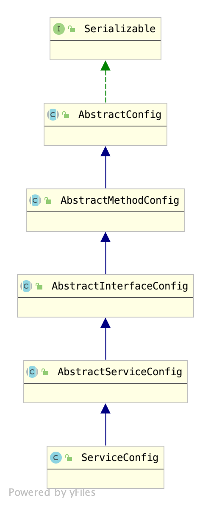

# 2.Provider

Dubbo的Provider端首先必须要先将服务对外暴露，Consumer才可以进行调用。

通常情况下，Provider是通过一个如下结构的XML文件将服务对外暴露的：

```xml
<?xml version="1.0" encoding="UTF-8"?>
<beans xmlns="http://www.springframework.org/schema/beans"
       xmlns:xsi="http://www.w3.org/2001/XMLSchema-instance"
       xmlns:dubbo="http://dubbo.apache.org/schema/dubbo"
       xsi:schemaLocation="http://www.springframework.org/schema/beans        http://www.springframework.org/schema/beans/spring-beans-4.3.xsd        http://dubbo.apache.org/schema/dubbo        http://dubbo.apache.org/schema/dubbo/dubbo.xsd">

    <!-- 提供方应用信息，用于计算依赖关系 -->
    <dubbo:application name="topic-service" organization="xdk" />

    <!-- 使用multicast广播注册中心暴露服务地址 -->
    <dubbo:registry  address="zookeeper://172.16.208.180:2181,172.16.208.181:2181,172.16.208.182:2181" />
    <!-- 用dubbo协议在20880端口暴露服务 -->
    <dubbo:protocol name="dubbo" port="20880" />

    <!-- 声明需要暴露的服务接口 -->
    <dubbo:service interface="com.sharedaka.topic.business.service.XdkHabitTopicService" ref="xdkHabitTopicService" group="PROD" validation="true" version="1.0.0" />

    <!-- 和本地bean一样实现服务 -->
    <bean id="xdkHabitTopicService" class="com.sharedaka.topic.business.service.impl.XdkHabitTopicServiceImpl" />
</beans>
```

Dubbo将该XML文件解析成对应的ServiceConfig对象，然后将Service暴露出去，即完成了服务的暴露。我们可以不使用XML文件进行服务的暴露：

```java
public class ApiProvider {

	public static void main(String[] args) throws IOException {
		// 1.创建ServiceConfig实例
		ServiceConfig<GreetingService> serviceConfig = new ServiceConfig<GreetingService>();
		// 2.设置应用程序配置
		serviceConfig.setApplication(new ApplicationConfig("first-dubbo-provider"));

		// 3.设置服务注册中心信息
		RegistryConfig registryConfig = new RegistryConfig("zookeeper://localhost:2181");
		serviceConfig.setRegistry(registryConfig);
		// 4.设置接口与实现类
		serviceConfig.setInterface(GreetingService.class);
		serviceConfig.setRef(new GreetingServiceImpl());

		// 5.设置服务分组与版本 
		serviceConfig.setVersion("1.0.0");
		serviceConfig.setGroup("dubbo");
		
		// 6.导出服务
		serviceConfig.export();

		// 7.挂起线程，避免服务停止
		System.out.println("server is started");
		System.in.read();
	}
}
```

上述代码将服务暴露分为6步，其中前5步都是组装配置，第6步暴露服务。考察Dubbo的架构图：


对于服务提供方来看，Config和Service层是接口层。Service就是服务提供方负责实现的接口，而Config则是Dubbo相关配置，对于服务提供方来说，使用的是`org.apache.dubbo.config.ServiceConfig`。该类的类继承结构图如下：



由于ServiceConfig中配置项过多，为了不让读者感觉过于枯燥，笔者准备在源码分析过程中进行介绍。

`serviceConfig.export();`是暴露服务的核心方法，下面我们开始对其进行分析。

## 2.1 服务暴露 - ServiceConfig.export()

由于ServiceConfig的复杂性，服务在暴露之前会首先进行校验，然后再进行服务暴露，`ServiceConfig.export()`方法源码如下：

```java
// 延迟暴露定时任务
private static final ScheduledExecutorService delayExportExecutor = Executors.newSingleThreadScheduledExecutor(new NamedThreadFactory("DubboServiceDelayExporter", true));

public synchronized void export() {
    // 1. 校验和更新子配置
    checkAndUpdateSubConfigs();

    if (!shouldExport()) {
        return;
    }
    // 2. 处理延迟暴露
    if (shouldDelay()) {
        delayExportExecutor.schedule(this::doExport, delay, TimeUnit.MILLISECONDS);
    } else {
        // 3. 暴露服务
        doExport();
    }
}
```

Dubbo提供了延迟暴露的功能，可以指定一个时间，在这段时间之后进行再暴露服务，实现这个功能是通过一个定时任务处理器，即`delayExportExecutor`完成的。核心的暴露服务逻辑在`doExport()`方法中。

```java
protected synchronized void doExport() {
    // 校验服务是否导出
    // 避免重复导出服务
    if (unexported) {
        throw new IllegalStateException("The service " + interfaceClass.getName() + " has already unexported!");
    }
    if (exported) {
        return;
    }
    exported = true;

    if (StringUtils.isEmpty(path)) {
        path = interfaceName;
    }
    // 暴露服务
    doExportUrls();
}
```

在Dubbo中，每个服务对应一个URL，然后将这个URL注册到服务注册中心，`<协议,服务>`二元组唯一标识一个服务，因此这里使用的方法名是`doExportUrls()`，源码如下：

```java
private void doExportUrls() {
    // 1. 加载注册中心配置，获取注册中心URL
    List<URL> registryURLs = loadRegistries(true);
    for (ProtocolConfig protocolConfig : protocols) {
        // 2. 通过注册中心URL获取服务URL
        // 2-1. 获取服务名称
        String pathKey = URL.buildKey(getContextPath(protocolConfig).map(p -> p + "/" + path).orElse(path), group, version);
        // 2-2. 构建服务Provider实体
        ProviderModel providerModel = new ProviderModel(pathKey, ref, interfaceClass);
        // 2-3. 服务实体初始化，注册到providedServices
        ApplicationModel.initProviderModel(pathKey, providerModel);
        // 3. 暴露服务
        doExportUrlsFor1Protocol(protocolConfig, registryURLs);
    }
}
```

由于后面的调用逻辑比较复杂，这里给出时序图：


这里我们主要关注1、3两个步骤：

1. 加载注册中心配置-loadRegistries(boolean)，源码如下：

```java
protected List<URL> loadRegistries(boolean provider) {
    // check && override if necessary
    List<URL> registryList = new ArrayList<URL>();
    // 获取注册中心地址
    if (CollectionUtils.isNotEmpty(registries)) {
        for (RegistryConfig config : registries) {
            String address = config.getAddress();
            // 尝试添加默认注册中心地址
            if (StringUtils.isEmpty(address)) {
                address = Constants.ANYHOST_VALUE;
            }
            // 注册中心可用
            if (!RegistryConfig.NO_AVAILABLE.equalsIgnoreCase(address)) {
                // 构建注册中心服务包装URL
                Map<String, String> map = new HashMap<String, String>();
                // 给URL添加应用名
                appendParameters(map, application);
                // 根据RegistryConfig添加URL属性
                appendParameters(map, config);
                map.put(Constants.PATH_KEY, RegistryService.class.getName());
                appendRuntimeParameters(map);
                if (!map.containsKey(Constants.PROTOCOL_KEY)) {
                    map.put(Constants.PROTOCOL_KEY, Constants.DUBBO_PROTOCOL);
                }
                List<URL> urls = UrlUtils.parseURLs(address, map);
                // 注册中心URL可能是多个，因此这里是多个URL
                for (URL url : urls) {
                    url = URLBuilder.from(url)
                            .addParameter(Constants.REGISTRY_KEY, url.getProtocol())
                            .setProtocol(Constants.REGISTRY_PROTOCOL)
                            .build();
                    if ((provider && url.getParameter(Constants.REGISTER_KEY, true))
                            || (!provider && url.getParameter(Constants.SUBSCRIBE_KEY, true))) {
                        registryList.add(url);
                    }
                }
            }
        }
    }
    return registryList;
}
```

Dubbo支持多种注册中心，他们统一由`org.apache.dubbo.registry.integration.RegistryProtocol`进行处理，`RegistryProtocol`是接口`Protocol`的一种实现，考察Dubbo自身的SPI配置文件`org.apache.dubbo.rpc.Protocol`：

```
registry=org.apache.dubbo.registry.integration.RegistryProtocol
```

参考[1-0.SPI](./../1.SPI/1-0.SPI.md)可以知道，获取RegistryProtocol需要通过ExtensionLoader通过registry这个名字获取，`loadRegistries(boolean)`就指定了这个名字，这里仍以`ApiProvider`举例，`ApiProvider`配置如下：

- 注册中心URL：zookeeper://localhost:2181
- 应用名：first-dubbo-provider

`loadRegistries(boolean)`为其添加了一些基础配置：

- 处理类(path)：org.apache.dubbo.registry.integration.RegistryProtocol
- 应用名(application):first-dubbo-provider
- 协议名(protocol):dubbo
- 协议版本(version): 2.0.2
- 应用pid(pid):2664
- Dubbo包版本(release): 2.7.1
- 创建时间戳(timestamp): XXXX

拼接成URL为：`registry://localhost:2181/org.apache.dubbo.registry.RegistryService?application=first-dubbo-provider&dubbo=2.0.2&pid=2664&registry=zookeeper&release=2.7.1&timestamp=1610539655399`


