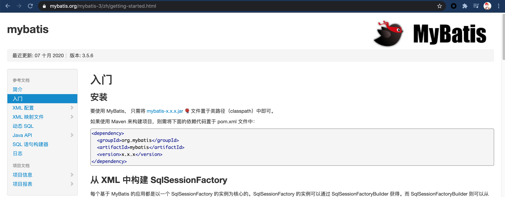
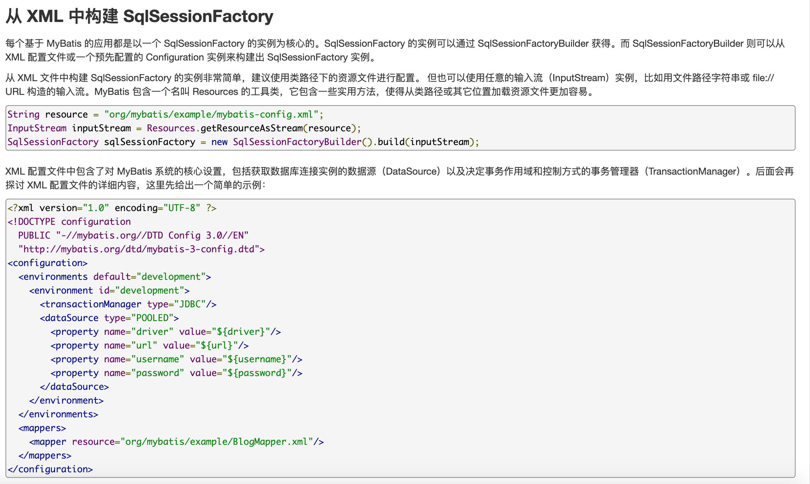

# 1. Mybatis 快速开始

本节笔者将根据[Mybatis的官方文档]()，创建一个基本的Mybatis Demo，以达到演示Mybatis基本功能的目的。

传统的业务开发中，我们都是使用Mybatis与数据库进行交互，因此使用Mybatis的主要功能就是进行数据持久化，虽然这部分传统的JDBC已经完成了这个功能，但是JDBC的使用相对比较麻烦，因此，也就有了大量的框架出现。接下来，我们根据文档，搭建一个Mybatis的Demo，并根据这个Demo介绍一些Mybatis中的基本定义。

本Demo使用包管理工具的是传统的maven，读者如果要进行本地调试，请保证maven已安装，安装方式请参考[maven官网](https://maven.apache.org/)。

## 1.1 版本选择

根据Mybatis官方文档中的说明，如果需要使用Mybatis，需要在pom文件中引入对应的包。



需要注意，Mybatis自身提供的功能对于开发而言，并不简易，因此许多开发者都对其进行了自定义，因此在maven仓库中搜索时会出现许多名称的包，这里，我们使用mybatis原生的包进行分析。笔者当前是在`2020-12-15`写的这篇文章，此时，maven仓库中最新的包是`3.5.6`版本，故本次使用该版本的包进行源码分析。

## 1.2 数据库创建

由于mybatis是一个持久化框架，因此，数据库的搭建是必不可少的。

这里我们基于Docker临时创建一个数据库实例，并在实例中创建一个数据库名为mybatis，创建一张名为blog的表。表中字段如下：

字段名|类型|描述
---|---|---
id|int(11)|自增id，主键
title|varchar(30)|名称
content|varchar(255)|内容

建表语句如下：

```sql
create database mybatis;
use mybatis;
create table `mybatis`.`blog` (
    `id` int(11) AUTO_INCREMENT NOT NULL,
    `title` varchar(30),
    `content` varchar(255),
    PRIMARY KEY (`id`)
) ENGINE=InnoDB DEFAULT CHARSET=utf8mb4;
```

对应的POJO代码为：

```java
package com.jllsq;

public class Blog {

    private Integer id;

    private String title;

    private String content;

    public Integer getId() {
        return id;
    }

    public void setId(Integer id) {
        this.id = id;
    }

    public String getTitle() {
        return title;
    }

    public void setTitle(String title) {
        this.title = title;
    }

    public String getContent() {
        return content;
    }

    public void setContent(String content) {
        this.content = content;
    }
}
```

笔者这里提供了一个压缩包，读者可以直接解压，然后cd到压缩包目录后，运行start.sh就可以使用docker运行起本次源码分析所需要的数据库了。

[我是压缩包](./mysql.zip)

同样，使用该压缩包中的脚本需要本地安装docker，安装教程请查看[docker官网](https://www.docker.com/get-started)。也可以本地直接安装mysql建表，效果相同。

## 1.3 代码编写

根据Mybatis的官方文档，使用Mybatis的基本功能需要如下几部：

1. 构建 SqlSessionFactory
2. 从 SqlSessionFactory 中获取 SqlSession
3. 使用SqlSession进行与数据库的交互。

### 1.3.1 构建 SqlSessionFactory

Mybatis中的一个核心概念是SqlSession，我们需要通过SqlSession与数据库进行交互，而SqlSession是通过SqlSessionFactory进行创建的（工厂模式）。因此，我们需要先创建一个SqlSessionFactory。

可能部分读者有疑问，那SqlSession和Mysql的session有什么关系么？

关于SqlSession的细节，后面再继续进行讨论。

SqlSessionFactory的创建可以基于XML文件或者基于代码创建。Mybatis在文档中也提供了这两种方式的示例。




这里我们采用基于XML文件的方式创建SqlSessionFactory，原因是，其实基于XML文件的方式最终还是需要基于Java代码创建SqlSessionFactory，只不过多了一步解析配置文件。为了给读者完全诠释Mybatis，这里我们采用基于XML文件的方式来写这个Demo。

首先需要准备配置文件：

```xml
<?xml version="1.0" encoding="UTF-8" ?>
<!DOCTYPE configuration
        PUBLIC "-//mybatis.org//DTD Config 3.0//EN"
        "http://mybatis.org/dtd/mybatis-3-config.dtd">
<configuration>
    <environments default="development">
        <environment id="development">
            <transactionManager type="JDBC"/>
            <dataSource type="POOLED">
                <property name="driver" value="com.mysql.cj.jdbc.Driver"/>
                <property name="url" value="jdbc:mysql://127.0.0.1:3306/mybatis"/>
                <property name="username" value="root"/>
                <property name="password" value="123456"/>
            </dataSource>
        </environment>
    </environments>

<mappers>
    <mapper resource="com/jllsq/BlogMapper.xml"/>
</mappers>
</configuration>
```

配置文件中仅声明了Mysql的基本信息以及一个Mapper，这个Mapper的配置文件在`com/jllsq/BlogMapper.xml`目录。关于这个Mapper，我们一会儿再仔细讲解。

只需要拥有这个配置文件，我们就可以创建一个SqlSessionFactory了。如果不需要使用到SqlSession，Mapper甚至可以不指定。

那么接下来需要写代码，读取配置文件，生成SqlSessionFactory。

```java
public class Main {

    public static void main(String[] args) throws IOException {
        String resource = "mybatis-config.xml";
        InputStream inputStream = Resources.getResourceAsStream(resource);
        SqlSessionFactory sqlSessionFactory = new SqlSessionFactoryBuilder().build(inputStream);
    }
}
```

Mybatis提供了一个SqlSessionFactoryBuilder用于解析配置文件，生成SqlSessionFactory，我们只需要将文件流传输给它即可。

截止到现在为止，SqlSessionFactory就已经生成了。

### 1.3.2 从 SqlSessionFactory 中获取 SqlSession

SqlSessionFactory作为一个工厂方法，提供了一个名为`openSession()`的方法，它的重载形式有很多，后面我们会对其进行分析。该方法会`创建`一个SqlSession。所以获取SqlSession的方法很简单：

```java
public class Main {

    public static void main(String[] args) throws IOException {
        String resource = "mybatis-config.xml";
        InputStream inputStream = Resources.getResourceAsStream(resource);
        SqlSessionFactory sqlSessionFactory = new SqlSessionFactoryBuilder().build(inputStream);
        // 获取SqlSession
        SqlSession sqlSession = sqlSessionFactory.openSession();
    }
}
```

### 1.3.3 通过SqlSession与数据库进行交互

使用SqlSession与数据库进行交互时，需要一个Mapper的配置文件。在讨论配置文件之前，我们先看一下Mapper这个名字,`映射器`。Mybatis的持久化方法与Sql语句是通过一个xml文件进行映射的。为了形象的解释这句话，我们举个例子。

例如对于上面的Demo，由于数据库里还没有数据，我们希望插入一条，因此，我们希望执行一条insert语句。这时我们尝试使用SqlSession，发现它有如下这样的方法：

```java
int insert(String statement);
int insert(String statement, Object parameter);
```

由于之前使用过jdbc，读者可能会想这么写：

```java
sqlSession.insert("insert into blog (title,content) value (\"first\",\"first\");");
```

那么问题来了，这与直接使用jdbc有什么区别呢，除了我们不再需要去显示创建Connection了，但是还需要创建SqlSession啊。而且Sql还是没法复用。Mybatis并不是这样使用的。接下来我们用正确的方式打开Mybatis。

在使用SqlSession操作数据库之前，我们需要创建一个Mapper配置文件（`映射器`），就是`1.3.1`节所提到的。

创建这个映射器的目的是什么呢？

传统使用Jdbc的一个缺点就是：sql是强编码的，不能复用。我们可以将sql封装成一个方法，sql的可变参数变为方法的参数，那么这样sql就可以复用了，这样就形成了一个`方法名与sql的映射`。这时就需要映射器了。

Mybatis的映射器就是做了这样一件事。mybatis通过一个id来唯一确定一条sql。这个id就是Mapper名+方法名。举个例子，现在我们需要去插入一条数据到数据库中。这时我们需要创建一个mapper，这里我们将其声明为`com.jllsq.BlogMapper`，表示这个是博客表的映射器，这个表可能要声明许多的模板sql，因此，mybatis为每个sql提供了一个id，我们设置插入一条数据的sql的id为`insertOne`，那么此时，这个Mapper的配置文件就可以写出来了。

```xml
<?xml version="1.0" encoding="UTF-8" ?>
<!DOCTYPE mapper
        PUBLIC "-//mybatis.org//DTD Mapper 3.0//EN"
        "http://mybatis.org/dtd/mybatis-3-mapper.dtd">
<mapper namespace="com.jllsq.BlogMapper">
    <insert id="insertOne" keyColumn="id" keyProperty="id" parameterType="com.jllsq.Blog" useGeneratedKeys="true">
        insert into blog (title,content) value (#{title},#{content})
    </insert>
</mapper>
```

此时，你就将`insert into blog (title,content) value (#{title},#{content})`这条插入语句映射到了`com.jllsq.BlogMapper.insertOne`这个id上。然后你就可以使用`com.jllsq.BlogMapper.insertOne`这个id调用sql了。 完整的代码如下：

```java

public class Main {

    public static void main(String[] args) throws IOException {
        // 创建SqlSessionFactory
        String resource = "mybatis-config.xml";
        InputStream inputStream = Resources.getResourceAsStream(resource);
        SqlSessionFactory sqlSessionFactory = new SqlSessionFactoryBuilder().build(inputStream);
        // 设置要插入的Blog的属性
        Blog blog = new Blog();
        blog.setTitle("first");
        blog.setContent("first");
        // 创建一个SqlSession
        SqlSession sqlSession = sqlSessionFactory.openSession();
        // 将Blog插入到数据库
        sqlSession.insert("com.jllsq.BlogMapper.insertOne",blog);
        // 提交事务
        sqlSession.commit();
        // 关闭SqlSession
        sqlSession.close();
    }
}
```

执行完毕之后，你的数据库就被插入了一条语句，至于删改查操作，使用方式都是相同的，这里就不多赘述了。

源码我会放在下面的压缩包中。

[我是代码包](./mybatis-demo.zip)

## 总结

本篇文章介绍了Mybatis的基本功能——sql与配置文件映射使用的简单用法。

Mybatis使用了两类配置文件：

1. SqlSessionFactory的配置文件
2. 映射器的配置文件

进行了如下操作：

1. 创建SqlSessionFactory（使用配置文件1）
2. 通过SqlSessionFactory创建SqlSession
3. 创建Sql与唯一id的映射——即Mapper（映射器）（使用配置文件2）
4. 通过唯一id，使用SqlSession对数据库进行操作
5. 清理SqlSession

接下来，我们会对这部分源代码进行分析。敬请期待。

[返回目录](../catelog.md)