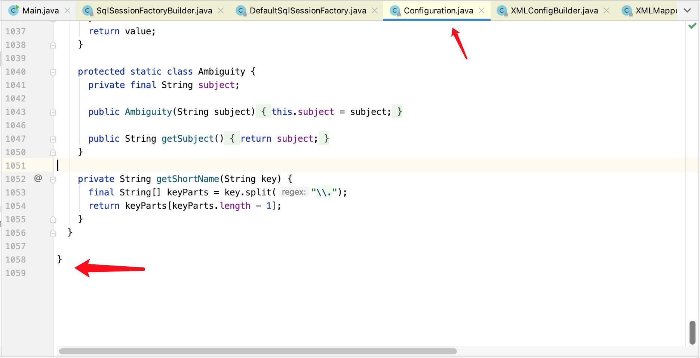

# 2.SqlSessionFactory的创建

通过上一篇文章[1. Mybatis 快速开始](../1.mybatis快速开始/1.mybatis快速开始.md)，我们已经了解了使用Mybatis的基本流程：

1. 创建SqlSessionFactory
2. 通过SqlSessionFactory创建SqlSession
3. 创建Sql与唯一id的映射——即Mapper（映射器）
4. 通过唯一id，使用SqlSession对数据库进行操作
5. 清理SqlSession

其中第一步就是创建SqlSessionFactory。我们的演示Demo是使用XML文件创建SqlSessionFactory的，那么接下来让我们仔细研究一下SqlSessionFactory是如何创建的。

在阅读基于Xml创建SqlSessionFactory创建源码之前，首先看一下基于Java代码创建SqlSessionFactory。由于基于Xml文件创建SqlSessionFactory也是基于Java代码创建，只不过是多了一层Xml文件解析。那么现在我们需要知道，Xml文件解析之后的产物是什么。查看Mybatis中的文档：


查看最后三行代码：

```java
Configuration configuration = new Configuration(environment);
configuration.addMapper(BlogMapper.class);
SqlSessionFactory sqlSessionFactory = new SqlSessionFactoryBuilder().build(configuration);
```

可以看到，事实上，SqlSessionFactory是通过一个`Configuration`类型的对象创建的，那么现在我们就了解了，其实Xml文件解析的最终结果是一个Configuration对象。

这里我们简单查看一下`Configuration`这个类的基本信息，由于`Configuration`这个类过长，所以我们看一下这个类的代码长度：



可以看到这是一个极大的配置类，这也是笔者不太喜欢Mybatis的地方之一。

接下来，让我们确认下，是否基于Xml文件生成SqlSessionFactory是按照我们所想的方式处理的。

基于Xml生成SqlSessionFactory的主要代码如下：

```java
SqlSessionFactory sqlSessionFactory = new SqlSessionFactoryBuilder().build(inputStream);
```

这里我们考察一下`SqlSessionFactoryBuilder.build(InputStream)`方法：

```java
public SqlSessionFactory build(InputStream inputStream) {
    return build(inputStream, null, null);
}

public SqlSessionFactory build(InputStream inputStream, String environment, Properties properties) {
    try {
        // 代码点1
        XMLConfigBuilder parser = new XMLConfigBuilder(inputStream, environment, properties);
        // 代码点2
        return build(parser.parse());
    } catch (Exception e) {
      throw ExceptionFactory.wrapException("Error building SqlSession.", e);
    } finally {
      ErrorContext.instance().reset();
      try {
        inputStream.close();
      } catch (IOException e) {
        // Intentionally ignore. Prefer previous error.
      }
    }
}
```

可以看到，代码点1为Mybatis创建了一个配置文件解析器，代码点2则开始解析Xml文件，并将解析结果创建成SqlSessionFactory。我们考察一下代码点2处调用的`build(...)`方法：

```java
public SqlSessionFactory build(Configuration config) {
    return new DefaultSqlSessionFactory(config);
}
```

可以看到，入参是一个Configuration类型的对象。这就意味着，Xml文件解析的结果就是一个Configuration类型的对象，那么，我们的猜想是正确的。

所以基于Xml文件创建SqlSessionFactory的过程可以由如下时序图表示：


通过上一节，我们知道，Mybatis的配置文件有两类：

1. SqlSessionFactory的配置文件
2. 映射器的配置文件

虽然这是两类配置文件，但这只是在功能上的区分，物理上仍然是一个文件，xml的根节点是`configuration`。

`XMLConfigBuilder`就对这两类配置文件进行解析。解析的主要代码是代码点2处的如下这行：

```java
return build(parser.parse());
```

我们考察`XMLConfigBuilder.parse()`方法：

```java
public Configuration parse() {
    if (parsed) {
      throw new BuilderException("Each XMLConfigBuilder can only be used once.");
    }
    parsed = true;
    // 代码点3
    parseConfiguration(parser.evalNode("/configuration"));
    return configuration;
}
```

可以看到，这里解析的就是`configuration`节点。考察代码点3，即`XMLConfigBuilder.parseConfiguration(XNode root)`方法查看细节：

```java
  private void parseConfiguration(XNode root) {
    try {
      // 代码点4  处理SqlSessionFactory相关配置

    
      // issue #117 read properties first
      propertiesElement(root.evalNode("properties"));
      Properties settings = settingsAsProperties(root.evalNode("settings"));
      loadCustomVfs(settings);
      loadCustomLogImpl(settings);
      typeAliasesElement(root.evalNode("typeAliases"));
      pluginElement(root.evalNode("plugins"));
      objectFactoryElement(root.evalNode("objectFactory"));
      objectWrapperFactoryElement(root.evalNode("objectWrapperFactory"));
      reflectorFactoryElement(root.evalNode("reflectorFactory"));
      settingsElement(settings);
      // read it after objectFactory and objectWrapperFactory issue #631
      environmentsElement(root.evalNode("environments"));
      databaseIdProviderElement(root.evalNode("databaseIdProvider"));
      typeHandlerElement(root.evalNode("typeHandlers"));

      // 代码点5 处理映射器配置文件


      mapperElement(root.evalNode("mappers"));
    } catch (Exception e) {
      throw new BuilderException("Error parsing SQL Mapper Configuration. Cause: " + e, e);
    }
  }
```

但是这里的代码写的并不是很好。考察一个问题，`XMLConfigBuilder`的解析结果是`Configuration`，但是`XMLConfigBuilder.parseConfiguration(XNode root)`这个方法并没有返回值啊，那么这个`Configuration`在哪儿呢？，查看`XMLConfigurationBuilder`的父类`BaseBuilder`，第一个属性就是`Configuration`：

```java
public abstract class BaseBuilder {
  protected final Configuration configuration;
  ...
}
```

这里我们考察一下`BaseBuilder`这个类的职责。由于Mybatis代码注释极少，因此无法通过注释获取信息，但是我们可以通过查看`BaseBuilder`的属性进行分析，该类有三个属性：

```java
// 全局核心配置类
protected final Configuration configuration;
// 别名注册表
protected final TypeAliasRegistry typeAliasRegistry;
// 类型处理器注册表
protected final TypeHandlerRegistry typeHandlerRegistry;
```

该类用于处理类型别名解析和类型处理器解析这些配置解析器公用的配置与操作。查看`BaseBuilder`的方法声明，还可以发现如下一类方法：

```java
  protected Pattern parseExpression(String regex, String defaultValue) {
    return Pattern.compile(regex == null ? defaultValue : regex);
  }

  protected Boolean booleanValueOf(String value, Boolean defaultValue) {
    return value == null ? defaultValue : Boolean.valueOf(value);
  }

  ...
```

可以看到这是一类基础工具方法。所以`BaseBuilder`提供了如下功能：

1. 基础工具功能的实现
2. 别名配置解析 以及 类型解析器解析
3. 核心配置类存储

Mybatis为不同的配置解析场景提供了不同的配置解析器，这里给出`BaseBuilder`相关子类的类继承结构：


1. XMLConfigBuilder：Mybatis xml配置解析器
2. XMLScriptBuilder：Mybatis 动态SQL标签解析器
3. XMLMapperBuilder：Mybatis mapper标签配置解析器
4. SqlSourceBuilder：Mybatis ParameterMap标签解析器
5. XMLStatementBuiler： Mybatis SQL语句解析器，解析insert、update、select标签
6. MapperBuilderAssistant：Mapper解析时的辅助缓存
7. ParameterMappingTokenHandler：parameterMapping的解析工具

对于每个标签的解析工作，会在接下来的章节中进行分析。

[返回目录](../catelog.md)
