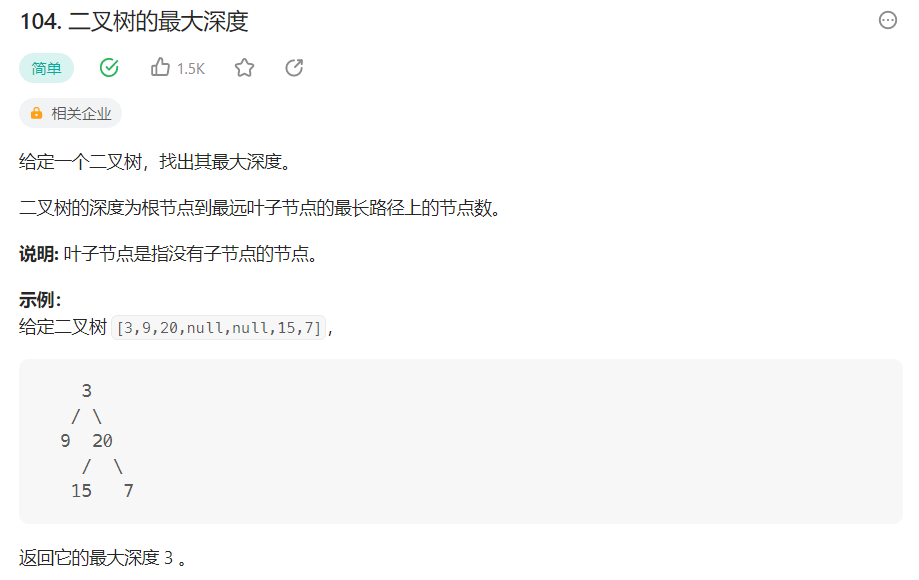

# 104.二叉树的最大深度

## 1. 问题

题目链接：[104.二叉树的最大深度](https://leetcode.cn/problems/maximum-depth-of-binary-tree/)



## 2. 解题思路

对于树的遍历类问题，我们需要思考两个问题：
1. **采用哪种遍历方式？**
2. **处理逻辑怎么写？**

由于二叉树的定义是递归定义，即：

二叉树由3部分组成：
1. 当前节点中的数据，以及当前节点n
2. 当前节点的左子树，也是一颗二叉树n.left
3. 当前节点的右子树，也是一颗二叉树n.right

因此我们如果知道`n.left的深度和n.right的深度`，则当前节点n的深度满足如下公式 `deepth(n) = max(deepth(n.left) ,deepth(n.right))+ 1`

因此，要解决该问题我们需要如下步骤：
1. **先遍历当前节点的左子树和右子树**，查找其深度
2. 根据当前节点的左子树和右子树深度，查找最大值，然后套用公式。

由**1**我们知道要先遍历左右子树，只有**后续遍历**满足该条件，而之前我们给出的公式就是处理逻辑。

## 3. 代码实现

go版本代码：

```go
type TreeNode struct {
	Val   int
	Left  *TreeNode
	Right *TreeNode
}

func maxDepth(root *TreeNode) int {
	if root == nil {
		return 0
	}
	result := maxDepth(root.Left)
	right := maxDepth(root.Right)
	if right > result {
		result = right
	}
	return result + 1
}
```