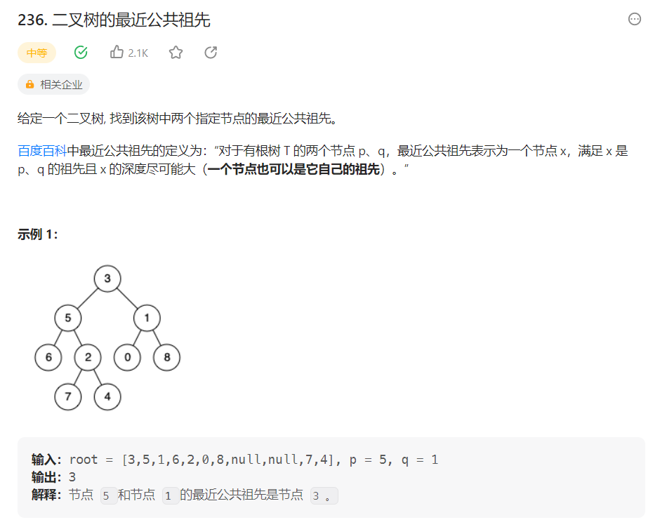

# 236. 二叉树的最近公共祖先

## 1. 问题

问题链接：[236. 二叉树的最近公共祖先](https://leetcode.cn/problems/lowest-common-ancestor-of-a-binary-tree/description/)



## 2.解题思路

该问题要求**寻找节点p和q的公共祖先**，但实际上我们甚至不了解该两个节点的位置，因此，很容易想到处理这个问题要使用**遍历**。

并且由于要**寻找公共祖先**，会涉及到父节点的问题，因此，可以**采用递归方式处理**该问题，因此备选的遍历方式就有了3种：**前中后序遍历**。

接下来就需要确定两个问题：
1. **采用哪种遍历方式？**
2. **处理逻辑怎么写？**

首先考虑处理逻辑，记深度优先遍历遍历到的当前节点为n。那么有如下三种情况：

1. n.left,n.right,n嫩神分别包含p,q中的一个，包括`n.left==p||q,` `n.right==p||q`，`n == p||q`，则此时找到了结果，p，q的公共祖先就是n。
2. `n.left或n.right或者n只包含了p，q中的一个`，需要由n的父节点处理该问题
3. n.left或者n.right包含了p，q两个节点，证明n至少是p，q的公共祖先，甚至是公共祖先的祖先，这种情况只会发生在**1情况后**，因此不需要处理。

因此，要处理该逻辑**需要先收集左右子树的信息**，我们最终选择的是**后序遍历**

## 代码实现

```go
type TreeNode struct {
	Val   int
	Left  *TreeNode
	Right *TreeNode
}

func lowestCommonAncestor(root, p, q *TreeNode) *TreeNode {
	_, _, result := contains(root, p, q)
	return result
}

// root为当前遍历到的节点
// p,q为题目中给出的要查找公共祖先的节点
// return 第一个bool是 root是否包含p
//        第二个bool是 root是否包含q
//        第三个TreeNode指针是 查找到的最近的p,q的公共祖先
func contains(root, p, q *TreeNode) (bool, bool, *TreeNode) {
	pContain, qContain := false, false
	if root == nil {
		return false, false, nil
	}
    // 收集左右子树中是否包含p,q
	leftP, leftQ, leftNode := contains(root.Left, p, q)
	rightP, rightQ, rightNode := contains(root.Right, p, q)
	// 情况3 左右子树中已经查找到公共祖先了，直接返回结果
    if leftNode != nil {
		return leftP, leftQ, leftNode
	}
	if rightNode != nil {
		return rightP, rightQ, rightNode
	}
    // 情况1||2 判断root是否是公共祖先
	pContain = leftP || rightP || root == p
	qContain = leftQ || rightQ || root == q
	// 情况1 root是公共祖先
    if pContain && qContain {
		return true, true, root
	}
    // 情况2 交给父节点处理
	return pContain, qContain, nil
}
```