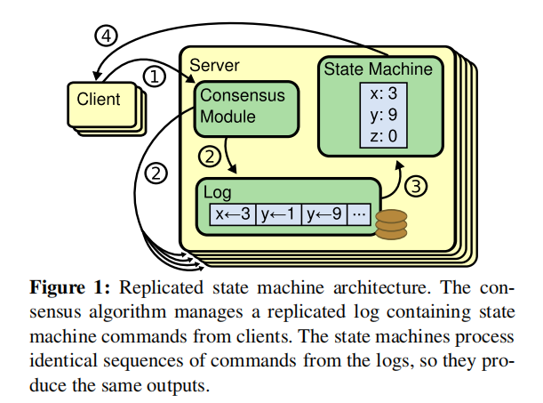
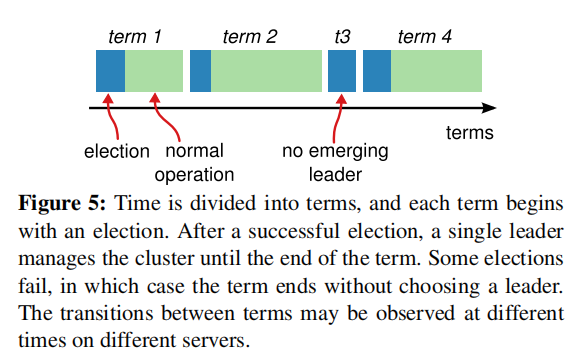
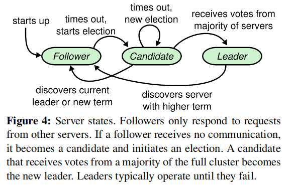
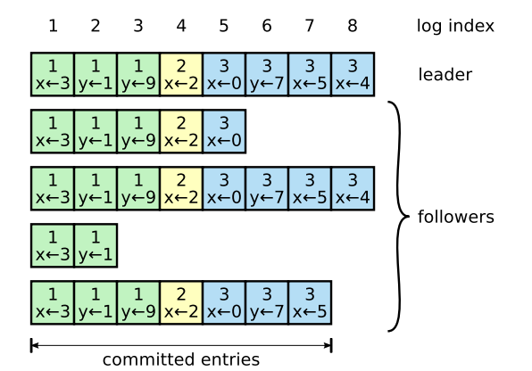
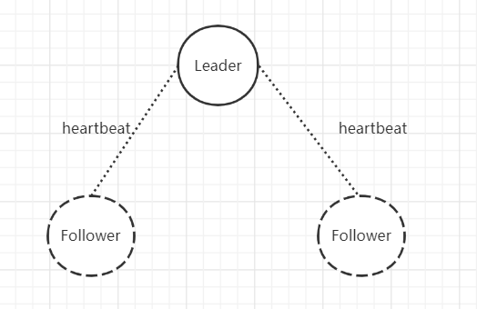
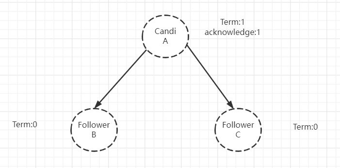
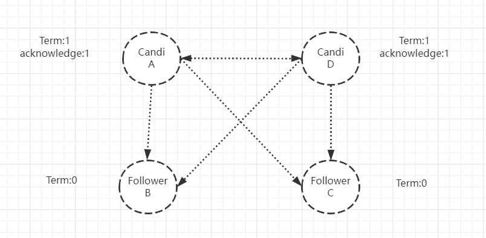
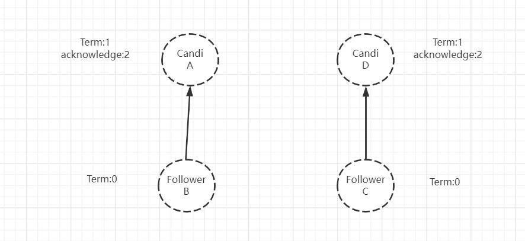

# Raft Leader Election 

## 背景介绍

Raft是一种用于管理Log的分布式一致性算法，在了解Raft之前首先需要了解为什么需要Log?

对于不同的系统，无论是中间件疑惑是其余的系统，我们如果想要求其满足CAP协议中的一致性，需要尽量保证多节点的数据是相同的，也就是所谓的“共识”。下文中将这些需要保证一致性的系统的每个结点称为Node。

但这里存在一个问题，就是Node本身的复杂性是很高的，如果想要将整个Node的所有状态进行一个持久化，代价是巨大的。因此，采用了`“复制状态机”`的办法，原文定义如下：

```
If two identical, deterministic processes begin in the same state and get the same inputs in the same order, they will produce the same output and end in the same state.
```

实际上就是`相同的初始状态+相同的操作=相同的结果`。因此，就我们需要记录结点的操作记录，即Log。

采用这种方式问题就简化了，我们只需要保证Log的准确传输以及保证顺序性，就可以达成我们想要的效果。“复制状态机”基本模式如下图：



接下来我们考虑如下一个模型：对于一个系统集群，其有一个Leader和多个Follower，其中Leader负责接收和处理Client的请求，并将数据同步至Follower，Follower不处理任何请求，仅负责数据存储，当Leader崩溃时可以随时转变为Leader进行接替。

进而简单解释该图：

1. 当Client向服务器集群发起请求，请求操作数据时，此时操作命令为A，Leader接收到请求，将A转化为对应Log，LA
2. 由`共识模块`将LA分发至各个Follower，要求Follower进行保存
3. 待Follower将LA保存完毕后，告知Leader，Leader将LA转变为对应操作，应用于数据
4. 待数据修改后，将修改结果发送给Client

这里的`共识模块`就是各种分布式一致性协议的具体实现，Raft是其中一种。现阶段使用Raft的中间件有很多，例如Kafka、etcd等。这里我们主要介绍Raft。在介绍Raft的选举机制前，需要有一定的前置知识。

## 前置知识讲解

### 1. Term（任期）

故名思意，Term即一个Leader本身执行其Leader工作的一段时间，当发生某种情况，导致当前Leader无法正确工作，则就要开始下一个Term。



需要注意的是，一个Term是从Leader选举开始，到当前Leader“卸任”为止。事实上Term仅仅是一个递增的数字，但在Raft算法中却起到了逻辑时钟的作用，因为Raft本身很多机制都与随机性有关。

### 2. Leader、Follower、Candidate

在Raft算法中，一个结点的任意时刻只能是如下三种状态的一种：

1. Leader
2. Follower
3. Candidate

Leader和Follower已经做过简单的介绍了，对于Candidate，如果Leader无法正常工作，或者Follower认为Leader无法正常工作，此时结点会开始进行重新选举，而重新选举之前，需要将自己设置为Candidate状态，选举成功后，再重新转换为Leader或者Follower。

以下是三种状态的转换图，后面会进行详细讲解：



### 3. Raft与前文介绍的区别

如果真实世界真的能保证每个Leader发出的请求，Follower都能立刻接收到并且做出正确操作，进而返回，那肯定是最好了，但是，事实并非如此。如果能做到这种情况，就是保证了真正的强一致性。

Raft保证的是最终一致性，即理论上到达某一个时间点，系统会达到正确的一致性的效果。因此，对于前文的第3步，Raft要求，只需要大部分的Follower保存了Log就可以了。当满足分布式算法的保存条件时，证明Leader可以安全地修改本地数据了，这称为该Log已经Commit。

注意：`对于Follower没有成功存储的Log，Leader在Commit后会一直进行重传，直到Follower接受为止，因此，Log是永远有序的。`

事实上，在Leader和Follower中，都要保存Log数据，形态如下图：



这是一个Leader和它的Follower a-f的日志保存状态。其中的数字代表的是该日志所在的任期。并且每个日志有自己独特的Index。也正因为`Log的有序性`，导致日志有如下特性：

1. 如果在不同的结点上的两条日志，但是其Term和Index相同，那么两条日志记录的命令相同
2. 如果在不同的结点上的两条日志，其Term和Index相同，那么他们之前的日志也都相同。

了解了这些之后，就可以介绍Raft的Leader选举了。

## Raft的Leader选举

### 成为Leader的条件

事实上，Raft选取Leader的条件只有一个：`被选取的Leader需要得到大多数结点的承认`，这个大多数就是`至少大于等于n/2上取整，n为总结点数`。

那么其他结点承认该结点的条件是什么呢？想要得到其他结点的承认需要满足：`条件：Candidate结点的Term必须要>=选举者的Term，其次Candidate结点的Index也要>=选举者Log的最大Index`。这就意味着`满足结果：Candidate需要携带上一个Term的所有Commit的日志才能被选中`。

为什么说满足了`条件`就满足了`结果`呢？

因为要成为Leader有一个隐藏条件，就是需要得到大部分结点的承认。Commit的条件是大部分结点保存了Log就可以Commit了。而Candidate的Log如果Index >= 选举结点，且Log的Term也大于等于选举结点，证明，选举结点的所有日志Candidate都已经保存好了。再加上要得到大部分结点的同意，从集群中任选(n/2上取整)个结点，必然有一个结点含有Commit的日志的全集，因此`结果`成立。

而新的Leader就要承担起补全其他Follower日志的工作，这一部分不属于Leader选举，这部分另一篇文章再讨论。

### 结点状态转换过程

最后，我们再看一下结点的状态转换图：


当结点启动时，初始状态是Follower，Leader为了保证能与Follower有效沟通，因此，与Follower之间会有一个`心跳机制`，即定时向Follower发送一个空请求，目的就是验证Follower是活着的。



但是，在Leader不存在时，Follower是无法接收到`心跳`的，因此，在多次无法接收到心跳时，我们称为`time out`，则此时要选出新的Leader。因此当前Follower就会自告奋勇，去竞选Leader，会执行如下操作：

1. 将自己的Term ++
2. 投自己一票
3. 并行发送给其他Node，请求其他结点的承认
4. 等待其他结点的回复结果



当结点BC接收到A的请求投票的请求后，会查看是否满足刚才谈到的条件，如果满足，就会投给A一票（`注意：每个投票者只能最多给一个Candidate投票`）。A接受到投票后，acknowledge会++，当接收到`大多数结点的承认`后，A就成为了新的Leader。然后A就会通知其他结点，告诉自己成为了新的Leader，防止有新的选举产生。当三类结点接收到这个广播消息后会采取如下操作：

1. Candidate：由于已经选举处理新的Leader，因此转变为该Leader的Follower
2. Leader：由于选举出了新的Leader，则将自己转化为新Leader的Follower
3. Follower：发现了新的Leader，将自己转化为新Leader的Follower

最后，对于上面的状态机，我们会发现有一种特殊的情况，即选举超时。这种情况是怎么回事呢？由于如下原因：
1. 每个投票者只能最多给一个Candidate投票，投票者的票是先到先得。
2. 可能同时存在多个结点处于Candidate状态

因此，就可能出现如下情况：当前集群中有4个Node，其中两个Follower都发现了系统中找不到可用的Leader，因此转化为Candidate状态，请求其他结点承认。



由于A、D两者的票是投给自己的，如果B投给A，D投给C，那么就会产生如下情况：



那么就会存在A、D都没有获得大多数Node承认的情况，如果发生这种情况，就需要选举超时来处理，等待超时时间到达后，开始一个新的Term，重新进行选举。为了去避免出现多个Node同时进行选举，Raft采用了一个随机的election timeout来减缓这个问题。

## 结论

至此，我们分析完了Raft选举机制的内容，Leader是Raft协议运行的一个非常重要的模块，后面的文章会讨论Raft的Log Replication问题。