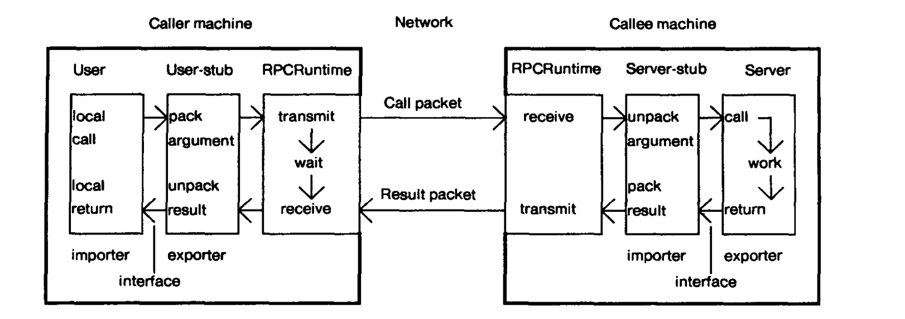
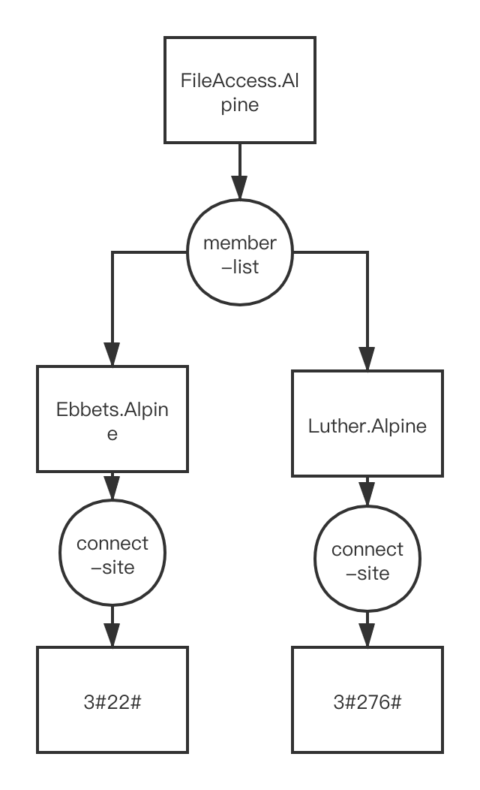
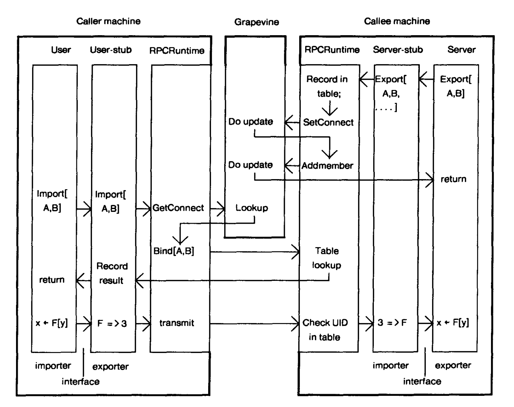

# 实现远程过程调用(Implementing Remote Procedure Calls)

ANDREW D. BIRRELL and BRUCE JAY NELSON

## 摘要

远程过程调用（RPC）是高级语言编写的应用程序之间通过网络通讯的很有用的手段。本篇论文主要介绍了设计支持RPC功能的工具包时，设计人员会面临的问题，以及笔者做出的一些决策。

我们描述了RPC机制实现的整体结构、RPC客户端的绑定机制、用于网络通讯的传输层协议的设计，以及最后介绍了一下实现结果的性能。

除此之外，笔者还提供了一些用于提高本RPC工具包的性能和降低多客户端时服务器负载的优化方案。

## 1. 介绍

### 1.1 背景

远程过程调用（RPC）的思想非常简单。

首先过程调用是什么？过程通常情况下就是一些易于理解、众所周知的操作，这个操作可能是简单操作，例如i++，或者一些复杂的操作，例如解一个方程。然而调用一个过程，通常只需要两方面数据：

1. 负责控制层的操作数据，即如何操作需要处理的数据，例如要执行对i的自增操作，那么自增两个字就是负责控制层的操作数据
2. 要被处理的数据，同样是对i进行自增操作，那么i就是要被处理的数据。

理解了这一点之后，对于RPC机制的理解就简单了，由于RPC是远程过程调用，所以一定存在两端：

1. 调用端
2. 执行端（调用者）

调用端需要一套转化机制，将具体的动作和要被操作的数据全部转化为数据，然后交给执行端执行。而执行端需要对接收到的数据进行转化，转化为对应的操作，将数据进行的转化，这里类似于序列化和反序列化。

一次RPC通常要经历如下过程：

1. 调用端将参数传输到执行端，调用端挂起
2. 执行端接收到数据开始执行
3. 执行端处理完毕后，将结果返回给调用端
4. 调用端接收到结果，继续执行。

事实上，如果调用端合理利用了并发编程，或者RPC实现了异步调用时，调用端触发了RPC调用也无须阻塞，其他线程可以继续执行自身的操作。

RPC有很多吸引人的地方：

1. 清爽和简洁的语法：这使得构建分布式计算服务时更加简单，并且可以正确的获取服务与服务数据。
2. 高效：过程调用通常是很简单的，因此系统间通讯会很快。
3. 泛用性：在单机计算中，过程通常是算法各部分之间通信的最重要机制。

RPC这个话题已经被讨论很多年了，最早可以追溯到1976年。尼尔森（Nelson）的博士学位论文参考了以前有关RPC的许多工作，对RPC系统的设计可能性进行了广泛的研究。然而，对于RPC的真正实现却很少。最近值得注意的工作包括Xerox NS协议家族中的Courier，以及麻省理工学院的最新工作。

本文是Cedar项目中RPC实现结果的产物。由于有前人的一些借鉴（尤其是Nelson的理论与实验），我们了解到对于RPC设计者的我们需要针对我们自身的目的和所处的环境做出一系列选择。在真正构建系统的过程中，我们发现对几个领域我们的理解并不充分，因此，我们使用了自己一些设计创造了我们的系统。

作为RPC基础设施的设计者，我们面对的主要问题是：

1. 允许机器之间通讯失败的一套精确的语法
2. 允许没有共享地址空间支持的一套包含调用地址的语法
3. 如何将RPC系统集成到当前已有（或者未来会有）的系统中
4. 客户端绑定（调用者如何去确定被调用者的地址）
5. 如何设计一套合适的协议去转化调用者和被调用者之间的通讯使用的控制层数据与待处理数据
6. 在一个开放的网络中，如何保证数据完整性和数据安全性

在构建我们自己的RPC基础架构时，我们解决了这里的所有问题，但是不可能在一篇论文中以适当的深度描述所有这些问题。因此这篇论文仅仅包括了我的在解决上面问题中的一些主要决定，并且描述了解决方案的整体结构。在本篇文章中，我们也会介绍一些关于绑定机制和传输层协议的细节。我们计划去写一些子集的论文去详细介绍本篇文章没有介绍到的问题：

1. 基于加解密的报文安全问题
2. 介绍stub模块（该模块负责解释RPC调用的参数和结果）
3. 在使用自研RPC时的一些经验

## 1.2 环境

我们自研的RPC框架主要用在Cedar编程环境中，通过Xerox内网进行网络交互。在构建这类基础的框架时，环境因素不可避免会影响设计，因此这里首先对环境进行简单介绍。

Cedar是一个致力于可以便利的构建一个用于实验的程序或者系统的强大的开发平台。它强调统一，高度交互的用户界面，并简化程序的构造和调试。尽管Cedar还用于构建服务器（提供公共服务的共享计算机，可通过通信网络访问），但Cedar旨在用于单用户工作站。

大多数使用Cedar的计算机是Dorados。Dorado是一台功能非常强大的机器（例如，简单的Algol样式的调用和返回只需不到10微秒的时间）。它配备有24位虚拟地址空间（16位字）和80 MB的磁盘。可以将Dorado看作为具有370/168个IBM处理器的主机，但是它只专用于单个用户。

这些计算机之间的通信通常通过每秒3兆位的以太网进行（甚至某些计算机通过每秒10兆位的以太网进行交互）。大多数运行Cedar的计算机都在同一以太网上，但是有些在我们研究网络中其他地方的不同以太网上。互联网络由大量3兆字节和10兆字节的以太网络（目前约160个）组成，这些网络通过租用的电话和卫星链路（数据速率在4800到56000 bps之间）连接。我们设想我们的RPC通讯将遵循我们在其他协议上经历的模式：大多数通信都在本地以太网上进行（因此，Internet链接的数据速率低得多给我们的用户带来了不便），并且以太网没有过载（我们很少看到提供的负载超过以太网容量的40％， 通常是10％）。

PUP协议族[3]提供对该互联网上任何计算机的统一访问。先前的PUP协议包括简单的不可靠（但概率很高）的数据报服务，以及可靠的流控制字节流。在同一以太网上的两台计算机之间，可以使用较低级别的原始以太网数据包格式。

本质上，所有编程都使用高级语言。 尽管也使用Smalltalk和InterLisp，但主要语言是Mesa（为Cedar进行了修改）。 Dorados没有汇编语言。

### 1.3 目标

我们的RPC项目主要为了使分布式计算更加简单。以前，在我们自己的研究社区中，构建需要交互的程序是一件非常困难的事情，仅仅由选定的专家来完成这件事情。即使是具有丰富系统经验的研究人员，也难以获得使用现有工具构建分布式系统所需的专业技能。这看起来是有一定问题的。我们拥有一个非常庞大，非常强大的通信网络，许多强大的计算机以及一个使构建程序相对容易的环境。然而，当前存在的通讯机制是约束分布式计算发展的主要原因。我们的希望是，通过提供与本地过程调用几乎一样的便捷通信，将鼓励人们构建和试验分布式应用程序。我们希望，RPC将消除不必要的困难，仅保留构建分布式系统的基本困难：实时性，组件的独立故障以及独立执行环境的共存。

除此之外，我们还有两个次要的目标。首先，我们希望RPC是高效的（例如，比网络的必要传输时间短五倍）。这使得应用程序设计者不会因为效率问题极力避免使用RPC。否则可能会开发的应用程序将因其避免通信的愿望而失真。另外，RPC包的语法应该在不损失简易性和效率的情况下尽可能强大。否则，为了保证统一的通信范式，需要应用程序员在RPC包上进行额外的开发。解决强大的语义与效率之间的矛盾是设计RPC框架中需要解决的一个重要问题。

我们的最后一个目的是让RPC通信是足够安全的。之前实现的协议对于在网络上传输的数据没有任何保护，甚至密码都是明文存储的。在我们看来，对于在公网中进行传输的数据，保证其安全性是合理的，并且网络协议和机制也允许完成这样的功能。而且，很少有分布式系统在之前提供安全的端到端通信，这很少用于RPC，因此该设计可能会提供有用的研究见解。

### 1.4 基本决策

### 1.5 结构

笔者项目组实现的RPC程序包的基本结构与`尼尔森`论文中提出的十分相似。这种结构基于一个名为`stub`的概念。一次远程调用会涉及如下五个组件:

- user
- user-stub
- RPC 通讯程序包 我们称之为RPCRuntime
- server-stub
- server

调用过程如图：

其中，RPCRuntime通常是基于操作系统进行网络通讯的程序包。当调用端希望进行一次RPC调用时，实际上是在调用端本地调用了user-stub，由它与被调用端交互。user-stub负责将调用端的请求（控制数据与备操作数据）转化为一个或多个报文，并通过RPCRuntime传递给被调用端。当被调用端接收到网络数据包后，被调用端的RPCRuntime程序包将数据交给Server-stub。Server-stub将数据报文拆包，将数据重新封装成本地调用，然后交由Server执行调用过程。而此时，调用端进程挂起，等待被调用端的回复。当Server执行完毕本地调用后，将数据交给Server-stub，由Server-stub将结果数据封装成报文，由被调用端的RPCRuntime传输给调用端。调用端接收到数据报文后，由User-stub进行拆包，将数据传输给user。RPCRuntime负责重传，确认，数据包路由和加密。在不考虑多机绑定机制与通信失败的情况下，RPC调用就像用户直接在服务端执行过程一样。

RPCRuntime是Cedar系统的一个基础组件。user和server这两端是分布式应用的两部分。user-stub和server-stub是通过一个名为Lupine的程序生成的。生成的产物是Mesa的接口模块。接口模块主要负责提供接口签名，即接过程的名称、参数类型以及返回值类型。这为调用者和被调用者进行编译期类型检查和生成调用关系数据提供了全面的数据。对于接口的具体实现，我们称为导出对应的接口。另一个程序模块可以根据接口声明进行RPC调用，我们称为引入了接口。当编码者在进行分布式应用的开发时，首先要对接口进行明确的声明。然后再去提供服务提供者和服务调用者，进而导出和引入服务。最后由Lupine生成user-stub和server-stub。

通过这种方式，编码者无须关心分布式系统之间交互的细节，只需要设计接口，提供接口的实现与调用即可。Lupine负责帮助你生成user-stub和server-stub，这两个模块将对数据进行拆包和封包，以及RPC调用的路由分发。最后RPCRuntime负责进行网络通讯。编码者需要避免使用不兼容的参数和结果（Lupine的校验避免了这件事情）。

## 2. 绑定

关于绑定的问题，有两方面需要考虑：

1. 网络通讯传输的数据与调用方法的绑定：从网络传输过来的数据如何去和被调用端的方法进行绑定，执行正确的方法。
2. 调用端和被调用端的绑定：调用端主机如何知道要调用哪台被调用端主机

事实上，第一个问题是一个声明问题，第二个是定位问题。

### 2.1 声明问题

笔者自实现的RPC包将接口的导入器和接口的导出器绑定在了一起。在绑定之后，导入器执行的过程调用会被导出器执行。在绑定期间我们就会遇到上面两个问题：声明和定位。对于一次RPC调用，调用者需要关注两件事：

1. 调用的方法
   对于Mesa，我们使用的仍然是Mesa接口的名称。事实上，RPC包无法控制接口的名称，事实上也不需要控制，只需要导入方和导出方达成共识。对于笔者研发的RPC包，导出器是使用接口的方法名来定位具体要调用的方法的。
2. 被调用者的地址
    举一个例子，例如，现在邮件服务提供了一个发送邮件的接口，而邮件服务器又部署了多台。那么调用者需要从多台被调用服务器中选择一台进行调用。

### 2.2 定位一个合适的方法

我们使用分布式数据库Grapevine来完成RPC的绑定功能。Grapevine最吸引我们的地方是它具有很强的扩展性和可靠的可用性。在我们的拓扑网络中， Grapevine是分布式部署的，并且保证了每份数据有3份备份，因此，极大的保证了Grapevine的可用性。在进行选型时，我们也想过不适用数据库的方式，但是这会带来一些问题。

- 我们曾经希望让分布式应用程序自身去保存它希望去通讯的服务器地址，但是这种方案对于大多数应用来说，都会使调用端过早的获取到服务端地址。例如，我们存在服务A与服务B，服务A需要在一个特殊情况下调用服务B，例如仅仅一个业务的一个分支，但是由于没有数据库的帮助，我们只能在服务A启动时就设置服务B的IP地址，但是实际上，可能服务A永远用不到这个远程调用。
- 我们也曾希望通过广播的方式获取远程服务的地址，这种方案通常情况下是可以接受的，但是会有一些弊端，例如：
  - 获取远程服务也只能选择一台被调用主机，然而广播的方式会使其他同服务的主机也受到影响，而且，有时可能要全内网广播，这甚至会影响到其他服务的主机。
  - 对于非统一内网的主机，甚至无法采用广播机制进行通信。

Grapevine的数据库由一组条目组成，每一个条目都有一个称为Grapevine RName的字符串类型的键。Grapevine支持两类条目：独立条目和组条目。对于每个Grapevine数据库中的条目来说，Grapevine都维护着一系列的信息，但是RPC程序包只关心两个：

1. 对于独立条目来说，RPC程序包关心`connect-site`这一字段。该字段是一个网络地址，负责表示提供服务的被调用者的网络地址。
2. 对于组条目来说，每个组条目维护了一个`member-list`，即某个服务的所有提供者的地址，这个`member-list`是一个Grapevine RName的集合。

因此通过这种方式就实现了一个树形结构，例如，如果网络地址为`3#22#`的服务器`Ebbets.Alpine`提供了远程接口`FileAccess.Alpine`，另一台网络地址为`3#276#`的服务器`Luther.Alpine`提供了远程接口`FileAccess.Alpine`，那么在Grapevine中`FileAccess.Alpine`组中就包含了两个member，分别是`Ebbets.Alpine` 和 `Luther.Alpine`，其中`Ebbets.Alpine`的`connect-site`是`3#22#`，`Luther.Alpine`的`connect-site`是`3#276#`。如下图：

如果一个服务器需要将自己的接口暴露出去提供服务，那么服务端代码需要通过server-stub调用调用RPCRuntime的一个过程`Exportlnterface`，将服务对外暴露。`ExportInterface`暴露了接口名称与实例信息，并且提供了一个分发器，当处理调用者发送过来的数据包时，server-stub用该程序进行分发。`ExportInterface`将当前暴露接口的服务器的相关信息维护到`Grapevine`中，这通常都会对数据库进行修改。然而修改数据库是一个相对重量级的操作，因此这里做了一个小的优化，如果数据已经存放在数据库中了，就不去对数据库数据进行修改。RPCRuntime会在暴露接口的主机本地维护一张表，用于记录被暴露接口的相关信息。对于每个被暴露的接口，这张表都会记录下接口名称、server-stube要使用的分发程序以及一个32位的标识，用于唯一确定暴露的接口，这张表通过一个小的数组实现。对于表中存储的用于唯一确定暴露接口的32位标识，其获取方法是当前接口注册前的秒级时间戳-1。但是由于使用这种方式，限制了`ExportInterface`的调用频率。

当一个调用端想要进行RPC调用时，用户端代码会调用user-stub，进而调用RPCRuntime的`Importlnterface`接口，并提供需要调用的接口与具体的主机地址传输。RPCRuntime向`Grapevine`请求具体被调用实例的网络地址，获取到网络地址后，调用端的RPCRuntime与服务端的RPCRuntime直接通信请求绑定所需的相关信息。如果服务端的主机没有暴露对应的接口，那么绑定失败。如果服务端主机实现了被调用的接口，那么将服务端主机中维护的标识接口的唯一标识，以及对应表中的索引返回给调用端，绑定成功。调用端的user-stub将唯一标识、索引以及被调用端的网络地址存储在本地，用于远程调用。

