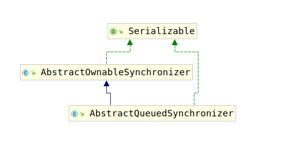

# AbstractQueuedSynchronizer

我们知道，Java中很多重要的并发组件都是基于`AQS`进行设计的，AQS本身是一个类，但是不如说他是一个框架，该框架为众多并发组件提供了底层基础。那么接下来开始分析该类。

首先考虑该类的类继承结构图：



该类的类继承结构极其简单，`AbstractQueuedSynchronizer`仅仅继承了`AbstractOwnableSynchronizer`。让我们首先查看`AbstractOwnableSynchronizer`的功能以及源码。

查看`AbstractOwnableSynchronizer`代码，发现`AbstractOwnableSynchronizer`其实是一个抽象类，该类只有一个属性：

```java
private transient Thread exclusiveOwnerThread;
```

并且也只有两个方法，即`exclusiveOwnerThread`属性的getter和setter方法。

查看`AbstractOwnableSynchronizer`的注释，我们可以发现，该类是一个保存当前占用线程的同步器，考察`exclusiveOwnerThread`的属性名，我们可以知道该属性用于存储`专有的拥有者线程`，考察一般加锁流程，如果要对A对象加锁，我们会设置一个标志（此处声明为label），那么使用该对象之前，先将label更改，这里我们假设更改的命令是`label=A`，然后使用完对象将`label=null`，这里的情况同理。

`AbstractQueuedSynchronizer`也是基于`AbstractOwnableSynchronizer`完成了自己的工作，那么`AbstractQueuedSynchronizer`到底完成了什么工作呢？查看注释我们可以看到：

```java
/**
 * This class is designed to
 * be a useful basis for most kinds of synchronizers that rely on a
 * single atomic {@code int} value to represent state.
 * /
```

该类是大多数依赖单个原子性int值表示同步状态的同步器的基础。那么该类到底是怎么实现该功能的呢？注释的第一句话就有说明：

```java
/**
 * Provides a framework for implementing blocking locks and
 *  related synchronizers (semaphores, events, etc) that rely on
 *  first-in-first-out (FIFO) wait queues.
 * /
```

可以看到，该类实现上述功能依赖了FIFO的阻塞队列。但是，Java中的阻塞队列不应该是基于各种锁，同步器么？这样不就出现了循环依赖么？那么`AbstractQueuedSynchronizer`是怎么依赖的阻塞队列？因此我们考察该类的属性，查看到底使用的是什么杨的阻塞队列。该类与队列相关的属性很少，只有两个：

```java
private transient volatile Node head;
private transient volatile Node tail;
```

显而易见，这就是阻塞队列的头结点和尾节点，链表本身就用于存储数据，那该类的节点与普通链表有何不同呢？这里我们考察一下该类的Node实现：

```java
static final class Node {
    static final Node SHARED = new Node();
    static final Node EXCLUSIVE = null;
    static final int CANCELLED =  1;
    static final int SIGNAL    = -1;
    static final int CONDITION = -2;
    static final int PROPAGATE = -3;

    volatile int waitStatus;
    volatile Node prev;
    volatile Node next;
    volatile Thread thread;
    Node nextWaiter;
}
```

Node节点有4个属性，分别是：

1. waitStatus：表示当前节点包含线程的状态。该状态有5种：
   1. CANCELLED：这意味着该线程已经因为超时或者中断而取消了，这是一个终结态。
   2. SIGNAL：表示当前线程的后继线程被阻塞或者即将被阻塞，当前线程释放锁或者取消后需要唤醒后继线程，注意这个状态一般都是后继线程来设置前驱节点的。
   3. CONDITION：说明当前线程在CONDITION队列
   4. PROPAGATE：用于将唤醒后继线程传递下去，这个状态的引入是为了完善和增强共享锁的唤醒机制。在一个节点成为头节点之前，是不会跃迁为此状态的
   5. 0：表示无状态
2. prev：前驱节点
3. next：后继结点
4. thread：该节点表示的线程
5. nextWaiter：SHARED or EXCLUSIVE

默认情况下创建一个Node其waitStatus都是0状态。根据Node的注释，我们知道这条阻塞队列是一个`CLH`队列，该思想主要用于自旋锁，在接下来的代码逻辑分析中你会看到自旋锁。下面让我们查看加锁逻辑，以此观察`AQS`是如何使用上面的队列的。在`AQS`中加锁、解锁的方法有很多，例如：

1. acquire(int arg):获取互斥锁
2. acquireInterruptibly(int arg)：获取互斥锁，但是一旦被中断，则取消获取
3. acquireShared(int arg)：获取共享锁
4. acquireSharedInterruptibly(int arg)：获取共享锁，一旦被中断，则取消获取。
5. release(int arg)：释放互斥锁
6. releaseShared(int arg)：释放共享锁

接下来首先分析`acquire(int arg)`和`release(int arg)`方法，即互斥锁的加锁与解锁流程，借此来分析AQS是怎么使用Node组成的阻塞队列的。

## 1. acquire(int arg)

`acquire(int arg)`方法用于获取互斥锁，并且忽略中断。考察该方法源码如下：

```java
public final void acquire(int arg) {
    // 尝试获取锁
    // 如果没有获取到，则创建一个节点放入队列中
    // 等待获取到锁，如果获取过程中，出现特殊情况，
    // 则中断当前线程，避免阻塞
    if (!tryAcquire(arg) &&
        acquireQueued(addWaiter(Node.EXCLUSIVE), arg))
        selfInterrupt();
}
```

注意`tryAquire(int)`方法负责尝试获取锁，但是需要注意，该方法在`AQS`中并没有实现，需要子类进行覆盖。因此我们需要去查看剩余的几个方法：

1. addWaiter(Node)：该方法负责创建一个Node，传入的参数表示获取锁的模式，即`Node.SHARED`或者是`Node.EXCLUSIVE`：

    ```java
    private Node addWaiter(Node mode) {
        // 创建一个Node，并通过传入参数设计其加锁模式
        // 监听的线程就是当前线程
        Node node = new Node(Thread.currentThread(), mode);
        // 获取队尾节点
        // 如果队列不为空，那么将当前节点与队尾节点连接
        // 然后执行CAS操作，将当前节点添加到pred后面zixuansuo
        Node pred = tail;
        if (pred != null) {
            node.prev = pred;
            if (compareAndSetTail(pred, node)) {
                pred.next = node;
                return node;
            }
        }
        // 如果队列是空，那么就创建一个空节点作为队列头，然后将新节点插入
        enq(node);
        return node;
    }
    ```

    接下来我们查看一下`enq(final Node)`中的细节，我们已经知道，该方法用于`处理队列是空，创建一个空节点作为队列头，然后将新节点插入`的情况，考察代码细节如下：

    ```java
    private Node enq(final Node node) {
        // 自旋+CAS 将Node添加到队列中
        for (;;) {
            Node t = tail;
            // 如果队列为空
            // 这时创建一个New Node作为head和tail
            if (t == null) { // Must initialize
                if (compareAndSetHead(new Node()))
                    tail = head;
            // 将新节点插入到对列尾部
            } else {
                node.prev = t;
                if (compareAndSetTail(t, node)) {
                    t.next = node;
                    return t;
                }
            }
        }
    }
    ```

    事实证明，AQS中的阻塞队列，队列头仅仅是一个标志，并不保存信息，如果没有头，就创建一个新的空对象就可以了，然后再执行插入新节点，这样做还有一个好处，如果多个线程同时在修改阻塞链表，那么可以保证修改正确。

    经过将线程信息放入到队列中后，就要开始获取锁了，`acquireQueued`方法用于获取锁。

2. acquireQueued(final Node, int)，自旋获取锁，该方法是用于为指定节点自旋获取锁。

    ```java
    final boolean acquireQueued(final Node node, int arg) {
        boolean failed = true;
        try {
            boolean interrupted = false;
            // 自旋+获取锁
            for (;;) {
                final Node p = node.predecessor();
                // 获取node的前一个节点，查看是否是头结点
                // 如果是头结点再进行获取锁
                // 如果获取到了，就将队列头设置为它
                if (p == head && tryAcquire(arg)) {
                    setHead(node);
                    p.next = null; // help GC
                    failed = false;
                    return interrupted;
                }
                // 在没有成功获取锁的情况下判断是否应该中断获取锁
                // 判断逻辑在`shouldParkAfterFailedAcquire`方法中
                // 挂起当前线程，避免占用资源。
                if (shouldParkAfterFailedAcquire(p, node) &&
                    parkAndCheckInterrupt())
                    interrupted = true;
            }
        } finally {
            // 如果没有成功获取锁，那么要唤醒线程，并进行一系列的处理
            if (failed)
                cancelAcquire(node);
        }
    }
    ```

    这里我们考察`shouldParkAfterFailedAcquire(Node,Node)`方法来考虑加锁未成功时会发生什么？

    ```java
    private static boolean shouldParkAfterFailedAcquire(Node pred, Node node) {
        int ws = pred.waitStatus;
        if (ws == Node.SIGNAL)
            // 如果当前节点的前驱节点的状态是`SIGNAL`，
            // 这意味着前驱节点线程占用的锁释放之后，就会分配给当前节点的线程
            // 因此挂起当前线程就可以了，直接返回true，表示已经获取到锁了
            return true;
        if (ws > 0) {
            // 如果前驱节点的状态是`CANCEL`，这意味着前驱节点的任务已经被取消了，
            // 这意味着要使用第一个非`CANCEL`状态的节点与当前节点进行对比
            do {
                node.prev = pred = pred.prev;
            } while (pred.waitStatus > 0);
            // 修改指针
            pred.next = node;
        } else {
            // 到达这里证明前驱节点的状态是0或者PROPAGATE
            // 那么这时候需要前驱节点线程释放锁之后通知当前节点线程
            // 因此需要修改前驱节点线程状态为Node.SIGNAL
            compareAndSetWaitStatus(pred, ws, Node.SIGNAL);
        }
        return false;
    }
    ```

    如果`shouldParkAfterFailedAcquire(Node,Node)`返回true，那么意味着当前Node已经加入到阻塞队列中了，因此需要挂起当前线程，直到当前节点的前驱节点释放锁为止。因此`parkAndCheckInterrupt()`方法就是此目的：

    ```java
    private final boolean parkAndCheckInterrupt() {
        // 挂起当前线程
        LockSupport.park(this);
        // 返回是否能够中断，表示是否挂起成功
        return Thread.interrupted();
    }
    ```

    然而有些情况下，会导致执行了`parkAndCheckInterrupt()`但是却没有成功获取到锁，因此，要清除错误信息，这时就要调用`cancelAcquire(Node)`方法，代码如下：

    ```java
    private void cancelAcquire(Node node) {
        if (node == null)
            return;
        // 清除Node数据，避免其他线程，使用到该Node，产生冲突
        node.thread = null;

        // 如果该Node的前驱节点都是被取消的任务
        // 那么将该Node添加到最后一个可用任务之后
        Node pred = node.prev;
        while (pred.waitStatus > 0)
            node.prev = pred = pred.prev;

        // 获取当前节点的前驱节点的下一个节点，用于进行后面的CAS操作
        Node predNext = pred.next;

        // 将未成功获取锁的节点设置为CANCELED，避免影响其他应用
        node.waitStatus = Node.CANCELLED;

        // 如果当前节点是尾部节点，那么就使用CAS将尾部节点设置为前一个节点
        if (node == tail && compareAndSetTail(node, pred)) {
            // 然后将predNext设置为null
            // 这里务必要先设置Tail在设置next，因为当前情况下pred节点后面的数据已经没有用了
            // 因为那些数据都是被CANCEL的，因此没有意义了。
            // 在设置next这里，有一个问题，就是在CAS将pred设置tail后立即添加了一个新节点到pred后，那么此时如果新添加了一个节点，此时就不能使用CAS操作将pred的下一个设置为null
            // 然而这里只是尝试调用一下，尽管返回false，也没问题。
            compareAndSetNext(pred, predNext, null);
        } else {
            // 由于有些情况下，队列中有的节点的状态是SIGNAL，因此这类节点被删除时，需要将其前一个可用节点的状态设置为SIGNAL
            // 该部分代码就用于处理该问题
            int ws;
            if (pred != head &&
                ((ws = pred.waitStatus) == Node.SIGNAL ||
                 (ws <= 0 && compareAndSetWaitStatus(pred, ws, Node.SIGNAL))) &&
                pred.thread != null) {
                Node next = node.next;
                if (next != null && next.waitStatus <= 0)
                    compareAndSetNext(pred, predNext, next);
            } else {
                /*
               * 这时说明pred == head或者pred状态取消或者pred.thread == null
               * 在这些情况下为了保证队列的活跃性，需要去唤醒一次后继线程。
               * 举例来说pred == head完全有可能实际上目前已经没有线程持有锁了，
               * 自然就不会有释放锁唤醒后继的动作。如果不唤醒后继，队列就挂掉了。
                *
               * 这种情况下看似由于没有更新pred的next的操作，队列中可能会留有一大把的取消节点。
               * 实际上不要紧，因为后继线程唤醒之后会走一次试获取锁的过程，
               * 失败的话会走到shouldParkAfterFailedAcquire的逻辑。
               * 那里面的if中有处理前驱节点如果为取消则维护pred/next,踢掉这些取消节点的逻辑。
               */
                unparkSuccessor(node);
            }
               /*
              * 取消节点的next之所以设置为自己本身而不是null,
              * 是为了方便AQS中Condition部分的isOnSyncQueue方法,
              * 判断一个原先属于条件队列的节点是否转移到了同步队列。
              *
              * 因为同步队列中会用到节点的next域，取消节点的next也有值的话，
              * 可以断言next域有值的节点一定在同步队列上。
              *
              * 在GC层面，和设置为null具有相同的效果。
              */
            node.next = node; // help GC
        }
    }
    ```

    最后让我们查看负责解除挂起状态的`unparkSuccessor(Node)` 方法，代码如下：

    ```java
    private void unparkSuccessor(Node node) {
        int ws = node.waitStatus;
        // 尝试将node的等待状态置为0,这样的话,后继争用线程可以有机会再尝试获取一次锁。
        if (ws < 0)
            compareAndSetWaitStatus(node, ws, 0);

        // 如果当前节点的下一节点可用，那么直接激活下个节点表示的线程
        // 否则从对列尾部开始查找距离node最近的可用节点，然后激活他中的线程
        Node s = node.next;
        if (s == null || s.waitStatus > 0) {
            s = null;
            for (Node t = tail; t != null && t != node; t = t.prev)
                if (t.waitStatus <= 0)
                    s = t;
        }
        if (s != null)
            LockSupport.unpark(s.thread);
    }
    ```

3. selfInterrupt()：中断当前线程

    该方法负责中断线程：

    ```java
    static void selfInterrupt() {
        Thread.currentThread().interrupt();
    }
    ```

由于`aquire(int)`方法代码逻辑比较长，这里给出一份加锁流程图，方便读者查阅：

.png)

这里没有标识加锁失败之后的情况，由于加锁失败时很多处理和释放锁很相似，所以我们主要介绍释放锁的逻辑。

## 2. release(int arg)

`release(int arg)`方法是`aquire(int)`的逆过程，主要用于释放独占锁，相比于`aquire(int)`来说，`release(int arg)`的逻辑相对简单的多：

```java
public final boolean release(int arg) {
    if (tryRelease(arg)) {
        Node h = head;
        if (h != null && h.waitStatus != 0)
            unparkSuccessor(h);
        return true;
    }
    return false;
}
```

可以看到，该方法仅仅是调用一次`tryRelease(int)`方法，然后，根据头结点信息，修改头结点业务信息，判断是否要触发后面线程获取锁，即调用`unparkSuccessor(Node)`方法，该方法的源码上面已经介绍过，这里为了方便理解，我们同样给出流程图：

.png)

## 3. AQS如何利用阻塞队列

通过上面的分析我们知道AQS使用一个个Node组成了阻塞队列，那么AQS到底是如何使用阻塞队列处理独占锁问题的呢？

AQS使用了CLH锁的思想实现同步器，CLH是一种基于单向链表的高性能、公平的自旋锁。申请加锁的线程通过前驱节点的变量进行自旋。在前置节点解锁后，当前节点会结束自旋，并进行加锁，不过AQS使用的是双向链表。

我们在`aquire(int)`和`release(int)`中可以看到许多设置前驱节点状态的代码。例如：

1. 在创建新节点时，如果是空队列，那么，要创建一个头结点，然后将新增的节点添加到头结点后面。
2. SIGNAL状态表示后继节点应该在当前节点释放锁后被通知
3. 获取锁时，如果前驱节点的状态不为CANCEL和SINGAL就将前驱节点状态设置为SIGNAL
4. 遍历列表，绝大多数都是从后向前遍历
5. 释放锁时，明明head节点没有业务数据（其实还是有一个状态的），修改的都是head节点，而不是head.next。

至此，AQS的独占锁相关的代码就分析完毕了，后面让我们查看共享锁相关的处理逻辑。

## 2. acquireInterruptibly(int)

该方法与`aquire(int)`方法的区别是，当线程中断时，会将加锁逻辑中断，而`aquire(int)`则不会。`acquireInterruptibly(int)`在实现上与`aquire(int)`有两处不同：

1. 在真正进行`tryAcquire(int)`之前进行了中断检测：

    ```java
    public final void acquireInterruptibly(int arg)
            throws InterruptedException {
        if (Thread.interrupted())
            throw new InterruptedException();
        if (!tryAcquire(arg))
            doAcquireInterruptibly(arg);
    }
    ```

2. 当在加锁过程中遇到中断时不再是设置标志值，而是抛出异常：

    ```java
    if (shouldParkAfterFailedAcquire(p, node) &&
                    parkAndCheckInterrupt())
        throw new InterruptedException();
    ```

## 3. acquireShared(arg)

该方法与`acquire(int arg)`的区别是`acquireShared(arg)`的加锁模式是共享锁，而`acquire(int arg)`的加锁模式是互斥锁。

因此对应的tryAquireXXX(int arg)的返回值都不同，尝试获取共享锁的`tryAcquireShared(int arg)`方法返回值是int值，尝试获取互斥锁的`tryAcquire(int arg)`方法返回值是boolean值。

这里可以首先考察一下`tryAcquireShared(int arg)`返回值的含义，该方法返回值可能有三种情况：

1. 返回负数，表示获取锁失败
2. 返回0，表示当前线程获取共享锁成功，但是后续线程没有成功
3. 返回正数，表示当前线程获取共享锁成功，后续也有n个线程成功获取共享锁，n即为返回值。

获取共享锁的流程与获取互斥锁相当相似，都是先进行获取，如果获取失败则将处理线程添加到队列中，然后循环获取锁。不过这里与`acquire(int arg)`的区别是，在获取锁成功之后不仅仅将当前Node放到链表头，还要处理其他线程，代码如下：

```java
private void doAcquireShared(int arg) {
    final Node node = addWaiter(Node.SHARED);
    boolean failed = true;
    try {
        boolean interrupted = false;
        for (;;) {
            final Node p = node.predecessor();
            if (p == head) {
            int r = tryAcquireShared(arg);
                if (r >= 0) {
                    // 注意
                    setHeadAndPropagate(node, r);
                    p.next = null; // help GC
                    if (interrupted)
                        selfInterrupt();
                    failed = false;
                    return;
                }
            }
            if (shouldParkAfterFailedAcquire(p, node) &&
                parkAndCheckInterrupt())
                interrupted = true;
        }
    } finally {
        if (failed)
            cancelAcquire(node);
    }
}
```

查看注释标注`注意`的地方，可以发现在`acquire(int)`方法中，此位置调用的是`setHead`方法，那么这两个方法有什么区别呢？考察该方法：

```java
private void setHeadAndPropagate(Node node, int propagate) {
    Node h = head; // Record old head for check below
    setHead(node);
    if (propagate > 0 || h == null || h.waitStatus < 0 ||
            (h = head) == null || h.waitStatus < 0) {
        Node s = node.next;
        if (s == null || s.isShared())
            doReleaseShared();
    }
}
```
