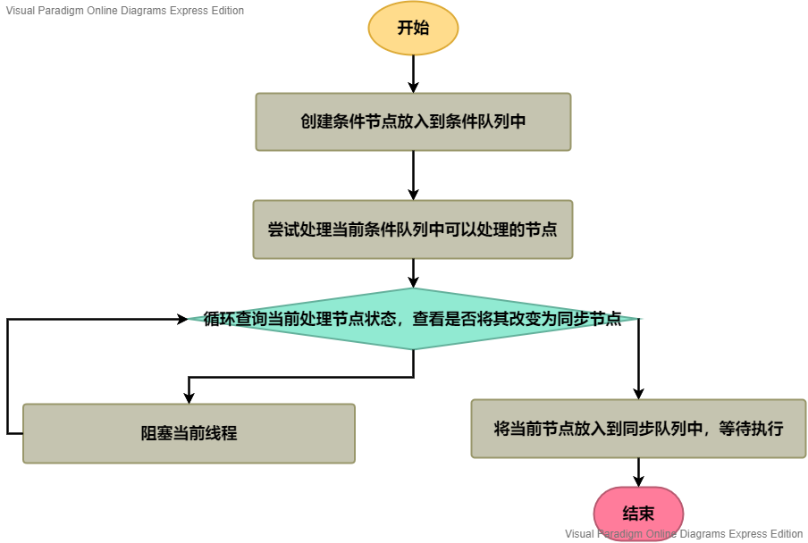

# 3.AbstractQueueSynchronizer-Condition

之前已经描述过，AQS是通过一个CLH队列来完成锁的相关操作，而CLH队列是通过AQS的子类Node类来实现的。Node类可以表示4类节点，其中有一类是CONDITION。本节主要讨论`CONDITION`节点相关的功能与操作。

我们知道对于Object类有如下几个方法用于对象的通知：

```java
public final native void notify();
public final native void notifyAll();
public final native void wait(long timeout) throws InterruptedException;
public final void wait(long timeout, int nanos) throws InterruptedException;
public final void wait() throws InterruptedException;
```

上述的`wait(XXX)`方法用于对某对象进行阻塞，调用`notify()`唤醒阻塞的对象，`notifyAll()`负责唤醒所有阻塞的对象。

上述方法都是native方法。AQS使用Condition完成相同的操作。

AQS使用自己本身的同步队列以及一个条件队列完成上述功能。其中同步队列负责执行，条件队列负责等待或者条件判断。

其中`ConditionObject`的`await(XXX)`方法对应Object的·`wait(XX)`方法，`ConditionObject`的`signalXXX(XXX)`方法对应Object的`notifyXXX()`方法。

我们首先考察数据结构`ConditionObject`。

## ConditionObject

该类的主要功能是实现了一个条件队列，并完成条件队列所有的基本操作。条件队列负责判断阻塞条件是否满足，然后将事件放入到同步队列，不负责消除阻塞，真正负责执行、消除阻塞的仍然是同步队列。

首先查看该类的属性，其中这里我们主要考虑与条件队列相关的属性，可以看到ConditionObject有如下属性：

```java
private transient Node firstWaiter;
private transient Node lastWaiter;
```

与同步队列相同，条件队列也通过头节点与尾节点进行表示。可以看到，这里每个节点使用的仍然是Node，因此Node具有CONDITION类型也就得到了解释。

那么条件队列到底是如何与同步队列协作的呢？我们接下来考察signal和await方法。

## await方法

首先考察await方法，该方法负责阻塞某线程，直到该线程被signal之后继续执行。

我们简单思考一下，如果让我们使用条件队列和同步队列实现上述操作如何实现。

1. 在await方法中将线程放入到条件队列，放入成功后进行阻塞。
2. 调用signal方法将特定线程在条件队列中的节点删除，然后将线程节点放入到同步队列中等待执行。

这里我们查看await方法的具体实现。

```java
public final void await() throws InterruptedException {
    if (Thread.interrupted())
        throw new InterruptedException();
    // 将当前线程创建对应的节点，放入到条件队列中
    Node node = addConditionWaiter();
    // 尝试处理当前节点
    int savedState = fullyRelease(node);
    int interruptMode = 0;
    // 判断当前节点是否是同步队列节点，如果不是，则阻塞线程
    while (!isOnSyncQueue(node)) {
        LockSupport.park(this);
        if ((interruptMode = checkInterruptWhileWaiting(node)) != 0)
                break;
    }
    // 如果条件队列中的节点应该放入同步队列，那么就将其放入同步队列
    if (acquireQueued(node, savedState) && interruptMode != THROW_IE)
        interruptMode = REINTERRUPT;
    // 清除无用的节点
    if (node.nextWaiter != null) // clean up if cancelled
        unlinkCancelledWaiters();
    if (interruptMode != 0)
        reportInterruptAfterWait(interruptMode);
}
```

可以看到，在AQS的实现中，并不是像我们想象的那么实现，而是把条件节点变为同步节点的操作全部放在了`await(XX)`方法中。下面针对下图分析`await(XX)`方法：



那么接下来有几个问题：

1. 条件队列也是CLH队列么？
2. 为何AQS不使用我们之前的想法？

首先我们解答第一个问题，我们通过考察`addConditionWaiter()`方法对其进行解答，该方法负责向AQS的条件队列中添加新的节点，因此可以通过此处判断条件队列是否是CLH队列。

```java
private Node addConditionWaiter() {
    Node t = lastWaiter;
    // If lastWaiter is cancelled, clean out.
    if (t != null && t.waitStatus != Node.CONDITION) {
        unlinkCancelledWaiters();
        t = lastWaiter;
    }
    Node node = new Node(Thread.currentThread(), Node.CONDITION);
    if (t == null)
        firstWaiter = node;
    else
        t.nextWaiter = node;
    lastWaiter = node;
    return node;
}
```

该方法仅仅为当前线程创建了一个条件队列节点放入到条件队列中。不过这里需要注意，在同步队列对节点的操作中都用了CAS加自旋锁的方式，然而这里却没有使用任何防止并发出错的措施。主要是因为Condition的方法在使用时，必须要借助锁。因此，就不必考虑并发问题了。

不过这里也可以看出，条件队列仅仅是一个普通的队列，并不是CLH队列，毕竟CLH队列是用于处理线程同步问题的，这里只是条件判断罢了。

就和同步队列的处理方式一样，当新的线程到来时，首先尝试处理新的线程，如果处理不成功，再放入同步队列中，然后调用自旋+CAS进行处理。这里也是，先调用`fullyRelease(Node)`方法尝试处理新到达的节点，如果处理失败，则尝试自旋处理。

那么到底是如何处理的呢？尝试考察`fullyRelease(Node)`方法：

```java
final int fullyRelease(Node node) {
    boolean failed = true;
    try {
        int savedState = getState();
        if (release(savedState)) {
            failed = false;
            return savedState;
        } else {
            throw new IllegalMonitorStateException();
        }
    } finally {
        if (failed)
            node.waitStatus = Node.CANCELLED;
    }
}
```

可以看到这里尝试处理当前节点所代表的当前线程。即尝试调用`release(int)`方法释放节点。如果成功处理了，则将当前节点的状态设置为`Node.CANCELLED`，表示节点已经失效。

尝试处理节点失败后开始对节点进行自旋处理。即如下代码：

```java
while (!isOnSyncQueue(node)) {
    LockSupport.park(this);
    if ((interruptMode = checkInterruptWhileWaiting(node)) != 0)
        break;
}
```

该段代码表示，如果当前节点没有被放入到同步队列，证明条件没有达成，因此挂起按当前线程。直到有人唤醒当前线程为止，也就是调用了`signal`方法，`signal`方法将条件队列中的节点放入到了同步队列，因此在当前线程唤醒之后，就可以开始进行执行业务要求的操作，即放入同步队列中竞争锁。代码如下：

```java
if (acquireQueued(node, savedState) && interruptMode != THROW_IE)
    interruptMode = REINTERRUPT;
```

由于条件队列在添加节点时，会先尝试判断是否满足条件，如果满足条件则立即执行业务操作，但是添加节点是在尝试处理之前的，如果尝试判断条件满足后，应该删除添加的节点，因此就有了接下来的代码：

```java
if (node.nextWaiter != null) // clean up if cancelled
    unlinkCancelledWaiters();
```

最后就是根据中断标志报告对应的情况。这里就没什么可说的了。由于唤醒阻塞线程的方法是在`signal`方法中的，因此我们有必要详细分析一下该方法。

## signal方法

通过对`await(XX)`方法的分析我们知道，await方法会阻塞当前线程，等待`signal`方法唤醒线程，然后将唤醒的线程参与同步队列竞争锁。这里我们考虑`signal`方法所作的事情。

```java
public final void signal() {
    if (!isHeldExclusively())
        throw new IllegalMonitorStateException();
    Node first = firstWaiter;
    if (first != null)
        doSignal(first);
}
```

该方法的执行逻辑很简单，仅仅是先检查占用锁的线程是否是当前线程，如果不是则抛出异常，否则开始唤醒第一个阻塞的线程。唤醒逻辑在`doSignal(Node)`方法中。而`doSignal(Node)`方法就是将条件队列中的第一个节点设置为0，然后将节点放入到同步队列中，如果节点状态是CANCELLED那么将其设置回SIGNAL，然后唤醒阻塞线程。

至此我们分析完了AQS 中条件队列和阻塞队列的所有基本方法。接下来我们可以根据这些去分析基于AQS的一系列组件。
