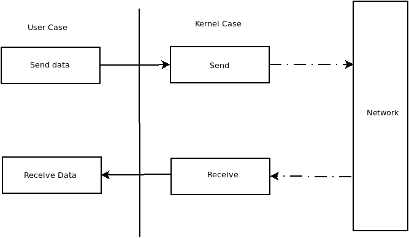
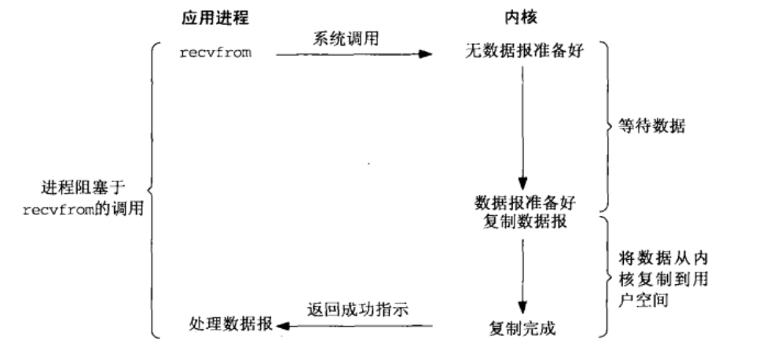
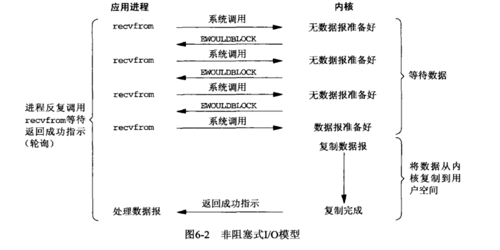
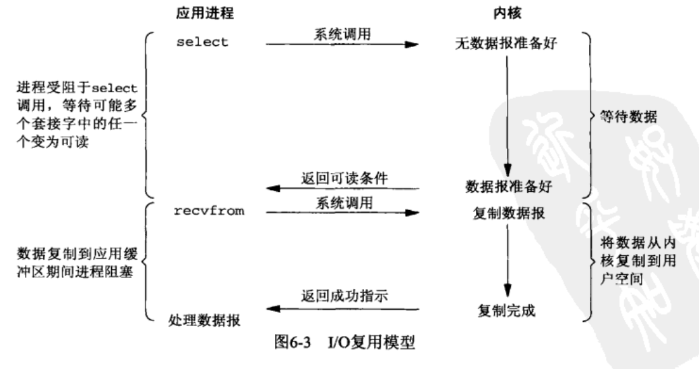

# Nio-Start

Nio并不是一个新的技术，只是在Java4 引入到Java中罢了。在Java的NIO中具有三个基本概念：

1. Channel（通道）
2. Selector
3. Buffer

Nio中体现的思想都来自linux，这里我们优先讨论一下Linux中的一些概念，方便理解Nio。

在Linux系统中，系统空间被分为用户态与内核态，并为每个状态下分配了缓冲区，即为用户态缓冲区和内核态缓冲区。用户态的所有操作最终都是交由内核态完成的，因此数据流向如下图所示：

发送数据还比较好说，但是从网络中读取数据时，可能会发生读取数据时，数据没有到达的情况，传统的BIO，也就是阻塞IO就是这种情况：

当应用程序需要进行数据接收时，应用程序主动通知内核需要接收数据，然而此时可能内核并没有准备好数据，因此应用程序无法获取到响应，就阻塞在这里，直到内核态将数据准备好，然后拷贝给应用程序，应用程序才能获取到数据，停止阻塞。

由于阻塞IO会导致长时间阻塞，阻塞时间内不仅占用资源，而且无法进行任何操作，因此效率极低，所以产生了非阻塞IO，下面是非阻塞IO的示意图：

非阻塞IO与阻塞IO最大的不同是，用户进程不断的进行轮询检查数据包是否准备完成，在轮询期间可以做一些其他操作，避免了资源浪费与阻塞。但是仍需要大量的检查操作，而且能够在循环中进行的业务操作并不多，因此效率依旧不高。

那么为什么这里不会陷入阻塞呢？因为在非阻塞IO中，如果内核没有准备好数据，不是等待内核把数据准备好，而是抛出一个错误。也因为这个错误不会使程序阻塞。

虽然非阻塞IO相比阻塞IO具有一定的优点，但是缺点仍然很大，因此又有了IO多路复用。其执行流程如图所示：

可以看到IO多路复用中也存在了阻塞，即select函数调用时产生了阻塞，那么这和BIO有什么区别呢？如果你使用IO多路复用永远处理单线程，那么将于阻塞IO并无不同，甚至效率会更低，但是如果处理多线程，那么就可以轻易发现区别。阻塞IO在处理多线程时会在每个线程都会进行阻塞，然而IO多路复用只会阻塞监控内核数据报是否准备好的线程，而且这一阻塞，其实并不影响效率，毕竟没有数据就没有办法进行处理。

当然除此之外，Linux中的I/O模型还有信号驱动式IO以及异步IO，但是这里就不赘述了。

事实上，Java的NIO就是利用了IO多路复用，这一切都在Selector中。这里我们首先讨论一些基础的IO操作，首先讨论ByteBuffer和Channel。
