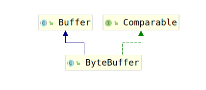

# ByteBuffer

在Nio中所有的数据操作都要经过ByteBuffer才能完成。你可以把Channel比作BIO中的IO流，而ByteBuffer比作数据，我们常见的BIO写入文件操作是：

```java
BufferedOutputStream a = new BufferedOutputStream(new FileOutputStream("XXX"));
a.write("Input".getBytes());
```

而如果把这简简单单的写入操作放入NIO中就会变为：

```java
FileChannel fileChannel = FileChannel.open(Paths.get("XXX"));
// or
FileChannel in = new FileInputStream("XXX").getChannel();
FileChannel out = new FileOutputStream("XXX").getChannel();

ByteBuffer data = ByteBuffer.wrap(new byte[]{'1','2','3'});
out.write(data);
out.clear();
ByteBuffer readBuffer = ByteBuffer.allocate(3);
in.read(readBuffer);
in.flip();
```

可以看到使用NIO要比BIO操作麻烦的多，但是麻烦换来的却是高效。经过上述两个例子我们已经知道了ByteBuffer在NIO中的重要性。下面我们来讨论ByteBuffer。

实际上ByteBuffer是一个抽象类，它提供了一些基础方法，本节我们只考虑ByteBuffer中的基本数据操作方法。

首先考虑ByteBuffer的创建操作。ByteBuffer可以通过两种方式进行创建：

1. 使用allocate(int)和allocateDirect(int)方法
2. 使用wrap(byte[]) 和 wrap(byte[],int,int)方法

其中第一种方式是创建一个空的ByteBuffer，其中参数要求的int值是ByteBuffer的size。而第二章方式则是将byte[]直接包装成一个ByteBuffer。那么既然第一种方法都是创建一个空的ByteBuffer，那为什么会有两个方法呢？事实上，这两个方法创建的ByteBuffer是不同类型的，前面说过，ByteBuffer是一个抽象类，我们考察一下这两个方法，详细查看一下创建的ByteBuffer的类型：

```java
public static ByteBuffer allocate(int capacity) {
    if (capacity < 0)
        throw new IllegalArgumentException();
    return new HeapByteBuffer(capacity, capacity);
}

public static ByteBuffer allocateDirect(int capacity) {
    return new DirectByteBuffer(capacity);
}
```

可以看到使用`allocate(int)`方法创建的是`HeapByteBuffer`，而`allocateDirect(int)`方法创建的是`DirectByteBuffer`。至于这两者区别，后面在考察。

那么下面我们开始考察ByteBuffer的存储结构，ByteBuffer在继承结构上，其类继承关系如图：



可以考到ByteBuffer继承自Buffer这个抽象类，查看HeapByteBuffer的构造器：

```java
HeapByteBuffer(int cap, int lim) {
    super(-1, 0, lim, cap, new byte[cap], 0)
}

ByteBuffer(int mark, int pos, int lim, int cap,   // package-private
                 byte[] hb, int offset)
{
    super(mark, pos, lim, cap);
    this.hb = hb;
    this.offset = offset;
}
```

由于ByteBuffer的构造器调用了Buffer的构造器，因此，考察Buffer的构造器就是必要的了：

```java
Buffer(int mark, int pos, int lim, int cap) {       // package-private
    if (cap < 0)
        throw new IllegalArgumentException("Negative capacity: " + cap);
    this.capacity = cap;
    limit(lim);
    position(pos);
    if (mark >= 0) {
        if (mark > pos)
            throw new IllegalArgumentException("mark > position: ("
                + mark + " > " + pos + ")");
        this.mark = mark;
    }
}
```

Buffer为ByteBuffer提供了作为一个Buffer所需的所有标志以及标志处理方法。可以看到，该类包含如下属性：

1. mark：mark用于表示用户自定义标志位
2. position：表示当前操作的位置
3. limit：表示缓存区的最大位置
4. capacity：表示缓存区的大小

这里讨论几个经常使用的方法：

1. Buffer position(int newPosition)：该方法用于更改Position的值，需要注意的是如果新的position大于mark的值，mark会置为-1。
2. Buffer limit(int newLimit)：该方法用于为ByteBuffer显式指定limit的值，如果postition>limit，那么position=limit，如果mark>limit，那么mark=-1。
3. Buffer mark()：该方法就是将当前position保存起来，即mark=position
4. Buffer reset()：该方法是mark()的逆方法，即将postition=mark，注意此处不会清除mark。
5. Buffer clear()：该方法用于清除缓存中的数据，这里是逻辑清除，不是物理清除，仅仅将position=0,limit=capacity，mark=-1。
6. Buffer flip()：该方法用于读完数据后，刷新Buffer状态，避免用户读到不该读到的数据，将limit=position，用将最后一次读到的数据作为限制，position=0用于让读取数据者从头读取，mark=-1用于清空之前的脏mark
7. Buffer rewind()：该方法用于保证写数据从头写，该方法将position设置为0，mark设置为-1。

ByteBuffer只提供了两个存储相关的属性：

1. hb：存储数据的数组
2. offset：偏移量

与这两者相关的主要方法就是`put`和`get`方法。

这里首先考察put方法中最基本的`put(byte[],int,int)`，因为其他的三种实现最后都是调用的该方法：

```java
public ByteBuffer put(byte[] src, int offset, int length) {
    // 获取长度，如果长度小于Bits.JNI_COPY_FROM_ARRAY_THRESHOLD，那么直接使用for循环将数据插入数组中
    // 否则调用unsafe的copyMemory(Object srcBase, long srcOffset,
    //                              Object destBase, long destOffset,
    //                              long bytes);
    // 方法直接拷贝内存
    if (((long)length << 0) > Bits.JNI_COPY_FROM_ARRAY_THRESHOLD) {
        checkBounds(offset, length, src.length);
        int pos = position();
        int lim = limit();
        assert (pos <= lim);
        int rem = (pos <= lim ? lim - pos : 0);
        if (length > rem)
            throw new BufferOverflowException();
            Bits.copyFromArray(src, arrayBaseOffset,
               (long)offset << 0,
               ix(pos),
               (long)length << 0);
            position(pos + length);
        } else {
            super.put(src, offset, length);
        }
        return this;
}
```

分析完put方法，接下来再次查看get方法族的`get(byte[] dst, int offset, int length)`就很简单了：

```java
public ByteBuffer get(byte[] dst, int offset, int length) {
    // 与put的逻辑相似
    // 读取的数据长度大于Bits.JNI_COPY_TO_ARRAY_THRESHOLD
    // 则调用unsafe的copyMemory(Object srcBase, long srcOffset,
    //                              Object destBase, long destOffset,
    //                              long bytes);
    // 方法从内存中直接进行数据拷贝
    // 否则使用for循环读取数据
    if (((long)length << 0) > Bits.JNI_COPY_TO_ARRAY_THRESHOLD) {
        checkBounds(offset, length, dst.length);
        int pos = position();
        int lim = limit();
        assert (pos <= lim);
        int rem = (pos <= lim ? lim - pos : 0);
        if (length > rem)
            throw new BufferUnderflowException();
            Bits.copyToArray(ix(pos), dst, arrayBaseOffset,
                (long)offset << 0,
                (long)length << 0);
            position(pos + length);
    } else {
        super.get(dst, offset, length);
    }
    return this;
}
```

至此，所有ByteBuffer相关的简单细节已经分析完毕，对于基本使用应该没有什么问题了，关于更多的细节将在之后分析，接下来我们考察Channel。
