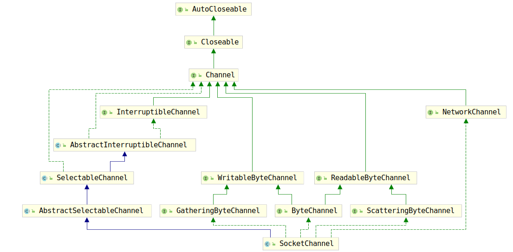

# Channel

Channel是NIO中的另一个重要概念，Java的Doc文档对其有如下描述：`A channel represents an open connection to an entity such as a hardware device, a file, a network socket, or a program component that is capable of performing one or more distinct I/O operations, for example reading or writing.`，即一个Channel代表一个连接，这个连接连接到了一个硬件设备、一个文件、一个Socket等等。这个概念个可能理解的比较困难，那么我们考虑如下场景，在linux中，如果我们要将一个程序的日志打印到某个文件，可以使用如下做法：

```shell
process.sh > log.log
```

Channel的作用就和上述语句类似，将字节信息存入到特定的对象中。在linux中我们将这类的操作称为I/O重定向操作。但是实际上每个进程都有自己维护的fd列表，用于表示打开的文件，其实根本目的还是写入数据罢了。

至于NIO和Blocked IO的具体读写操作实现，我们之后讨论。常见的Channel包括：

1. SocketChannel：TCP客户端
2. ServerSocketChannel：TCP服务端
3. FileChannel：文件处理
4. DatagramChannel：处理UDP协议

这里我们主要介绍ServerSocketChannel，因为相比之下TCP协议的使用相对更普遍，而且通过介绍ServerSocketChannel也可以顺带介绍了SocketChannel，因为ServerSocketChannl依赖SocketChannel，首先介绍SocketChannel。

## 1. SocketChannel

考察一个类首先要考察其继承关系，下图显示了SocketChannel的累积成关系：



## 1.1 Channel

首先我们考察最基本的Channel接口。之前已经说过，Channel相当于一个连接，由于是连接，所以必定有开启连接和关闭连接的问题，因此Channel只要求实现了两个方法：

1. isOpen()方法：用于查询Channel是否是开启的
2. close()方法：关闭Channel。如果Channel已经关闭，那么再使用该Channel进行IO操作时，那么会抛出ClosedChannelException异常。重复关闭Channel是没有任何作用的。

除此之外没有别的方法。

## 1.2 ReadableByteChannel和WritableByteChannel

对于Channel来说除了开启和关闭，相对重要的也就是读写数据操作了，读操作由`ReadableByteChannel`接口定义，而写数据相关的操作由`WritableByteChannel`接口定义。

首先考察`ReadableByteChannel`接口，该接口仅仅定义了一个从Channel中读取数据到ByteBuffer的方法：

```java
public int read(ByteBuffer dst) throws IOException;
```

虽然该方法是Nio的方法，但是，他的用法很像InputStream的read(byte[])方法，因为作用都是尽可能将数据读取到给定的容器中。但是也有一定的区别，Channel具有阻塞模式和非阻塞模式，阻塞模式下就和BIO相差不大了,如果在非阻塞模式下，如果读取缓冲区中没有数据，该方法会直接返回，而不是阻塞等待数据到来。不过需要注意的是，Channel并不是在非阻塞模式下就不会阻塞了，如果一个Channel中的数据正在被另一个线程读取，那么当前线程的读取操作就会阻塞，等待另一个线程读取完毕之后再开始当前线程的读取操作。不过也正因此，默认情况下Channel的读取操作是线程安全的。还有一件事需要强调，由于Channel的读取操作是向ByteBuffer进行了写操作，所以在ByteBuffer被读之前记得flip()一下，否则position会在读取到数据的末尾位置。

了解了`ReadableByteChannel`接口再查看`WritableByteChannel`就简单多了，因为`WritableByteChannel`与`ReadableByteChannel`相当类似，只定义了一个方法：

```java
public int write(ByteBuffer src) throws IOException;
```

而且该方法和`read(ByteBuffer)`特性也极其相似，也会阻塞。默认情况下进行写入操作时，都是写入ByteBuffer中所有可写的数据，但是也存在不写入数据的情况，例如socket的发送缓冲区满了的情况。而且在写出数据后，如果要再进行写操作也是要clear()一下。

由于读写操作是一个Channel的基本操作，因此上面介绍的三个接口也被封装成了一个`ByteChannel`接口，方便使用。

## 1.3 ScatteringByteChannel和GatheringByteChannel

然而，上述接口提供的方法是有一定局限性的，因为只能读取数据将整个ByteBuffer占满，要么就将ByteBuffer中的所有数据写到Channel中。这些方法灵活性太小，因此就有了`GatheringByteChannel`接口和`ScatteringByteChannel`接口。继续优先查看用于读取数据的`ScatteringByteChannel`。该接口定义了两个方法：

```java
public long read(ByteBuffer[] dsts, int offset, int length)throws IOException;
public long read(ByteBuffer[] dsts) throws IOException;
```

可以看到上述方法将参数从之前的ByteBuffer对象换为ByteBuffer[]，第一个offset方法指定了从第几个ByteBuffer开始使用，length表示最多使用多少个ByteBuffer。而 `read(ByteBuffer[])` 是`read(dest,0,dest.length)`的封装罢了。

至于`GatheringByteChannel`的接口，这里查看一下，我想读者也就知道他们的含义了：

```java
public long write(ByteBuffer[] srcs, int offset, int length)
        throws IOException;
public long write(ByteBuffer[] srcs) throws IOException;
```

这里不再对上述两个方法的含义进行介绍。

通过上述的分析，我们已经将所有负责读取、写入操作的接口全部分析完毕，但是由于我们这里分析的是SocketChannel，因此会有许多网络相关的操作，这些操作由NetworkChannel进行定义。
