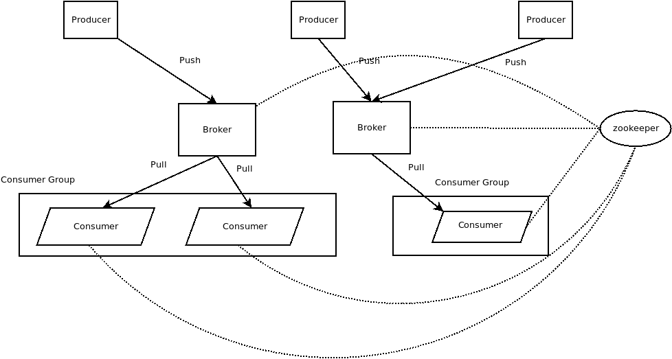

# 1.基本概念

Kafka是一个分布式消息队列。Kafka对消息保存时根据Topic进行归类，发送消息者称为Producer，消息接受者称为Consumer，此外kafka集群有多个kafka实例组成，每个实例(server)称为broker。

无论是kafka集群，还是consumer都依赖于zookeeper。这里是Kafka的基本结构图：

Kafka大致结构分为三部分，分别为：

1. Producer:消息生产者。
2. Broker:Kafka服务端，消息的存储者。
3. Consumer：消息消费者。

同时Broker以及 Consumer依赖于zookeeper。

通过上图可以看到对于Kafka来说，Producer是通过push的方式将消息推送到Broker中，而Consumer通过pull的方式对消息进行拉取。

对于消息队列来说，消费者消费消息可以有如下两种方式：

1. 消息队列主动推送消息
   - 优点：
     1. 消息可以及时的推送到消费端，实时性较高
     2. 消费者不用实时监听消息的推送状况，减轻消费者负担
   - 缺点：
     1. 消费者增加就要去修改服务端配置，耦合性过大
     2. 只要有一条消息就要推送，服务端性能降低
     3. 可能出现生产者推送消息速率快于消费者消费速率的情况，可能使消费者系统崩溃
     4. 无法判断消费者处理消息的情况，发出的消息没有正确处理则丢失，会导致消息丢失
2. 消费者主动拉取消息
   - 优点:
     1. 消费者可以控制消费速率，保证了消费者系统的稳定
     2. 耦合性降低，消费者增加不会影响到服务端
     3. 可以控制服务器端 批量推送数据，提高服务器端效率
   - 缺点:
     1. 生产者消息生产速率过快可能会压垮服务器端
     2. 消息处理的实时性由消费端决定，实时性无法保证
     3. 消费者要处理拉取消息以及实时监控服务端消息存储状况的工作。
     4. 可能会处理消息重复问题

下面可以对上述的各个原因进行简单分析：

1. 实时性问题

    采用Broker主动推送给Consumer时，可以保证一旦有一条消息到达就及时向Consumer们进行推送，Consumer接收到之后就可以处理，拥有较高的实时性。

    如果采用Consumer主动拉取的方式，拉取速率、拉取时间都由消费者控制，实时性无法得到保证。

    但是消费者的实时性是可以让开发者根据业务逻辑独立设计策略进行避免的，例如1s拉取n条数据，甚至更小的时间间隔内拉取一次数据。而如果是Broker推送数据，我们无法保证所有的Consumer都要求如此高的实时性，可能会导致资源的浪费。虽然Push方法实时性较好，但是却不灵活。

2. 消费者监控服务端消息情况问题

    采用Push的方式则表示有数据就会推送，消息本身就在服务端进行存储，服务端对消息存储情况更了解，消费者系统可以将更多的精力放在处理业务问题部分。

    采用Pull的方式时，由于消费者端不了解服务端是否存在消息存储情况，因此为了保证消息尽快处理，需要循环拉取消息。

3. 耦合性问题

    采用Push的方式需要让服务端知晓有哪些消费者需要消息推送，因此如果要添加一个消费者就要重新配置、重启消息队列，耦合性过大 。

    采用Pull的方式只需要为消费者配置服务者的信息即可，增加消费者也不需要对服务端有任何影响，耦合性大大降低

4. 消息推送开销问题

    Kafka服务端的消息存在于硬盘中，在发送消息时使用sendfile进行优化，因此，一次推送更多的消息比单条消息推送效率更高，Pull的方式给予了一定时间间隔，可以让消息推送的块更大，效率更高。

5. 速率不匹配问题

    由于消息队列的模式就是生产者-服务端-消费者模式，这个模式本身就可能出现速率不平衡的问题，所以在传统的操作系统中出现了生产者-消费者问题。这个问题同样适用于现在的情况，如果生产者生产速率大于消费者消费速率，采用Push的方式，由于消息不能及时被消费，服务端会被挤爆（或者是服务端丢弃数据）。采用Pull的方式，由于服务端消息推送速度过快导致消费者端根本无法承受，那么会导致消费者端崩溃（或者是消费者端丢弃数据）

## 1.1 Kafka消息存储格式

对于Kafka来说，Topic是Kafka数据写入操作的基本单元。一个Topic可以创建一个或者多个Partition，每个Partition中还有多个Segment，每个Segment中包含多条消息。每条消息属于且仅属于一个Topic。

上面描述的结构可以用如下图来表示：

Kafka将消费者分为不同的消费者组，对于同一条消息，同一消费者组内只能有一个消费者消费该消息。对于一个Partition，同一消费者组中只有一个消费者在规定时间范围内能够消费该Partition的消息。生产者生产的消息也都放在Partition尾部，逐步Append。

那么为什么Kafka会引入Partition以及Segment？

首先考察为何引入Partition？

