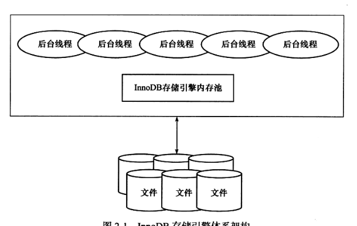
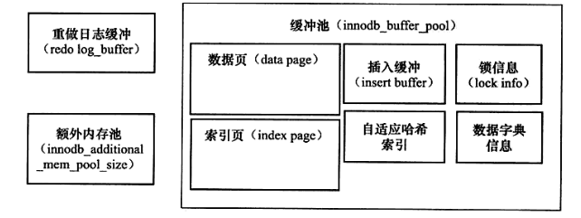

# 2.3 InnoDB体系架构

InnoDB存储引擎体系架构如下图:



InnoDB存储引擎主要由后台线程、存储引擎内存池（由多个内存块组成）组成，内存池主要负责如下工作：

1. 维护所有进程/线程需要访问的多个内部数据结构。
2. 缓存磁盘上的数据，方便快速地读取，同时在对磁盘文件的数据修改之前在这里缓存。
3. 重做日志缓冲。

后台线程主要用于负责刷新内存池中的数据，保证缓冲池中的内存缓存的是最近的数据。此外将已修改的数据文件刷新到新的磁盘文件，同时保证在数据库发生异常的情况下InnoDB能够回复到正常运行的状态。

## 2.3.1 后台线程

后台线程主要分为4类：

1. Master Thread：即主线程，该线程主要负责将缓冲池的数据异步刷新到磁盘，保证数据的一致性，包括脏页的刷新、合并插入缓存（INSERT BUFFER）、UNDO页的回收等。
2. IO Thread:即IO 线程，InnoDB存储引擎中大量使用了AIO（异步IO）进行写IO请求，极大的提高了数据库性能，IO线程负责对于这些IO请求的回调处理。InnoDB 1.0版本之前共有4个IO Thread，分别是write、read、insert buffer和log IO thread。可以通过innodb_read_io_threads和innodb_write_io_threads参数进行设置，读线程的ID总是小于写线程。
3. Purge Thread:即清除线程，事务被提交后，其所使用的undolog可能不再需要，Purge Thread用于回收已经使用并分配的undo页。InnoDB 1.1版本之前改操作交给Master Thread做，在InnoDB 1.1版本开始，purge操作独立到单独的线程中执行，减少Master Thread的工作。可以通过如下设置来配置Purge Thread:

    ```conf
    [mysqld]
    innodb_purge_threads=1
    ```

4. Page Cleaner Thread:即页清理线程，该线程用于脏页的刷新操作，目的是减轻原Master Thread的工作一级对于用户查询线程的阻塞，该线程是在InnoDB 1.2.x引入的。

## 2.3.2 内存

### 1. 缓冲池

InnoDB存储引擎是基于磁盘存储的，并将其中的记录按照页的方式进行管理。但是由于CPU与磁盘速度之间的鸿沟，基于磁盘的数据库系统通常使用缓冲池技术来提高数据库的整体性能。

缓冲池简单来说就是一块内存区域，通过内存的速度弥补磁盘速度较慢对数据库性能的影响。

在数据库的读取页的操作，首先将从磁盘读到的页存放在缓冲池中，这个过程称为将页"FIX"在缓冲池中。下一次再读相同的页时，首先判断该页是否在缓冲池中。若在缓冲池中被命中，直接读取该页。否则，读取磁盘上的页。

对于数据库中页的修改操作，则首先修改在缓冲池中的页，然后再以一定的频率刷新到磁盘上。这里需要注意的是，页从缓冲池刷新回磁盘的操作并不是在每次页发生更新时触发，而是通过一种称为Checkpoint的机制刷新回磁盘。同样也是为了提高数据库的整体性能。

综上所述，缓冲池的大小直接影响着数据库的整体性能。32位操作系统的限制，该系统最多将该值设置为3G，为了让数据库使用更多的内存，强烈建议数据库服务器采用64位的操作系统。对于InnoDB存储引擎而言，其缓冲池配置通过参数innodb_buffer_pool_size来设置。

    show variables like 'innodb_buffer_pool_size'

注意此处查出来的值以byte为单位。

InnoDB内存数据对象结构分布如下：



具体来看，缓冲池中缓存的数据页类型有：索引页、数据页、undo页、插入缓冲、自适应哈希索引、InnoDB存储的锁信息、数据字典信息等。不能简单地认为，缓冲池只是缓存索引页和数据页，它们只是占据缓冲池地很大一部分而已。

从InnoDB 1.0.X版本开始，允许有多个缓冲池实例。每个页根据哈希值平均分配到不同缓冲池实例中。这样可以减少数据库内部地资源竞争，增加数据库地并发处理能力。可以通过参数innodb_buffer_pool_instances来进行配置，该值默认为1：

    show variables like 'innodb_buffer_pool_instances';

可以通过命令观察到缓冲区地详细内容：

    show engine innodb status;

并且可以通过--BUFFER POOL 0来表明是哪个缓冲池实例。从Mysql 5.6版本开始，可以通过information_schema架构下地表INNODB_BUFFER_POOL_STATS来观察缓冲的状态，运行如下命令可以看到各个缓冲池地使用状态：

     select POOL_ID,POOL_SIZE,FREE_BUFFERS,DATABASE_PAGES from information_schema.innodb_buffer_pool_stats；

### 2. LRU List、Free List和Flush List

InnoDB存储引擎是如何对这么大的内存区域进行管理？

通常来说，数据库中的缓冲池是通过LRU（最近最少使用）算法来管理。在InnoDB存储引擎中，缓冲池中页地大小默认为16KB，同样使用LRU算法对缓冲池进行管理。InnoDB存储引擎对传统地LRU算法做了优化。在InnoDB的存储引擎中，LRU列表中还加入了midpoint位置。新读取到的页虽然是最新访问的页，但并不是直接放入到LRU列表地首部，而是放入到LRU列表的midpoint位置。这个算法在InnoDB存储引擎下称为midpoint insertion strategy。默认配置下，该位置在LRU列表长度地5/8处。midpoint位置由参数innodb_old_blocks_pct控制，如:

    show variables like 'innodb_old_blocks_pct';

参数innodb_old_blocks_pct默认值为37，表示新读取的页插入到LRU列表尾端地37%的位置（差不多3/8地位置）。在innodb存储引擎中，把midpoint之后的列表称为old列表，之前地列表称为new列表。可以简单地理解为new列表中的页都是最为活跃地热点数据。

相比于朴素LRU算法的优点是：若直接将读取到的页放入到LRU的首部，那么某些SQL操作可能会使缓冲池中的页被刷新出，从而影响缓冲池地效率，常见的这类操作为索引或数据的扫描操作。这类操作需要访问表中地许多页，甚至是全部地页，这些页通常来说又仅在这次查询操作中需要，并不是活跃的热点数据。如果页被放入LRU列表地首部，那么非常可能将所需要地热点数据页从LRU列表中移除，而在下一次需要读取该页时，InnoDB存储引擎需要再次访问磁盘。

为了解决该问题，InnoDB存储引擎引入了innodb_old_blocks_time参数来进一步管理LRU列表，用于表示页读取到mid位置后需要等待多久才会被加入到LRU列表地热端，因此当需要执行上述所说地SQL操作时，可以先将该参数调大，然后执行SQL操作，执行完毕后，将该值调回原值。

LRU列表用来管理已经读取的页，但当数据库刚启动时，LRU列表是空的，即没有任何的页。这时页都存放在Free列表中。当需要从缓冲池中分页时，首先从Free列表中查找是否有可用的空闲页，若有则将该页从Free列表中删除，放入到LRU列表中。否则根据LRU算法，淘汰LRU列表末尾的页，将该内存空间分配给新的页。当页从LRU列表中的old部分加入到new部分时，称此时发生地操作为page made young，而因为innodb_old_blocks_time的设置而导致页没有从old部分移动到new部分称为page not made young，可以通过show engine innodb status观察LRU列表预计Free列表的使用状况与运行状态:

```
BUFFER POOL AND MEMORY
----------------------
Total large memory allocated 137428992
Dictionary memory allocated 292354
Buffer pool size   8191
Free buffers       7643
Database pages     544
Old database pages 217
Modified db pages  0
Pending reads      0
Pending writes: LRU 0, flush list 0, single page 0
Pages made young 0, not young 0
0.00 youngs/s, 0.00 non-youngs/s
Pages read 473, created 71, written 4144
0.00 reads/s, 0.00 creates/s, 0.00 writes/s
Buffer pool hit rate 1000 / 1000, young-making rate 0 / 1000 not 0 / 1000
```

其中Buffer pool size共有8191个页，即8191*16K，共计128MB的缓冲区。Free buffers表示当前Free列表中的页的数量，Database pages表示LRU列表中页地数量。可能的情况是Free Buffers与Database pages的数量之和不等于Buffer pool size。因为缓冲池中的页还可能会被分配给自适应哈希索引、Lock信息、Insert Buffer等页，而这部分页不需要LRU算法进行维护，因此不存在于LRU列表中。

Pages made young显示了LRU列表中页移动到前端的次数，not young表示从前端移动到后段地次数，youngs/s、none-youngs/s表示每秒这两类操作地次数。Buffer pool hit rate表示缓存地命中率，本例子中是100%，说明缓冲池运行状态良好，通常该值不应小于95%，否则要考察是否由于全表扫描引起地LRU列表被污染导致问题。

从InnoDB 1.2版本开始，可以通过表INNODB_BUFFER_POOL_STATS来观察缓冲池地运行状态，如：

    select POOL_ID,HIT_RATE,PAGES_MADE_YOUNG,PAGES_NOT_MADE_YONG FROM information_schema.INNODB_BUFFER_POOL_STATS;

此外，还可以通过表INNODB_BUFFER_PAGE_LRU来观察每个LRU列表中每个页地具体信息，例如通过下面的语句可以看到缓冲池LRU列表中SPACE为1的表的页类型：

    select TABLE_NAME,SPACE,PAGE_NUMBER,PAGE_TYPE from information_schema.INNODB_BUFFER_PAGE_LRU where space = 1;

InnoDB存储引擎从1.0.x版本开始支持压缩页地功能，即将原本16KB的页压缩为1KB、2KB、4KB和8KB。而由于页地大小发生了变化，LRU列表也有了些许地改变。对于非16KB的页，是通过unzip_LRU列表进行管理的。通过show engine innodb status，可以看到如下数据：

```
Buffer pool hit rate 1000 / 1000, young-making rate 0 / 1000 not 0 / 1000
Pages read ahead 0.00/s, evicted without access 0.00/s, Random read ahead 0.00/s
LRU len: 556, unzip_LRU len: 0
I/O sum[0]:cur[0], unzip sum[0]:cur[0]
```

可以看到LRU列表总共有556个页，而unzip_LRU列表中有0个页。实际上LRU中的页包含了unzip_LRU列表中的页。对于压缩页的表，每个表的压缩比率可能各不相同。可能存在有的表页大小为8KB，有的表页大小为2KB的情况。在unzip_LRU列表中对不同压缩页大小地页进行分别管理。其次，通过伙伴算法进行内存地分配，例如对需要从缓冲池中申请页为4KB的大小，其过程如下：

1. 检查4KB的unzip_LRU列表，检查是否有可用地空闲页。
2. 若有，则直接使用。
3. 否则，检查8KB地unzip_LRU列表。
4. 若能得到空闲页，将页分成两个4KB页，存放到4KB的unzip_LRU列表。
5. 若不能得到空闲页，从LRU列表中申请一个16KB的页，将页分为一个8KB的页、2个4KB的页，分别存放在对应地unzip_LRU列表中。

同样可以通过information_schema架构下的表INNODB_BUFFER_PAGE_LRU来观察unzip_LRU列表中的页，如：

```
select TABLE_NAME,SPACE,PAGE_NUMBER,COMPRESSED_SIZE from information_schema.INNODB_BUFFER_PAGE_LRU where COMPRESSED_SIZE <> 0;
```

在LRU列表中的页被修改后，称该页为脏页，即缓冲池中的页和磁盘上的页的数据产生了不一致。这是数据库会通过CHCEKPOINT机制将脏页刷新回磁盘，而Flush列表中地页即为脏页列表。需要注意地是脏页既存在于LRU列表中，也存在于Flush列表中。LRU列表用来管理缓冲池中页地可用性，Flush列表用来管理将页刷新回磁盘，两者互不影响。

Flush列表也可以通过命令SHOW ENGINE INNODB STATUS来查看，Modified db pages 显示了脏页的数量。information_schema架构下并没有类似于INNODB_BUFFER_PAGE_LRU的表来显示脏页地数量及脏页地类型，但由于脏页存在于LRU列表中，故可以通过INNODB_BUFFER_PAGE_LRU表查看，唯一不同地是需要加入OLDEST_MODIFICATION大于0的SQL查询条件。

```
select TABLE_NAME,SPACE,PAGE_NUMBER,COMPRESSED_SIZE from information_schema.INNODB_BUFFER_PAGE_LRU where OLDEST_MODIFICATION > 0;
```

### 3. 重做日志缓冲

InnoDB存储引擎地内存区域除了有缓冲池外，还有重做日志缓冲。InnoDB存储引擎首先将重做日志信息先放入到这个缓冲区，然后按一定频率将其刷新到重做日志文件。重做日志缓冲一般不需要设置得很大，因为一般情况下每一秒钟会将重做日志缓冲刷新到日志文件，因此用户只需要保证每秒产生的事务量在这个缓冲大小之内即可。该值可有配置参数innodb_log_buffer_size控制，默认为8MB:

```
show variables like 'innodb_log_buffer_size'\G;
```

通常情况下，8MB的重做日志缓冲池足以满足绝大部分的应用，因为重做日志在下列三种情况下会将重做日志缓冲中的内容刷新到外部硬盘地重做日志文件中。

- Master Thread每一秒将重做日志缓冲刷新到重做日志文件；
- 每个事务提交时会将重做日志缓冲刷新到重做日志文件；
- 当重做日志缓冲池剩余空间小于1/2时，重做日志缓冲刷新到重做日志文件。

### 4. 额外地内存池

在InnoDB存储引擎中，对内存的管理是通过一种称为内存堆的方式进行的。在对一些数据结构本身的内存进行分配时，需要从额外的内存池中进行申请，当该区域的内存不够时，会从缓冲池中进行申请。例如，分配了缓冲池（innodb_buffer_pool），但是每个缓冲池中的帧缓冲还有对应的缓冲控制对象（buffer control block），这些对象记录了一些诸如LRU、锁、等待等信息，而这个对象地内存需要从额外内存池中申请。因此，在申请了很大地InnoDB缓冲池时，也应考虑相应地增加该值。
