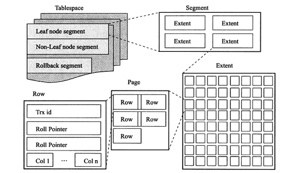

# 4.2 InnoDB逻辑存储结构

从InnoDB存储引擎的逻辑存储结构来看，所有的数据都被逻辑地存放在一个空间中，称之为表空间。表空间由段、区、页组成。页在一些文档中有时也称为块，InnoDB存储引擎的逻辑存储结构大致如下：

## 1. 表空间

表空间可以看做InnoDB存储引擎逻辑结构的最高层，所有的数据都存放在表空间中。默认情况下InnoDB存储引擎有一个共享表空间ibdata1，即所有的数据都存放在这个表空间内。如果用户启用了参数innodb_file_per_table，则每张表内的数据可以单独放到一个表空间内。

但是如果启用了innodb_file_per_table的参数，每张表的表空间内存放的只是数据、索引、插入缓存的Bitmap页，其他类的数据，如回滚信息，插入缓冲索引页、系统失误信息、二次写缓冲等还是存放在原来的共享表空间内。因此，即使启动了参数innodb_file_per_table之后，共享表空间还是会不断的增加其大小。

## 2. 段

本文开头给出的逻辑存储结构图显式了表空间是由各个段组成的，常见的段有数据段、索引段、回滚段等。因为InnoDB存储引擎表是索引组织的，因此数据即索引，索引即数据，那么数据段即为B+树的叶子节点，索引段即为B+树的非索引节点。回滚段较为特殊，会在之后进行单独讨论。在InnoDB中对段的管理都是由引擎自身完成的，DBA不能也没有必要对其进行控制。

## 3. 区

区是由连续页组成的空间，在任何情况下每个区的大小都为1MB。为了保证区中页的连续性，InnoDB存储引擎一次从磁盘申请4~5个区。默认情况下，InnoDB存储引擎的大小为16KB，即一个区中一共有64个连续的页。

InnoDB 1.0.x版本开始引入压缩页，即每个页的大小可以通过参数KEY_BLOCK_SIZE设置为2K、4K、8K，因此每个区对应的页的数量为512、256、128。

InnoDB 1.2.x版本新增了参数 innodb_page_size，通过该参数可以将默认页的大小设置为4K、8K，但是数据库的区并不会被压缩。这时区中页的数量会变成256、128，总之，不论页的大小怎么变化，区的大小总是为1MB。

但是在用户启动了参数innodb_file_per_table后，创建的表默认大小是96KB，而并不是1MB。其实是在每个段开始时，先用32个页大小的碎片页来存放数据，在使用完这些页之后才是64个连续页的申请。这样为了对于一些小表，或者是undo这类的段，可以在开始时申请较小的空间，节省磁盘容量的开销。

## 4. 页

同大多数数据库一样，InnoDB有页的概念，页是InnoDB磁盘管理的最小单位。在InnoDB存储引擎中，默认的每个页大小为16KB。在InnoDB中常见的页类型为：

- 数据页（B-tree Node）
- undo页（undo Log Page）
- 系统页（System Page）
- 事务数据页（Transaction system Page）
- 插入缓冲位图页（Insert Buffer Bitmap）
- 插入缓冲空闲列表页（Insert Buffer Free List）
- 未压缩的二进制大对象页（Uncompressed BLOB Page）
- 压缩的二进制大对象页（Compressed BLOB Page）

## 5. 行

