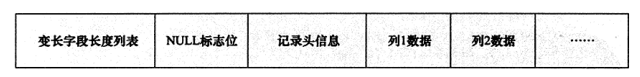
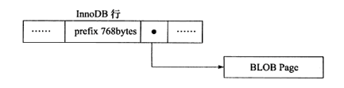
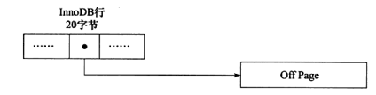

# 4.3 InnoDB行记录格式

InnoDB存储引擎记录是以行的形式存储的。这意味着页中保存着表中一行行的数据。在InnoDB 1.0.x版本之前，InnoDB存储引擎提供了Compact和Redundant两种格式来存放行记录数据。Redundant格式是为兼容之前的版本而保留的。可以通过Show table status like 'table_name'来查看当前表使用的行格式，其中row_format属性表示当前所使用的行记录结构类型。

```
mysql> show table status like 'user'\G;
*************************** 1. row ***************************
           Name: user
         Engine: InnoDB
        Version: 10
     Row_format: Dynamic
           Rows: 5
 Avg_row_length: 3276
    Data_length: 16384
Max_data_length: 0
   Index_length: 32768
      Data_free: 0
 Auto_increment: 15
    Create_time: 2019-10-30 11:50:06
    Update_time: NULL
     Check_time: NULL
      Collation: utf8mb4_general_ci
       Checksum: NULL
 Create_options: 
        Comment: 
1 row in set (0.00 sec)
```

可以看到user表的Row_format为Dynamic。Mysql的行记录格式有4种，分别是REDUNDANT、COMPACT、DYNAMIC、COMPRESSED。详情参考[Mysql InnoDB Row Formats文档](https://dev.mysql.com/doc/refman/5.7/en/innodb-row-format.html)

## 1. Compact行记录格式

Compact行记录在Mysql 5.0中引入的，其设计目标是高效地存储数据。简单来说，一个页中存放的行数越多，性能就越高，下图表示Compact行记录的存储方式：



Compact行记录格式的首部是一个非NULL变长字段长度列表，并且其是按照列的顺序逆序放置的，其长度为：

- 若列的长度小于255字节，用1字节表示；
- 若大于255个字节，用2字节表示；

变长字段的长度最大不可以超过2字节，也因此数据库中VARCHAR类型的最大长度限制为65535。变长字段之后的第二个部分是NULL标志位，该位指示了该行数据中是否有NULL值，有则用1表示（位表示）。该部分所占的字节应该为1字节。接下来的部分是记录头信息，固定占用5字节（40位），含义见下表：

| 名称         | 大小(bit) | 描述                                                                                     |
| ------------ | --------- | ---------------------------------------------------------------------------------------- |
| （）         | 1         | 未知                                                                                     |
| （）         | 1         | 未知                                                                                     |
| deleted_flag | 1         | 该行是否已被删除                                                                         |
| min_rcc_flag | 1         | 为1，如果该记录是预先被定义为最小的记录                                                  |
| n_owned      | 4         | 该记录拥有的记录数                                                                       |
| heap_no      | 13        | 索引堆中该条记录的排序记录                                                               |
| record_type  | 3         | 记录类型，000表示普通，001表示B+树节点指针，010表示Infimum，011表示Supremum，1xx表示保留 |
| next_record  | 16        | 页中下一条记录的相对位置                                                                 |
| Total        | 40        | 总共40字节                                                                               |

最后的部分就是实际存储每个列的数据。需要注意的是，NULL不占该部分任何空间，即NULL除了占有NULL标志位，实际存储不占有任何空间。另外，每行数据除了用户定义的列外，还有两个隐藏列，事务ID列和回滚指针列，分别为6字节和7字节的大小。若InnoDB表没有定义主键，每行还会增加一个6字节的rowid列。

## 2. Redundant行记录格式

Redundant是Mysql 5.0版本之前InnoDB的行记录存储方式，Mysql 5.0支持Redundant是为了兼容之前版本的页格式。Redundant行记录采用如下方式存储：


不同于Compact行记录格式，Redundant行记录格式的首部是一个字段长度便宜列表，同样是按照列的顺序逆序放置的。若列的长度小于255字节，用1字节表示；若大于255字节，用2字节表示。第二部分为记录头信息，不同于Compact行记录格式，Redundant行记录格式的记录头占用6字节（48位），每位的含义如下表：

| 名称            | 大小（bit） | 描述                                    |
| --------------- | ----------- | --------------------------------------- |
| （）            | 1           | 未知                                    |
| （）            | 1           | 未知                                    |
| deleted_flag    | 1           | 该行是否已被删除                        |
| min_rcc_flag    | 1           | 为1，如果该记录是预先被定义为最小的记录 |
| n_owned         | 4           | 该记录拥有的记录数                      |
| heap_no         | 13          | 索引堆中该条记录的索引号                |
| n_fields        | 10          | 记录中列的数量                          |
| 1byte_offs_flag | 1           | 偏移列表为1字节还是2字节                |
| next_record     | 16          | 页中下一条记录的相对位置                |
| Total           | 48          | 总共48字节                              |

n_fields值代表一行中列的数量，占用10位，这也就是为何Mysql数据库一行支持最多的列为1023.另一个需要注意的值为1byte_off_flages，该值定义了偏移列表占用1字节还是2字节。最后的部分就是实际存储的每个列的数据。

与Compact不同的是，对于VARCHAR类型的NULL值，Redundant行记录格式不占用任何存储空间，而CHAR类型的NULL值需要占用空间。在Redundant行记录格式下，CHAR类型将会占用可能存放的最大字节数。

## 3. 行溢出数据

InnoDB存储引擎可以将一条记录中的某些数据存储在真正的数据页面之外。一般认为BLOB、LOB这类大对象列类型的存储会把数据存放在数据页面之外。但是这个理解有点偏差，BLOB可以不讲数据放在溢出页面，而且即使是VARCHAR列数据类型，依然有可能被存放为行溢出数据。

Mysql数据库的VARCHAR类型可以存放65535字节。但是，实际状况下，最多只能存放65532字节的数据，并且需要注意Mysql官方手册中定义的65535长度是指所有VARCHAR列的长度总和，如果列的长度总和超过这个长度依然无法创建。例如一条记录中有三个VARCHAR类型的列，三者想加长度超过65535，都会出现问题。

InnoDB存储引擎的页为16KB，即16384字节，一般情况下，InnoDB存储引擎的数据都是存放在页类型为B-tree node中，但是当发生行溢出时，数据存放在页类型为Uncompress BLOB页中。对于行溢出的数据，InnoDB采用如下的方式进行存放：



正如上图，在出现行溢出的情况时，首先会在InnoDB行中存储前768字节，如果字节更多才会存储到新的Uncompressed BLOB Page。

多长的VARCHAR是保存在单个数据页中的，从多长开始又会保存在BLOB页呢？可以这样进行思考：InnoDB存储引擎是索引组织的，即B+Tree的结构，这样每个页中至少应该有两条记录，如果页中只能存放下一条记录，那么InnoDB存储引擎会自动将行数据存放到溢出页中。因此，TEXT或BLOB类型的数据页并不总是存放在Uncompressed BLOB Page中。

## 4. Compressed和Dynamic行记录格式

InnoDB 1.0.x版本开始引入了新的文件格式，以前支持的Compact喝Redundant格式被称为Antelope文件格式，新的格式被称为Barracuda文件格式。Barracuda文件格式下用友两种新的行记录格式：Compressed喝Dynamic。

新的两种记录格式对于存放在BLOB中的数据采用了完全的行溢出的方式，如下图：



在数据页只存放20个字节的指针，实际的数据都存放在Off Page中，而之前的Compact喝Redundant两种格式会存放768个前缀字节。

Compressed行记录格式的另一个功能就是，存储在期中的行数据会以zlib的算法进行压缩，因此对于BLOB、TEXT、VARCHAR这类大长度类型的数据进行非常有效的压缩。

## 5. CHAR的行结构存储

由于VARCHAR是存储变长长度的字符类型，CHAR是存储固定长度的字符类型。从MySQL 4.1版本开始，CHAR(N)中的N指的是字符的长度，而不是字节的长度，也就是说在不同的字符集下，CHAR类型列内部存储的可能不是定长的数据。

对于多字节字符编码的CHAR数据类型的存储，InnoDB存储引擎在内部将其视为变长字符类型。这也就意味着在变长长度列表中会记录CHAR数据类型的长度。CHAR类型被明确视为了变长字符类型，对于未能占满长度的字符还是填充0x20。
