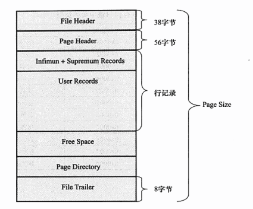

# 4.4 InnoDB数据页结构

页是InnoDB存储引擎管理数据库的最小磁盘单位。页类型为B-tree Node的页存放的即是表中行的实际数据。

InnoDB数据页由以下7个部分组成：

- File Header（文件头）
- Page Header（页头）
- Infimun喝Supremum Records
- User Records（用户记录，即行记录）
- Free Space（空闲空间）
- Page Directory（页目录）
- File Trailer（文件结尾信息）

其中File Header、Page Header、File Trailer的大小是固定的，分别为38、56、8字节，User Records、Free Space、Page Directory 这些部分为实际的记录存储空间，因此大小是动态的。

## 1. File Header

File Header用来记录页的一些头信息，共占用38个字节。

名称|大小（字节）|说明
---|---|---
FIL_PAGE_SPACE_OR_CHKSUM|4|当Mysql4.0.14之前的版本时，该值为0，在之后的MYSQL版本中，该值代表页的checksum值。
FIL_PAGE_OFFSET|4|表空间中页的偏移值。如某独立表空间 a.ibd的大小为1GB，如果页的大小为16KB，那么总共有65536个页。FIL_PAGE_OFFSET表示该页在所有页中的未知。若此表空间的ID为10，那么搜索页（10,1）就表示查找表a中的第二个页。
FIL_PAGE_PREV|4|当前页的上一个页，B+Tree特性决定了叶子节点必须是双向列表
FIL_PAGE_NEXT|4|当前页的下一个页，B+Tree特性决定了叶子节点必须是双向链表
FILE_PAGE_TYPE|2|InnoDB存储引擎页的类型。其中0x45BF，该值代表了存放的是数据页，即实际行记录的存储空间。
FIL_PAGE_FILE_FLUSH_LSN|8|该值仅在系统空间的一个页中定义，代表文件至少被更新到了该LSN值，对于独立表空间，该值都为0.
FIL_PAGE_ARCH_LOG_NO_OR_SPACE_ID|4|从MySQL 4.1开始，该值代表页属于哪个表空间

其中InnoDB存储引擎中的页的类型如下：

名称|十六进制|解释
---|---|---
FIL_PAGE_INDEX|0x45BF|B+树叶节点
FIL_PAGE_UNDO_LOG|0x002|Undo Log页
FIL_PAGE_INODE|0x003|索引节点
FIL_PAGE_IBUF_FREE_LIST|0x004|Insert Buffer空闲列表
FIL_PAGE_TYPE_ALLOCATED|0x0000|该页为最新分配
FIL_PAGE_IBUF_BITMAP|0x0005|Insert Buffer位图
FIL_PAGE_TYPE_SYS|0x0006|系统页
FIL_PAGE_TYPE_TRX_SYS|0x0007|事务系统数据
FIL_PAGE_TYPE_FSP_HDR|0x0008|File Space Header
FIL_PAGE_TYPE_XDES|0x0009|扩展描述页
FIL_PAGE_TYPE_BLOB|0x000A|BLOB页

## 2. Page Header

接着File Header部分是Page Header，该部分用来记录数据页的状态信息，由14个部分组成，共占用56个字节，如下表：

名称|大小（字节）|说明
---|---|---
PAGE_N_DIR_SLOTS|2|在Page Directory（页目录）中的Slot（槽）数
PAGE_HEAP_TOP|2|堆中第一个记录的指针，记录在页总是根据堆的形式存放的
PAGE_N_HEAP|2|堆中的记录数。一共占用2字节，但是第15位表示行记录格式
PAGE_FREE|2|指向可重用空间的首指针
PAGE_GARBAGE|2|已删除记录的字节数，即行记录结构中delete flag为1的记录大小的总数
PAGE_LAST_INSERT|2|最后插入记录的位置
PAGE_DIRECTION|2|最后插入的方向，可能的取值为：1. Page_LEFT（0x01）2. PAGE_RIGHT（0x02） 3. PAGE_SAME_REC（0x03） 4. PAGE_SAME_PAGE（0x04） 5. PAGE_NO_DIRECTION（0x05）
PAGE_N_DIRECTION|2|一个方向连续插入记录的数量
PAGE_N_RECS|2|该页中记录的数量
PAGE_MAX_TRX_ID|8|修改当前页的最大事务ID，注意该值仅在Secondary Index中定义
PAGE_LEVEL|2|当前页在索引树中的位置，0x00代表叶节点，即叶节点总是在第0层
PAGE_INDEX_ID|8|索引ID，表示当前页属于哪个索引
PAGE_BTR_SEG_HEAF|10|B+树数据非页节点所在段的segment header，注意该值仅在B+树的Root页中定义。
PAGE_BTR_SEG_TOP|10|B+树数据所在段的segment header。注意该值仅在B+树的Root页中定义。

## 3. Infimum和Supremum Record

在InnoDB存储引擎中，每个数据页中有两个虚拟的行记录，用来限定记录的便捷。Infimum记录是比该页中任何主键值都要小的值，Supremum指比任何可能大的值还要大的值。这两个值在页创建时被建立，并且在任何情况下不会被删除。在Compact行格式和Redundant行格式下，两者占用的字节数各不相同，下图展示了Infimum和Supremum。

## 4. User Record 和 Free Space

User Record就是之前讨论过得实际存储行记录的内容。

Free Space很明显指的是空闲空间，同样也是个链表数据结构，在一条记录诶删除后，该空间会被加入到空闲链表中。

## 5. Page Directory

Page Directory（页目录）中存放了记录的相对未知（不是偏移量），有些时候这些记录指针称为Slot（槽）或目录槽（Directory Slots）。与其他数据库系统不同的是，在InnoDB中并不是每个记录拥有一个槽，InnoDB存储引擎的槽是一个稀疏目录（sparse directory），即一个槽中可能包含多个记录，伪记录Infimum的n_owned值总是为1，记录Supremum的n_owned的取值范围为[1,8]，其他用户记录n_owned的取值范围为[4,8]。当记录被插入或删除时需要对槽进行分裂或平衡的维护操作。

由于在InnoDB存储引擎中Page Directory是稀疏目录，二叉查找的结果是一个粗略的结果，因为最多查找到对应的槽，但是一个槽内可能有多个记录。因此InnoDB存储引擎必须通过recorder Header中的next_record来继续查找相关记录。

注意，B+树索引本身并不能找到具体的一条记录，能找到的只是该记录所在的页。数据库把页载入到内存，然后通过Page Directory再次进行二茬查找。

## 6. File Trailer

为了检测页是否已经完整的写入磁盘（如可能发生的写入过程中磁盘损坏、机器关机等），InnoDB存储引擎的页中设置了File Trailer部分。

File Trailer只有一个FIL_PAGE_END_LSN部分，占用8字节。前4字节代表该页的checksum值，最后4字节和File Header中的FIL_PAGE_LSN相同。将这两个值于File Header中的FIL_PAGE_SPACE_OR_CHKSUM和FIL_PAGE_LSN值进行比较，看是否一致（checksum的比较需要通过InnoDB的checksum函数来进行比较，不是简单的等值比较），以此来保证页的完整性。

在默认配置下，InnoDB存储引擎每次从磁盘读取一个页就会检测该页的完整性，就是通过File Trialer进行检测，用户可以通过参数innodb_checksums来开启或关闭对这个页完整性的检查。

MySQL 5.6.6版本开始新增了参数innodb_checksum_algorithm，该参数用来控制检测checksum函数的算法，默认值为crc32，可设置的值有：innodb、crc32、none、strict_innodb、strict_crc32、strict_none。
