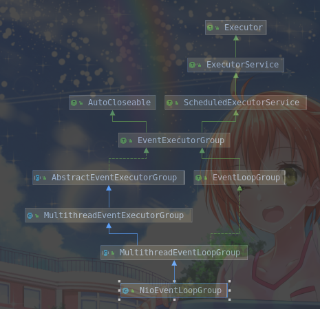

# 1. NioEventLoopGroup

示例代码如下：

```java
private void start() throws Exception {
        initServerConfig();
        if (this.configFileName != null) {
            resetServerSaveParams();
            loadServerConfig(this.configFileName);
        }
        initServer();
        RedisServerEventLoopHolder holder = RedisServerEventLoopHolder.getInstance();
        NioEventLoopGroup group = new NioEventLoopGroup(1);
        holder.setEventLoopGroup(group);
        try {
            ScheduledFuture<?> scheduledFuture = group.scheduleAtFixedRate(
                    () -> {
                        cronLoops++;
                        RedisDb[] db = RedisServerDbHolder.getInstance().getDb();
                        RedisServerStateHolder.getInstance().updateUnixTime();
                        for (int i = 0; i < db.length; i++) {
                            int size = db[i].getDict().getSize();
                            int used = db[i].getDict().getUsed();
                            int vkeys = db[i].getExpires().getUsed();

                            if (cronLoops % 5 == 0 && (used > 0 || vkeys > 0)) {
                                try {
                                    RedisLog.getInstance().log(RedisLog.LOG_LEVEL_VERBOSE, "DB %d: %d keys (%d volatile) in %d slots HT.", i, used, vkeys, size);
                                } catch (IOException e) {
                                    e.printStackTrace();
                                }
                            }
                        }
                        for (int i = 0;i < db.length;i ++) {
                            int expired = 0;
                            Dict<RedisObject,RedisObject> expires = db[i].getExpires();
                            do {
                                int num = expires.getUsed();
                                long time = RedisServerStateHolder.getInstance().getUnixTime();

                                if (num > REDIS_EXPIRELOOKUPS_PER_CRON) {
                                    num = REDIS_EXPIRELOOKUPS_PER_CRON;
                                }
                                while (num -- > 0) {
                                    DictEntry<RedisObject,RedisObject> entry = expires.dictGetRandomKey();
                                    if (entry == null){
                                        break;
                                    } else {
                                        long expireTime = (long)(entry.getValue().getPtr());
                                        if (expireTime < time) {
                                            DictEntry<RedisObject,RedisObject> dataEntry = null;
                                            dataEntry = db[i].getDict().delete(entry.getKey());
                                            dataEntry.getKey().destructor();
                                            dataEntry.getValue().destructor();
                                            dataEntry = expires.delete(entry.getKey());
                                            dataEntry.getKey().destructor();
                                            dataEntry.getValue().destructor();
                                            expired ++;
                                        }
                                    }
                                }
                            } while (expired > REDIS_EXPIRELOOKUPS_PER_CRON / 4);

                        }

                    }, 0, 1, TimeUnit.SECONDS);
            holder.setScheduledFuture(scheduledFuture);
            this.b = new ServerBootstrap();
            b.group(group)
                    .channel(NioServerSocketChannel.class)
                    .localAddress(new InetSocketAddress(this.port))
                    .childHandler(new ChannelInitializer<SocketChannel>() { //7
                        @Override
                        public void initChann如下el(SocketChannel ch) {
                            ch.pipeline()
                                    .addLast(new RedisObjectDecoder(), new RedisObjectEncoder(), new RedisServerHandler(RedisServer.this));
                        }
                    });
            holder.setBootstrap(b);
            ChannelFuture f = b.bind().sync();
            holder.setChannelFuture(f);
            RedisLog.getInstance().log(RedisLog.LOG_LEVEL_VERBOSE,RedisServer.class.getName() + " started and listen on " + f.channel().localAddress());
            f.channel().closeFuture().sync();
        } finally {
            group.shutdownGracefully().sync();
        }
    }

```

主要讨论如下代码：

```java
NioEventLoopGroup group = new NioEventLoopGroup(1);
```

NioEventLoogGroup 类图如下：



## 1. 代码流程分析

上述代码调用了`NioEventLoopGroup`的构造器，代码如下：

```java
    /**
     * Create a new instance that uses the default {@link Executor} and the {@link SelectorProvider} which
     * is returned by {@link SelectorProvider#provider()}.
     *
     * @see io.netty.util.concurrent.DefaultEventExecutorExecutorServiceFactory
     *
     * @param nEventLoops   the number of {@link EventLoop}s that will be used by this instance.
     *                      If {@code executor} is {@code null} this number will also be the parallelism
     *                      requested from the default executor. It is generally advised for the number
     *                      of {@link EventLoop}s and the number of {@link Thread}s used by the
     */
    public NioEventLoopGroup(int nEventLoops) {
        this(nEventLoops, (Executor) null);
    }
```

注释说明，该方法创建一个默认的`Executor`实例，并且通过`SelectorProvider`的`provider()`方法返回一个`SelectorProvider`。其中输入了参数`nEventLoops`，该参数表示产生的实例的`EventLoop`数量，如果Executor是null，则执行默认的系统并行策略。

该方法调用了另一个构造器，代码如下：

```java
    /**
     * Create a new instance that uses the the {@link SelectorProvider} which is returned by
     * {@link SelectorProvider#provider()}.
     *
     * @param nEventLoops   the number of {@link EventLoop}s that will be used by this instance.
     *                      If {@code executor} is {@code null} this number will also be the parallelism
     *                      requested from the default executor. It is generally advised for the number
     *                      of {@link EventLoop}s and the number of {@link Thread}s used by the
     *                      {@code executor} to lie very close together.
     * @param executor   the {@link Executor} to use, or {@code null} if the default should be used.
     */
    public NioEventLoopGroup(int nEventLoops, Executor executor) {
        this(nEventLoops, executor, SelectorProvider.provider());
    }
```

使用SelectorProvider.provider()返回的SelecEventExecutorvider创建一个新的实例。其中nEventLoops属性仍然指定的是EventLoop的数量EventExecutorExecutor则制定了使用的Executor。

紧接着调用了第三个构造器:
```java
    /**
     * @param nEventLoops   the number of {@link EventLoop}s that will be used by this instance.
     *                      If {@code executor} is {@code null} this number will also be the parallelism
     *                      requested from the default executor. It is generally advised for the number
     *                      of {@link EventLoop}s and the number of {@link Thread}s used by the
     *                      {@code executor} to lie very close together.
     * @param executor  the {@link Executor} to use, or {@code null} if the default should be used.
     * @param selectorProvider  the {@link SelectorProvider} to use. This value must not be {@code null}.
     */
    public NioEventLoopGroup(int nEventLoops, Executor executor, final SelectorProvider selectorProvider) {
        super(nEventLoops, executor, selectorProvider);
    }
```

该构造器要求selectProvider必定不能为空，而第二个构造器中的SelectorProvider.provider()保证了这一点。考察SelectorProvider.provider()函数，代码如下：

```java
    public static SelectorProvider provider() {
        synchronized (lock) {
            if (provider != null)
                return provider;
            return AccessController.doPrivileged(
                new PrivilegedAction<SelectorProvider>() {
                    public SelectorProvider run() {
                            if (loadProviderFromProperty())
                                return provider;
                            if (loadProviderAsService())
                                return provider;
                            provider = sun.nio.ch.DefaultSelectorProvider.create();
                            return provider;
                        }
                    });
        }
    }
```

代码逻辑如下：

1. 先对对象加锁，防止并发问题，类似于单例模式
2. 如果provider属性不为空，则直接返回。
3. 否则先调用loadProviderFromProperty()初始化provider，初始化成功则返回，否则继续处理。

    ```java
    private static boolean loadProviderFromProperty() {
        /* 加载java.nio.channels.spi.SelectorProvider属性指定的类型的Provider */
        String cn = System.getProperty("java.nio.channels.spi.SelectorProvider");
        /* 如果不为空，则根据反射创建一个空参数构造器的实例 */
        if (cn == null)
            return false;
        try {
            Class<?> c = Class.forName(cn, true,
                                       ClassLoader.getSystemClassLoader());
            provider = (SelectorProvider)c.newInstance();
            return true;
        } catch (ClassNotFoundException x) {
            throw new ServiceConfigurationError(null, x);
        } catch (IllegalAccessException x) {
            throw new ServiceConfigurationError(null, x);
        } catch (InstantiationException x) {
            throw new ServiceConfigurationError(null, x);
        } catch (SecurityException x) {
            throw new ServiceConfigurationError(null, x);
        }
    }
    ```
4. 调用loadProviderAsService()初始化provider，初始化成功则返回，否则继续处理。

    ```java
    private static boolean loadProviderAsService() {

        /* 从类加载器中搜索SelectorProvider类型的类，如果存在，则使用该实例 */
        ServiceLoader<SelectorProvider> sl =
            ServiceLoader.load(SelectorProvider.class,
                               ClassLoader.getSystemClassLoader());
        Iterator<SelectorProvider> i = sl.iterator();
        for (;;) {
            try {
                if (!i.hasNext())
                    return false;
                provider = i.next();
                return true;
            } catch (ServiceConfigurationError sce) {
                if (sce.getCause() instanceof SecurityException) {
                    // Ignore the security exception, try the next provider
                    continue;
                }
                throw sce;
            }
        }
    }
    ```

5. 如果上述两种方式都初始化失败，则使用默认的sun.nio.ch.DefaultSelectorProvider。

上述构造器，调用了NioEventLoopGroup的父类MultithreadEventLoopGroup的构造器，如下：

```java
    /**
     * @see {@link MultithreadEventExecutorGroup#MultithreadEventExecutorGroup(int, Executor, Object...)}
     */
    protected MultithreadEventLoopGroup(int nEventLoops, Executor executor, Object... args) {
        super(nEventLoops == 0 ? DEFAULT_EVENT_LOOP_THREADS : nEventLoops, executor, args);
    }
```

根据注释MultithreadEventLoopGroup类是EventExecutorGroup的一个抽象基类实现，主要用于使用多个线程处理任务。

```java

/**
     * @param nEventExecutors           the number of {@link EventExecutor}s that will be used by this instance.
     *                                  If {@code executor} is {@code null} this number will also be the parallelism
     *                                  requested from the default executor. It is generally advised for the number
     *                                  of {@link EventExecutor}s and the number of {@link Thread}s used by the
     *                                  {@code executor} to lie very close together.
     * @param executorServiceFactory    the {@link ExecutorServiceFactory} to use, or {@code null} if the default
     *                                  should be used.
     * @param args                      arguments which will passed to each {@link #newChild(Executor, Object...)} call.
     */
    protected MultithreadEventExecutorGroup(int nEventExecutors,
                                            ExecutorServiceFactory executorServiceFactory,
                                            Object... args) {
        this(nEventExecutors, executorServiceFactory != null
                                ? executorServiceFactory.newExecutorService(nEventExecutors)
                                : null,
             true, args);
    }
```

根据注释MultithreadEventExecutorGroup构造器中`nEventExecutors`表示将使用的`EventExecutor`数量，，如果`executor`参数是空，将会使用默认参数。通常建议`EventExecutor`的数量与`executor`使用的线程数量尽量接近。`executorServiceFactory`表示要使用的`ExecutorServiceFactory`。`args`表示要传输到`newChild(Executor, Object...)`方法中的参数。

可以看到如果`nEventLoops == 0`，则默认使用`DEFAULT_EVENT_LOOP_THREADS`常量，该常量初始化逻辑为：

```java
    static {
        /* 首先获取io.netty.eventLoopThreads指定的int值，如果获取不到，则使用可用的处理器*2，将获取到的值与1进行对比，取最大值 */
        DEFAULT_EVENT_LOOP_THREADS = Math.max(1, SystemPropertyUtil.getInt(
                "io.netty.eventLoopThreads", Runtime.getRuntime().availableProcessors() * 2));

        if (logger.isDebugEnabled()) {
            logger.debug("-Dio.netty.eventLoopThreads: {}", DEFAULT_EVENT_LOOP_THREADS);
        }
    }
```
最后调用如下私有构造器进行真正的初始化：
```java

    private MultithreadEventExecutorGroup(int nEventExecutors,
                                          Executor executor,
                                          boolean shutdownExecutor,
                                          Object... args) {
        if (nEventExecutors <= 0) {
            throw new IllegalArgumentException(
                    String.format("nEventExecutors: %d (expected: > 0)", nEventExecutors));
        }

        if (executor == null) {
            executor = newDefaultExecutorService(nEventExecutors);
            shutdownExecutor = true;
        }

        children = new EventExecutor[nEventExecutors];
        if (isPowerOfTwo(children.length)) {
            chooser = new PowerOfTwoEventExecutorChooser();
        } else {
            chooser = new GenericEventExecutorChooser();
        }

        for (int i = 0; i < nEventExecutors; i ++) {
            boolean success = false;
            try {
                children[i] = newChild(executor, args);
                success = true;
            } catch (Exception e) {
                // TODO: Think about if this is a good exception type
                throw new IllegalStateException("failed to create a child event loop", e);
            } finally {
                if (!success) {
                    for (int j = 0; j < i; j ++) {
                        children[j].shutdownGracefully();
                    }

                    for (int j = 0; j < i; j ++) {
                        EventExecutor e = children[j];
                        try {
                            while (!e.isTerminated()) {
                                e.awaitTermination(Integer.MAX_VALUE, TimeUnit.SECONDS);
                            }
                        } catch (InterruptedException interrupted) {
                            // Let the caller handle the interruption.
                            Thread.currentThread().interrupt();
                            break;
                        }
                    }
                }
            }
        }

        final boolean shutdownExecutor0 = shutdownExecutor;
        final Executor executor0 = executor;
        final FutureListener<Object> terminationListener = new FutureListener<Object>() {
            @Override
            public void operationComplete(Future<Object> future) throws Exception {
                if (terminatedChildren.incrementAndGet() == children.length) {
                    terminationFuture.setSuccess(null);
                    if (shutdownExecutor0) {
                        // This cast is correct because shutdownExecutor0 is only try if
                        // executor0 is of type ExecutorService.
                        ((ExecutorService) executor0).shutdown();
                    }
                }
            }
        };

        for (EventExecutor e: children) {
            e.terminationFuture().addListener(terminationListener);
        }nEventExecutors
nEventExecutors
        Set<EventExecutor> childrenSet = new LinnEventExecutorskedHashSet<EventExecutor>(children.length);nEventExecutors
        Collections.addAll(childrenSet, children);
        readonlyChildren = Collections.unmodifiableSet(childrenSet);
    }
```

处理逻辑如下：

1. 如果`nEventExecutors <= 0` 则报错。
2. 如果`executor == null` 则获取默认的`executor`，获取方式采用`newDefaultExecutorService(nEventExecutors)`方法。
    ```java
    protected ExecutorService newDefaultExecutorService(int nEventExecutors) {
        return new DefaultExecutorServiceFactory(getClass()).newExecutorService(nEventExecutors);
    }
    ```
3. 创建`nEventExecutors`个数的子线程，并且根据`nEventExecutors`是否是2的n次幂，选择特定的`EventExecutorChooser`，如果是，则使用`PowerOfTwoEventExecutorChooser`，否则使用`GenericEventExecutorChooser`。
4. 使用`newChild()`方法分别创建`EventExecutor`
5. 为每个`EventExecutor`注册`terminationListener`。
6. 为对象创建不可变的只读列表，用于存放`nEventExecutors`个`EventExecutor`。

## 2. 相关细节

### 1. 默认Executor生成逻辑

当`executor == null`时，使用默认的生成逻辑，即`newDefaultExecutorService(nEventExecutors)`方法，考察该方法：

```java
    protected ExecutorService newDefaultExecutorService(int nEventExecutors) {
        return new DefaultExecutorServiceFactory(getClass()).newExecutorService(nEventExecutors);
    }
```
该方法使用`DefaultExecutorServiceFactory`的`newExecutorService(nEventExecutors)`创建`ExecutorService`，考察该方法如下：

```java
    public ExecutorService newExecutorService(int parallelism) {
        ForkJoinWorkerThreadFactory threadFactory =
                new DefaultForkJoinWorkerThreadFactory(namePrefix + '-' + executorId.getAndIncrement());

        return new ForkJoinPool(parallelism, threadFactory, DefaultUncaughtExceptionHandler.INSTANCE, true);
    }
```

具体逻辑如下：

1. 根据`namePrefix`创建`DefaultForkJoinWorkerThreadFactory`。
2. 根据`DefaultForkJoinWorkerThreadFactory`创建`ForkJoinPool`;

由于`DefaultExecutorServiceFactory`类不长，因此对整个类进行简单解析：

```java
/**
 * An implementation of an {@link ExecutorServiceFactory} that creates a new {@link ForkJoinPool} on each
 * call to {@link #newExecutorService(int)}.
 * <p>
 * This {@link ExecutorServiceFactory} powers Netty's nio and epoll eventloops by default. Netty moved from managing its
 * own threads and pinning a thread to each eventloop to an {@link Executor}-based approach. That way advanced
 * users of Netty can plug in their own threadpools and gain more control of scheduling the eventloops.
 * <p>
 * The main reason behind choosing a {@link ForkJoinPool} as the default {@link Executor} is that it uses
 * thread-local task queues, providing a high level of thread affinity to Netty's eventloops.
 * <p>
 * The whole discussion can be found on GitHub
 * <a href="https://github.com/netty/netty/issues/2250">https://github.com/netty/netty/issues/2250</a>.
 * 默认情况下，此{@link ExecutorServiceFactory}支持Netty的nio和epoll事件循环。 * Netty从管理自己的线程并将线程固定到每个eventloop到基于{@link Executor}的方法。 * 这样，Netty的高级用户可以插入他们自己的线程池并获得更多控制事件循环的调度。
 * 选择ForkJoinPool最为默认Executor的最主要原因是，他使用了thread-local任务队列，为Netty的eventloops提供高级别的线程亲和力。
 */
public final class DefaultExecutorServiceFactory implements ExecutorServiceFactory {

    private static final InternalLogger logger =
            InternalLoggerFactory.getInstance(DefaultExecutorServiceFactory.class);

    private static final AtomicInteger executorId = new AtomicInteger();
    private final String namePrefix;

    /**
     * 初始化新建的ForkJoinWorkerThread线程名字前缀，使用传入的类名作为前缀
     * @param clazzNamePrefix   the name of the class will be used to prefix the name of each
     *                          {@link ForkJoinWorkerThread} with.
     */
    public DefaultExecutorServiceFactory(Class<?> clazzNamePrefix) {
        this(toName(clazzNamePrefix));
    }

    /**
     * 直接初始化新建ForkJoinWorkerThread前缀
     * @param namePrefix    the string to prefix the name of each {@link ForkJoinWorkerThread} with.
     */
    public DefaultExecutorServiceFactory(String namePrefix) {
        this.namePrefix = namePrefix;
    }
PowerOfTwoEventExecutorChooser
    @OverridePowerOfTwoEventExecutorChooser
    public ExecutorService PowerOfTwoEventExecutorChoosernewExecutorService(int parallelism) {
        ForkJoinWorkerThreaPowerOfTwoEventExecutorChooserdFactory threadFactory =
                new DefaultForkJoinWorkerThreadFactory(namePrefix + '-' + executorId.getAndIncrement());

        return new ForkJoinPool(parallelism, threadFactory, DefaultUncaughtExceptionHandler.INSTANCE, true);
    }

    /* 获取小写驼峰类名（不是全类名，而是简单类名）*/
    private static String toName(Class<?> clazz) {
        if (clazz == null) {
            throw new NullPointerException("clazz");
        }

        String clazzName = StringUtil.simpleClassName(clazz);
        switch (clazzName.length()) {
            case 0:
                return "unknown";
            case 1:
                return clazzName.toLowerCase(Locale.US);
            default:
                if (Character.isUpperCase(clazzName.charAt(0)) && Character.isLowerCase(clazzName.charAt(1))) {
                    return Character.toLowerCase(clazzName.charAt(0)) + clazzName.substring(1);
                } else {
                    return clazzName;
                }
        }
    }

    private static final class DefaultUncaughtExceptionHandler implements UncaughtExceptionHandler {

        private static final DefaultUncaughtExceptionHandler INSTANCE = new DefaultUncaughtExceptionHandler();

        @Override
        public void uncaughtException(Thread t, Throwable e) {
            if (logger.isErrorEnabled()) {
                logger.error("Uncaught exception in thread: {}", t.getName(), e);
            }
        }
    }

    private static final class DefaultForkJoinWorkerThreadFactory implements ForkJoinWorkerThreadFactory {

        private final AtomicInteger idx = new AtomicInteger();
        private final String namePrefix;

        DefaultForkJoinWorkerThreadFactory(String namePrefix) {
            this.namePrefix = namePrefix;
        }

        @Override
        public ForkJoinWorkerThread newThread(ForkJoinPool pool) {
            // Note: The ForkJoinPool will create these threads as daemon threads.
            /* 创建新的DefaultForkJoinWorkerThread，并为其设置名字，并将优先级设置为最高 */
            ForkJoinWorkerThread thread = new DefaultForkJoinWorkerThread(pool);
            thread.sPowerOfTwoEventExecutorChooseretName(namePrefix + '-' + idx.getAndIncrement());
            thread.sPowerOfTwoEventExecutorChooseretPriority(Thread.MAX_PRIORITY);
            return tPowerOfTwoEventExecutorChooserhread;
        }PowerOfTwoEventExecutorChooser
    }

    private static final class DefaultForkJoinWorkerThread
            extends ForkJoinWorkerThread implements FastThreadLocalAccess {

        private InternalThreadLocalMap threadLocalMap;

        DefaultForkJoinWorkerThread(ForkJoinPool pool) {
            super(pool);
        }

        @Override
        public InternalThreadLocalMap threadLocalMap() {
            return threadLocalMap;
        }

        @Override
        public void setThreadLocalMap(InternalThreadLocalMap threadLocalMap) {
            this.threadLocalMap = threadLocalMap;
        }
    }
}

```

### 2. GenericEventExecutorChooser和PowerOfTwoEventExecutorChooser的区别

根据上述代码可知，当nEventLoops的值为2的n次幂时，使用PowerOfTwoEventExecutorChooser，否则使用GenericEventExecutorChooser
