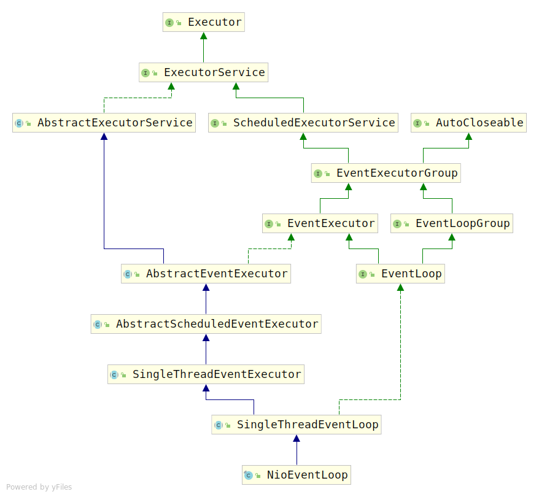

# EventLoop

netty采用了注明的Reactor模式，简单的说，在服务端启动的时候，启动了两个线程组，我们分别将其称为`Acceptor Group`和`Worker Group`，他们的职责正如他们的名字一样：

1. Acceptor Group: 负责接收客户端TCP连接以及将链路状态变更通知到Worker Group
2. Worker Group: 负责进行业务操作

而这两个线程组里面的线程就是我们即将要介绍的`EventLoop`。这里我们通过`NioEventLoop`对`EventLoop`进行分析。

## NioEventLoop

首先查看`NioEventLoop`的类图：



这里我们可以看到几个非常熟悉的类和接口：`Executor`、`ExecutorService`、`AbstractExecutorService`、`ScheduledExecutorService`、`AutoCloseable`这几个接口都是JDK本身的接口，这里不再赘述，我们接下来主要讨论其余的接口与实现类。首先讨论途中的接口，这样方便明确每个实现类提供的功能。

### 1. EventExecutorGroup和EventExecutor

刚才已经了解到服务端在启动时会创建两个线程组，业务操作由两个线程组（`EventExecutorGroup`）执行，但是实际上，线程组中真正执行业务操作的是各个线程（`EventExecutor`）。因此`EventExecutorGroup`实际上就是`EventExecutor`的代理，因此`EventExecutor`接口继承了`EventExecutorGroup`。

考察`EventExecutorGroup`源码，我们可以将该接口中要求实现的方法分为两类：

1. EventExecutorGroup生命周期相关的方法

    1. `boolean isShuttingDown()`：判断线程组是否被关闭
    2. `Future<?> shutdownGracefully()`：使用默认参数优雅的关闭线程组
    3. `Future<?> shutdownGracefully(long quietPeriod, long timeout, TimeUnit unit)`：明确指定参数优雅的关闭线程组

2. 管理线程组中线程的方法

    1. `EventExecutor next()`：获取线程组管理的一个线程
    2. `<E extends EventExecutor> Set<E> children()`：获取线程组管理的所有线程（不可修改）
    3. `Future<?> submit(...)`：提交任务到线程组
    4. `ScheduledFuture<?> scheduleXXX(XXX)`：提交定时任务到线程组

由于`EventExecutorGroup`是`EventExecutor`的代理，因此`EventExecutorGroup`接口`EventExecutor`必须实现，除此之外，`EventExecutor`还实现了一些本身的接口，这些接口可以分为两类：

1. 属性接口：
   1. `EventExecutorGroup parent()`：返回管理当前`EventExecutor`的线程组
   2. `boolean inEventLoop({Thread}?)`：判断指定线程是否被`EventExecutor`管理，如果Thread参数不传，则默认为当前线程
   3. `EventExecutor unwrap()`：将当前`EventExecutor`解包装
2. 结果返回接口：
    由于`EventExecutor`执行业务操作都是异步执行的，因此，所有的结果返回都是通过回调（即`Promise`）的方式，这部分接口就是通过`Promise`来指定返回结果的。

    1. `<V> Promise<V> newPromise()`
    2. `<V> ProgressivePromise<V> newProgressivePromise()`
    3. `<V> Future<V> newSucceededFuture(V result)`
    4. `<V> Future<V> newFailedFuture(Throwable cause)`

然而到现在为止，我们分析的仅仅是`EventExecutor`，而不是`EventLoop`，那么这两者到底有什么区别呢？我们接下来进行分析。

### 2. EventLoopGroup和EventLoop

`EventLoop`和`EventExecutor`从名字就可以看出，一个是循环的多次一直操作，一个只是单次操作。事实上对于Nio的开发模式来说`EventLoop`使用的更多，因为，我们更偏向于只要有一个事件发生就执行一系列操作，而不是我们需要自己监听某个集合是否有事件。除此之外，`EventLoop`将`EventExecutor`与`Channel`耦合起来了。但是`EventExecutor`为`EventLoop`提供基础，可能在不就的将来，就会有使用`EventExecutor`实现的`EventCircle`什么的呢。

与`EventExecutorGroup和EventExecutor`的关系一样，`EventLoopGroup`是`EventLoop`的管理者，同时也是`EventLoop`的代理。所以我们还是首先分析`EventLoopGroup`接口。`EventLoopGroup`仅仅提供了一个新的注册接口，还有一个旧接口的变体。

由于Nio大量使用了`Channel`和`基于事件监听的方式`，因此`EventLoop`需要将两者与`EventExecutor`整合起来，这就需要一个`register(XXX)`方法将`Channel`注册到`EventLoop`中进行监听，所以就有了如下接口：

1. ChannelFuture register(Channel channel);
2. ChannelFuture register(Channel channel, ChannelPromise promise);

既然`EventLoopGroup`管理的都是`EventLoop`了，所以获取`EventExecutor`的方法肯定要变成获取`EventLoop`，所以`next()`方法的返回值就被修改了：

1. EventLoop next();

之前已经说了`EventLoopGroup`是`EventLoop`的代理，`EventLoop`有很多自己实现的方法，事实上，`EventLoop`仅仅要求多实现如下方法：

```java
ChannelHandlerInvoker asInvoker();
```

无论是`EventLoop`还是`EventExecutor`，都要进行业务逻辑的处理，而`ChannelHandlerInvoker`就是`EventLoop`进行业务处理的具体执行者。那么为什么`EventExecutor`没有对应的业务执行者呢？因为只有`Channel`才能明确监听哪些事件，`EventExecutor`是无法控制到底要监听多少事件的，所以`EventExecutor`没有对应的执行者对象。

至此，`EventLoop`相关的所有接口都分析完了，但是仅仅了解接口定义是不够的，我们需要进一步了解接口的具体实现。接下来让我们来考察上面四个接口的具体实现。

### 3. AbstractEventExecutor

`AbstractEventExecutor`是`EventExecutor`接口的一个简单实现，事实上`AbstractEventExecutor`几乎所有的管理线程组中线程的方法都是`AbstractExecutorService`实现的，自己仅仅实现了一些模板方法罢了，例如：

```java
    public Future<?> shutdownGracefully() {
        return shutdownGracefully(DEFAULT_SHUTDOWN_QUIET_PERIOD, DEFAULT_SHUTDOWN_TIMEOUT, TimeUnit.SECONDS);
    }
```

该类实现了`shutdownGracefully()`方法，但是对于具体实现`uture<?> shutdownGracefully(long quietPeriod, long timeout, TimeUnit unit)`则交给了子类。

不过这里实现了所有的结果返回接口：

```java
    public <V> Promise<V> newPromise() {
        return new DefaultPromise<V>(this);
    }

    @Override
    public <V> ProgressivePromise<V> newProgressivePromise() {
        return new DefaultProgressivePromise<V>(this);
    }

    @Override
    public <V> Future<V> newSucceededFuture(V result) {
        return new SucceededFuture<V>(this, result);
    }

    @Override
    public <V> Future<V> newFailedFuture(Throwable cause) {
        return new FailedFuture<V>(this, cause);
    }
```

虽然`AbstractEventExecutor`像一个混子接口，但是这个接口实际上做了很多事。我们知道，`AbstractEventExecutor`的所有管理线程的业务都交给了`AbstractExecutorService`，那为什么还要用`AbstractEventExecutor`呢？事实上，该类最重要的就是最后这一部分结果返回接口。

因为基于事件监听的编码方式中业务都是异步完成的，无法像常规的编码那样同步处理，所以结果返回就是回调，因此该类的主要作用是为全新的编码方式提供基础。

### 4. AbstractScheduledEventExecutor

正如类名所示，`AbstractScheduledEventExecutor`为`EventExecutor`提供了定时任务支持。我们都知道，`ExecutorService`虽然好，但是有个非常不方便的地方，就是没办法执行定时任务。Jdk的定时任务都需要使用其他类执行。所以`AbstractScheduledEventExecutor`实现了自己的定时任务执行器。

事实上`AbstractScheduledEventExecutor`仅仅实现了一个优先级队列，用于存储需要执行的定时任务，真正的监听与执行操作都是子类完成的。`AbstractScheduledEventExecutor`维护的就是如下对象：

```java
PriorityQueue<ScheduledFutureTask<?>> scheduledTaskQueue;
```

获取`scheduledTaskQueue`的方法是如下方法：

```java
    PriorityQueue<ScheduledFutureTask<?>> scheduledTaskQueue() {
        if (scheduledTaskQueue == null) {
            scheduledTaskQueue = new DefaultPriorityQueue<ScheduledFutureTask<?>>(
                    SCHEDULED_FUTURE_TASK_COMPARATOR,
                    // Use same initial capacity as java.util.PriorityQueue
                    11);
        }
        return scheduledTaskQueue;
    }
```

剩下的仅仅是维护队列的一系列方法。至于具体是如何执行定时任务的，我们会在讨论到`NioEventLoop`时讨论到。

### 5. SingleThreadEventExecutor

之前我们已经知道，`AbstractEventExecutor`默认实现的`submit(XXX)`这些操作都是交给`AbstractExecutorService`实现的。这样其实在普通的业务操作执行时，通常还是同步操作，这些业务操作并没有被自己管理起来异步执行。因此就需要使用`SingleThreadEventExecutor`进行封装。

所以，`SingleThreadEventExecutor`存在的目的就是让`执行的业务操作看似是异步执行的，但是实际上使用的是同一线程`。这里我们首先考察一下`SingleThreadEventExecutor`中声明的属性：

1. `SingleThreadEventExecutor`状态：

    ```java
    private volatile int state = ST_NOT_STARTED;
    private static final int ST_NOT_STARTED = 1;
    private static final int ST_STARTED = 2;
    private static final int ST_SHUTTING_DOWN = 3;
    private static final int ST_SHUTDOWN = 4;
    private static final int ST_TERMINATED = 5;
    private static final AtomicIntegerFieldUpdater<SingleThreadEventExecutor> STATE_UPDATER =
            AtomicIntegerFieldUpdater.newUpdater(SingleThreadEventExecutor.class, "state");
    ```

    要达到上面的目的，事实上我们相当于重新管理了一下线程，因此要给线程一系列状态，方便进行管理。`SingleThreadEventExecutor`声明了五个状态，为了保证状态更新的原子性，使用了`AtomicIntegerFieldUpdater`。

2. 保存执行线程的属性

    ```java
    private volatile ThreadProperties threadProperties;
    private static final AtomicReferenceFieldUpdater<SingleThreadEventExecutor, ThreadProperties> PROPERTIES_UPDATER =
                AtomicReferenceFieldUpdater.newUpdater(
                        SingleThreadEventExecutor.class, ThreadProperties.class, "threadProperties");
    private static final class DefaultThreadProperties implements ThreadProperties {
        private final Thread t;

        ...
    }
    ```

    由于`SingleThreadEventExecutor`使用单个线程处理多个业务事件，因此需要保存被使用的线程的状态。而保存该状态的就是`DefaultThreadProperties`类型的对象。需要注意，实际上`DefaultThreadProperties`中仅仅存了`Thread`对象。为了保证原子性更新同样使用了`AtomicReferenceFieldUpdater`。

    不过需要注意，事实上在`SingleThreadEventExecutor`是没有使用到这个属性的。

3. 存储执行业务操作的队列

    ```java
    private final Queue<Runnable> taskQueue;
    ```

    通过上面的分析，我们已经知道了定时任务存储在`scheduledTaskQueue`中，那么非定时任务的业务操作呢？实际上就放在了`taskQueue`中。默认情况下，`taskQueue`是一个`LinkedBlockingQueue`：

    ```java
    taskQueue = newTaskQueue(this.maxPendingTasks);

    protected Queue<Runnable> newTaskQueue(int maxPendingTasks) {
        return new LinkedBlockingQueue<Runnable>(maxPendingTasks);
    }
    ```

    阻塞队列默认长度是16，长度可以在创建`SingleThreadEventExecutor`时自己调节。

4. 真正执行业务操作的执行器

    ```java
    private final Executor executor;
    ```

    真正执行业务操作的执行器。

5. 执行线程是否中断

    ```java
    private volatile boolean interrupted;
    ```

6. 线程锁

    ```java
    private final Semaphore threadLock = new Semaphore(0);
    ```

    明明是单线程，为什么需要线程锁呢？`ExecutorService`接口要求实现`awaitTermination(long timeout, TimeUnit unit)`，要求规定时间内，无法新添加任务，只有已经添加了的任务执行。为了做到这一点netty使用了信号量，注意信号量初始值为0。就意味着调用了就锁死。
